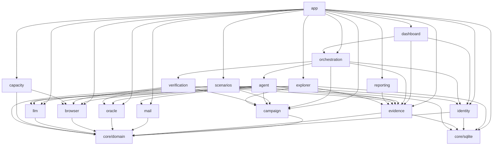
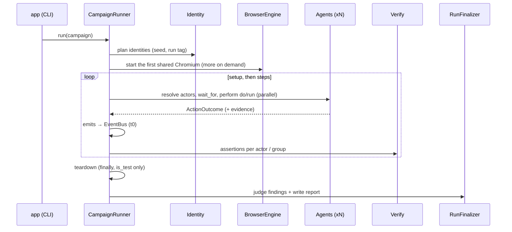

# Pətək architecture

Pətək is one JVM process. An orchestrator runs N tester agents as coroutines. Each agent owns one isolated browser
context on one of the shared Chromium browsers and writes evidence to one SQLite database. The code is split by
**feature**. Every feature follows **clean architecture** (domain → application → infrastructure), and all wiring
happens in `app/` (the composition root).

There is no fixed number of testers: a campaign may ask for 30, 100 or 500, and nothing refuses it. How many a machine
handles depends on its memory and cores, so `petek capacity` *recommends* a maximum (and `run` warns when a campaign
asks for more) but never enforces it. Agent ids grow without a bound (`a01`..`a99`, `a100`, `a1000`, ...) and are
ordered by number everywhere.

## Modules

| Module | Responsibility | Key ports (domain) | Infrastructure |
|---|---|---|---|
| `core/domain` | Shared kernel: ids (agent ids of any length, ordered by number), harness clock, `Secret`, `TargetPolicy`, `Role`, `RegistrationMode` | `IdGenerator`, `HarnessClock` | UUIDv7 ids, system clock |
| `core/sqlite` | One SQLite database per evidence dir (WAL, busy timeout, single writer) | — | Exposed 1.x JDBC |
| `features/campaign` | Campaign/scenario model, actor grammar, templates, validation, the target profile with its flows (contract flows by default), overlays, API prefix and pacing | `CampaignSource`, `ActorExpressionParser`, `TemplateRenderer`, `CampaignValidator` | kaml YAML reader with line numbers |
| `features/identity` | Deterministic identity registry for any number of testers (unique names via patronymics and ordinals, e-mail, password, phone, role, department, registration mode) | `IdentityRegistryGenerator`, `PasswordDeriver`, `IdentityRepository` | SQLite repository |
| `features/evidence` | Runs, steps, events, receipts, artifacts, assertions, findings, usage | `EvidenceRecorder`, `EvidenceQuery`, `RunRepository`, `ArtifactStore` | SQLite + file system |
| `features/mail` | Verification codes and invitation links (also by a site's own link pattern) from the test inbox | `Mailbox`, `VerificationExtractor`, `AwaitVerificationUseCase` | Mailpit REST client, the target's test API (`GET /test/emails`) (Ktor) |
| `features/oracle` | Target test API (source of truth "C") | `TargetOracle`, `JsonFieldSelector` | Ktor client with `X-Test-Token`, `is_test` guard |
| `features/browser` | Isolated browser sessions, snapshots for the LLM, real-time transport detection, accepted-and-recorded JavaScript dialogs, localStorage seeded before page scripts, the mutating requests each page sends to the target (race evidence) | `BrowserEngine`, `BrowserSessionFactory`, `BrowserSession` | Playwright (browser servers sharded by load, thread-confined sessions) |
| `features/llm` | Structured-output LLM calls, retries, concurrency limit, usage metering | `LlmClient` | Claude Code CLI (`claude -p`, Claude plan) and Anthropic Java SDK |
| `features/agent` | Tool whitelist, decision protocol, agent loop, deterministic `run` functions that execute the target's flows | `DecisionProtocol`, `LoopDetector`, `AgentLoop`, `RunFunction`, `TesterAgent` | — |
| `features/verification` | Typed assertions (visible_text, not_visible, oracle, http_status, count, latency_max, only_one_succeeds), race evidence from each actor's own requests | `AssertionEvaluator`, `VerifyStepUseCase`, `RaceEvidence` | — |
| `features/orchestration` | Run lifecycle, actor resolution, event bus, scheduler with pacing, watchdog, teardown, repeat, live board, the orchestrator's task plan for live views | `EventBus`, `ActorResolver`, `MonitorView`, `CampaignRunner`, `RunFinalizer` | in-process bus, Mordant board |
| `features/reporting` | Three-source judge, stability analysis, Markdown + HTML report | `Judge`, `ReportWriter` | kotlinx.html |
| `features/capacity` | Recommends (never enforces) the maximum number of testers for this machine | `HostResourceProbe`, `SessionCostProbe`, `CapacityAdvisor` | `/proc` + cgroup v2 memory, measured browser sessions |
| `features/scenarios` | Versioned scenarios reviewed by the owner (draft, approve, freeze), YAML diff, triage of a run's surprises into system bug / model gap / scenario bug with v2 proposals (Faza 7) | `ScenarioRepository`, `TriageRepository`, `ScenarioValidator`, `ScenarioFiles`, `TextRedactor` | SQLite repositories (immutability enforced by triggers), campaign-loader validator, file system |
| `features/dashboard` | Local web panel: live agent board, instructions, explorer, scenarios, orchestrator task matrix, reports | `PanelBackend` (`PanelCapacity`, `PanelExplorer`, `PanelScenarios`, `PanelRuns`); `LiveDashboard` is a `MonitorView` | Ktor CIO server + SSE, one self-contained page (vanilla JS) |
| `features/explorer` | Explorer agent (PLAN.md Faza 6–7): learns a site model, records findings, generates campaign drafts, diffs model versions | `ExplorationRepository`, `ExplorationObserver`, `TestTargetCheck` | SQLite repository |
| `app` | CLI (`plan`, `run`, `report`, `teardown`, `smoke`, `doctor`, `capacity`), `.env` config, composition root, logging | — | Clikt, logback |
| `testing/fake-target` | A small KadroHR-like site + Mailpit-compatible API + test API, implementing `docs/TARGET_CONTRACT.md` | — | Ktor server + SSE |
| `e2e` | Architecture rules (Konsist) and end-to-end runs against the fake target with real Chromium | — | — |

## Dependency rules

Inside a feature, `domain` imports nothing from `application` or `infrastructure`, and nothing from frameworks.
`application` never imports any `infrastructure`. Only `app` may import another feature's `infrastructure`.
`e2e/src/test/kotlin/.../ArchitectureTest.kt` enforces these rules with Konsist.

## Run lifecycle (`petek run`)

1. **Plan.** Load and validate the campaign. Derive the run tag from the run id and build the identity registry.
   Persist the run record and the identities.
2. **Browser.** Start the first Chromium browser server. Every session gets the profile's `local_storage` seeded into
   the target origin before any page script runs. Each agent opens its own context with its own Playwright
   instance on its own single thread. A server hosts at most `contextsPerBrowser` sessions (`PETEK_CONTEXTS_PER_BROWSER`,
   default 20); when every running server is full the next one starts, and each new session goes to the least-loaded
   server with room. 100 agents therefore use five browsers, 500 use 25. Sessions open a bounded number at a time
   (one per core, 4..16), so a large run starts without overloading the machine. JavaScript dialogs (`alert`,
   `confirm`, `prompt`, `beforeunload`) are accepted as they open and recorded; the agent loop and the run functions
   add them to the step detail and to what the model sees next.
3. **Steps.** For each step:
   - Resolve its actors.
   - With `wait_for`, each actor waits on the event bus. The receipt is recorded when the event text shows up on
     screen (`visible_text`).
   - Each actor performs its `do` (LLM loop) or `run` (code). All actors of a step run concurrently. `parallel: true`
     additionally starts them at the same instant (a barrier), which race tests need. Otherwise `campaign.pacing`
     starts their actions `start_stagger_ms` apart in agent id order (measured from the step's start, so waiting for an
     event is not paced) and at most `max_parallel_actors` at once, against the per-IP limits of a real site. A step
     that only asserts (no `do` or `run`) sends nothing to the site and is not paced.
   - With `emits`, the object id is read from the configured id source and the event is published with t0.
   - Assertions are evaluated per actor. `only_one_succeeds` is evaluated per group, from evidence (see "Races").
   - `on_fail: abort` stops the run; `continue` goes on.
4. **Watchdog.** An agent with no progress for `inactivityTimeout` is marked `blocked`. Its current action is cancelled
   and it moves to the next step.
5. **Teardown.** In `finally`, the test company recorded as a run resource is deleted. The oracle refuses companies
   that are not `is_test`.
6. **Finalize.** The judge turns assertion records into findings. The report (Markdown + HTML) is written to
   `evidence/<run_id>/report/`.

The live console board fits the terminal whatever the number of agents: a headline counts the agents per state, the
rows show the agents that need attention first (working, blocked, failed, waiting) and one line counts the rest.

## Races (`only_one_succeeds`)

A race step (`parallel: true`) asks that exactly one actor wins, e.g. two managers approving the same ticket. Who won
is decided by code from each actor's own requests (CLAUDE.md rule 2), never by what its agent says:

1. **Browser.** Every session records the mutating requests (`POST`, `PUT`, `PATCH`, `DELETE`) its page sends to the
   target's origin, form posts and `fetch`/XHR alike, with the URL path (no query), the answer's status and the
   harness time it saw the answer (`BrowserSession.mutations(since)`). Requests made by `BrowserSession.request`
   (assertion probes) and requests to other origins are not included.
2. **Orchestration.** Right before the action the runner reads the actor's requests once (so answers to earlier
   requests are timestamped first) and takes the start time; after the action it reads the requests since then.
   `only_one_succeeds: {request: "<METHOD> <path regex>"}` narrows them (default: every mutating request). An actor
   won when one matching request was accepted (status < 400) and none was refused (403, 409, 422); a refusal of the
   same request it had already won (a double submit) does not count. Only a winner emits the step's event.
3. **Lost race.** An actor that was refused as already decided (409/422), or that gave its answer (success claimed,
   a problem or a refusal reported) without sending a matching request while another actor won, did what a race
   expects: its action is recorded PASSED with detail `lost_race: <decisive request>; won by <agent>; agent: 
`
   and it is no failed agent. Reporting treats it like the expected `permission_denied` refusal, including the agent's
   own records of that action (same correlation id); the report shows "yarışı uduzdu". Any other answer to the
   actor's own request (403, 400, 404, 5xx) is never a lost race: when its agent claimed success anyway, the action is
   FAILED with `request_failed: <request>; agent: 
` (an INVESTIGATE finding), otherwise the agent's own
   failure stands. A race interrupted by the budget or an abort still records the racers that already acted.
4. **Verdict.** `verification` passes when exactly one actor won and the requests of every actor could be read; the
   observed text lists the decisive request per actor (`a02 POST /tickets/t2/approve -> 303; a03 POST
   /tickets/t2/approve -> 409`). With `oracle: {path, field, equals}` and a test API, the target's final state must
   match too, and its answer is kept as an ORACLE artifact.

## Live task plan

Besides the agent board, `MonitorView` receives the orchestrator's plan and progress, for the web panel (the console
views may ignore them; the methods have no-op defaults):

- `planReady(RunPlan)`: every step (phase, actors as written, `do`/`run` text, `emits`, `wait_for`, `parallel`,
  assertion types) with the agents that act in it. Sent once the agents' sessions are open and again before a step
  when an agent that failed meanwhile changes who runs the remaining steps; steps already run keep their agents.
- `taskUpdated(TaskUpdate)`: every step × agent transition, `PENDING` -> (`WAITING_EVENT`) -> `RUNNING` ->
  `PASSED` | `FAILED` | `BLOCKED` | `LOST_RACE`, or `SKIPPED` (agent failed earlier, run aborted, never reached).
- `eventPublished(PublishedEvent)` and `eventReceived(event, agent, latencyMs, received)` for the event timeline.

## Target flows

A site's sign-up, login and invitation are data, not code, so Pətək fits any site (docs/KADROHR_READINESS.md: the real
KadroHR differs from docs/TARGET_CONTRACT.md in almost every flow). `target_profile.flows` in the campaign holds flows
by name; the `run` functions execute them through the agent's `FlowRunner`:

| Run function | Flows |
|---|---|
| `register_owner` | `register_owner`, then (test API) the company id and code published for everyone; `login` when the page shows nobody signed in; `verify_identity` unless a flow asserted the identity; the storage state saved unless a flow saved it |
| `register_and_login` | `join_by_invite` or `join_by_code` by the identity's registration mode, then as above; up to 3 attempts, and once the flow passed `account_created` a retry signs in with `login` instead of registering again |
| `login` / `verify_identity` | `login` / `verify_identity` |

The defaults (`TargetProfile.DEFAULT_FLOWS`) are the contract flows, written against the profile's selector keys, so the
fake target needs no flows and a campaign that overrides a selector changes them too. A flow is a list of steps
(`goto`, `fill`, `select`, `check`, `click`, `click_if_visible`, `wait_for`, `expect_url`, `email_link`, `email_code`,
`phone_code`, `read`, `set_shared`, `if_visible`, `save_session`, `account_created`, `assert_identity` and `journey`, a
small state machine for sites whose next page depends on the account: e-mail code, phone code, login page). Each step is
one RUN step in the evidence; overlays listed under `dismiss` are clicked away before every step; a failing flow keeps a
screenshot of that moment and reports the step's own `fail: {reason, message, error}` or names the flow and the step.
Selectors are profile keys or literal CSS/Playwright selectors. Values are templates rendered by the harness:
`{self.*}` (with `first_name`/`last_name` split from the display name), `{shared.*}` (awaited until another tester
publishes it), `{vars.*}`, `{campaign.company}`; `{self.password}` only in `fill` values, never shown (`***`), never in
anything sent to the LLM. `{api}` in campaign paths is replaced by `target_profile.api_prefix` when the file is loaded.
Test mail can come from Mailpit or from the target's own test API (`TestApiMailbox`; `PETEK_MAIL_SOURCE=mailpit|test-api`,
chosen in `AppContainer`), and an e-mail link can be picked by the site's own pattern (`set-password\?token=`). The
`/test/...` API (oracle and test-API mail) is addressed at `PETEK_TEST_API_URL` when it is not on the target's origin
(KadroHR's `api.` host), else at the target; `petek doctor` checks whichever inbox is configured.

`scenarios/contract-demo.yaml` is the campaign for the contract site (fake target, e2e); `scenarios/kadrohr.yaml`
describes the real KadroHR.

## Capacity advice (`petek capacity`)

`features/capacity` answers "how many testers can this machine run?" and nothing ever enforces the answer.
`SystemHostResourceProbe` reads total and available memory (`/proc/meminfo` `MemAvailable`; under cgroup v2 memory
limits the smallest `memory.max` and the smallest headroom `memory.max − (memory.current − inactive_file)` on the way
to the root; the JVM's `OperatingSystemMXBean` elsewhere) and the usable cores. `CapacityAdvisor` keeps a
reserve of `max(2 GiB, 15 % of total)` free, fits testers into the rest at `bytesPerSession` each plus one
`bytesPerBrowser` per `contextsPerBrowser` sessions (browsers counted whole), bounds the CPU at 6 sessions per core
(agents mostly wait for the LLM and the network), and recommends the smaller bound, at least 1. Without a
measurement it uses documented estimates (180 MiB per session, 350 MiB per browser); `--measure N` opens N real
sessions through the `BrowserEngine` and measures the memory growth of the browser and driver processes (`Pss` of
`/proc/<pid>/smaps_rollup` over the JVM's descendants). The notes always add that LLM throughput
(`PETEK_LLM_CONCURRENCY`, the Claude plan's rate limits) limits how fast testers act, not how many can run. `run`
computes the fast estimate first and only warns when the campaign asks for more; `plan` prints it as information.

## Scenario catalog and triage (Faza 7)

`features/scenarios` keeps every campaign text the owner works with as an immutable, numbered version and turns a
finished run's surprises into explainable verdicts. The web panel (Faza 8) is built on its use cases.

- **Versions.** `ScenarioCatalog` imports files, stores drafts (from the owner, the explorer or triage), approves,
  freezes, lists, diffs and exports. Every version must load and pass the campaign validator, exactly as `petek run`
  would. `DRAFT -> APPROVED -> FROZEN`: approving supersedes the previous `APPROVED` version of the name
  (`SUPERSEDED`), a `FROZEN` baseline never changes again, and only `APPROVED`/`FROZEN` versions run by default. The
  SQLite schema enforces the invariants itself (one approved version per name, immutable text and frozen rows).
  Texts are exported byte-exact, so a run's `campaign_hash` points back to the version it executed.
- **Surprises.** Per actor and scenario step, a run's `report_problem` steps, failed concluding steps and findings
  form one surprise with all of that actor's evidence. `permission_denied` in a main step (an expected refusal: the
  agent's own `permission_denied`, or any problem it reported in a step whose assertions test the refusal with
  `not_visible` or `http_status` 401/403; the orchestrator records both as `permission_denied` and the assertions
  decide, see ADR-0007), the
  losers of a race whose `only_one_succeeds` passed, environment failures (`mail_unavailable`, `llm_unavailable`)
  together with the checks run after the action they broke, and receivers whose `wait_for` timed out for an event
  nobody published (the emitter's failure is the surprise) are listed as ignored instead.
- **Triage.** `TriageRunUseCase` works on finished runs only and asks the LLM one structured question per surprise
  (redacted evidence facts plus the scenario YAML, both marked as data) and validates the answer in code:
  `SYSTEM_BUG` (the target is wrong), `MODEL_GAP` (our knowledge of the site is wrong), `SCENARIO_BUG` (the scenario is
  wrong). Each verdict links only to the steps, artifacts and findings the question showed. A proposed change is a
  list of exact text edits; it is kept only if the edited YAML passes the campaign validator and keeps the campaign's
  identity settings (the target also as written, since `PETEK_TARGET` hides it once loaded), otherwise it is rejected
  with the reason and the verdict stays. The usable changes of a run become one `DRAFT` (source `TRIAGE`, parent = the
  executed version) for the owner to review as a diff; a later execution of the same run (deferred or retried
  questions) builds its draft on top of that one, so the newest triage draft of a run carries all of its changes.
  Re-running triage resumes: decided surprises are not asked again.
## Web panel (`features/dashboard`)
## Tester isolation

Only the orchestrator sees more than one tester. Each agent owns one browser context on one confined thread, reads
only its own `Identity`, and knows the others as `Colleague`s (name, role, e-mail, department, registration — no
password, no phone). What testers share (`SharedRunState`: `company_id`, `company_code`, `invite_link:<email>`) is
write-once: the first publisher wins and a different later value is refused, so nobody can change what the others act
on. `{last_id}` resolves to the actor's own emitted object, the object it waited for, or the newest object before the
step began — never to an object a colleague created concurrently in the same step. The campaign validator lets only the
admin run `register_owner` and `seed_company` and requires exactly one emitting step per event name. Evidence, events
and receipts are attributed by harness state, never by the model. The full table and the scale proofs (5 000 testers
through the orchestrator, 60 real Chromium contexts) are in `docs/requirements/R01-concurrent-multi-agent-testing.md`.

## Explorer (`features/explorer`, PLAN.md Faza 6)

The explorer builds a model of a site it has never seen and turns it into a campaign draft; the panel's "Kəşfiyyat"
screen (`PanelExplorerAdapter` in the app) drives it, one exploration at a time.

- **Site model.** `SiteModel` holds pages (forms and fields), actions (`ActionKind`: register, login, create, approve,
  …), roles, realtime observations, unknowns and findings; every element carries its `Provenance` (`OBSERVED` from the
  page, `INFERRED` by the model). Models are versioned per target (`SiteModelVersions`), every exploration is an event
  log (`ExplorationEventLog`, replayed after a restart), both in SQLite (`SqliteExplorationRepository`);
  `CompareExplorationsUseCase` diffs two versions (`SiteModelDiff`: pages, forms, actions added, changed, gone).
- **Three-phase walk** (`ExploreSiteUseCase`, budget `ExplorationBudget`: pages and minutes). `ANONYMOUS` always
  runs, through a `ReadOnlyBrowserSession` that cannot click, type or submit; `CrawlPass` follows same-site links
  under `LinkPolicy`, `RobotsRules` and `UrlPatterns`, marks pages a 401/403 or a redirect to sign-in denies, and only
  reads the sign-in and sign-up pages. `ROLE_BASED` walks with the logged-in sessions the caller hands in per role;
  the panel gets them from `TestCompanyRoleSessions`, a setup-only campaign (owner sign-up, seeding, one manager and
  one employee joining, by run functions over the site's own target profile from the scenario catalog) whose company
  is torn down when the exploration ends. `TRIAL_TOUCH` (`TrialToucher`) submits harmless actions only with the
  owner's "Sınaq toxunuşu" and a target the `TestTargetCheck` confirms as test data, and never touches login, sign-up,
  verification, password or file forms. Without sessions the last two phases are skipped and the screen says why.
- **Reading a page.** Code first: `HtmlScanner` (links, forms, fields, buttons), `PageHeuristics`, `FormClassifier` and
  `Keywords` (English and Azerbaijani). Then one structured LLM question per page (`PageAnalyst`,
  `PageAnalysisProtocol`: purpose, actions, unknowns) over a `PromptRedaction`-cleaned snapshot; the answer is
  validated in code and merged by `SiteModelAccumulator`. Unknowns are questions to the owner; answers are kept per
  site in the app's `AnswerBook` and ground the next exploration and the drafts.
- **From model to campaign.** `TestPatterns` derive `TestIdea`s per action (happy path, permission, race, realtime,
  boundary, idempotency); `GenerateScenarioUseCase` with `ScenarioComposer` writes a campaign (`CampaignYamlWriter`:
  fixed setup, then the ideas as steps, `target_profile` paths, selectors and id sources, no flows) that must pass the
  campaign validator and is stored as a `DRAFT` in the scenario catalog for the owner's review.
- **Findings.** `ExplorationFinding` (`FindingKind`, `Severity`) records what the walk itself noticed, e.g. leaked error
  text, and is shown with the model.
- **Not yet** (PLAN.md Faza 10): the explorer has no credentials of its own, never signs up by itself and cannot fall
  back to accounts the owner provides; logged-in exploration needs the target's test API.

## Decisions taken for the MVP (answers to the plan's open questions)

| Question | Decision |
|---|---|
| Invitation or company code? | Both, per tester. `campaign.registration` splits the non-admin testers (by default half by invitation, never fewer than the managers). Managers always join by invitation: the `/join` form has no role field, so a company-code sign-up becomes an employee on the target. The validator therefore requires `registration.invite >= roles.manager`; the invitations left after the managers go to employees (seeded, spread over the departments), and company-code identities are employees only. Each identity carries its `RegistrationMode`, and `register_and_login` follows the matching flow. |
| Which real-time mechanism? | Detected automatically; Pətək does not depend on it. Latency is measured in the DOM (t1 − t0). The transport (WebSocket, SSE or polling) is detected from network traffic and shown in the report. |
| Does the backend store "read" receipts? | Yes (confirmed). The `receipts` oracle assertion is part of the default campaign. |
| LLM provider? | Claude through the user's Claude plan, Sonnet by default (`claude-sonnet-5`). Default client is the Claude Code CLI (`claude -p`). The Anthropic API (official Java SDK) can be used instead. Both sit behind `LlmClient`; other providers can be added later as new adapters. |
| How many testers? | Any number: there is no fixed limit (30 was only the first campaign's size). Agent ids grow past `a99`/`a999`, identity names never run out, browsers are sharded by load. `petek capacity` recommends a maximum for the machine, `run` warns above it and still starts. |
| Browser dialogs? | Accepted (OK / leave page; a prompt gets its default text) and recorded as evidence with type, message and time; the model sees them in its next turn. |
| How does Pətək fit a site whose flows differ from the contract? | The campaign describes them: `target_profile.flows` (defaults: the contract), selectors by key or literal, `local_storage`, `dismiss`, `api_prefix`, `campaign.pacing`. The run functions execute flows by name; a new site needs YAML, not code. |
| May kadrohr.com be the target? | Yes, for now: it is the owner's pre-launch site without customers. The target policy stays in place; `.env.example` lists `kadrohr.com` as a production host with `PETEK_ALLOW_PRODUCTION=true` and a reminder to set it to false at launch. |
| Real accounts and a real inbox? | Later (PLAN Faza 8): a "bring your own accounts" mode with a real inbox read over IMAP. |

## Security

- **Secrets.** `.env` is git-ignored. Secrets are wrapped in `Secret` and never logged. The LLM never sees passwords
  or tokens: it types `{self.password}` and the harness substitutes it.
- **Target policy.** Hosts listed in `PETEK_PRODUCTION_HOSTS` are refused unless `PETEK_ALLOW_PRODUCTION=true`; the
  refusal names both variables. Oracle deletes require `is_test=true`.
- **Dialogs.** A dialog's message is masked for secrets the session typed before it reaches the evidence or the LLM.
- **Claude CLI.** It runs with no tools (`--tools ""`), no MCP servers and no settings, and without session
  persistence. It is started via `ProcessBuilder` with an argument list (no shell).
- **Supply chain.** Dependencies are pinned in the version catalog. The Gradle distribution is checksum-verified.
  Mailpit is pinned to a version and bound to 127.0.0.1.
