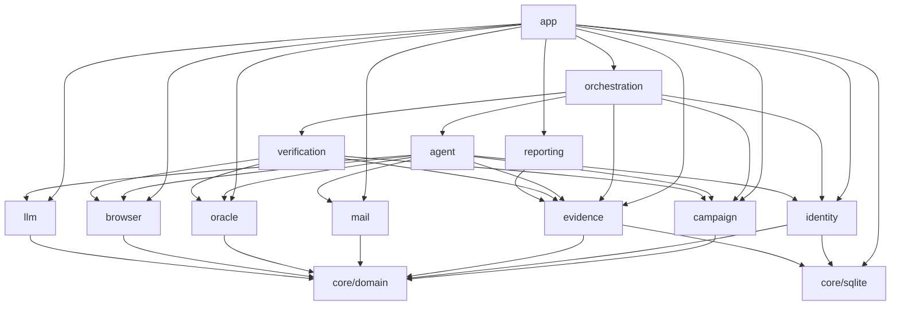
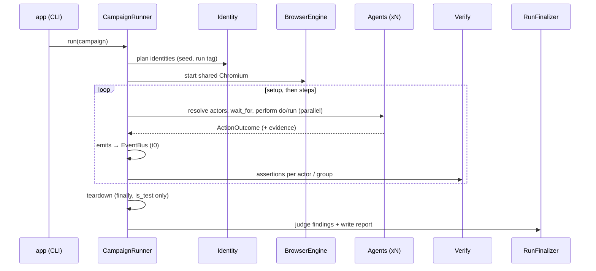

# Pətək architecture

Pətək is one JVM process. An orchestrator runs N tester agents as coroutines. Each agent owns one isolated browser
context on a shared Chromium and writes evidence to one SQLite database. The code is split by **feature**. Every
feature follows **clean architecture** (domain → application → infrastructure), and all wiring happens in `app/`
(the composition root).

## Modules

| Module | Responsibility | Key ports (domain) | Infrastructure |
|---|---|---|---|
| `core/domain` | Shared kernel: ids, harness clock, `Secret`, `TargetPolicy`, `Role`, `RegistrationMode` | `IdGenerator`, `HarnessClock` | UUIDv7 ids, system clock |
| `core/sqlite` | One SQLite database per evidence dir (WAL, busy timeout, single writer) | — | Exposed 1.x JDBC |
| `features/campaign` | Campaign/scenario model, actor grammar, templates, validation | `CampaignSource`, `ActorExpressionParser`, `TemplateRenderer`, `CampaignValidator` | kaml YAML reader with line numbers |
| `features/identity` | Deterministic identity registry (names, e-mail, password, phone, role, department, registration mode) | `IdentityRegistryGenerator`, `PasswordDeriver`, `IdentityRepository` | SQLite repository |
| `features/evidence` | Runs, steps, events, receipts, artifacts, assertions, findings, usage | `EvidenceRecorder`, `EvidenceQuery`, `RunRepository`, `ArtifactStore` | SQLite + file system |
| `features/mail` | Verification codes and invitation links from the test inbox | `Mailbox`, `VerificationExtractor`, `AwaitVerificationUseCase` | Mailpit REST client (Ktor) |
| `features/oracle` | Target test API (source of truth "C") | `TargetOracle`, `JsonFieldSelector` | Ktor client with `X-Test-Token`, `is_test` guard |
| `features/browser` | Isolated browser sessions, snapshots for the LLM, real-time transport detection | `BrowserEngine`, `BrowserSessionFactory`, `BrowserSession` | Playwright (shared browser server, thread-confined sessions) |
| `features/llm` | Structured-output LLM calls, retries, concurrency limit, usage metering | `LlmClient` | Claude Code CLI (`claude -p`, Claude plan) and Anthropic Java SDK |
| `features/agent` | Tool whitelist, decision protocol, agent loop, deterministic `run` functions | `DecisionProtocol`, `LoopDetector`, `AgentLoop`, `RunFunction`, `TesterAgent` | — |
| `features/verification` | Typed assertions (visible_text, not_visible, oracle, http_status, count, latency_max, only_one_succeeds) | `AssertionEvaluator`, `VerifyStepUseCase` | — |
| `features/orchestration` | Run lifecycle, actor resolution, event bus, scheduler, watchdog, teardown, repeat, live board | `EventBus`, `ActorResolver`, `MonitorView`, `CampaignRunner`, `RunFinalizer` | in-process bus, Mordant board |
| `features/reporting` | Three-source judge, stability analysis, Markdown + HTML report | `Judge`, `ReportWriter` | kotlinx.html |
| `app` | CLI (`plan`, `run`, `report`, `teardown`, `smoke`, `doctor`), `.env` config, composition root, logging | — | Clikt, logback |
| `testing/fake-target` | A small KadroHR-like site + Mailpit-compatible API + test API, implementing `docs/TARGET_CONTRACT.md` | — | Ktor server + SSE |
| `e2e` | Architecture rules (Konsist) and end-to-end runs against the fake target with real Chromium | — | — |

## Dependency rules

Inside a feature, `domain` imports nothing from `application` or `infrastructure`, and nothing from frameworks.
`application` never imports any `infrastructure`. Only `app` may import another feature's `infrastructure`.
`e2e/src/test/kotlin/.../ArchitectureTest.kt` enforces these rules with Konsist.

## Run lifecycle (`petek run`)

1. **Plan.** Load and validate the campaign. Derive the run tag from the run id and build the identity registry.
   Persist the run record and the identities.
2. **Browser.** Start one Chromium browser server. Each agent opens its own context with its own Playwright instance
   on its own single thread.
3. **Steps.** For each step:
   - Resolve its actors.
   - With `wait_for`, each actor waits on the event bus. The receipt is recorded when the event text shows up on
     screen (`visible_text`).
   - Each actor performs its `do` (LLM loop) or `run` (code). All actors of a step run concurrently. `parallel: true`
     additionally starts them at the same instant (a barrier), which race tests need.
   - With `emits`, the object id is read from the configured id source and the event is published with t0.
   - Assertions are evaluated per actor. `only_one_succeeds` is evaluated per group.
   - `on_fail: abort` stops the run; `continue` goes on.
4. **Watchdog.** An agent with no progress for `inactivityTimeout` is marked `blocked`. Its current action is cancelled
   and it moves to the next step.
5. **Teardown.** In `finally`, the test company recorded as a run resource is deleted. The oracle refuses companies
   that are not `is_test`.
6. **Finalize.** The judge turns assertion records into findings. The report (Markdown + HTML) is written to
   `evidence/<run_id>/report/`.

## Decisions taken for the MVP (answers to the plan's open questions)

| Question | Decision |
|---|---|
| Invitation or company code? | Both. `campaign.registration` splits the 29 non-admins (default 15 invite / 14 company code). Managers always join by invitation: the `/join` form has no role field, so a company-code sign-up becomes an employee on the target. The validator therefore requires `registration.invite >= roles.manager`; the invitations left after the managers go to employees (seeded, spread over the departments), and company-code identities are employees only. Each identity carries its `RegistrationMode`, and `register_and_login` follows the matching flow. |
| Which real-time mechanism? | Pətək does not depend on it. Latency is measured in the DOM (t1 − t0). The transport (WebSocket, SSE or polling) is detected from network traffic and shown in the report. |
| Does the backend store "read" receipts? | Yes (confirmed). The `receipts` oracle assertion is part of the default campaign. |
| LLM provider? | Claude. Default is the Claude Code CLI (`claude -p`, the user's Claude plan). The Anthropic API (official Java SDK) can be used instead. Both sit behind `LlmClient`; other providers can be added later as new adapters. |

## Security

- **Secrets.** `.env` is git-ignored. Secrets are wrapped in `Secret` and never logged. The LLM never sees passwords
  or tokens: it types `{self.password}` and the harness substitutes it.
- **Target policy.** Production hosts are refused unless `PETEK_ALLOW_PRODUCTION=true`. Oracle deletes require
  `is_test=true`.
- **Claude CLI.** It runs with no tools (`--tools ""`), no MCP servers and no settings, and without session
  persistence. It is started via `ProcessBuilder` with an argument list (no shell).
- **Supply chain.** Dependencies are pinned in the version catalog. The Gradle distribution is checksum-verified.
  Mailpit is pinned to a version and bound to 127.0.0.1.
