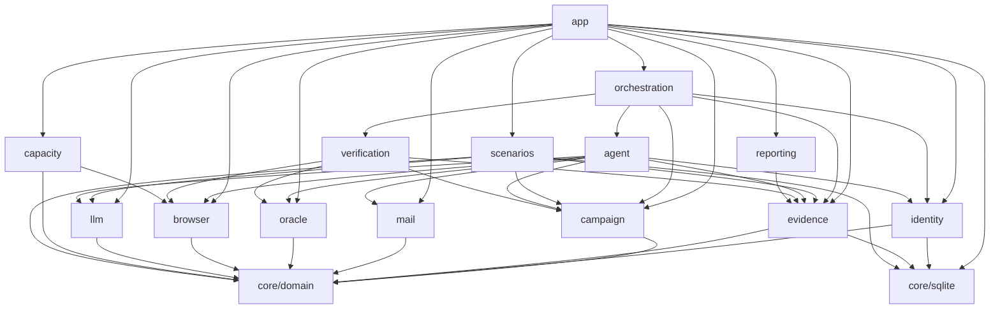
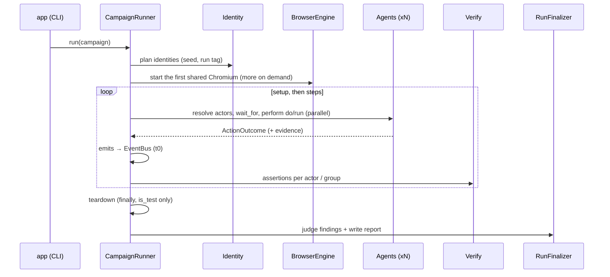

# Pətək architecture

Pətək is one JVM process. An orchestrator runs N tester agents as coroutines. Each agent owns one isolated browser
context on one of the shared Chromium browsers and writes evidence to one SQLite database. The code is split by
**feature**. Every feature follows **clean architecture** (domain → application → infrastructure), and all wiring
happens in `app/` (the composition root).

There is no fixed number of testers: a campaign may ask for 30, 100 or 500, and nothing refuses it. How many a machine
handles depends on its memory and cores, so `petek capacity` *recommends* a maximum (and `run` warns when a campaign
asks for more) but never enforces it. Agent ids grow without a bound (`a01`..`a99`, `a100`, `a1000`, ...) and are
ordered by number everywhere.

## Modules

| Module | Responsibility | Key ports (domain) | Infrastructure |
|---|---|---|---|
| `core/domain` | Shared kernel: ids (agent ids of any length, ordered by number), harness clock, `Secret`, `TargetPolicy`, `Role`, `RegistrationMode` | `IdGenerator`, `HarnessClock` | UUIDv7 ids, system clock |
| `core/sqlite` | One SQLite database per evidence dir (WAL, busy timeout, single writer) | — | Exposed 1.x JDBC |
| `features/campaign` | Campaign/scenario model, actor grammar, templates, validation | `CampaignSource`, `ActorExpressionParser`, `TemplateRenderer`, `CampaignValidator` | kaml YAML reader with line numbers |
| `features/identity` | Deterministic identity registry for any number of testers (unique names via patronymics and ordinals, e-mail, password, phone, role, department, registration mode) | `IdentityRegistryGenerator`, `PasswordDeriver`, `IdentityRepository` | SQLite repository |
| `features/evidence` | Runs, steps, events, receipts, artifacts, assertions, findings, usage | `EvidenceRecorder`, `EvidenceQuery`, `RunRepository`, `ArtifactStore` | SQLite + file system |
| `features/mail` | Verification codes and invitation links from the test inbox | `Mailbox`, `VerificationExtractor`, `AwaitVerificationUseCase` | Mailpit REST client (Ktor) |
| `features/oracle` | Target test API (source of truth "C") | `TargetOracle`, `JsonFieldSelector` | Ktor client with `X-Test-Token`, `is_test` guard |
| `features/browser` | Isolated browser sessions, snapshots for the LLM, real-time transport detection, accepted-and-recorded JavaScript dialogs | `BrowserEngine`, `BrowserSessionFactory`, `BrowserSession` | Playwright (browser servers sharded by load, thread-confined sessions) |
| `features/llm` | Structured-output LLM calls, retries, concurrency limit, usage metering | `LlmClient` | Claude Code CLI (`claude -p`, Claude plan) and Anthropic Java SDK |
| `features/agent` | Tool whitelist, decision protocol, agent loop, deterministic `run` functions | `DecisionProtocol`, `LoopDetector`, `AgentLoop`, `RunFunction`, `TesterAgent` | — |
| `features/verification` | Typed assertions (visible_text, not_visible, oracle, http_status, count, latency_max, only_one_succeeds) | `AssertionEvaluator`, `VerifyStepUseCase` | — |
| `features/orchestration` | Run lifecycle, actor resolution, event bus, scheduler, watchdog, teardown, repeat, live board | `EventBus`, `ActorResolver`, `MonitorView`, `CampaignRunner`, `RunFinalizer` | in-process bus, Mordant board |
| `features/reporting` | Three-source judge, stability analysis, Markdown + HTML report | `Judge`, `ReportWriter` | kotlinx.html |
| `features/capacity` | Recommends (never enforces) the maximum number of testers for this machine | `HostResourceProbe`, `SessionCostProbe`, `CapacityAdvisor` | `/proc` + cgroup v2 memory, measured browser sessions |
| `features/scenarios` | Versioned scenarios reviewed by the owner (draft, approve, freeze), YAML diff, triage of a run's surprises into system bug / model gap / scenario bug with v2 proposals (Faza 7) | `ScenarioRepository`, `TriageRepository`, `ScenarioValidator`, `ScenarioFiles`, `TextRedactor` | SQLite repositories (immutability enforced by triggers), campaign-loader validator, file system |
| `app` | CLI (`plan`, `run`, `report`, `teardown`, `smoke`, `doctor`, `capacity`), `.env` config, composition root, logging | — | Clikt, logback |
| `testing/fake-target` | A small KadroHR-like site + Mailpit-compatible API + test API, implementing `docs/TARGET_CONTRACT.md` | — | Ktor server + SSE |
| `e2e` | Architecture rules (Konsist) and end-to-end runs against the fake target with real Chromium | — | — |

## Dependency rules

Inside a feature, `domain` imports nothing from `application` or `infrastructure`, and nothing from frameworks.
`application` never imports any `infrastructure`. Only `app` may import another feature's `infrastructure`.
`e2e/src/test/kotlin/.../ArchitectureTest.kt` enforces these rules with Konsist.

## Run lifecycle (`petek run`)

1. **Plan.** Load and validate the campaign. Derive the run tag from the run id and build the identity registry.
   Persist the run record and the identities.
2. **Browser.** Start the first Chromium browser server. Each agent opens its own context with its own Playwright
   instance on its own single thread. A server hosts at most `contextsPerBrowser` sessions (`PETEK_CONTEXTS_PER_BROWSER`,
   default 20); when every running server is full the next one starts, and each new session goes to the least-loaded
   server with room. 100 agents therefore use five browsers, 500 use 25. Sessions open a bounded number at a time
   (one per core, 4..16), so a large run starts without overloading the machine. JavaScript dialogs (`alert`,
   `confirm`, `prompt`, `beforeunload`) are accepted as they open and recorded; the agent loop and the run functions
   add them to the step detail and to what the model sees next.
3. **Steps.** For each step:
   - Resolve its actors.
   - With `wait_for`, each actor waits on the event bus. The receipt is recorded when the event text shows up on
     screen (`visible_text`).
   - Each actor performs its `do` (LLM loop) or `run` (code). All actors of a step run concurrently. `parallel: true`
     additionally starts them at the same instant (a barrier), which race tests need.
   - With `emits`, the object id is read from the configured id source and the event is published with t0.
   - Assertions are evaluated per actor. `only_one_succeeds` is evaluated per group.
   - `on_fail: abort` stops the run; `continue` goes on.
4. **Watchdog.** An agent with no progress for `inactivityTimeout` is marked `blocked`. Its current action is cancelled
   and it moves to the next step.
5. **Teardown.** In `finally`, the test company recorded as a run resource is deleted. The oracle refuses companies
   that are not `is_test`.
6. **Finalize.** The judge turns assertion records into findings. The report (Markdown + HTML) is written to
   `evidence/<run_id>/report/`.

The live console board fits the terminal whatever the number of agents: a headline counts the agents per state, the
rows show the agents that need attention first (working, blocked, failed, waiting) and one line counts the rest.

## Capacity advice (`petek capacity`)

`features/capacity` answers "how many testers can this machine run?" and nothing ever enforces the answer.
`SystemHostResourceProbe` reads total and available memory (`/proc/meminfo` `MemAvailable`; under cgroup v2 memory
limits the smallest `memory.max` and the smallest headroom `memory.max − (memory.current − inactive_file)` on the way
to the root; the JVM's `OperatingSystemMXBean` elsewhere) and the usable cores. `CapacityAdvisor` keeps a
reserve of `max(2 GiB, 15 % of total)` free, fits testers into the rest at `bytesPerSession` each plus one
`bytesPerBrowser` per `contextsPerBrowser` sessions (browsers counted whole), bounds the CPU at 6 sessions per core
(agents mostly wait for the LLM and the network), and recommends the smaller bound, at least 1. Without a
measurement it uses documented estimates (180 MiB per session, 350 MiB per browser); `--measure N` opens N real
sessions through the `BrowserEngine` and measures the memory growth of the browser and driver processes (`Pss` of
`/proc/<pid>/smaps_rollup` over the JVM's descendants). The notes always add that LLM throughput
(`PETEK_LLM_CONCURRENCY`, the Claude plan's rate limits) limits how fast testers act, not how many can run. `run`
computes the fast estimate first and only warns when the campaign asks for more; `plan` prints it as information.

## Scenario catalog and triage (Faza 7)

`features/scenarios` keeps every campaign text the owner works with as an immutable, numbered version and turns a
finished run's surprises into explainable verdicts. The web panel (Faza 8) is built on its use cases.

- **Versions.** `ScenarioCatalog` imports files, stores drafts (from the owner, the explorer or triage), approves,
  freezes, lists, diffs and exports. Every version must load and pass the campaign validator, exactly as `petek run`
  would. `DRAFT -> APPROVED -> FROZEN`: approving supersedes the previous `APPROVED` version of the name
  (`SUPERSEDED`), a `FROZEN` baseline never changes again, and only `APPROVED`/`FROZEN` versions run by default. The
  SQLite schema enforces the invariants itself (one approved version per name, immutable text and frozen rows).
  Texts are exported byte-exact, so a run's `campaign_hash` points back to the version it executed.
- **Surprises.** Per actor and scenario step, a run's `report_problem` steps, failed concluding steps and findings
  form one surprise with all of that actor's evidence. `permission_denied` in a main step (an expected refusal), the
  losers of a race whose `only_one_succeeds` passed, environment failures (`mail_unavailable`, `llm_unavailable`)
  together with the checks run after the action they broke, and receivers whose `wait_for` timed out for an event
  nobody published (the emitter's failure is the surprise) are listed as ignored instead.
- **Triage.** `TriageRunUseCase` works on finished runs only and asks the LLM one structured question per surprise
  (redacted evidence facts plus the scenario YAML, both marked as data) and validates the answer in code:
  `SYSTEM_BUG` (the target is wrong), `MODEL_GAP` (our knowledge of the site is wrong), `SCENARIO_BUG` (the scenario is
  wrong). Each verdict links only to the steps, artifacts and findings the question showed. A proposed change is a
  list of exact text edits; it is kept only if the edited YAML passes the campaign validator and keeps the campaign's
  identity settings (the target also as written, since `PETEK_TARGET` hides it once loaded), otherwise it is rejected
  with the reason and the verdict stays. The usable changes of a run become one `DRAFT` (source `TRIAGE`, parent = the
  executed version) for the owner to review as a diff; a later execution of the same run (deferred or retried
  questions) builds its draft on top of that one, so the newest triage draft of a run carries all of its changes.
  Re-running triage resumes: decided surprises are not asked again.

## Decisions taken for the MVP (answers to the plan's open questions)

| Question | Decision |
|---|---|
| Invitation or company code? | Both, per tester. `campaign.registration` splits the non-admin testers (by default half by invitation, never fewer than the managers). Managers always join by invitation: the `/join` form has no role field, so a company-code sign-up becomes an employee on the target. The validator therefore requires `registration.invite >= roles.manager`; the invitations left after the managers go to employees (seeded, spread over the departments), and company-code identities are employees only. Each identity carries its `RegistrationMode`, and `register_and_login` follows the matching flow. |
| Which real-time mechanism? | Detected automatically; Pətək does not depend on it. Latency is measured in the DOM (t1 − t0). The transport (WebSocket, SSE or polling) is detected from network traffic and shown in the report. |
| Does the backend store "read" receipts? | Yes (confirmed). The `receipts` oracle assertion is part of the default campaign. |
| LLM provider? | Claude through the user's Claude plan, Sonnet by default (`claude-sonnet-5`). Default client is the Claude Code CLI (`claude -p`). The Anthropic API (official Java SDK) can be used instead. Both sit behind `LlmClient`; other providers can be added later as new adapters. |
| How many testers? | Any number: there is no fixed limit (30 was only the first campaign's size). Agent ids grow past `a99`/`a999`, identity names never run out, browsers are sharded by load. `petek capacity` recommends a maximum for the machine, `run` warns above it and still starts. |
| Browser dialogs? | Accepted (OK / leave page; a prompt gets its default text) and recorded as evidence with type, message and time; the model sees them in its next turn. |
| May kadrohr.com be the target? | Yes, for now: it is the owner's pre-launch site without customers. The target policy stays in place; `.env.example` lists `kadrohr.com` as a production host with `PETEK_ALLOW_PRODUCTION=true` and a reminder to set it to false at launch. |
| Real accounts and a real inbox? | Later (PLAN Faza 8): a "bring your own accounts" mode with a real inbox read over IMAP. |

## Security

- **Secrets.** `.env` is git-ignored. Secrets are wrapped in `Secret` and never logged. The LLM never sees passwords
  or tokens: it types `{self.password}` and the harness substitutes it.
- **Target policy.** Hosts listed in `PETEK_PRODUCTION_HOSTS` are refused unless `PETEK_ALLOW_PRODUCTION=true`; the
  refusal names both variables. Oracle deletes require `is_test=true`.
- **Dialogs.** A dialog's message is masked for secrets the session typed before it reaches the evidence or the LLM.
- **Claude CLI.** It runs with no tools (`--tools ""`), no MCP servers and no settings, and without session
  persistence. It is started via `ProcessBuilder` with an argument list (no shell).
- **Supply chain.** Dependencies are pinned in the version catalog. The Gradle distribution is checksum-verified.
  Mailpit is pinned to a version and bound to 127.0.0.1.
