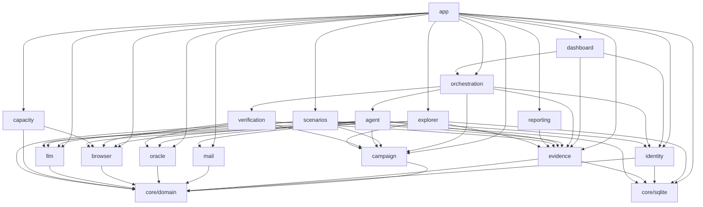
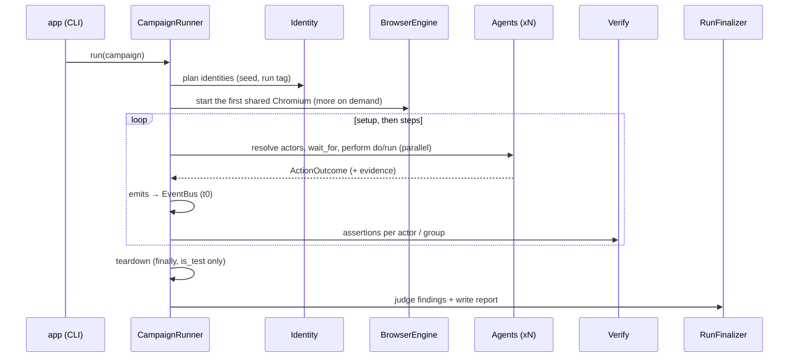

# Pətək architecture

Pətək is one JVM process. An orchestrator runs N tester agents as coroutines. Each agent owns one isolated browser
context on one of the shared Chromium browsers and writes evidence to one SQLite database. The code is split by
**feature**. Every feature follows **clean architecture** (domain → application → infrastructure), and all wiring
happens in `app/` (the composition root).

There is no fixed number of testers: a campaign may ask for 30, 100 or 500, and nothing refuses it. How many a machine
handles depends on its memory and cores, so `petek capacity` *recommends* a maximum (and `run` warns when a campaign
asks for more) but never enforces it. Agent ids grow without a bound (`a01`..`a99`, `a100`, `a1000`, ...) and are
ordered by number everywhere.

## Modules

| Module | Responsibility | Key ports (domain) | Infrastructure |
|---|---|---|---|
| `core/domain` | Shared kernel: ids (agent ids of any length, ordered by number), harness clock, `Secret`, `TargetPolicy`, `Role`, `RegistrationMode`, `PathSegments` (which address segment names one object, shared by the explorer's page patterns and the testers' checks) | `IdGenerator`, `HarnessClock` | UUIDv7 ids, system clock |
| `core/sqlite` | One SQLite database per evidence dir (WAL, busy timeout, single writer; writes and start-up schema statements open with `BEGIN IMMEDIATE`, so a read-then-write never fails on a stale snapshot) | — | Exposed 1.x JDBC |
| `features/campaign` | Campaign/scenario model, actor grammar, templates, validation, the target profile with its flows (contract flows by default), overlays, API prefix and pacing | `CampaignSource`, `ActorExpressionParser`, `TemplateRenderer`, `CampaignValidator` | kaml YAML reader with line numbers |
| `features/identity` | Deterministic identity registry for any number of testers (unique names via patronymics and ordinals, e-mail, password, phone, role, department, registration mode) | `IdentityRegistryGenerator`, `PasswordDeriver`, `IdentityRepository` | SQLite repository |
| `features/evidence` | Runs, steps, events, receipts, artifacts, assertions, findings, usage | `EvidenceRecorder`, `EvidenceQuery`, `RunRepository`, `ArtifactStore` | SQLite + file system |
| `features/ownership` | Proof that the site under test is the owner's (ADR-0012): the code to publish, the file and DNS probes, loopback/private exemption, a 30-day ledger | `SiteOwnership`, `OwnershipProbe`, `HostLocality`, `OwnershipLedger` | HTTP file probe, JNDI DNS probe, SQLite ledger |
| `features/mail` | Verification codes and invitation links (also by a site's own link pattern) from the test inbox | `Mailbox`, `VerificationExtractor`, `AwaitVerificationUseCase` | Mailpit REST client, the target's test API (`GET /test/emails`) (Ktor) |
| `features/oracle` | Target test API (source of truth "C") | `TargetOracle`, `JsonFieldSelector` | Ktor client with `X-Test-Token`, `is_test` guard |
| `features/browser` | Isolated browser sessions, snapshots for the LLM, real-time transport detection, accepted-and-recorded JavaScript dialogs, localStorage seeded before page scripts, the mutating requests each page sends to the target (race evidence), the credential headers the page itself sends the target (`PageCredentials`: its token for `http_status` probes, masked everywhere) | `BrowserEngine`, `BrowserSessionFactory`, `BrowserSession` | Playwright (browser servers sharded by load, thread-confined sessions) |
| `features/llm` | Structured-output LLM calls, retries, concurrency limit, usage metering; open provider keys (`LlmProviderKey`) | `LlmClient` | Command-line AI agents through one `CliAgentLlmClient` with a profile each (any tool the owner describes in `.env`, `codex exec`, `gemini -p`, `opencode run`), the Anthropic Java SDK, and one Ktor `OpenAiCompatibleLlmClient` (OpenAI, Ollama, Groq, Mistral, OpenRouter, LM Studio; strict `json_schema` → `json_object` → schema in the prompt) |
| `features/agent` | Tool whitelist, decision protocol, agent loop, deterministic `run` functions that execute the target's flows | `DecisionProtocol`, `LoopDetector`, `AgentLoop`, `RunFunction`, `TesterAgent` | — |
| `features/verification` | Typed assertions (visible_text, not_visible, oracle, http_status, count, latency_max, only_one_succeeds), race evidence from each actor's own requests | `AssertionEvaluator`, `VerifyStepUseCase`, `RaceEvidence` | — |
| `features/orchestration` | Run lifecycle, actor resolution, event bus, scheduler with pacing, watchdog, teardown, repeat, live board, the orchestrator's task plan for live views | `EventBus`, `ActorResolver`, `MonitorView`, `CampaignRunner`, `RunFinalizer` | in-process bus, Mordant board |
| `features/reporting` | Three-source judge, stability analysis, Markdown + HTML report | `Judge`, `ReportWriter` | kotlinx.html |
| `features/capacity` | Recommends (never enforces) the maximum number of testers for this machine | `HostResourceProbe`, `SessionCostProbe`, `CapacityAdvisor` | `/proc` + cgroup v2 memory, measured browser sessions |
| `features/scenarios` | Versioned scenarios reviewed by the owner (draft, approve, freeze), YAML diff, triage of a run's surprises into system bug / model gap / scenario bug with v2 proposals (Faza 7) | `ScenarioRepository`, `TriageRepository`, `ScenarioValidator`, `ScenarioFiles`, `TextRedactor` | SQLite repositories (immutability enforced by triggers), campaign-loader validator, file system |
| `features/dashboard` | Local web panel: live agent board, instructions ("Test et"), explorer, scenarios, orchestrator task matrix, reports; the MCP face of the same use cases (`infrastructure/mcp`: stdio JSON-RPC server, 30 tools, write gating) | `PanelBackend` (`PanelCapacity`, `PanelExplorer`, `PanelScenarios`, `PanelRuns`, `PanelReadiness`, `PanelTestFlow`, `PanelSites`, ...); `LiveDashboard` is a `MonitorView` | Ktor CIO server + SSE, one self-contained page (vanilla JS); MCP over stdio |
| `features/explorer` | Explorer agent (PLAN.md Faza 6–7): learns a site model, records findings, generates campaign drafts, diffs model versions | `ExplorationRepository`, `ExplorationObserver`, `TestTargetCheck` | SQLite repository |
| `app` | CLI (`init`, `test`, `plan`, `run`, `report`, `compare`, `teardown`, `smoke`, `doctor`, `capacity`, `probe`, `panel`, `mcp`, `verify`, `findings`, `dev`; `--json` on doctor/init/verify/test/plan/run/report/compare/findings/teardown/capacity/probe/smoke), `.env` config, composition root, logging, the web panel's backend (`PanelCore` = the object graph, `WebPanel` = served over HTTP, `McpCommand` = served over MCP); `init` (`app/init`) writes a project's `.env`, `.petek/` profile and skill pack, per-agent instruction fragments and MCP entries; the platform bundles (`bundle` task: jlink runtime + one Playwright driver) | — | Clikt, logback |
| `launcher/` | The `petek` npm package: `npx petek` downloads the release bundle for the machine once (SHA-256 checked) and runs it; no dependencies, tested with `node --test` against a local stand-in release | — | Node 18+ |
| `docker/` | The image `ghcr.io/aslan564/petek`: the Linux bundle on Playwright's official image (Chromium inside), one build for amd64 and arm64; `prepare-context.sh` lays a bundle out for it | — | Docker buildx |
| `testing/fake-target` | A small portal-like site + Mailpit-compatible API + test API, implementing `docs/TARGET_CONTRACT.md` | — | Ktor server + SSE |
| `e2e` | Architecture rules (Konsist) and end-to-end runs against the fake target with real Chromium | — | — |

## Dependency rules

```mermaid
flowchart TD
  app --> dashboard & explorer & orchestration & reporting & capacity & scenarios & llm & mail & oracle & browser & identity & evidence & campaign & sqlite[core/sqlite]
  dashboard --> orchestration & identity & evidence
  orchestration --> agent & verification & identity & evidence & campaign
  scenarios --> campaign & evidence & llm
  agent --> browser & llm & mail & oracle & evidence & identity & campaign
  verification --> browser & oracle & evidence & campaign
  reporting --> evidence
  capacity --> browser
  explorer --> browser & llm & campaign & evidence & sqlite
  identity & evidence & scenarios --> sqlite
  campaign & identity & evidence & mail & oracle & browser & llm & capacity & scenarios --> core[core/domain]
```

Inside a feature, `domain` imports nothing from `application` or `infrastructure`, and nothing from frameworks.
`application` never imports any `infrastructure`. Only `app` may import another feature's `infrastructure`.
`e2e/src/test/kotlin/.../ArchitectureTest.kt` enforces these rules with Konsist.

## Run lifecycle (`petek run`)

```mermaid
sequenceDiagram
  participant CLI as app (CLI)
  participant R as CampaignRunner
  participant I as Identity
  participant B as BrowserEngine
  participant A as Agents (xN)
  participant V as Verify
  participant F as RunFinalizer
  CLI->>R: run(campaign)
  R->>I: plan identities (seed, run tag)
  R->>B: start the first shared Chromium (more on demand)
  loop setup, then steps
    R->>A: resolve actors, wait_for, perform do/run (parallel)
    A-->>R: ActionOutcome (+ evidence)
    R->>R: emits → EventBus (t0)
    R->>V: assertions per actor / group
  end
  R->>R: teardown (finally, is_test only)
  R->>F: judge findings + write report
```

1. **Plan.** Load and validate the campaign. Derive the run tag from the run id and build the identity registry.
   Persist the run record and the identities.
2. **Browser.** Start the first Chromium browser server. Every session gets the profile's `local_storage` seeded into
   the target origin before any page script runs. Each agent opens its own context with its own Playwright
   instance on its own single thread. A server hosts at most `contextsPerBrowser` sessions (`PETEK_CONTEXTS_PER_BROWSER`,
   default 20); when every running server is full the next one starts, and each new session goes to the least-loaded
   server with room. 100 agents therefore use five browsers, 500 use 25. Sessions open a bounded number at a time
   (one per core, 4..16), so a large run starts without overloading the machine. JavaScript dialogs (`alert`,
   `confirm`, `prompt`, `beforeunload`) are accepted as they open and recorded; the agent loop and the run functions
   add them to the step detail and to what the model sees next.
3. **Steps.** For each step:
   - Resolve its actors.
   - A step with `emits` first has the receivers of its event start watching their own pages for the text of their
     `visible_text` (Faza 24.10), so the moment the text appears is timed by the page, whatever the agents do until
     the receivers' step runs; a text already there is `stale_text`, not a delivery (`{pass}` in the text makes every
     wave's and the swap's publication new).
   - With `wait_for`, each actor waits on the event bus. The receipt is recorded when the event text shows up on
     screen (`visible_text`), with the latency from the write behind the event (t0) to that moment (t1).
   - Each actor performs its `do` (LLM loop) or `run` (code). All actors of a step run concurrently. `parallel: true`
     additionally starts them at the same instant (a barrier), which race tests need. Otherwise `campaign.pacing`
     starts their actions `start_stagger_ms` apart in agent id order (measured from the step's start, so waiting for an
     event is not paced) and at most `max_parallel_actors` at once, against the per-IP limits of a real site. A step
     that only asserts (no `do` or `run`) sends nothing to the site and is not paced. A `parallel` step ignores the
     limit, so `petek plan`, `petek run` and the panel warn (never block) when one can start more actors than
     `max_parallel_actors` (`CampaignValidator.warnings`, Faza 24.15).
   - With `emits`, the object id is read from the configured id source and the event is published with t0: the
     answer to the actor's own write request (`emits.request`, else its first accepted one), the publish time kept
     apart; without a write the page showed, the publish, and latencies become a range.
   - Assertions are evaluated per actor. `only_one_succeeds` is evaluated per group, from evidence (see "Races").
   - In a step whose assertions test a refusal with `http_status` 401/403, the runner reads the actor's own requests
     after the action: a matching write the site accepted (status < 400) fails the step with `forbidden_accepted`, a
     defect of the site whatever the agent said, with a screenshot of the page (`StepExecutor.refusalBreached`,
     Faza 24.2).
   - `on_fail: abort` stops the run; `continue` goes on.
   - With `--swap-accounts` (Faza 18) the testers who finished the main steps pass their accounts on in a ring: each
     account opens in a fresh browser with its saved session, on the target's home page (`swap_open` evidence, where
     it landed), and a fresh agent runs the main steps again as `<step>@swap`. A `wait_for` takes only an event
     published after the start of its emitting step's latest execution (`RunState.eventCursor`), so the swap never
     hands a receiver the first pass's event (Faza 24.4). A tester that failed a main step stays out
     (`swap_accounts` SKIPPED), and so does the whole swap in a run with waves.
4. **Watchdog.** An agent with no progress for `inactivityTimeout` is marked `blocked`. Its current action is cancelled
   and it moves to the next step. Waiting for one of the shared AI slots (`PETEK_LLM_CONCURRENCY`) and waiting for the
   provider's answer never count as inactivity (`LlmCallObserver`, 2026-10-01), so a big run's queue never blocks a
   tester; an AI attempt still unanswered after its own bound is `blocked` with `llm_unavailable` (the surroundings),
   inactivity alone stays `timeout`. Checks after an action that did not complete are recorded SKIPPED ("not
   evaluated"), never as a site defect.
5. **Roll call.** At the start the run records its `roster` (every planned tester) and, from the host probe, its
   `capacity` record (`within_capacity` or `over_capacity`, never a verdict). When the run concludes (passed, failed,
   aborted or cancelled), every planned tester × step without a result of its own gets a `not_reached` record saying
   why (`run_aborted`, `wave_not_started`, `failed_earlier`, `never_reached`); a tester left out of a step that began
   without it (out since its gate or browser failed) keeps the runner's `skip` record, which the report reads the same
   way. A step no tester ran in any pass gets an `uncovered` record (FAILED, `not_covered`, so the run cannot pass),
   unless a pass the run stopped before (a wave that never began) would have given it to someone: that pass's
   `not_reached` records name those testers instead. An early stop gets an `abort` record (steps not run per wave), and
   the closed roll call a `roll_call` record. A crashed
   browser context is restored with the storage state saved since. The report's "Testerlərin yoxlaması" sets the
   planned testers against who acted and lists who did not get to which step and why; it says nobody is missing only
   when the roll call was closed, so a process killed before its end leaves a report that says the roll call is
   missing, never that everyone finished.
6. **Teardown.** In `finally`, the test company recorded as a run resource is deleted. The oracle refuses companies
   that are not `is_test`.
7. **Finalize.** The judge turns assertion records into findings. The report (Markdown + HTML) is written to
   `evidence/<run_id>/report/`; its PDF (`report.pdf`) is printed only when asked for (`ExportReportPdfUseCase` over the
   `ReportPdfPrinter` port; the app gives `PlaywrightPdfPrinter`, Chromium's own print of `share.html`). Its summary also names what the scenario left unchecked: the campaign's `coverage:`
   lines, recorded as a `SYSTEM` step (`coverage`) when the run starts.

The live console board fits the terminal whatever the number of agents: a headline counts the agents per state, the
rows show the agents that need attention first (working, blocked, failed, waiting) and one line counts the rest.

## Races (`only_one_succeeds`)

A race step (`parallel: true`) asks that exactly one actor wins, e.g. two managers approving the same ticket. Who won
is decided by code from each actor's own requests (AGENTS.md rule 2), never by what its agent says:

1. **Browser.** Every session records the mutating requests (`POST`, `PUT`, `PATCH`, `DELETE`) its page sends to the
   target's origin, form posts and `fetch`/XHR alike, with the URL path (no query), the answer's status and the
   harness time it saw the answer (`BrowserSession.mutations(since)`). Requests made by `BrowserSession.request`
   (assertion probes) and requests to other origins are not included.
2. **Orchestration.** Right before the action the runner reads the actor's requests once (so answers to earlier
   requests are timestamped first) and takes the start time; after the action it reads the requests since then.
   `only_one_succeeds: {request: "<METHOD> <path regex>"}` names the request that decides; it is required, since with
   every mutating request an unrelated accepted one (a notification marked read) would make a second winner. An actor
   won when one matching request was accepted (status < 400) and none was refused (403, 409, 422); a refusal of the
   same request it had already won (a double submit) does not count. Only a winner emits the step's event.
3. **Lost race.** An actor that was refused as already decided (409/422), or that gave its answer (success claimed,
   a problem or a refusal reported) without sending a matching request while another actor won, did what a race
   expects: its action is recorded PASSED with detail `lost_race: <decisive request>; won by <agent>; agent: 
`
   and it is no failed agent. Reporting treats it like the expected `permission_denied` refusal, including the agent's
   own records of that action (same correlation id); the report shows "yarışı uduzdu". Any other answer to the
   actor's own request (403, 400, 404, 5xx) is never a lost race: when its agent claimed success anyway, the action is
   FAILED with `request_failed: <request>; agent: 
` (an INVESTIGATE finding), otherwise the agent's own
   failure stands. A race interrupted by the budget or an abort still records the racers that already acted.
4. **Verdict.** `verification` passes when at least two actors raced (reached the start line and acted), at least
   two of them sent the deciding request, exactly one actor won and the requests of every actor could be read. It fails
   when the site decided wrongly: two winners (`several_winners: ...`, a SITE_CHECK finding about the site: the site's
   own answers show it, the owner's decision of 2026-09-30), or every attempt refused (an INVESTIGATE finding, since a
   scenario can cause it too). It is `INCONCLUSIVE` (Faza 24.12: no finding about the site, the "tool gap" shelf, and
   the run is not PASSED; `petek run` exits with 3 when nothing else failed) when the evidence cannot decide: one racer
   is no race (a race step whose other actors are in another wave, failed earlier or stopped before the start line:
   `a race needs at least 2 racing actors; only a02 raced`, whoever won); no racer sent the request (`no_attempt: no
   racer sent a request matching ...`); only the winner sent it while the others found the object decided and did not
   ask (`uncontested: ...`, the owner's decision of 2026-09-30: the site was never asked two decisions at once); or
   the requests of an actor could not be read while no second winner is proven. The observed text lists the decisive request per actor (`a02 POST /tickets/t2/approve
   -> 303; a03 POST /tickets/t2/approve -> 409`; an actor that never acted shows `did not race`). With `oracle: {path,
   field, equals}` and a test API, the target's final state must match too, and its answer is kept as an ORACLE
   artifact.

## Live task plan

Besides the agent board, `MonitorView` receives the orchestrator's plan and progress, for the web panel (the console
views may ignore them; the methods have no-op defaults):

- `planReady(RunPlan)`: every step (phase, actors as written, `do`/`run` text, `emits`, `wait_for`, `parallel`,
  assertion types) with the agents that act in it. Sent once the agents' sessions are open and again before a step
  when an agent that failed meanwhile changes who runs the remaining steps; steps already run keep their agents.
- `taskUpdated(TaskUpdate)`: every step × agent transition, `PENDING` -> (`WAITING_EVENT`) -> `RUNNING` ->
  `PASSED` | `FAILED` | `BLOCKED` | `LOST_RACE`, or `SKIPPED` (agent failed earlier, run aborted, never reached).
- `eventPublished(PublishedEvent)` and `eventReceived(event, agent, latencyMs, received)` for the event timeline.

## Target flows

A site's sign-up, login and invitation are data, not code, so Pətək fits any site (a real site usually differs from
docs/TARGET_CONTRACT.md in almost every flow; `docs/examples/company-portal.yaml` is such a site). `target_profile.flows` in the campaign holds flows
by name; the `run` functions execute them through the agent's `FlowRunner`:

| Run function | Flows |
|---|---|
| `register_owner` | `register_owner`, then (test API) the company id and code published for everyone; `login` when the page shows nobody signed in; `verify_identity` unless a flow asserted the identity; the storage state saved unless a flow saved it |
| `register_and_login` | `join_by_invite` or `join_by_code` by the identity's registration mode, then as above; up to 3 attempts, and once the flow passed `account_created` a retry signs in with `login` instead of registering again. On a site without companies the tester's gate decides: `self` follows `sign_up` (name, e-mail, password), `login` signs in with the owner's account it was given, `guest` only opens the home page |
| `login` / `verify_identity` | `login` / `verify_identity` |
| `site_health` | no flow: blind checks decided by code from what the browser saw (links, console/network errors, slow requests, back button, phone width, session expiry, then `login` again) over `pages`, and `perf`, which never fails a step: each page's own timing as the browser measured it (first byte, DOM ready, load, largest contentful paint, layout shift) is recorded per page and screen (`page_timing` table) for the report's "Səhifə sürəti" and `petek compare`; `look`, only when named and never failing a step either, takes each page's look on its screen by code (settled, at the top, CSS scale down to `look_max_height`, a second load; masks measured, never painted: `target_profile.visual.mask`, `look_mask`, `data-petek-mask`, embeds, date/time texts, the run's own texts) as `VISUAL` frames and a `page_look` row (`BrowserSession.look`, `look-settle.js`, `look-read.js`) for `petek compare`'s "Görünüş" (`CompareLooks`: the `RasterCodec` port, `ImageIoRasterCodec` in reporting infrastructure, pictures and `visual.json` under `report/visual/<baseline>/`; ADR-0014); `share: pages` deals the pages out among the step's testers, `share: links` has each tester check every page but ask about only its share of the links |
| `page_checks` | no flow: what a visitor sees on each page, checked by code (in-page anchors, broken images, alt texts, title, one `h1`, description and language, duplicate titles, links to other sites asked once, language versions: each `hreflang` version answers, says its language and names the page back, lists: a list the explorer saw the visitor shown still shows an object, on the desktop) over `pages`; `share` as for `site_health` |
| `direct_url` | no flow: opens someone else's object by its `path`; passes when the site refuses (401/403/404, another page, or the object's `text` not shown). Drafts write it only for objects the visitor never saw, or for a draft (`Drafts`, Faza 19) |

The defaults (`TargetProfile.DEFAULT_FLOWS`) are the contract flows, written against the profile's selector keys, so the
fake target needs no flows and a campaign that overrides a selector changes them too. A flow is a list of steps
(`goto`, `fill`, `select`, `check`, `click`, `click_if_visible`, `wait_for`, `expect_url`, `email_link`, `email_code`,
`phone_code`, `read`, `set_shared`, `if_visible`, `save_session`, `account_created`, `assert_identity` and `journey`, a
small state machine for sites whose next page depends on the account: e-mail code, phone code, login page). Each step is
one RUN step in the evidence; overlays listed under `dismiss` are clicked away before every step; a failing flow keeps a
screenshot of that moment and reports the step's own `fail: {reason, message, error}` or names the flow and the step.
Selectors are profile keys or literal CSS/Playwright selectors. Values are templates rendered by the harness:
`{self.*}` (with `first_name`/`last_name` split from the display name), `{shared.*}` (awaited until another tester
publishes it), `{vars.*}`, `{campaign.company}`; `{self.password}` only in `fill` values, never shown (`***`), never in
anything sent to the LLM. `{api}` in campaign paths is replaced by `target_profile.api_prefix` when the file is loaded;
a full address there (an API on its own host) is called only by `http_status`, after the run's start checked that
host like the target (production policy, ownership proof; `Campaign.apiOriginInUse`).
Test mail can come from Mailpit or from the target's own test API (`TestApiMailbox`; `PETEK_MAIL_SOURCE=mailpit|test-api`,
chosen in `AppContainer`), and an e-mail link can be picked by the site's own pattern (`set-password\?token=`). The
`/test/...` API (oracle and test-API mail) is addressed at `PETEK_TEST_API_URL` when it is not on the target's origin
(e.g. a separate `api.` host), else at the target; `petek doctor` checks whichever inbox is configured.

`scenarios/contract-demo.yaml` is the campaign for the contract site (fake target, e2e); `docs/examples/company-portal.yaml`
describes the company portal.

## Capacity advice (`petek capacity`)

`features/capacity` answers "how many testers can this machine run?" and nothing ever enforces the answer.
`SystemHostResourceProbe` reads total and available memory (`/proc/meminfo` `MemAvailable`; under cgroup v2 memory
limits the smallest `memory.max` and the smallest headroom `memory.max − (memory.current − inactive_file)` on the way
to the root; the JVM's `OperatingSystemMXBean` elsewhere, with macOS `vm_stat` free, inactive and speculative pages as
the available memory, since the JVM's "free" leaves out the file cache) and the usable cores. `CapacityAdvisor` keeps a
reserve of `max(2 GiB, 15 % of total)` free, fits testers into the rest at `bytesPerSession` each plus one
`bytesPerBrowser` per `contextsPerBrowser` sessions (browsers counted whole), bounds the CPU at 6 sessions per core
(agents mostly wait for the LLM and the network), and recommends the smaller bound, at least 1. Without a
measurement it uses documented estimates (180 MiB per session, 350 MiB per browser); `--measure N` opens N real
sessions through the `BrowserEngine` and measures the memory growth of the browser and driver processes (`Pss` of
`/proc/<pid>/smaps_rollup` over the JVM's descendants). The notes always add that LLM throughput
(`PETEK_LLM_CONCURRENCY`, the AI provider's rate limits) limits how fast testers act, not how many can run. `run`
computes the fast estimate first and only warns when the campaign asks for more; `plan` prints it as information.

## Scenario catalog and triage (Faza 7)

`features/scenarios` keeps every campaign text the owner works with as an immutable, numbered version and turns a
finished run's surprises into explainable verdicts. The web panel (Faza 8) is built on its use cases.

- **Versions.** `ScenarioCatalog` imports files, stores drafts (from the owner, the explorer or triage), approves,
  freezes, lists, diffs and exports. Every version must load and pass the campaign validator, exactly as `petek run`
  would. `DRAFT -> APPROVED -> FROZEN`: approving supersedes the previous `APPROVED` version of the name
  (`SUPERSEDED`), a `FROZEN` baseline never changes again, and only `APPROVED`/`FROZEN` versions run by default. The
  SQLite schema enforces the invariants itself (one approved version per name, immutable text and frozen rows).
  Texts are exported byte-exact, so a run's `campaign_hash` points back to the version it executed.
- **Surprises.** Per actor and scenario step, a run's `report_problem` steps, failed concluding steps and findings
  form one surprise with all of that actor's evidence. `permission_denied` in a main step (an expected refusal: the
  agent's own `permission_denied`, or any problem it reported in a step whose assertions test the refusal with
  `not_visible` or `http_status` 401/403; the orchestrator records both as `permission_denied` and the assertions
  decide, see ADR-0007), the
  losers of a race whose `only_one_succeeds` passed, environment failures (`mail_unavailable`, `llm_unavailable`)
  together with the checks run after the action they broke, and receivers whose `wait_for` timed out for an event
  nobody published (the emitter's failure is the surprise) are listed as ignored instead.
- **Triage.** `TriageRunUseCase` works on finished runs only and asks the LLM one structured question per surprise
  (redacted evidence facts plus the scenario YAML, both marked as data) and validates the answer in code:
  `SYSTEM_BUG` (the target is wrong), `MODEL_GAP` (our knowledge of the site is wrong), `SCENARIO_BUG` (the scenario is
  wrong). Each verdict links only to the steps, artifacts and findings the question showed. A proposed change is a
  list of exact text edits; it is kept only if the edited YAML passes the campaign validator and keeps the campaign's
  identity settings (the target also as written, since `PETEK_TARGET` hides it once loaded), otherwise it is rejected
  with the reason and the verdict stays. The usable changes of a run become one `DRAFT` (source `TRIAGE`, parent = the
  executed version) for the owner to review as a diff; a later execution of the same run (deferred or retried
  questions) builds its draft on top of that one, so the newest triage draft of a run carries all of its changes.
  Re-running triage resumes: decided surprises are not asked again.
## Web panel (`features/dashboard`)

`petek` with no arguments serves the panel on loopback (`PanelCommand`). `CliSession` finds the configuration:
`--env-file`; `.env` in the working directory; the environment alone when it sets `PETEK_TARGET` (CI); else the owner's
workspace, `$PETEK_HOME/workspace/.env` (`PETEK_HOME` defaults to `~/.petek`), whose relative paths (evidence,
scenarios, target profiles) resolve inside it. Without any, the setup page (`SetupServer`, `PanelSetup`) asks for the
site (rule 12) and writes the workspace's `.env`, so a bare `petek` finds it from any directory afterwards.

The page opens on **Quraşdırma** until the owner marks it done once. `PanelReadiness` (`PanelReadinessAdapter` in the
app) shows the site, the configuration file and the configured AI without contacting anything, and checks each part
when the page asks: the site answering (`TargetReachability`), its ownership (`SiteOwnership.check`, or `verify` for a
fresh look that remembers a proof it finds) and the AI answering `petek doctor`'s tiny request through its own client.
The tester count set there is the instruction screen's (`P.testers`). The AI is chosen there too (`aiOptions`,
`chooseAi`; `/api/readiness/ai-options`, `/api/readiness/ai-choice`): the choice (provider, and the model, endpoint or
key only where that provider needs one; a blank key keeps the file's) is written to the configuration file, the
configuration is read again, and `AppContainer.refresh` takes its AI settings and target profiles, nothing else; the
container's `SwitchableLlmClient` sends the next calls to the new client, so the panel is not restarted. A choice the
environment would override is refused and the file put back; the AI is not switched while an exploration, a test or a
run is going.

The sites the panel knows are on the instruction screen's **Saytlar** card (`PanelSites`, `PanelSitesAdapter`;
`/api/sites`): the panel's own site and every target profile, each with the settings a run there takes
(`TargetProfileConfig.forTarget`: test API, mail, accounts); "Seç" makes one the form's target. A new site is written
as a small profile `targets/<name>.yaml` (address, and only what the owner gave: mail source, test API address, the
token as a `${PETEK_SITE_<NAME>_TOKEN}` reference) with the token itself in the configuration file; the configuration
is read again and `AppContainer.refreshTargets` takes its profiles, nothing else, so a run or an exploration there uses
them at once. The panel's own site, a site or name already known and a production host are refused; a profile or a
configuration that does not load puts both files back. `PETEK_TEST_TOKEN` stays with the panel's own site: a profile
of another site that names no token of its own has none.

**Test et** (Faza 25.3) is the main path, the same on three faces: the instruction screen's button (`POST /api/test`,
`GET /api/test`, `POST /api/test/cancel`), `petek test` (`TestCommand` over `PanelCore`, exit code by the run's
result) and MCP `test_site`/`get_test`/`cancel_test`. `PanelTestFlow` (`PanelTestFlowAdapter` in the app) chains the
ordinary panel operations: it starts the exploration (`PanelExplorerAdapter.begin`), waits until that exploration has
let go of its sessions and browser, drafts from that exploration only (`PanelScenariosAdapter.generateFor`, never an
earlier one), approves the draft and starts the run on the same site with the form's tester count
(`PanelRunsAdapter.launch`), and ends with the run (`FINISHED` with its result, or `STOPPED` with the reason: an
exploration that failed, was stopped or saved no model, an invalid draft, a refused or aborted run). Its rules are the
parts' own (target policy, reachability, the ownership proof before anything is written, one exploration and one run
at a time); one test at a time, and `cancelTest` stops the part that is going. One run at a time holds across
processes too (the owner's decision of 2026-09-30): every run, whether the panel, `petek test`, MCP, the explorer's
session setup or `petek run` starts it, holds the operating system's lock on `<evidence>/run.lock` (`RunLock`), whose
text says who holds it; a second one is refused with that (the panel's `PanelConflictException`, `petek run`'s exit 2),
and the lock goes with its process, so a crash leaves none behind. The form's team is optional
(`PanelInstructions.roles`, `registration` and `departments`): with the page's automatic split nothing is sent, and the
draft takes the roles, ways in and departments the explorer saw (Faza 25.1–25.2). Regenerating the text of a superseded
version makes a new draft instead of returning the one that can never be approved again.

While the run goes the explorer goes on (Faza 18, the owner's decision in `LINK_ONLY_SWARM.md` §0.8):
`PanelExplorerAdapter.begin(..., continueFrom)` starts an exploration seeded with the model the run's scenario came
from (`ExplorationRequest.seed`, `SiteModelAccumulator.seed`): its pages are opened for their links but not asked
about again, the page budget counts only new pages, and it submits nothing (no trial touch). When the run ends it is
stopped too (`endWithRun`), and if it found pages or actions the seed did not have, the next run's scenario is drafted
from its model, a new version of the same scenario waiting for the owner's approval (`TestFlowView.nextScenarioId`);
the run itself never changes. Explorations have their own browser engine, so the two never close each other's pages.

## Tester isolation

Only the orchestrator sees more than one tester. Each agent owns one browser context on one confined thread, reads
only its own `Identity`, and knows the others as `Colleague`s (name, role, e-mail, department, registration — no
password, no phone). What testers share (`SharedRunState`: `company_id`, `company_code`, `invite_link:<email>`) is
write-once: the first publisher wins and a different later value is refused, so nobody can change what the others act
on. `{last_id}` is the step's own object only: the one the actor waited for and, in its checks, the one it emitted —
never an object a colleague created concurrently in the same step and never another step's object; with no id it is a
template error, not a fallback (Faza 24.6). Another step's object is `{event.<name>.id}`. `{pass}` marks a text with
the execution of the steps it belongs to (`<run tag>-<n>`: the first pass, a later wave, the account swap), following
the step's own event like `{last_id}`, so a text published again is never taken for the earlier one. The campaign validator lets
only the admin run `register_owner` and `seed_company`, requires exactly one emitting step per event name, refuses
`{last_id}` in a step without an event of its own, and lets several testers emit an event others depend on only in a
race. Evidence, events
and receipts are attributed by harness state, never by the model. The full table and the scale proofs (5 000 testers
through the orchestrator, 60 real Chromium contexts) are in `docs/requirements/R01-concurrent-multi-agent-testing.md`.

## Explorer (`features/explorer`, PLAN.md Faza 6)

The explorer builds a model of a site it has never seen and turns it into a campaign draft; the panel's "Kəşfiyyat"
screen (`PanelExplorerAdapter` in the app) drives it, one exploration at a time.

- **Site model.** `SiteModel` holds pages (forms and fields), actions (`ActionKind`: register, login, create, approve,
  …), roles, realtime observations, unknowns and findings; every element carries its `Provenance` (`OBSERVED` from the
  page, `INFERRED` by the model). Models are versioned per target (`SiteModelVersions`), every exploration is an event
  log (`ExplorationEventLog`, replayed after a restart), both in SQLite (`SqliteExplorationRepository`);
  `CompareExplorationsUseCase` diffs two versions (`SiteModelDiff`: pages, forms, actions added, changed, gone).
- **Three-phase walk** (`ExploreSiteUseCase`, budget `ExplorationBudget`: pages and minutes). `ANONYMOUS` always
  runs, through a `ReadOnlyBrowserSession` that cannot click, type or submit; `CrawlPass` follows same-site links
  under `LinkPolicy`, `RobotsRules` and `UrlPatterns`, marks pages a 401/403 or a redirect to sign-in denies, and only
  reads the sign-in and sign-up pages. `ROLE_BASED` walks with the logged-in sessions the caller opens per role once
  the visitor's walk is done (`RoleWalkSource`, with the site as that walk saw it); the panel's sign-in chain may get
  them from `TestCompanyRoleSessions`, a setup-only campaign (owner sign-up, seeding, one manager and one employee
  joining, by run functions over the site's own target profile from the scenario catalog) whose company is torn down
  when the exploration ends, but only where the site has companies: the profile's `tenant: company`, or a form to join
  by invitation or company code that walk saw (`GateMaps.joinPages`, Faza 25.1). `TRIAL_TOUCH` (`TrialToucher`) submits harmless actions only with the
  owner's "Sınaq toxunuşu" and a target the `TestTargetCheck` confirms as test data (`OracleTestTargetCheck`: the test
  company is `is_test`; on a site without companies `ExplorerAccountTestCheck`: the explorer's own account, signed up in
  this exploration, on the configured site whose ownership is proved or local; 2026-09-30), and never touches login, sign-up,
  verification, password or file forms. Without sessions the last two phases are skipped and the screen says why. The
  site's kind (`SiteKinds`) and its gate (`GateMaps.of`) are read from the visitor's pages only, whatever the roles saw
  inside.
- **Reading a page.** Code first: `HtmlScanner` (links, forms, fields, buttons), `PageHeuristics`, `FormClassifier` and
  `Keywords` (English and Azerbaijani). Then one structured LLM question per page (`PageAnalyst`,
  `PageAnalysisProtocol`: purpose, actions, unknowns) over a `PromptRedaction`-cleaned snapshot; the answer is
  validated in code and merged by `SiteModelAccumulator`. Unknowns are questions to the owner; answers are kept per
  site in the app's `AnswerBook` and ground the next exploration and the drafts.
- **From model to campaign.** `TestPatterns` derive `TestIdea`s per action (happy path, permission, race, realtime,
  boundary, idempotency); `GenerateScenarioUseCase` with `ScenarioComposer` writes a campaign (`CampaignYamlWriter`:
  fixed setup, then the ideas as steps, `target_profile` paths, selectors and id sources, no flows) that must pass the
  campaign validator and is stored as a `DRAFT` in the scenario catalog for the owner's review.
- **Findings.** `ExplorationFinding` (`FindingKind`, `Severity`) records what the walk itself noticed, e.g. leaked error
  text, and is shown with the model.
- **Sign-in chain** (PLAN.md Faza 10, 17; R07): the explorer signs in along the profile's `sign_in` order (a test
  company where the site has companies, the owner's accounts, its own sign-up with the gate the visitor's walk
  mapped), falling back to the next; each attempt is an activity line of the exploration (`SignInChain`,
  `ExplorationTracker`), not an evidence event. Testers pass the gate by code (Faza 18), not through this chain.

## Decisions taken for the MVP (answers to the plan's open questions)

| Question | Decision |
|---|---|
| Invitation or company code? | Both, per tester. `campaign.registration` splits the non-admin testers (by default half by invitation, never fewer than the managers). Managers always join by invitation: the `/join` form has no role field, so a company-code sign-up becomes an employee on the target. The validator therefore requires `registration.invite >= roles.manager`; the invitations left after the managers go to employees (seeded, spread over the departments), and company-code identities are employees only. Each identity carries its `RegistrationMode`, and `register_and_login` follows the matching flow. |
| A site without companies? | `campaign.tenant: none` (Faza 13): `roles` names the site's own roles (`{editor: 2, reader: 3}`, any lowercase key), departments are optional, and `registration` deals the testers to gates (`self`, `login`, `guest`; omitted, everyone signs up). `register_owner`/`seed_company` are refused, the prompt carries a short test context instead of the company roster, and a `login` tester takes an owner's account of its role from the target profile. Oracle checks without a test API (`PETEK_ORACLE=none` or a profile's `test_api.mode: none`) are "N/A (no oracle)"; a profile may move the test API's own paths (`test_api.paths`). Explorer drafts follow the profile's `tenant`, else companies only when the explorer saw the site's own way into one (a join form taking an invitation or company code, and a signed-in role handing them out) and the test API can seed it (`GateMaps.tenantFor`, Faza 25.1); a test API alone is for oracle checks and teardown. |
| More testers than one machine or one IP carries? | `campaign.wave_size` splits the testers into waves (`Waves.plan`): each opens its browsers, runs every step with its own testers and its own event bus (a live event never crosses waves) and closes them before the next. A tester whose role nobody else has (the company's owner, a single manager) is a resident: live in every wave (`wave_size` + residents browsers at once), its setup steps run in the first wave only, and the events of setup steps are carried to every later wave's bus; a step the residents do alone runs again in a later wave only when it emits or waits for an event of a main step (so a race between the owner and the only manager on a setup object is not run twice on a decided object), and a receiver of an event published in an earlier pass (a carried setup event, or one read in the swap) checks its text as shown, with `latency_max` not applicable, instead of timing a delivery long past. The racers of one race step share a wave when they fit in it (a race larger than `wave_size` is split, and said beforehand), and every role is dealt into the waves in turn, so each wave has its share of managers and employees (Faza 24.11). A receiver whose wave has no tester of the step that emits its event is skipped at once (`emitter_absent`; in setup the tester is left out of the later steps instead, never counted as set up), a race whose racers all are is not judged, and a `wait_for` step no wave could check is `not_covered`, a failure of the run; `petek run` and the panel say beforehand which receivers the waves leave without an emitter and which races are larger than a wave (Faza 24.1, 24.7). `PETEK_PROXIES` is used only on a site whose owner proved it is theirs or a local one (`RunOptions.ownSite`; a visitor run on an unproved site goes out from the machine's IP and says so): it gives the residents the first proxies and the testers of each wave the next, a swapped account keeps its own, and with fewer proxies than live testers the run does not start. Without proxies, an action the site answered with 429 is `rate_limited`, an environment gap, not a site bug. A crashed browser context is restored with the same identity and its storage state (`RestoringBrowserSession`). |
| Which real-time mechanism? | Detected automatically; Pətək does not depend on it. Latency is measured in the DOM (t1 − t0): t0 is the emitter's write as its page saw it, t1 the moment the text appeared on the receiver's page, which watched for it from before the write. The transport (WebSocket, SSE or polling) is detected from network traffic and shown in the report. |
| Does the backend store "read" receipts? | Yes (confirmed). The `receipts` oracle assertion is part of the default campaign. |
| LLM provider? | Whatever AI the owner has, no vendor preferred (ADR-0008, R09): `PETEK_LLM_PROVIDER=auto` resolves, with a reason `doctor` shows, from an explicit value, then settings and API keys in the environment (`PETEK_LLM_BIN`, `PETEK_LLM_BASE_URL`, OpenAI, Grok, OpenRouter, Gemini, Anthropic keys), then the project's AI markers (`AGENTS.md`, `GEMINI.md`) when that CLI is installed, then the known agent CLIs on `PATH` and Ollama; the other CLIs found are fallbacks; nothing found is `none`, whose calls say how to set one up |
| How many testers? | Any number: there is no fixed limit (30 was only the first campaign's size). Agent ids grow past `a99`/`a999`, identity names never run out, browsers are sharded by load. `petek capacity` recommends a maximum for the machine, `run` warns above it and still starts. |
| Browser dialogs? | Accepted (OK / leave page; a prompt gets its default text) and recorded as evidence with type, message and time; the model sees them in its next turn. |
| How does Pətək fit a site whose flows differ from the contract? | The campaign describes them: `target_profile.flows` (defaults: the contract), selectors by key or literal, `local_storage`, `dismiss`, `api_prefix`, `campaign.pacing`. The run functions execute flows by name; a new site needs YAML, not code. |
| May a production site be the target? | Only with the owner's explicit `PETEK_ALLOW_PRODUCTION=true` for the hosts in `PETEK_PRODUCTION_HOSTS` (none by default), and only once its ownership is proved (ADR-0012); a pre-launch site without customers is the usual case. A staging copy with the test mode stays the recommended target. |
| Real accounts and a real inbox? | Later (PLAN Faza 8): a "bring your own accounts" mode with a real inbox read over IMAP. |

## Security

- **Secrets.** `.env` is git-ignored. Secrets are wrapped in `Secret` and never logged. The LLM never sees passwords
  or tokens: it types `{self.password}` and the harness substitutes it.
- **Target policy.** Hosts listed in `PETEK_PRODUCTION_HOSTS` are refused unless `PETEK_ALLOW_PRODUCTION=true`; the
  refusal names both variables. Oracle deletes require `is_test=true`.
- **Testers stay on the site.** A tester may be only on the target's host and the hosts the owner allowed
  (`allowed_hosts` of the target profile, `PETEK_ALLOWED_HOSTS`): `navigate` elsewhere is an invalid decision, a page
  that a click or redirect took away is brought back before the model sees it (`off_site` when it keeps leaving), and
  every browser context answers a navigation to a production host with `204` (the tab stays) and aborts a write there
  (`SessionOptions.blockedHosts`). A typed e-mail address or phone number must be the test team's (`ContactPolicy`).
- **Dialogs.** A dialog's message is masked for secrets the session typed before it reaches the evidence or the LLM.
- **AI command-line tools.** A tool is started via `ProcessBuilder` with an argument list (no shell) in an empty
  temporary directory; its arguments are the owner's (`PETEK_LLM_ARGS`), the code holds no vendor-specific flag.
- **Supply chain.** Dependencies are pinned in the version catalog. The Gradle distribution is checksum-verified.
  Mailpit is pinned to a version and bound to 127.0.0.1.
