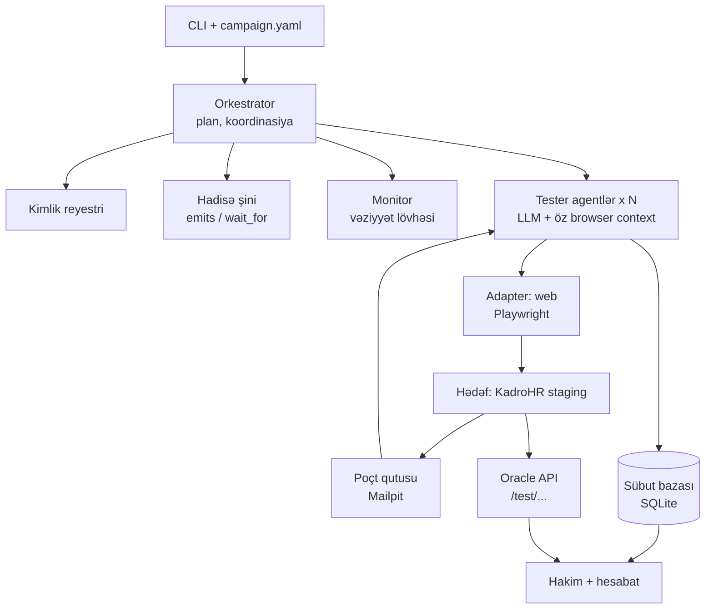

# Pətək — çoxistifadəçili AI test platforması: MVP planı

2026-09-25 ·

## Nə istəyirik, niyə və məqsəd

Pətək — bir əmrlə işə düşən, hədəf saytda N sayda AI tester agentini eyni anda ayrı-ayrı brauzer sessiyalarında işlədən və sübut əsaslı hesabat verən çoxistifadəçili test platformasıdır. İlk hədəf KadroHR web (staging), uzunmüddətli hədəf sənin yazdığın istənilən sayt.

**Niyə**

- Çoxistifadəçili və real-time xətalar (elan çatmır, ticket statusu yanlış görünür, iki nəfər eyni anda təsdiqləyir) tək istifadəçi ilə əl testində üzə çıxmır.
- 30 adam və 30 cihazla canlı test praktiki mümkün deyil; avtomatlaşdırılmalıdır.
- Hər buraxılışdan sonra eyni testlər lazımdır; bir dəfə yazılıb dəfələrlə işlədilməlidir.
- Sənə aid olmayan hissə (LLM-in ekranı oxuması, brauzer idarəsi) hazır kitabxanalardır; sənin dəyərin orkestrator, kimlik reyestri, real-time koordinasiya və sübut əsaslı hesabatdır.

**MVP-nin məqsədi (ölçülə bilən)**

`petek run scenarios/kadrohr.yaml` əmri ilə:

1. 30 agent KadroHR staging-də qeydiyyatdan keçir — email təsdiqi və OTP daxil, insan müdaxiləsi olmadan.
2. Şirkət, 5 departament, rəhbərlər və işçilər yaradılır; hər agent öz rolunda login olur.
3. Elan ssenarisi (1 → 29) və ticket ssenariləri (yarat → in-progress → assign → approve/reject → bildiriş) icra olunur.
4. Hər addımın sübutu (screenshot, DOM, vaxt, oracle cavabı) saxlanılır, hesabat çıxır.
5. Eyni ssenari 3 dəfə ardıcıl işlədildikdə nəticə eynidir; staging-də artıq heç nə qalmır.

## Əhatə: MVP-yə daxildir və daxil deyil

MVP tək maşında, web-də, ssenarili rejimdə 30 agentlə tam dövrəni (qeydiyyat → test → hesabat → təmizlik) bağlayır; qalan hər şey sonrakı fazalardır.

| Sahə | MVP (Faza 0–5) | Sonra (Faza 6–8) |
|---|---|---|
| Adapter | Web, Playwright | API adapteri, mobil (Maestro/Appium) |
| Rejim | Ssenarili (YAML) | Sərbəst kəşf (exploratory) |
| Agent sayı | 30-a qədər, tək proses, tək Chromium | 100+, Redis/NATS ilə çoxmaşınlı |
| Kimlik | Reyestr, catch-all email, email OTP, telefon test kodu | Real SMS provayderi ilə OTP |
| Doğrulama | Typed assert + oracle API + üç mənbəli müqayisə | LLM hakim (screenshot əsaslı yumşaq yoxlama) |
| Hesabat | Markdown/HTML fayl, konsol lövhəsi | Web paneli, tarixçə, trend |
| Kəşfiyyatçı agent | Yox | Faza 6: sayt modeli, avtomatik ssenari |
| Əks-əlaqə | Yox | Faza 7: sürpriz triajı, ssenari v2, fərq kəşfiyyatı |
| Hədəf | KadroHR staging | İstənilən sənin saytın |

## Arxitektura və komponentlər

MVP tək JVM prosesidir: orkestrator kotlinx.coroutines ilə 30 agent korutinini idarə edir, hər agent öz single-thread dispetçerində bir Playwright instansı və browser context ilə yaşayır, hamısı bir SQLite sübut bazasına yazır.



Oxunuşu: orkestrator kimlikləri yaradır və addımları paylayır; agentlər hədəflə brauzer vasitəsilə danışır, OTP-ni Mailpit-dən oxuyur; hakim sübut bazası ilə oracle cavablarını tutuşdurub hesabat çıxarır.

| Komponent | Vəzifəsi | Fayl (MVP, `src/main/kotlin/az/petek/`) |
|---|---|---|
| CLI | `plan`, `run`, `report`, `teardown`, `smoke` əmrləri; campaign.yaml oxuyur | `Main.kt`, `config/Config.kt` |
| Orkestrator | Agentləri yaradır, ssenari addımlarını aktora görə paylayır, ilişməni aşkar edir, run-ı bitirir | `orchestrator/Scheduler.kt` |
| Kimlik reyestri | Ad, email, parol, telefon, rol, departament — başlamazdan əvvəl, deterministik | `identity/Identity.kt` |
| Hadisə şini | `emits` → hadisə + t0; `wait_for` → `CompletableDeferred`; gecikmə ölçmə | `orchestrator/Bus.kt` |
| Monitor | Hər agentin addımı, son əməliyyatı, son screenshotu; hərəkətsizlik taymeri | `orchestrator/Monitor.kt` |
| Tester agent | Gör → LLM qərar verir → Playwright icra edir → qeyd et; yalnız whitelist əməliyyatlar | `agent/AgentLoop.kt`, `Tools.kt`, `Llm.kt` |
| Adapter (web) | Agent başına Playwright instansı, browser server-ə `connect()`, context, snapshot, screenshot | `adapter/WebAdapter.kt`, `BrowserServer.kt` |
| Poçt oxuyucu | Mailpit REST API-dən OTP və təsdiq linki | `mail/MailReader.kt` |
| Oracle müştərisi | KadroHR `/test/...` endpointlərindən həqiqət mənbəyi | `oracle/Oracle.kt` |
| Sübut bazası | run, identity, step, event, artifact, finding cədvəlləri | `evidence/Store.kt` |
| Hakim + hesabat | Typed assertlər, üç mənbəli müqayisə, Markdown/HTML hesabat | `evidence/Judge.kt`, `Report.kt` |

## Əsas dizayn qərarları

Beş qərar bütün kodun sərhədlərini çəkir; hər biri pozulanda sistemin etibarı itir.

**1. Unikallıq agentin yox, orkestratorun işidir.** Agentlər ad, email və ya parol uydurmur. Orkestrator run başlamazdan əvvəl kimlik reyestrini yaradır: hər tester üçün ad, unikal email, parol, telefon, rol, departament. Reyestr `seed` ilə deterministikdir (eyni seed = eyni 30 adam), DB-də `UNIQUE(email)` və `UNIQUE(run_id, display_name)` məhdudiyyəti var, toqquşma olduqda run heç başlamır. Agent öz kimliyini yalnız oxuyur.

**2. Hər agent öz brauzer kontekstində ****və öz thread-ində ****yaşayır.** Bir Chromium prosesi (browser server kimi qaldırılır), N browser context: cookie, localStorage, sessionStorage tam ayrıdır, sessiyalar qarışmır. Playwright-ın browser context mexanizmi məhz bunun üçündür — hər test üçün ayrıca brauzer açmadan izolyasiya olunmuş mühitlər verir və çoxistifadəçili ssenariləri birbaşa dəstəkləyir ([mənbə](https://thegtmdirectory.com/tools/playwright/md)). Playwright Java thread-safe deyil — metodları Playwright obyektinin yaradıldığı thread-də çağırılmalıdır, hər thread-də ayrıca instans yaratmaq olar ([mənbə](https://playwright.dev/java/docs/multithreading)); ona görə hər agent öz Playwright instansı ilə serverə `BrowserType.connect(ws)` edir və bütün brauzer çağırışları onun `newSingleThreadContext` dispetçerində (`withContext(agent.dispatcher)`) icra olunur. Login sonrası `storage_state` faylı saxlanılır; kontekst çökərsə eyni kimliklə yenidən qaldırılır. Sübut: hər agent login sonrası ekranda öz adını oxuyur və reyestrlə tutuşdurur.

**3. Real-time koordinasiya ssenaridə asılı addım kimi yazılır.** "Admin elan verir, işçilər oxuyur" iki müstəqil agent deyil, `emits` / `wait_for` cütüdür. Admin agenti `announcement_created(id, t0)` yayır; 29 işçi agenti həmin hadisəni gözləyir, ekranda görəndə `seen(id, t1)` qaytarır; t1 − t0 real gecikmədir. MVP-də şin tək prosesdə `kotlinx.coroutines CompletableDeferred` + payload-dur; Faza 8-də eyni interfeys Redis pub/sub və ya NATS ilə əvəz olunur. Vaxtı həmişə harness saatı ölçür: t0 = emit anı, t1 = Playwright `wait_for_selector`-in qayıtdığı an; timeout = `not_received`.

**4. Doğruluğu üç mənbənin uyğunluğu təsdiqləyir, AI-nin fikri yox.** A = göndərənin etdiyi (agentin addım logu), B = alanların gördüyü (DOM-da tapılan mətn, screenshot), C = hədəfin özü (oracle API). Qayda: A = B = C → keçdi; A ≠ C → backend xətası; C ≠ B → çatdırılma və ya UI xətası; A ≠ B, C yoxdursa → araşdırılmalı tapıntı. MVP-də yalnız typed assertlər var; LLM hakim (screenshot əsaslı "mətn düzgün görünür?") Faza 8-də əlavə olunur və hər hökmün yanında screenshot saxlanır ki, insan yoxlaya bilsin.

**5. Deterministik olan ****`run`****, düşüncə tələb edən ****`do`****.** `run` addımı sabit Playwright funksiyasıdır (login, OTP oxuma, menyuya keçid) — LLM yox, ucuz, stabil. `do` addımı təbii dildir, LLM icra edir. Qeydiyyat kimi axınlar bir dəfə `do` ilə (UI-ı test edir), qalan 29 üçün `run` ilə keçir. Nəticə: LLM xərci və qeyri-sabitlik yalnız həqiqətən test olunan addımlarda qalır.

## Kimlik reyestri, email və OTP mexanizmi

MVP-də bütün poçt Mailpit-ə gedir, telefon kodu KadroHR-ın test rejimindən oxunur — DNS, real domen və SMS provayderi lazım deyil.

**Reyestrin sahələri**

| Sahə | Nümunə | Qeyd |
|---|---|---|
| `agent_id` | `a07` | run daxilində sabit |
| `display_name` | `Əli Kərimov` | sən verdiyin adlar əvvəl, sonra daxili siyahı; eyni run-da təkrar olmur |
| `email` | `eli.k7x2.a07@test.kadrohr.com` | ad + run-ın 4 simvollu qısaltması + agent_id; həmişə unikal |
| `password` | generasiya, 16 simvol | SQLite-da açıq saxlanır — yalnız test kimliyi |
| `phone` | `+99450` + 7 rəqəm | uydurma, real nömrə deyil; test rejimində validasiya olunmur |
| `role` | `admin` / `manager` / `employee` | campaign.yaml-dakı bölgüyə görə |
| `department` | `IT` | manager və employee üçün; admin-də boş |
| `status` | `planned` → `registered` → `active` → `failed` | orkestrator yeniləyir |
| `storage_state` | fayl yolu | login sonrası cookie/storage; bərpa üçün |

Rol bölgüsü deterministikdir: admin = 1 (agent `a01`), hər departamentə 1 manager, qalan agentlər departamentlərə növbə ilə paylanır (5 departament × 5–6 nəfər).

**Email: Mailpit ilə (MVP)**

1. Mailpit Docker ilə qaldırılır: SMTP `:1025`, REST API və UI `:8025`.
2. KadroHR staging-in çıxış SMTP-si test rejimində Mailpit-ə yönəlir. Beləliklə hədəf real poçt göndərmir, hər məktub Mailpit-də qalır.
3. `test.kadrohr.com` domeni real olmalı deyil — məktub heç vaxt internetə çıxmır.
4. Agentin `run: read_email_code` addımı Mailpit API-də `to:<email>` ilə axtarır, hər 1 saniyədə bir, maksimum 60 saniyə.
5. Kod regex ilə çıxarılır (4–8 rəqəm); təsdiq linki varsa `href` götürülüb eyni browser context-də açılır.
6. Oxunan məktub "read" işarələnir ki, köhnə kod təkrar istifadə olunmasın; məktubun id-si sübut bazasına yazılır.

Alternativ (Faza 8, KadroHR-dan başqa hədəflər üçün): real catch-all domen + IMAP oxuyucu. Eyni `MailReader` interfeysi, fərqli implementasiya.

**Telefon və SMS OTP**

- Test rejimində KadroHR SMS göndərmir; kodu `GET /test/otp/{phone}` oracle endpointi qaytarır (yalnız test tenantı üçün).
- `run` funksiyaları telefon addımını özləri keçir; `do` addımında agent `get_phone_code` alətini çağırır, harness kodu `/test/otp/{phone}`-dan bir neçə saniyə təkrar soruşaraq oxuyur və `{vars.phone_code}` kimi saxlayır (kod LLM-ə getmir).
- Sadə alternativ: test rejimində sabit kod `000000`. Oracle variantı üstündür — real kod generasiyası da test olunur.
- Real SMS provayderi ilə iş MVP-dən kənardır.

**Uğursuzluq halları**

- 60 saniyədə məktub gəlmirsə addım `failed(mail_timeout)`, agent dayanır, orkestrator bunu tapıntı kimi qeyd edir (poçt göndərilmir = xəta).
- Test poçt qutusunun özü (Mailpit) bütün gözləmə müddətində oxunmursa addım `error(mail_unavailable)` olur: bu mühit problemidir, hədəfin xətası sayılmır və hesabatda "test inbox unreachable" kimi görünür.
- Kod səhv qəbul edilirsə bir dəfə təzə kod istənir, ikinci dəfə `failed(otp_rejected)`.
- Qeydiyyat 3 cəhddən sonra alınmırsa agent `failed`, qalan 29 davam edir; hesabatda ayrıca görünür.

## Ssenari formatı və assert növləri

Ssenari YAML-dır: `do` sətirləri təbii dildir (LLM şərh edir), `run`, `emits`, `wait_for` və `assert` isə kod tərəfindən icra və yoxlanır.

Real fayl `scenarios/kadrohr.yaml`-dır; aşağıdakı blok onun tam surətidir (fayl dəyişəndə bu da yenilənir).

```yaml
# KadroHR core campaign (docs/PLAN.md "Ssenari formatı"). `do` = natural language for the LLM agent;
# `run`, `emits`, `wait_for` and `assert` are executed and checked by code.
campaign:
  name: kadrohr-core
  target: https://staging.kadrohr.com     # PETEK_TARGET in .env wins
  testers: 30
  seed: 42
  names: [Əli, Vəli, Sahil, Cəmil, Amil]   # the rest comes from the built-in catalog
  roles: {admin: 1, manager: 5, employee: 24}
  departments: [IT, HR, Satış, Maliyyə, Əməliyyat]
  registration: {invite: 15, company_code: 14}   # how the 29 non-admins join; all 5 managers are among the invited
  budget: {max_steps_per_agent: 60, max_minutes: 40}
  on_fail: continue

# Where the harness reads ids of created objects (never from the LLM when a better source exists).
target_profile:
  id_sources:
    announcement_created:
      oracle: {path: "/test/announcements/latest?by={self.email}", field: id}
    ticket_created:
      oracle: {path: "/test/tickets/latest?by={self.email}", field: id}

setup:
  - id: owner_signup
    actor: admin
    do: "Qeydiyyatdan keç, email kodunu və istənsə telefon kodunu təsdiqlə, 'Pətək Test MMC' adlı şirkət yarat"
  - id: seed
    actor: admin
    run: seed_company              # departments + invitations for invite-mode testers (test API)
  - id: join
    actor: employee[*] | manager[*]
    run: register_and_login        # invite link or company code + e-mail code + phone OTP; saves storage_state

steps:
  - id: announce
    actor: admin
    do: "Elan yarat: 'Sabah 10:00 ümumi iclas'"
    emits: announcement_created
    assert:
      - oracle: {path: "/test/announcements/{last_id}", field: status, equals: published}

  - id: read_announce
    actor: employee[*]
    wait_for: announcement_created
    do: "Bildirişləri aç və yeni elanı oxu"
    assert:
      - visible_text: {text: "Sabah 10:00 ümumi iclas", within_s: 5}
      - latency_max: {ms: 5000}
      - oracle: {path: "/test/announcements/{last_id}/receipts", contains: "{self.email}"}

  - id: ticket
    actor: employee[dept=IT, n=1]
    do: "IT departamentinə ticket yaz: 'Noutbuk işləmir'"
    emits: ticket_created

  - id: ticket_flow
    actor: manager[IT]
    wait_for: ticket_created
    do: "Ticketi in-progress et, sonra HR menecerinə assign et"
    assert:
      - oracle: {path: "/test/tickets/{last_id}", field: status, equals: in_progress}

  - id: race
    actor: ["manager[IT]", "manager[HR]"]   # quoted: [ and ] are YAML syntax inside a list
    parallel: true
    do: "Eyni ticketi approve et"
    assert:
      - only_one_succeeds: true

  - id: forbidden
    actor: employee[dept=IT, n=2]
    do: "Ticketi approve etməyə çalış"
    assert:
      - not_visible: {selector: "[data-testid=\"ticket-approve\"]"}
      - http_status: {path: "/api/tickets/{last_id}/approve", method: POST, equals: 403}
```

**Addım açarları**

| Açar | Mənası |
|---|---|
| `actor` | Kim edir: `admin`, `manager[IT]`, `employee[*]` (hamısı), `employee[dept=IT, n=1]` (departamentdən n-ci), siyahı = bir neçə aktor |
| `do` | Təbii dil tapşırığı; LLM whitelist əməliyyatlarla icra edir |
| `run` | Sabit Playwright və ya API funksiyası; LLM iştirak etmir |
| `emits` | Addım bitəndə hadisə yayır; payload = `{id, actor, t0}` |
| `wait_for` | Hadisə gələnə qədər gözləyir; `timeout_s` (default 30) |
| `parallel` | Aktorlar eyni anda başlayır (yarış testləri üçün) |
| `assert` | Bir və ya bir neçə typed yoxlama; hamısı keçməlidir |
| `on_fail` | `continue` (default) və ya `abort` |

**Assert növləri (MVP)**

| Assert | Parametrlər | Necə yoxlanır |
|---|---|---|
| `visible_text` | `text`, `within_s` | Playwright `wait_for_selector(text=)`; gecikmə = t1 − t0 |
| `not_visible` | `text` və ya `selector` | element DOM-da yoxdur və ya gizlidir |
| `oracle` | `path`, `field`, `equals` / `contains` | oracle API cavabı ilə müqayisə |
| `http_status` | `path`, `method` (default `GET`), `equals` | agentin sessiyası ilə birbaşa HTTP çağırışı |
| `count` | `selector`, `equals` | elementlərin sayı |
| `latency_max` | `ms` | `wait_for` sonrası ölçülən gecikmə həddi |
| `only_one_succeeds` | — | paralel aktorlardan yalnız birinin `do` nəticəsi uğurludur, oracle statusu bir dəfə dəyişib |

`{last_id}` və `{self.email}` kimi şablonlar orkestrator tərəfindən run vaxtı doldurulur: `last_id` = həmin aktorun son `emits` payload-undakı obyekt id-si.

## Texnologiya seçimi və repo strukturu

MVP Kotlin/JVM 21 + Gradle (Kotlin DSL) + kotlinx.coroutines + Playwright Java + SQLite üzərində, tək JVM prosesində, IntelliJ IDEA-da yazılır. Python-un üstünlüyü (hazır browser-agent kitabxanaları) bu planda onsuz da istifadə olunmur, çünki agent döngəsi whitelist alətlərlə özümüz yazırıq; Kotlin isə developerin sürətini və Faza 8-in web paneli üçün Spring Boot yolunu verir.

| Ehtiyac | Seçim | Niyə |
|---|---|---|
| Brauzer | Playwright Java (`com.microsoft.playwright`) | browser context izolyasiyası, auto-wait, trace; Node ayrıca lazım deyil, driver paketlə gəlir |
| Paralellik | kotlinx.coroutines; agent başına `newSingleThreadContext`, LLM/HTTP çağırışları suspend | Playwright-ın "eyni thread" qaydası ödənir, paralellik itmir |
| Brauzer prosesi | Bir Chromium browser server + agent başına `BrowserType.connect(ws)` | 30 Chromium əvəzinə bir Chromium, 30 context |
| Agentin səhifəni oxuması | ARIA snapshot + nömrələnmiş elementlər; screenshot yalnız lazım olanda | tam HTML LLM üçün baha və səhvə meyllidir |
| LLM | Tool calling dəstəkləyən API, Ktor client ilə birbaşa HTTP + JSON; agentlərə ucuz model | xərc nəzarəti, SDK asılılığı yox |
| Konfiqurasiya | kotlinx.serialization + kaml (YAML) | tipli sxem, aydın xəta mesajları |
| CLI | Clikt + Mordant | əmrlər və canlı konsol lövhəsi |
| Sübut bazası | sqlite-jdbc + Exposed | tək fayl, run başına ayrı DB mümkündür |
| Poçt və oracle | Ktor client | Mailpit REST, KadroHR `/test/...` |
| Hesabat | kotlinx.html → HTML, Markdown şablon | screenshot linkləri ilə |
| Loglama | kotlin-logging + logback | `run_id`/`agent_id` MDC ilə |

İlk risk yoxlaması Faza 3-dədir: browser server + `connect()` patterni yaddaş və stabillik baxımından gözləniləni verməsə, Python-a keçid ucuzdur — ssenari formatı, DB sxemi və oracle müqaviləsi dildən asılı deyil.

```
petek/
  build.gradle.kts, settings.gradle.kts
  docker-compose.yml               # Mailpit
  CLAUDE.md, docs/PLAN.md
  scenarios/kadrohr.yaml
  src/main/kotlin/az/petek/
    Main.kt                        # Clikt: plan / run / report / teardown / smoke
    config/Config.kt               # campaign.yaml → data class-lar
    identity/Identity.kt           # reyestr, seed, unikallıq
    mail/MailReader.kt             # interfeys + MailpitReader
    oracle/Oracle.kt               # KadroHR test endpointləri
    agent/
      AgentLoop.kt                 # gör → qərar → et → qeyd; limit, dövrə aşkarı
      Tools.kt                     # whitelist əməliyyatlar
      Llm.kt                       # tool calling, token sayğacı
      runs/                        # Login, RegisterAndLogin, SeedCompany, ReadEmailCode
    adapter/
      WebAdapter.kt                # Playwright instansı, connect, context, snapshot, screenshot
      BrowserServer.kt             # Chromium server-i qaldırır, ws endpoint verir
    orchestrator/
      Scheduler.kt                 # addımları aktorlara paylayır, parallel, on_fail
      Bus.kt                       # emits / wait_for, t0/t1
      Monitor.kt                   # vəziyyət lövhəsi, hərəkətsizlik taymeri
    scenario/
      Schema.kt                    # YAML modeli, aktor seçici, şablonlar
      Asserts.kt                   # typed assertlər
    evidence/
      Store.kt                     # SQLite cədvəlləri
      Judge.kt                     # üç mənbəli müqayisə
      Report.kt                    # Markdown/HTML
  src/test/kotlin/az/petek/         # faza smoke testləri
```

## KadroHR tərəfində hazırlıq

Sayt sənindir: hədəfdə `TEST_MODE` açmaq platformanın yarısını asanlaşdırır, ona görə bu iş Faza 0-dadır və Pətək kodundan əvvəl bitir.

**Test rejimi (****`TEST_MODE=true`****, yalnız staging)**

- Ayrı staging mühiti və ayrı DB; production-a heç bir bağlantı yoxdur.
- Çıxış SMTP → Mailpit (`:1025`); SMS provayderi söndürülür, kod `/test/otp/{phone}`-dan oxunur.
- `@test.kadrohr.com` email ilə yaradılan şirkət `is_test=true` alır; oracle və teardown yalnız belə şirkətlərdə işləyir (təhlükəsizlik qapağı).
- Rate limit və CAPTCHA test IP-ləri üçün söndürülür (allowlist).
- Test endpointləri `X-Test-Token` başlığı tələb edir; token yalnız staging env-də var.

**Oracle və köməkçi endpointlər**

| Metod | Yol | Qaytarır / edir |
|---|---|---|
| GET | `/test/otp/{phone}` | həmin nömrə üçün son OTP kodu |
| GET | `/test/announcements/{id}` | status, yaradılma vaxtı, hədəf auditoriya |
| GET | `/test/announcements/{id}/receipts` | kim oxuyub, nə vaxt (email + timestamp siyahısı) |
| GET | `/test/tickets/{id}` | cari status, assignee, status tarixçəsi (kim, nə vaxt, nədən nəyə) |
| GET | `/test/notifications?user={email}` | istifadəçiyə göndərilən bildirişlər və oxunma vaxtı |
| POST | `/test/companies/seed` | şirkət + departamentlər + dəvətlər bir çağırışla (setup-ı sürətləndirir) |
| DELETE | `/test/companies/{id}` | test şirkətini bütün verilənləri ilə silir |

**UI tərəfində**

- Bildiriş zəngi, elan siyahısı, ticket statusu, approve/reject/assign düymələri `data-testid` alır. Agentin etibarlılığı ən çox buna bağlıdır.
- Real-time mexanizmi sənədləşdirilir: web-də WebSocket, SSE, yoxsa polling; bildiriş DOM-a hansı elementlə düşür. Bu bilinməsə `visible_text` gecikməsi düzgün ölçülmür.

Açıq sual: qeydiyyat dəvətlə (admin əlavə edir, işçi linklə gəlir) yoxsa sərbəstdir (işçi özü qeydiyyatdan keçib şirkət kodu yazır)? Cavab `register_and_login` `run` funksiyasının axınını müəyyən edir.

## Fazalar

Faza 0–5 MVP-dir, 6–8 sonrasıdır; hər faza yalnız "hazır sayılır" şərti ödənəndə bağlanır, yarımçıq faza üstündən növbətiyə keçilmir.

| Faza | Ad | Nəticə | Təxmini müddət |
|---|---|---|---|
| 0 | Hədəf və mühit | Staging test rejimində, Mailpit işləyir, bir skript login olur | 2–3 gün |
| 1 | Konfiqurasiya və reyestr | `petek plan` 30 deterministik kimlik verir | 1–2 gün |
| 2 | Tək agent | Bir agent `do` tapşırığını sübutla tamamlayır | 1–2 həftə |
| 3 | N agent və orkestrator | 30 agent eyni anda, izolyasiya sübutu, ilişmə aşkarı | 3–5 gün |
| 4 | Ssenari və real-time | emits/wait_for, assertlər, KadroHR ssenariləri keçir | 1 həftə |
| 5 | Hesabat, stabillik, təmizlik | Tək əmr → hesabat; 3 run eyni nəticə; teardown | 3–5 gün |
| 6 | Kəşfiyyatçı | Sayt modeli, avtomatik ssenari | sonra |
| 7 | Sürpriz və əks-əlaqə | Triaj, ssenari v2, fərq kəşfiyyatı | sonra |
| 8 | Universal platforma | Web paneli, API/mobil adapter, çoxmaşınlı | sonra |

Müddətlər təxminidir və bir nəfərin axşam-həftəsonu işi kimi hesablanıb.

**Faza 0 — Hədəf və mühit**

- [ ] Staging mühiti ayrı DB ilə qaldırılır, `TEST_MODE` bayrağı əlavə olunur
- [ ] SMTP → Mailpit, SMS → `/test/otp/{phone}`; rate limit və CAPTCHA allowlist
- [ ] `is_test` tenant bayrağı; oracle və teardown endpointləri (yuxarıdakı cədvəl)
- [ ] Əsas UI elementlərinə `data-testid`
- [ ] Real-time mexanizmi və bildirişin DOM görünüşü sənədləşdirilir
- [ ] Repo: IntelliJ IDEA, Kotlin/JVM 21, Gradle (Kotlin DSL); `Chromium ilk Playwright.create()-də avtomatik yüklənir`, `.env` (LLM açarı, test token, Mailpit URL)
- [ ] `docker-compose.yml` ilə Mailpit

Hazır sayılır: bir Playwright skripti test email ilə qeydiyyatdan keçir, kodu Mailpit-dən oxuyur, login olur, `DELETE /test/companies/{id}` ilə silir.

**Faza 1 — Konfiqurasiya və kimlik reyestri**

- [ ] `config``/Config.kt`: campaign.yaml → kaml + kotlinx.serialization data class-ları; xətalar sətir nömrəsi ilə
- [ ] `identity``/Identity.kt`: ad siyahısı, email/parol/telefon generasiyası, seed, rol və departament bölgüsü
- [ ] SQLite sxemi: `run`, `identity`, `step`, `event`, `artifact`, `finding`; unikallıq məhdudiyyətləri
- [ ] `petek plan campaign.yaml`: kimlikləri cədvəl kimi çap edir, DB-yə yazır, heç nə icra etmir

Hazır sayılır: `plan` iki dəfə çağırılanda eyni 30 kimliyi verir; eyni adı iki dəfə verəndə run başlamır və səbəbi yazır.

**Faza 2 — Tək agent (ən vacib faza)**

- [ ] `adapter/``WebAdapter.kt + BrowserServer.kt`: context yaratma, accessibility snapshot (nömrələnmiş elementlər), screenshot, `storage_state`
- [ ] `agent/``Tools.kt`: whitelist — `navigate`, `click(id)`, `type(id, text)`, `read_text(selector)`, `wait_text(text, timeout)`, `done(summary)`, `report_problem(kind, note)`
- [ ] `agent/``Llm.kt`: tool calling, sistem promptu (rol, məqsəd, qaydalar), token sayğacı
- [ ] `agent/``AgentLoop.kt`: gör → qərar → et → qeyd; addım limiti; eyni əməliyyatın 3 dəfə təkrarı = dövrə, dayandır
- [ ] Hər addımda: screenshot + accessibility snapshot + vaxt + LLM gerekçəsi → `step` və `artifact`
- [ ] `runs/`: `login`, `read_email_code`, `register_and_login`, `seed_company`

Hazır sayılır: bir agent "qeydiyyatdan keç, kodu təsdiqlə, şirkət yarat" tapşırığını `do` ilə tamamlayır; hər addımın sübutu DB-dədir; eyni iş `run` ilə 10 saniyədən az çəkir.

**Faza 3 — N agent və orkestrator**

- [ ] `orchestrator/Scheduler.kt`: aktor seçici parseri, addımları agent korutinlərinə paylama, `parallel`
- [ ] Hər agent öz single-thread dispetçeri və öz Playwright instansı ilə ortaq browser server-ə connect() edir; 30 context bir Chromium-da; yaddaş və CPU ölçülür
- [ ] `orchestrator/Monitor.kt`: vəziyyət lövhəsi (Mordant), N saniyə hərəkətsizlik → `blocked`, agent növbəti addıma keçir
- [ ] Çökən context eyni kimlik və `storage_state` ilə bərpa olunur
- [ ] `on_fail: continue | abort`

Hazır sayılır: 30 agent eyni anda login olur, hər biri ekranda öz adını oxuyub reyestrlə tutuşdurur (sessiya qarışmasının sübutu); biri süni ilişdiriləndə digərləri dayanmır; 30 agent eyni anda gözləyərkən gecikmə ölçüsü serialaşmır.

**Faza 4 — Ssenari mühərriki və real-time**

- [ ] `scenario/``Schema.kt`: addım açarları, şablonlar (`{last_id}`, `{self.email}`)
- [ ] `orchestrator/Bus.kt`: `emits` → hadisə + t0; `wait_for` → gözləmə + timeout; alan tərəfdə t1
- [ ] `scenario/Asserts.kt`: `visible_text`, `not_visible`, `oracle`, `http_status`, `count`, `latency_max`, `only_one_succeeds`
- [ ] `oracle``/Oracle.kt`: test endpointləri müştərisi
- [ ] `scenarios/kadrohr.yaml`: setup, elan, ticket axını, icazə, yarış

Hazır sayılır: elan ssenarisi 29/29 çatır və gecikmələr agent başına yazılır; ticket axınları oracle ilə təsdiqlənir; icazə testi 403 qaytarır; yarış testində yalnız biri qalib gəlir.

**Faza 5 — Hesabat, stabillik, təmizlik**

- [ ] `evidence/Judge.kt`: A/B/C müqayisəsi, tapıntı növləri (backend, çatdırılma/UI, araşdırılmalı)
- [ ] `evidence/Report.kt`: addım cədvəli, gecikmə paylanması, tapıntılar screenshot və oracle cavabı ilə, agent başına token və xərc
- [ ] `petek run --repeat 3`: stabillik faizi, flaky addımların işarələnməsi
- [ ] `petek teardown`: run bitəndə və yarımçıq qalanda test şirkəti silinir
- [ ] README: quraşdırma, ilk run, ssenari yazma

Hazır sayılır: tək əmr → tam run → hesabat; 3 ardıcıl run eyni nəticə; staging-də artıq heç nə qalmır.

**Faza 6 — Kəşfiyyatçı (MVP-dən sonra)**

- [ ] Sayt modeli sxemi: `pages`, `roles`, `actions`, `realtime`, `unknowns`; `observed` / `inferred` ayrımı
- [ ] Üç fazalı gəzinti: anonim, rol-əsaslı, sınaq toxunuşu; səhifə və vaxt büdcəsi
- [ ] Test nümunələri kitabxanası: hər əməliyyat üçün uğurlu yol, icazə, yarış, real-time, sərhəd, idempotentlik
- [ ] İnstruksiya verilibsə onu modelə bağlama (grounding)

**Faza 7 — Sürpriz protokolu və əks-əlaqə**

- [ ] `report_problem` → kəşfiyyatçı triajı: sistem xətası / model boşluğu / ssenari xətası
- [ ] Model versiyalama; run sonrası hesabat v2 → ssenari v2 diff → sənin təsdiqin
- [ ] Təsdiqlənmiş ssenarilər dondurulur; fərq kəşfiyyatı (release-dən release-ə nə dəyişib)

**Faza 8 — Universal platforma**

- [ ] Web paneli (kampaniya yaratma, canlı lövhə, hesabat tarixçəsi)
- [ ] API adapteri, mobil adapter, IMAP `MailReader`
- [ ] Sərbəst rejim, LLM hakim
- [ ] Redis/NATS ilə çoxmaşınlı orkestrasiya

## Sübut bazası və hesabat

Hər keçdi/keçmədi hökmü ən azı bir screenshot və ya oracle cavabına bağlıdır; sübutsuz nəticə hesabata düşmür.

| Cədvəl | Əsas sahələr | Nə üçün |
|---|---|---|
| `run` | `run_id`, `campaign_hash`, `seed`, `started_at`, `ended_at`, `result` | run-ları müqayisə etmək, `--repeat` |
| `identity` | reyestrin sahələri + `run_id` | kim kimdir |
| `step` | `step_id`, `run_id`, `agent_id`, `scenario_step`, `kind` (do/run), `action`, `llm_reason`, `t_start`, `t_end`, `result` | hər əməliyyatın izi |
| `event` | `event_id`, `name`, `emitter_agent`, `payload`, `t0`; alan tərəf üçün `receiver_agent`, `t1` | real-time gecikmə |
| `artifact` | `step_id`, `type` (screenshot/a11y/dom/http/mail), `path` | sübut faylları |
| `finding` | `finding_id`, `step_id`, `class` (backend/delivery_ui/investigate/flaky), `a`, `b`, `c`, `note` | üç mənbəli müqayisənin nəticəsi |

Hesabat (Markdown + HTML, run başına bir qovluq):

- Xülasə: keçən/keçməyən addım sayı, agent sayı, müddət, ümumi token və xərc.
- Addım cədvəli: ssenari addımı × aktor, nəticə, müddət, screenshot linki.
- Real-time: hər hadisə üçün alan başına gecikmə, orta, maksimum, çatmayanlar.
- Tapıntılar: sinif, A/B/C dəyərləri yanaşı, screenshot və oracle cavabı.
- Stabillik (`--repeat` ilə): hər addımın keçmə faizi; 100%-dən aşağı olanlar `flaky`.
- Uğursuz agentlər: hansı addımda, hansı səbəblə (`mail_timeout`, `otp_rejected`, `blocked`).

## Pozulmamalı qaydalar, risklər və xərc

**Kodlaşdırarkən pozulmamalı qaydalar**

1. Vaxtı həmişə harness ölçür, LLM yox.
2. Assertləri həmişə kod yoxlayır, LLM yox.
3. Agent yalnız whitelist əməliyyatları edə bilər; yeni əməliyyat = kod dəyişikliyi, prompt dəyişikliyi yox.
4. Hər şeyin ID-si var: `run_id`, `agent_id`, `step_id`, `event_id`, `correlation_id`.
5. Sübutsuz nəticə yoxdur.
6. Deterministik olan `run`, yalnız düşüncə tələb edən `do`.
7. Kimliyi yalnız orkestrator yaradır.
8. Oracle və teardown yalnız `is_test=true` şirkətlərdə işləyir.

**Risklər**

| Risk | Təsiri | Tədbir |
|---|---|---|
| LLM addımı qeyri-sabitdir (yanlış element, dövrə) | flaky testlər | accessibility tree + `data-testid`; addım limiti; təkrar aşkarı; `run` ilə əvəzləmə |
| 30 context yaddaşı doldurur | agentlər çökür | screenshot yalnız lazım olanda; context başına viewport kiçik; lazım olsa 2 Chromium |
| Bildiriş DOM-a gec düşür, polling intervalı | gecikmə yanlış ölçülür | real-time mexanizmi Faza 0-da sənədləşdirilir; `visible_text` intervalı 100 ms |
| Mailpit-də köhnə məktub oxunur | səhv OTP | oxunan məktub read işarələnir; axtarış run başlanğıcından sonrakı məktublarla məhdudlaşır |
| Teardown yarımçıq run-da işləmir | staging zibillənir | `try/finally` + `petek teardown --run <id>` əmri |
| Ssenari LLM tərəfindən "yaradıcı" şərh olunur | test məqsədindən sapma | `do` mətnləri qısa və birmənalı; sistem promptunda "tapşırıqdan kənara çıxma" |

**Xərc (təxmini)**

Bir `do` addımı accessibility tree ilə təxminən 3–5 min token, `run` addımı 0 token. 30 agent × ~40 `do` addımı × ~4 min token ≈ 5 milyon token bir run üçün — ucuz modellə bir neçə dollar səviyyəsində. Setup-ın `run` və API ilə edilməsi bu rəqəmi yarıya endirir. Dəqiq rəqəm Faza 2-də token sayğacı ilə ölçüləcək.

**Qərar gözləyən suallar**

- [ ] Qeydiyyat dəvətlə, yoxsa sərbəst şirkət kodu ilə?
- [ ] KadroHR web-də real-time mexanizmi hansıdır?
- [ ] Elanın "oxundu" statusu backend-də var, yoxsa yalnız bildiriş göndərilir? (receipts oracle-ı buna bağlıdır)
- [ ] Hansı LLM provayderi və model agentlər üçün?

## MVP-nin uğur meyarları

Aşağıdakıların hamısı işarələnəndə MVP bitmiş sayılır və Faza 6-ya keçilir.

- [ ] `petek run scenarios/kadrohr.yaml` tək əmrlə, insan müdaxiləsi olmadan sona çatır
- [ ] 30 agentin ən azı 28-i qeydiyyat + OTP + login mərhələsini keçir; qalanların səbəbi hesabatdadır
- [ ] Hər agent login sonrası öz adını görür (izolyasiya sübutu)
- [ ] Elan 29 alandan ən azı 28-inə çatır, gecikmələr ölçülüb yazılır
- [ ] Ticket axını (yarat → in-progress → assign → approve/reject) oracle ilə təsdiqlənir
- [ ] İcazə testi 403 qaytarır; yarış testində yalnız biri qalib gəlir
- [ ] Hər keçmədi tapıntısının yanında screenshot və A/B/C dəyərləri var
- [ ] `--repeat 3` ilə nəticə eynidir; flaky addımlar sıfırdır və ya səbəbi bilinir
- [ ] Run sonrası staging-də test şirkəti qalmır
- [ ] Hesabat README-də təsvir olunmuş yolla açılır
