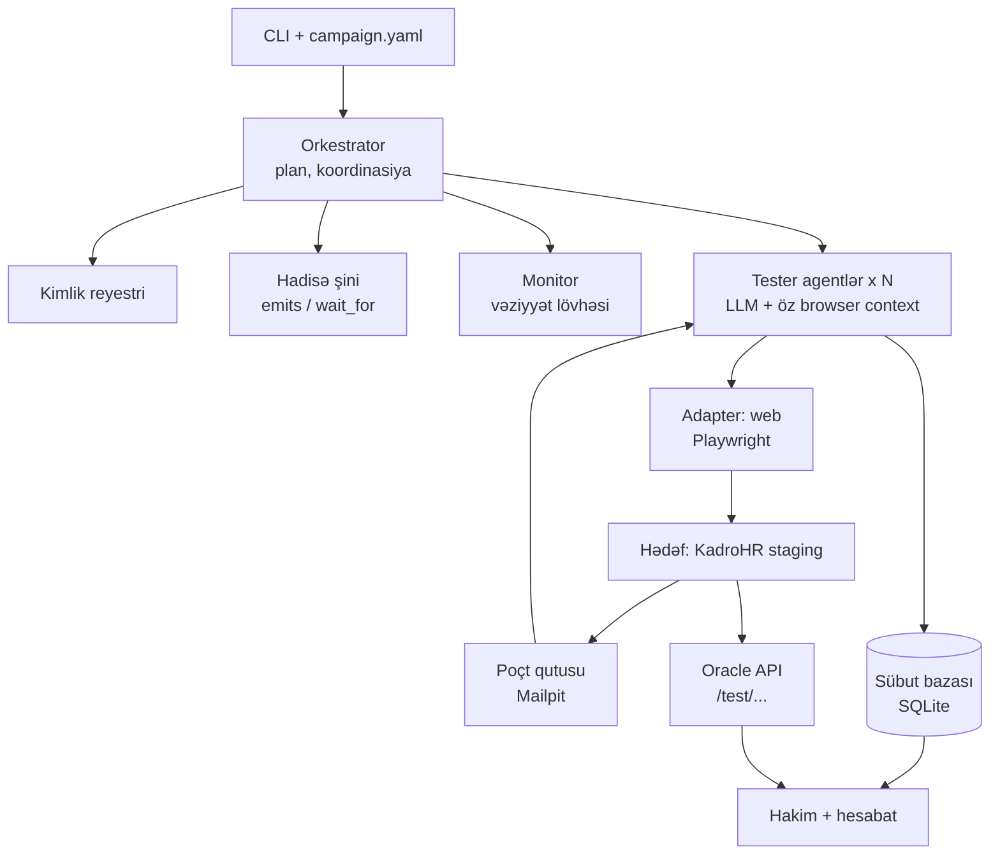

# Pətək — çoxistifadəçili AI test platforması: MVP planı

2026-09-25 ·

## Nə istəyirik, niyə və məqsəd

Pətək — bir əmrlə işə düşən, hədəf saytda N sayda AI tester agentini eyni anda ayrı-ayrı brauzer sessiyalarında işlədən və sübut əsaslı hesabat verən çoxistifadəçili test platformasıdır. İlk hədəf KadroHR web (staging), uzunmüddətli hədəf sənin yazdığın istənilən sayt.

**Niyə**

- Çoxistifadəçili və real-time xətalar (elan çatmır, ticket statusu yanlış görünür, iki nəfər eyni anda təsdiqləyir) tək istifadəçi ilə əl testində üzə çıxmır.
- 30 adam və 30 cihazla canlı test praktiki mümkün deyil; avtomatlaşdırılmalıdır.
- Hər buraxılışdan sonra eyni testlər lazımdır; bir dəfə yazılıb dəfələrlə işlədilməlidir.
- Sənə aid olmayan hissə (LLM-in ekranı oxuması, brauzer idarəsi) hazır kitabxanalardır; sənin dəyərin orkestrator, kimlik reyestri, real-time koordinasiya və sübut əsaslı hesabatdır.

**MVP-nin məqsədi (ölçülə bilən)**

`petek run scenarios/kadrohr.yaml` əmri ilə:

1. 30 agent KadroHR staging-də qeydiyyatdan keçir — email təsdiqi və OTP daxil, insan müdaxiləsi olmadan.
2. Şirkət, 5 departament, rəhbərlər və işçilər yaradılır; hər agent öz rolunda login olur.
3. Elan ssenarisi (1 → 29) və ticket ssenariləri (yarat → in-progress → assign → approve/reject → bildiriş) icra olunur.
4. Hər addımın sübutu (screenshot, DOM, vaxt, oracle cavabı) saxlanılır, hesabat çıxır.
5. Eyni ssenari 3 dəfə ardıcıl işlədildikdə nəticə eynidir; staging-də artıq heç nə qalmır.

## Əhatə: MVP-yə daxildir və daxil deyil

MVP tək maşında, web-də, ssenarili rejimdə 30 agentlə tam dövrəni (qeydiyyat → test → hesabat → təmizlik) bağlayır; qalan hər şey sonrakı fazalardır.

| Sahə | MVP (Faza 0–5) | Sonra (Faza 6–8) |
|---|---|---|
| Adapter | Web, Playwright | API adapteri, mobil (Maestro/Appium) |
| Rejim | Ssenarili (YAML) | Sərbəst kəşf (exploratory) |
| Agent sayı | Limitsiz (ilk kampaniya 30), tək proses, yükə görə bölünmüş Chromium-lar; `petek capacity` maşın üçün maksimumu tövsiyə edir | Redis/NATS ilə çoxmaşınlı |
| Kimlik | Reyestr, catch-all email, email OTP, telefon test kodu | Real SMS provayderi ilə OTP |
| Doğrulama | Typed assert + oracle API + üç mənbəli müqayisə | LLM hakim (screenshot əsaslı yumşaq yoxlama) |
| Hesabat | Markdown/HTML fayl, konsol lövhəsi | Web paneli, tarixçə, trend |
| Kəşfiyyatçı agent | Yox | Faza 6: sayt modeli, avtomatik ssenari |
| Əks-əlaqə | Yox | Faza 7: sürpriz triajı, ssenari v2, fərq kəşfiyyatı |
| Hədəf | KadroHR staging | İstənilən sənin saytın |

## Arxitektura və komponentlər

MVP tək JVM prosesidir: orkestrator kotlinx.coroutines ilə 30 agent korutinini idarə edir, hər agent öz single-thread dispetçerində bir Playwright instansı və browser context ilə yaşayır, hamısı bir SQLite sübut bazasına yazır.



Oxunuşu: orkestrator kimlikləri yaradır və addımları paylayır; agentlər hədəflə brauzer vasitəsilə danışır, OTP-ni Mailpit-dən oxuyur; hakim sübut bazası ilə oracle cavablarını tutuşdurub hesabat çıxarır.

| Komponent | Vəzifəsi | Fayl (MVP, `src/main/kotlin/az/petek/`) |
|---|---|---|
| CLI | `plan`, `run`, `report`, `teardown`, `smoke` əmrləri; campaign.yaml oxuyur | `Main.kt`, `config/Config.kt` |
| Orkestrator | Agentləri yaradır, ssenari addımlarını aktora görə paylayır, ilişməni aşkar edir, run-ı bitirir | `orchestrator/Scheduler.kt` |
| Kimlik reyestri | Ad, email, parol, telefon, rol, departament — başlamazdan əvvəl, deterministik | `identity/Identity.kt` |
| Hadisə şini | `emits` → hadisə + t0; `wait_for` → `CompletableDeferred`; gecikmə ölçmə | `orchestrator/Bus.kt` |
| Monitor | Hər agentin addımı, son əməliyyatı, son screenshotu; hərəkətsizlik taymeri | `orchestrator/Monitor.kt` |
| Tester agent | Gör → LLM qərar verir → Playwright icra edir → qeyd et; yalnız whitelist əməliyyatlar | `agent/AgentLoop.kt`, `Tools.kt`, `Llm.kt` |
| Adapter (web) | Agent başına Playwright instansı, browser server-ə `connect()`, context, snapshot, screenshot | `adapter/WebAdapter.kt`, `BrowserServer.kt` |
| Poçt oxuyucu | Mailpit REST API-dən OTP və təsdiq linki | `mail/MailReader.kt` |
| Oracle müştərisi | KadroHR `/test/...` endpointlərindən həqiqət mənbəyi | `oracle/Oracle.kt` |
| Sübut bazası | run, identity, step, event, artifact, finding cədvəlləri | `evidence/Store.kt` |
| Hakim + hesabat | Typed assertlər, üç mənbəli müqayisə, Markdown/HTML hesabat | `evidence/Judge.kt`, `Report.kt` |

## Əsas dizayn qərarları

Beş qərar bütün kodun sərhədlərini çəkir; hər biri pozulanda sistemin etibarı itir.

**1. Unikallıq agentin yox, orkestratorun işidir.** Agentlər ad, email və ya parol uydurmur. Orkestrator run başlamazdan əvvəl kimlik reyestrini yaradır: hər tester üçün ad, unikal email, parol, telefon, rol, departament. Reyestr `seed` ilə deterministikdir (eyni seed = eyni 30 adam), DB-də `UNIQUE(email)` və `UNIQUE(run_id, display_name)` məhdudiyyəti var, toqquşma olduqda run heç başlamır. Agent öz kimliyini yalnız oxuyur.

**2. Hər agent öz brauzer kontekstində ****və öz thread-ində ****yaşayır.** Bir Chromium prosesi (browser server kimi qaldırılır), N browser context: cookie, localStorage, sessionStorage tam ayrıdır, sessiyalar qarışmır. Playwright-ın browser context mexanizmi məhz bunun üçündür — hər test üçün ayrıca brauzer açmadan izolyasiya olunmuş mühitlər verir və çoxistifadəçili ssenariləri birbaşa dəstəkləyir ([mənbə](https://thegtmdirectory.com/tools/playwright/md)). Playwright Java thread-safe deyil — metodları Playwright obyektinin yaradıldığı thread-də çağırılmalıdır, hər thread-də ayrıca instans yaratmaq olar ([mənbə](https://playwright.dev/java/docs/multithreading)); ona görə hər agent öz Playwright instansı ilə serverə `BrowserType.connect(ws)` edir və bütün brauzer çağırışları onun `newSingleThreadContext` dispetçerində (`withContext(agent.dispatcher)`) icra olunur. Login sonrası `storage_state` faylı saxlanılır; kontekst çökərsə eyni kimliklə yenidən qaldırılır. Sübut: hər agent login sonrası ekranda öz adını oxuyur və reyestrlə tutuşdurur.

**3. Real-time koordinasiya ssenaridə asılı addım kimi yazılır.** "Admin elan verir, işçilər oxuyur" iki müstəqil agent deyil, `emits` / `wait_for` cütüdür. Admin agenti `announcement_created(id, t0)` yayır; 29 işçi agenti həmin hadisəni gözləyir, ekranda görəndə `seen(id, t1)` qaytarır; t1 − t0 real gecikmədir. MVP-də şin tək prosesdə `kotlinx.coroutines CompletableDeferred` + payload-dur; Faza 8-də eyni interfeys Redis pub/sub və ya NATS ilə əvəz olunur. Vaxtı həmişə harness saatı ölçür: t0 = emit anı, t1 = Playwright `wait_for_selector`-in qayıtdığı an; timeout = `not_received`.

**4. Doğruluğu üç mənbənin uyğunluğu təsdiqləyir, AI-nin fikri yox.** A = göndərənin etdiyi (agentin addım logu), B = alanların gördüyü (DOM-da tapılan mətn, screenshot), C = hədəfin özü (oracle API). Qayda: A = B = C → keçdi; A ≠ C → backend xətası; C ≠ B → çatdırılma və ya UI xətası; A ≠ B, C yoxdursa → araşdırılmalı tapıntı. MVP-də yalnız typed assertlər var; LLM hakim (screenshot əsaslı "mətn düzgün görünür?") Faza 8-də əlavə olunur və hər hökmün yanında screenshot saxlanır ki, insan yoxlaya bilsin.

**5. Deterministik olan ****`run`****, düşüncə tələb edən ****`do`****.** `run` addımı sabit Playwright funksiyasıdır (login, OTP oxuma, menyuya keçid) — LLM yox, ucuz, stabil. `do` addımı təbii dildir, LLM icra edir. Qeydiyyat kimi axınlar bir dəfə `do` ilə (UI-ı test edir), qalan 29 üçün `run` ilə keçir. Nəticə: LLM xərci və qeyri-sabitlik yalnız həqiqətən test olunan addımlarda qalır.

## Kimlik reyestri, email və OTP mexanizmi

MVP-də bütün poçt Mailpit-ə gedir, telefon kodu KadroHR-ın test rejimindən oxunur — DNS, real domen və SMS provayderi lazım deyil.

**Reyestrin sahələri**

| Sahə | Nümunə | Qeyd |
|---|---|---|
| `agent_id` | `a07` | run daxilində sabit |
| `display_name` | `Əli Kərimov` | sən verdiyin adlar əvvəl, sonra daxili siyahı; eyni run-da təkrar olmur |
| `email` | `eli.k7x2.a07@test.kadrohr.com` | ad + run-ın 4 simvollu qısaltması + agent_id; həmişə unikal |
| `password` | generasiya, 16 simvol | SQLite-da açıq saxlanır — yalnız test kimliyi |
| `phone` | `+99450` + 7 rəqəm | uydurma, real nömrə deyil; test rejimində validasiya olunmur |
| `role` | `admin` / `manager` / `employee` | campaign.yaml-dakı bölgüyə görə |
| `department` | `IT` | manager və employee üçün; admin-də boş |
| `status` | `planned` → `registered` → `active` → `failed` | orkestrator yeniləyir |
| `storage_state` | fayl yolu | login sonrası cookie/storage; bərpa üçün |

Rol bölgüsü deterministikdir: admin = 1 (agent `a01`), hər departamentə 1 manager, qalan agentlər departamentlərə növbə ilə paylanır (5 departament × 5–6 nəfər). Managerlər həmişə dəvətlə qoşulur (`/join` formasında rol sahəsi yoxdur, şirkət kodu ilə qoşulan işçi olur); qalan dəvətlər işçilərə seed-ə görə departamentlər üzrə paylanır, şirkət kodu ilə yalnız işçilər qoşulur.

**Email: Mailpit ilə (MVP)**

1. Mailpit Docker ilə qaldırılır: SMTP `:1025`, REST API və UI `:8025`.
2. KadroHR staging-in çıxış SMTP-si test rejimində Mailpit-ə yönəlir. Beləliklə hədəf real poçt göndərmir, hər məktub Mailpit-də qalır.
3. `test.kadrohr.com` domeni real olmalı deyil — məktub heç vaxt internetə çıxmır.
4. Agentin `run: read_email_code` addımı Mailpit API-də `to:<email>` ilə axtarır, hər 1 saniyədə bir, maksimum 60 saniyə.
5. Kod regex ilə çıxarılır (4–8 rəqəm); təsdiq linki varsa `href` götürülüb eyni browser context-də açılır.
6. Oxunan məktub "read" işarələnir ki, köhnə kod təkrar istifadə olunmasın; məktubun id-si sübut bazasına yazılır.

Alternativ (Faza 8, KadroHR-dan başqa hədəflər üçün): real catch-all domen + IMAP oxuyucu. Eyni `MailReader` interfeysi, fərqli implementasiya.

**Telefon və SMS OTP**

- Test rejimində KadroHR SMS göndərmir; kodu `GET /test/otp/{phone}` oracle endpointi qaytarır (yalnız test tenantı üçün).
- `run` funksiyaları telefon addımını özləri keçir; `do` addımında agent `get_phone_code` alətini çağırır, harness kodu `/test/otp/{phone}`-dan bir neçə saniyə təkrar soruşaraq oxuyur və `{vars.phone_code}` kimi saxlayır (kod LLM-ə getmir).
- Sadə alternativ: test rejimində sabit kod `000000`. Oracle variantı üstündür — real kod generasiyası da test olunur.
- Real SMS provayderi ilə iş MVP-dən kənardır.

**Uğursuzluq halları**

- 60 saniyədə məktub gəlmirsə addım `failed(mail_timeout)`, agent dayanır, orkestrator bunu tapıntı kimi qeyd edir (poçt göndərilmir = xəta).
- Test poçt qutusunun özü (Mailpit) bütün gözləmə müddətində oxunmursa addım `error(mail_unavailable)` olur: bu mühit problemidir, hədəfin xətası sayılmır və hesabatda "test inbox unreachable" kimi görünür.
- Kod səhv qəbul edilirsə bir dəfə təzə kod istənir, ikinci dəfə `failed(otp_rejected)`.
- Qeydiyyat 3 cəhddən sonra alınmırsa agent `failed`, qalan 29 davam edir; hesabatda ayrıca görünür.

## Ssenari formatı və assert növləri

Ssenari YAML-dır: `do` sətirləri təbii dildir (LLM şərh edir), `run`, `emits`, `wait_for` və `assert` isə kod tərəfindən icra və yoxlanır.

Aşağıdakı blok `scenarios/contract-demo.yaml`-ın tam surətidir (fayl dəyişəndə bu da yenilənir): kontrakt saytı (`docs/TARGET_CONTRACT.md`, fake target) üçün kampaniya. Real KadroHR üçün kampaniya `scenarios/kadrohr.yaml`-dır: eyni sxem, üstəlik `target_profile.flows` (qeydiyyat, dəvət, şirkət kodu ilə qoşulma, login axınları real markup-a görə), `local_storage`, `dismiss`, `api_prefix` və `campaign.pacing` (aşağıda "Hədəf axınları").

```yaml
# Contract demo campaign (docs/PLAN.md "Ssenari formatı"): the site of docs/TARGET_CONTRACT.md, which the fake target
# implements (./gradlew :testing:fake-target:run). Its flows are the contract defaults, so target_profile names none.
# `do` = natural language for the LLM agent; `run`, `emits`, `wait_for` and `assert` are executed and checked by code.
campaign:
  name: contract-demo
  target: https://staging.kadrohr.com     # PETEK_TARGET in .env wins
  testers: 30
  seed: 42
  names: [Əli, Vəli, Sahil, Cəmil, Amil]   # the rest comes from the built-in catalog
  roles: {admin: 1, manager: 5, employee: 24}
  departments: [IT, HR, Satış, Maliyyə, Əməliyyat]
  registration: {invite: 15, company_code: 14}   # how the 29 non-admins join; all 5 managers are among the invited
  budget: {max_steps_per_agent: 60, max_minutes: 40}
  on_fail: continue

# Where the harness reads ids of created objects (never from the LLM when a better source exists).
target_profile:
  id_sources:
    announcement_created:
      oracle: {path: "/test/announcements/latest?by={self.email}", field: id}
    ticket_created:
      oracle: {path: "/test/tickets/latest?by={self.email}", field: id}

setup:
  - id: owner_signup
    actor: admin
    do: "Qeydiyyatdan keç, email kodunu və istənsə telefon kodunu təsdiqlə, 'Pətək Test MMC' adlı şirkət yarat"
  - id: seed
    actor: admin
    run: seed_company              # departments + invitations for invite-mode testers (test API)
  - id: join
    actor: employee[*] | manager[*]
    run: register_and_login        # invite link or company code + e-mail code + phone OTP; saves storage_state

steps:
  - id: announce
    actor: admin
    do: "Elan yarat: 'Sabah 10:00 ümumi iclas'"
    emits: announcement_created
    assert:
      - oracle: {path: "/test/announcements/{last_id}", field: status, equals: published}

  - id: read_announce
    actor: employee[*]
    wait_for: announcement_created
    do: "Bildirişləri aç və yeni elanı oxu"
    assert:
      - visible_text: {text: "Sabah 10:00 ümumi iclas", within_s: 5}
      - latency_max: {ms: 5000}
      - oracle: {path: "/test/announcements/{last_id}/receipts", contains: "{self.email}"}

  - id: ticket
    actor: employee[dept=IT, n=1]
    do: "IT departamentinə ticket yaz: 'Noutbuk işləmir'"
    emits: ticket_created

  - id: ticket_flow
    actor: manager[IT]
    wait_for: ticket_created
    do: "Ticketi in-progress et, sonra HR menecerinə assign et"
    assert:
      - oracle: {path: "/test/tickets/{last_id}", field: status, equals: in_progress}

  - id: race
    actor: ["manager[IT]", "manager[HR]"]   # quoted: [ and ] are YAML syntax inside a list
    parallel: true
    do: "Eyni ticketi approve et"
    assert:
      # Decided by code from each manager's own approve request (accepted < 400, refused 409), never by the agent.
      - only_one_succeeds: {request: "POST .*/approve"}

  - id: forbidden
    actor: employee[dept=IT, n=2]
    do: "Ticketi approve etməyə çalış"
    assert:
      - not_visible: {selector: "[data-testid=\"ticket-approve\"]"}
      - http_status: {path: "/api/tickets/{last_id}/approve", method: POST, equals: 403}
```

**Addım açarları**

| Açar | Mənası |
|---|---|
| `actor` | Kim edir: `admin`, `manager[IT]`, `employee[*]` (hamısı), `employee[dept=IT, n=1]` (departamentdən n-ci), siyahı = bir neçə aktor |
| `do` | Təbii dil tapşırığı; LLM whitelist əməliyyatlarla icra edir |
| `run` | Sabit Playwright və ya API funksiyası; LLM iştirak etmir |
| `emits` | Addım bitəndə hadisə yayır; payload = `{id, actor, t0}` |
| `wait_for` | Hadisə gələnə qədər gözləyir; `timeout_s` (default 30) |
| `parallel` | Aktorlar eyni anda başlayır (yarış testləri üçün) |
| `assert` | Bir və ya bir neçə typed yoxlama; hamısı keçməlidir |
| `on_fail` | `continue` (default) və ya `abort` |

**Assert növləri (MVP)**

| Assert | Parametrlər | Necə yoxlanır |
|---|---|---|
| `visible_text` | `text`, `within_s` | Playwright `wait_for_selector(text=)`; gecikmə = t1 − t0 |
| `not_visible` | `text` və ya `selector` | element DOM-da yoxdur və ya gizlidir |
| `oracle` | `path`, `field`, `equals` / `contains` | oracle API cavabı ilə müqayisə |
| `http_status` | `path`, `method` (default `GET`), `equals` | agentin sessiyası ilə birbaşa HTTP çağırışı |
| `count` | `selector`, `equals` | elementlərin sayı |
| `latency_max` | `ms` | `wait_for` sonrası ölçülən gecikmə həddi |
| `only_one_succeeds` | `true` və ya `{request: "<METHOD> <path regex>", oracle: {path, field, equals}}` | paralel aktorlardan yalnız birinin sorğusunu hədəf qəbul edib: brauzerin gördüyü uyğun sorğulardan biri `< 400`, heç biri 403/409/422 deyil (agentin `done(success)` sözü nəzərə alınmır); `oracle` verilibsə, test API-nin son vəziyyəti də yoxlanır. Yarışı uduzan aktor (409/422 və ya obyekt artıq qərarlaşdırılıb) gözlənilən nəticədir: addımı `lost_race` ilə keçir |

`{last_id}` və `{self.email}` kimi şablonlar orkestrator tərəfindən run vaxtı doldurulur: `last_id` = həmin aktorun son `emits` payload-undakı obyekt id-si.

### Hədəf axınları (`target_profile.flows`)

Pətək istənilən sayta uyğunlaşmalıdır: KadroHR-ın real axınları kontraktdan fərqlənir (linklə təsdiq, loginə şirkət
kodu, ad/soyad ayrı, şifrə təkrarı, overlay-lər). Ona görə deterministik `run` funksiyaları sabit kod yox, kampaniyadakı
**axınları** icra edir. Axın adlarını run funksiyaları seçir:

| Run funksiyası | Axın(lar) |
|---|---|
| `register_owner` | `register_owner`; test API varsa şirkət id/kodu paylaşılır; sessiya açılmayıbsa `login`, sonra `verify_identity` |
| `register_and_login` | kimliyin rejiminə görə `join_by_invite` və ya `join_by_code`; sessiya açılmayıbsa `login`; `verify_identity`; 3 cəhd (hesab yarandıqdan sonra təkrar cəhd `login` ilə) |
| `login` | `login` |
| `verify_identity` | `verify_identity` (`assert_identity` addımı məcburidir) |

Default axınlar `docs/TARGET_CONTRACT.md`-dəki kontraktdır (fake target üçün heç nə yazmaq lazım deyil); kampaniya eyni
adlı axını yazanda default əvəz olunur. Axın addımları (bir addım = bir sübut sətri):

| Addım | Nə edir |
|---|---|
| `goto: <path>` | səhifəni açır (path açarı, `/path` və ya `{vars.link}` kimi şablon) |
| `fill: {selector, value}`, `select: {selector, option}`, `check`, `click`, `click_if_visible` | forma əməliyyatları |
| `wait_for: <selector>` / `{selector \| any: [...] \| text, timeout_s, fail}` | element və ya mətn görünənə qədər gözləyir |
| `expect_url: {regex, timeout_s, fail}` | URL uyğun gələnə qədər gözləyir |
| `email_link: {purpose: verify\|invite\|any, pattern, open, into}` | test poçtundan linki götürür (dəvət üçün əvvəl `seed_company`-nin paylaşdığı link), saxlayır, açır |
| `email_code: {selector, submit}`, `phone_code: {selector, submit}` | kodu yazır; rədd edilən e-poçt kodu bir dəfə yenisi ilə təkrarlanır, sonra `otp_rejected` |
| `read: {selector, into, regex}`, `set_shared: {key, value}` | dəyər oxuyur/paylaşır (`vars.<k>` və ya `shared.<k>`) |
| `if_visible: {selector, then, timeout_s}` | şərti addımlar |
| `journey: {label, until, pages, start, max_visits}` | saytın vəziyyətindən asılı səhifələr (kod, telefon, login...) `until` görünənə qədər |
| `save_session`, `account_created`, `assert_identity: <selector>` | sessiyanı saxlayır; hesabın yarandığını qeyd edir; kimliyi yoxlayır |

Selektor ya profil açarıdır (`login.email` → `target_profile.selectors`), ya da olduğu kimi CSS/Playwright selektorudur
(`role=button[name="Daxil ol"]`). Dəyərlər şablondur: `{self.email|password|name|first_name|last_name|phone|department|role|agent_id}`,
`{shared.company_code|company_id|invite_link|...}` (paylaşılmayıbsa gözlənilir), `{vars.<key>}`, `{campaign.company}`,
xəta mesajlarında `{url}`. `{self.password}` yalnız `fill` dəyərində ola bilər — axınlar LLM-ə getmir, sübutda `***` görünür.
`fail: {reason, message, error}` addımın xətasını adlandırır (`login_failed`, `registration_failed`, ...); `error`
selektorunun mətni mesaja əlavə olunur.

Profilin digər açarları: `local_storage` (hər brauzer kontekstinə, səhifə skriptlərindən əvvəl, yalnız hədəf origin-ə
yazılır, məs. `kadro:domain_dialog_dismissed: "1"`), `dismiss` (hər addımdan əvvəl görünən overlay-lər bağlanır;
selektor olduğu kimi işlənir, şablon ola bilməz),
`api_prefix` (`{api}` → `/api/v1`, fayl yüklənəndə açılır). `campaign.pacing: {start_stagger_ms, max_parallel_actors}`
bir addımın aktorlarını agent id sırası ilə aralıqla və ən çox N paralel başladır (IP limitləri üçün); `parallel: true`
addımları və yalnız yoxlama edən (`do`/`run`-suz) addımlar bundan asılı deyil. Poçt mənbəyi Mailpit və ya hədəfin test API-si (`GET /test/emails?to=`) ola bilər.

## Texnologiya seçimi və repo strukturu

MVP Kotlin/JVM 21 + Gradle (Kotlin DSL) + kotlinx.coroutines + Playwright Java + SQLite üzərində, tək JVM prosesində, IntelliJ IDEA-da yazılır. Python-un üstünlüyü (hazır browser-agent kitabxanaları) bu planda onsuz da istifadə olunmur, çünki agent döngəsi whitelist alətlərlə özümüz yazırıq; Kotlin isə developerin sürətini və Faza 8-in web paneli üçün Spring Boot yolunu verir.

| Ehtiyac | Seçim | Niyə |
|---|---|---|
| Brauzer | Playwright Java (`com.microsoft.playwright`) | browser context izolyasiyası, auto-wait, trace; Node ayrıca lazım deyil, driver paketlə gəlir |
| Paralellik | kotlinx.coroutines; agent başına `newSingleThreadContext`, LLM/HTTP çağırışları suspend | Playwright-ın "eyni thread" qaydası ödənir, paralellik itmir |
| Brauzer prosesi | Bir Chromium browser server + agent başına `BrowserType.connect(ws)` | 30 Chromium əvəzinə bir Chromium, 30 context |
| Agentin səhifəni oxuması | ARIA snapshot + nömrələnmiş elementlər; screenshot yalnız lazım olanda | tam HTML LLM üçün baha və səhvə meyllidir |
| LLM | Tool calling dəstəkləyən API, Ktor client ilə birbaşa HTTP + JSON; agentlərə ucuz model | xərc nəzarəti, SDK asılılığı yox |
| Konfiqurasiya | kotlinx.serialization + kaml (YAML) | tipli sxem, aydın xəta mesajları |
| CLI | Clikt + Mordant | əmrlər və canlı konsol lövhəsi |
| Sübut bazası | sqlite-jdbc + Exposed | tək fayl, run başına ayrı DB mümkündür |
| Poçt və oracle | Ktor client | Mailpit REST, KadroHR `/test/...` |
| Hesabat | kotlinx.html → HTML, Markdown şablon | screenshot linkləri ilə |
| Loglama | kotlin-logging + logback | `run_id`/`agent_id` MDC ilə |

İlk risk yoxlaması Faza 3-dədir: browser server + `connect()` patterni yaddaş və stabillik baxımından gözləniləni verməsə, Python-a keçid ucuzdur — ssenari formatı, DB sxemi və oracle müqaviləsi dildən asılı deyil.

```
petek/
  build.gradle.kts, settings.gradle.kts
  docker-compose.yml               # Mailpit
  CLAUDE.md, docs/PLAN.md
  scenarios/kadrohr.yaml
  src/main/kotlin/az/petek/
    Main.kt                        # Clikt: plan / run / report / teardown / smoke
    config/Config.kt               # campaign.yaml → data class-lar
    identity/Identity.kt           # reyestr, seed, unikallıq
    mail/MailReader.kt             # interfeys + MailpitReader
    oracle/Oracle.kt               # KadroHR test endpointləri
    agent/
      AgentLoop.kt                 # gör → qərar → et → qeyd; limit, dövrə aşkarı
      Tools.kt                     # whitelist əməliyyatlar
      Llm.kt                       # tool calling, token sayğacı
      runs/                        # Login, RegisterAndLogin, SeedCompany, ReadEmailCode
    adapter/
      WebAdapter.kt                # Playwright instansı, connect, context, snapshot, screenshot
      BrowserServer.kt             # Chromium server-i qaldırır, ws endpoint verir
    orchestrator/
      Scheduler.kt                 # addımları aktorlara paylayır, parallel, on_fail
      Bus.kt                       # emits / wait_for, t0/t1
      Monitor.kt                   # vəziyyət lövhəsi, hərəkətsizlik taymeri
    scenario/
      Schema.kt                    # YAML modeli, aktor seçici, şablonlar
      Asserts.kt                   # typed assertlər
    evidence/
      Store.kt                     # SQLite cədvəlləri
      Judge.kt                     # üç mənbəli müqayisə
      Report.kt                    # Markdown/HTML
  src/test/kotlin/az/petek/         # faza smoke testləri
```

## KadroHR tərəfində hazırlıq

Sayt sənindir: hədəfdə `TEST_MODE` açmaq platformanın yarısını asanlaşdırır, ona görə bu iş Faza 0-dadır və Pətək kodundan əvvəl bitir.

**Test rejimi (****`TEST_MODE=true`****, yalnız staging)**

- Ayrı staging mühiti və ayrı DB; production-a heç bir bağlantı yoxdur.
- Çıxış SMTP → Mailpit (`:1025`); SMS provayderi söndürülür, kod `/test/otp/{phone}`-dan oxunur.
- `@test.kadrohr.com` email ilə yaradılan şirkət `is_test=true` alır; oracle və teardown yalnız belə şirkətlərdə işləyir (təhlükəsizlik qapağı).
- Rate limit və CAPTCHA test IP-ləri üçün söndürülür (allowlist).
- Test endpointləri `X-Test-Token` başlığı tələb edir; token yalnız staging env-də var.

**Oracle və köməkçi endpointlər**

| Metod | Yol | Qaytarır / edir |
|---|---|---|
| GET | `/test/otp/{phone}` | həmin nömrə üçün son OTP kodu |
| GET | `/test/announcements/{id}` | status, yaradılma vaxtı, hədəf auditoriya |
| GET | `/test/announcements/{id}/receipts` | kim oxuyub, nə vaxt (email + timestamp siyahısı) |
| GET | `/test/tickets/{id}` | cari status, assignee, status tarixçəsi (kim, nə vaxt, nədən nəyə) |
| GET | `/test/notifications?user={email}` | istifadəçiyə göndərilən bildirişlər və oxunma vaxtı |
| POST | `/test/companies/seed` | şirkət + departamentlər + dəvətlər bir çağırışla (setup-ı sürətləndirir) |
| DELETE | `/test/companies/{id}` | test şirkətini bütün verilənləri ilə silir |

**UI tərəfində**

- Bildiriş zəngi, elan siyahısı, ticket statusu, approve/reject/assign düymələri `data-testid` alır. Agentin etibarlılığı ən çox buna bağlıdır.
- Real-time mexanizmi sənədləşdirilir: web-də WebSocket, SSE, yoxsa polling; bildiriş DOM-a hansı elementlə düşür. Bu bilinməsə `visible_text` gecikməsi düzgün ölçülmür.

Açıq sual: qeydiyyat dəvətlə (admin əlavə edir, işçi linklə gəlir) yoxsa sərbəstdir (işçi özü qeydiyyatdan keçib şirkət kodu yazır)? Cavab `register_and_login` `run` funksiyasının axınını müəyyən edir.

## Fazalar

Faza 0–5 MVP-dir, 6–8 sonrasıdır; hər faza yalnız "hazır sayılır" şərti ödənəndə bağlanır, yarımçıq faza üstündən növbətiyə keçilmir.

| Faza | Ad | Nəticə | Təxmini müddət |
|---|---|---|---|
| 0 | Hədəf və mühit | Staging test rejimində, Mailpit işləyir, bir skript login olur | 2–3 gün |
| 1 | Konfiqurasiya və reyestr | `petek plan` 30 deterministik kimlik verir | 1–2 gün |
| 2 | Tək agent | Bir agent `do` tapşırığını sübutla tamamlayır | 1–2 həftə |
| 3 | N agent və orkestrator | 30 agent eyni anda, izolyasiya sübutu, ilişmə aşkarı | 3–5 gün |
| 4 | Ssenari və real-time | emits/wait_for, assertlər, KadroHR ssenariləri keçir | 1 həftə |
| 5 | Hesabat, stabillik, təmizlik | Tək əmr → hesabat; 3 run eyni nəticə; teardown | 3–5 gün |
| 6 | Kəşfiyyatçı | Sayt modeli, avtomatik ssenari | sonra |
| 7 | Sürpriz və əks-əlaqə | Triaj, ssenari v2, fərq kəşfiyyatı | sonra |
| 8 | Bünövrə düzəlişləri və biznes hazırlığı | Real KadroHR-da kəşfiyyat işləyir; lisenziya, `workspace_id`, edition portları | 3–5 gün |
| 9 | Provayder-agnostik AI qatı | Layihə hansı AI-ı işlədirsə Pətək onunla işləyir (`auto`) | 1 həftə |
| 10 | Hədəf profili və giriş zənciri | Bir neçə sayt, öz hesablarınla giriş, IMAP/manual OTP, sübut səviyyələri | 1–2 həftə |
| 11 | Alət üzü | MCP server + `--json` CLI: ev sahibi AI Pətəki çağırır | 1 həftə |
| 12 | Skill paketi və paylanma | `petek init`, rol təlimatları, Docker/CLI dist, `petek dev`, CI rejimi | 1–2 həftə |
| 13 | Universal hədəf modeli | Şirkət modeli isteğe bağlı, sərbəst rollar, kor test naxışları | 2 həftə |
| 14 | Ekosistem və ödənişli modullar | Kontrakt kitləri, log körpüsü, regressiya baseline, hosted sürü | sonra |
| 15 | Sahiblik təsdiqi və icazə qapısı | Pətək yalnız sahibliyi təsdiqlənmiş sayta yazır, qalanında yalnız oxuyur | 2–3 gün |
| 16 | Poçt: sahibin qutusu və artı ünvan | OTP və təsdiq linki sahibin IMAP qutusundan oxunur | 3–5 gün |
| 17 | Kəşfiyyatçı: Keçid 0 → 1 | Saytın növü, kəşfiyyatçının öz hesabı, içəridən ev xəritəsi | 1–2 həftə |
| 18 | Qapı dalğası, hesablar və izolyasiya | Qapı bir dəfə öyrənilir, kodla keçilir; testerlər bir-birini görmür | 1–2 həftə |
| 19 | Xırda xəta kartları | Ümumi kataloq, mağaza, xəbər və vitrin naxışları | 1–2 həftə |
| 20 | İki qatlı, üç rəfli hesabat | Müştəri üçün sadə qat, detal qatı, JUnit XML və SARIF | 1 həftə |
| 21 | Tutum, dalğalar və ayrı IP | Böyük sürü dalğalarla; hər testerə ayrı IP seçimi | 1 həftə |
| 22 | Demo hədəfləri | Ghost və WooCommerce sahibin serverində, real tapıntılar | sonra |

Müddətlər təxminidir və bir nəfərin axşam-həftəsonu işi kimi hesablanıb. Faza 8–14 "Pətək 2: universal alət" planıdır
(aşağıda, Faza 7-dən sonra); köhnə Faza 8 ("Universal platforma") onun içində əridilib.

**Faza 0 — Hədəf və mühit**

- [ ] Staging mühiti ayrı DB ilə qaldırılır, `TEST_MODE` bayrağı əlavə olunur — **sahib:** KadroHR tərəfi (`docs/KADROHR_READINESS.md`; fake target bunu kontrakt üzrə edir)
- [ ] SMTP → Mailpit, SMS → `/test/otp/{phone}`; rate limit və CAPTCHA allowlist — **sahib:** KadroHR tərəfi (`docs/KADROHR_READINESS.md`; fake target bunu kontrakt üzrə edir)
- [ ] `is_test` tenant bayrağı; oracle və teardown endpointləri (yuxarıdakı cədvəl) — **sahib:** KadroHR tərəfi (`docs/KADROHR_READINESS.md`; fake target bunu kontrakt üzrə edir)
- [ ] Əsas UI elementlərinə `data-testid` — **sahib:** KadroHR tərəfi (`docs/KADROHR_READINESS.md`; fake target bunu kontrakt üzrə edir)
- [x] Real-time mexanizmi və bildirişin DOM görünüşü sənədləşdirilir
- [x] Repo: IntelliJ IDEA, Kotlin/JVM (indi JDK 25 toolchain), Gradle (Kotlin DSL); `Chromium ilk Playwright.create()-də avtomatik yüklənir`, `.env` (LLM açarı, test token, Mailpit URL)
- [x] `docker-compose.yml` ilə Mailpit

Hazır sayılır: bir Playwright skripti test email ilə qeydiyyatdan keçir, kodu Mailpit-dən oxuyur, login olur, `DELETE /test/companies/{id}` ilə silir.

**Faza 1 — Konfiqurasiya və kimlik reyestri**

- [x] `config``/Config.kt`: campaign.yaml → kaml + kotlinx.serialization data class-ları; xətalar sətir nömrəsi ilə
- [x] `identity``/Identity.kt`: ad siyahısı, email/parol/telefon generasiyası, seed, rol və departament bölgüsü
- [x] SQLite sxemi: `run`, `identity`, `step`, `event`, `artifact`, `finding`; unikallıq məhdudiyyətləri
- [x] `petek plan campaign.yaml`: kimlikləri cədvəl kimi çap edir, DB-yə yazır, heç nə icra etmir

Hazır sayılır: `plan` iki dəfə çağırılanda eyni 30 kimliyi verir; eyni adı iki dəfə verəndə run başlamır və səbəbi yazır.

**Faza 2 — Tək agent (ən vacib faza)**

- [x] `adapter/``WebAdapter.kt + BrowserServer.kt`: context yaratma, accessibility snapshot (nömrələnmiş elementlər), screenshot, `storage_state`
- [x] `agent/``Tools.kt`: whitelist — `navigate`, `click(id)`, `type(id, text)`, `select(id, option)`, `read_text(selector)`, `wait_text(text, timeout)`, `get_email_code()`, `get_phone_code()`, `done(summary)`, `report_problem(kind, note)`
- [x] `agent/``Llm.kt`: tool calling, sistem promptu (rol, məqsəd, qaydalar), token sayğacı
- [x] `agent/``AgentLoop.kt`: gör → qərar → et → qeyd; addım limiti; eyni əməliyyatın 3 dəfə təkrarı = dövrə, dayandır
- [x] Hər addımda: screenshot + accessibility snapshot + vaxt + LLM gerekçəsi → `step` və `artifact`
- [x] `runs/`: `login`, `read_email_code`, `register_and_login`, `seed_company`

Hazır sayılır: bir agent "qeydiyyatdan keç, kodu təsdiqlə, şirkət yarat" tapşırığını `do` ilə tamamlayır; hər addımın sübutu DB-dədir; eyni iş `run` ilə 10 saniyədən az çəkir.

**Faza 3 — N agent və orkestrator**

- [x] `orchestrator/Scheduler.kt`: aktor seçici parseri, addımları agent korutinlərinə paylama, `parallel`
- [x] Hər agent öz single-thread dispetçeri və öz Playwright instansı ilə ortaq browser server-ə connect() edir; 30 context bir Chromium-da; yaddaş və CPU ölçülür
- [x] `orchestrator/Monitor.kt`: vəziyyət lövhəsi (Mordant), N saniyə hərəkətsizlik → `blocked`, agent növbəti addıma keçir
- [ ] Çökən context eyni kimlik və `storage_state` ilə bərpa olunur
- [x] `on_fail: continue | abort`

Hazır sayılır: 30 agent eyni anda login olur, hər biri ekranda öz adını oxuyub reyestrlə tutuşdurur (sessiya qarışmasının sübutu); biri süni ilişdiriləndə digərləri dayanmır; 30 agent eyni anda gözləyərkən gecikmə ölçüsü serialaşmır.

**Faza 4 — Ssenari mühərriki və real-time**

- [x] `scenario/``Schema.kt`: addım açarları, şablonlar (`{last_id}`, `{self.email}`)
- [x] `orchestrator/Bus.kt`: `emits` → hadisə + t0; `wait_for` → gözləmə + timeout; alan tərəfdə t1
- [x] `scenario/Asserts.kt`: `visible_text`, `not_visible`, `oracle`, `http_status`, `count`, `latency_max`, `only_one_succeeds`
- [x] `oracle``/Oracle.kt`: test endpointləri müştərisi
- [x] `scenarios/kadrohr.yaml`: setup, elan, ticket axını, icazə, yarış

Hazır sayılır: elan ssenarisi 29/29 çatır və gecikmələr agent başına yazılır; ticket axınları oracle ilə təsdiqlənir; icazə testi 403 qaytarır; yarış testində yalnız biri qalib gəlir.

**Faza 5 — Hesabat, stabillik, təmizlik**

- [x] `evidence/Judge.kt`: A/B/C müqayisəsi, tapıntı növləri (backend, çatdırılma/UI, araşdırılmalı)
- [x] `evidence/Report.kt`: addım cədvəli, gecikmə paylanması, tapıntılar screenshot və oracle cavabı ilə, agent başına token və xərc
- [x] `petek run --repeat 3`: stabillik faizi, flaky addımların işarələnməsi
- [x] `petek teardown`: run bitəndə və yarımçıq qalanda test şirkəti silinir
- [x] README: quraşdırma, ilk run, ssenari yazma

Hazır sayılır: tək əmr → tam run → hesabat; 3 ardıcıl run eyni nəticə; staging-də artıq heç nə qalmır.

**Faza 6 — Kəşfiyyatçı (MVP-dən sonra)** — kodda: `features/explorer`, panelin "Kəşfiyyat" ekranı (`docs/ARCHITECTURE.md`)

- [x] Sayt modeli sxemi: `pages`, `roles`, `actions`, `realtime`, `unknowns`; `observed` / `inferred` ayrımı (`SiteModel`, `Provenance`)
- [x] Üç fazalı gəzinti: anonim, rol-əsaslı, sınaq toxunuşu; səhifə və vaxt büdcəsi (`ExploreSiteUseCase`, `ExplorationBudget`)
- [x] Test nümunələri kitabxanası: hər əməliyyat üçün uğurlu yol, icazə, yarış, real-time, sərhəd, idempotentlik (`TestPatterns`)
- [x] İnstruksiya verilibsə onu modelə bağlama (grounding) — sahibin təlimatı + cavab kitabı (`AnswerBook`)

**Faza 7 — Sürpriz protokolu və əks-əlaqə** — kodda: `features/scenarios`, `CompareExplorationsUseCase`

- [x] `report_problem` → kəşfiyyatçı triajı: sistem xətası / model boşluğu / ssenari xətası (`TriageRunUseCase`)
- [x] Model versiyalama; run sonrası hesabat v2 → ssenari v2 diff → sənin təsdiqin (`ScenarioCatalog`: draft → diff → approve)
- [x] Təsdiqlənmiş ssenarilər dondurulur; fərq kəşfiyyatı (release-dən release-ə nə dəyişib) (`freeze`, `SiteModelDiff`)

Faza 6–7-nin bu siyahısı 2026-09-25-də kodla tutuşdurulub; qalan boşluqlar (kəşfiyyatçının öz girişi, öz hesablar,
IMAP) aşağıda Faza 10-dadır.

## Pətək 2: universal alət planı (2026-09-25)

### Sahibin qərarları (bu planın əsası)

1. **Pətək məhsuldur, AI onun bir parçasıdır.** Adam Pətəki öz layihəsində işə salır, brauzerdə Pətəkin paneli açılır,
   orada hansı saytı, hansı hissəni, neçə testerlə yoxlayacağını seçir, mühərrik işləyir, sübutlu hesabat çıxır. UI,
   mühərrik, sübut sistemi və hesabat Pətəkindir; AI yalnız "düşünən" hissəni doldurur. BMAD kimi yalnız təlimat faylı
   deyil, işləyən proqramdır — ideya və dəyər sahibdə qalır, satıla bilir.
2. **AI provayderindən asılı deyil.** Layihə hansı AI-ı işlədirsə (Claude, Codex, Gemini, Copilot, Ollama...), Pətək
   onu tapır və onunla işləyir. AI yoxdursa kəşfiyyat və `do` addımları işləmir (hələlik); dondurulmuş `run`
   ssenariləri LLM-siz də icra olunur. İndi sahibin layihəsində Claude var, ona görə default Claude-dur.
3. **Bir neçə sayt.** Sahibin 2–3 fərqli saytı var; KadroHR yalnız ilk hədəf və nümunə profildir.
4. **Kəşfiyyatçı özü daxil ola bilməlidir**: test API ilə şirkət yarada bilmirsə sahibin verdiyi hesablarla, o da yoxsa
   özü qeydiyyatdan keçib OTP-ni oxuyaraq; heç biri alınmasa anonim. Qeydiyyat alınmasa login məlumatlarına düşür.
5. **Məlumat yoxdursa kor testlər**: kəşfiyyatçının topladığı modelə əsasən, model boş olsa da ümumi naxışlarla test.
6. **Layihə ilə birgə işləmə və kod səviyyəsində kök səbəb**: Pətək layihənin yanında qalxır; tapıntılar layihənin öz
   AI-ına verilir, o repoda kodu araşdırır. Pətək başqa AI-ı içinə almır.
7. **Gələcəkdə pul qazanmaq mümkün olmalıdır**: açıq nüvə + ödənişli modullar/hosted; sərhədlər indi çəkilir.

### Məhsul sərhədi: nə Pətəkdir, nə deyil

| Pətəkin özü (məhsul) | Layihənin AI-ı (kənar) |
|---|---|
| Panel (UI), CLI, MCP server | Kəşfiyyatın "bu səhifə nə edir" nəticə çıxarması |
| Brauzer sessiyaları, kimlik reyestri, poçt/OTP oxuma | `do` addımlarında növbəti hərəkəti seçmək |
| Vaxt ölçmə, assert-lər, oracle, üç mənbəli hökm | Triaj (sistem bug / model boşluğu / ssenari xətası) |
| Sübut bazası, hesabat, tarixçə, teardown | Kök səbəbi repoda tapmaq, düzəliş təklif etmək |
| Hədəf profilləri, giriş zənciri, kontrakt | — |

Pozulmamalı qaydalar (CLAUDE.md) bu bölgünü zaten diktə edir: vaxtı harness ölçür, assertləri kod yoxlayır, AI yalnız
whitelist daxilində hərəkət seçir. Ona görə AI-ın kim olduğu nəticənin etibarını dəyişmir.

### Üç qatlı arxitektura

```
┌──────────────────────────────────────────────────────────────┐
│ Ev sahibi AI (Claude Code / Codex / Gemini CLI / Cursor ...)  │
│  oxuyur: SKILL.md · AGENTS.md · CLAUDE.md · .cursor/rules      │
│  rollar: explorer · scenario author · judge · root-cause       │
└───────────────┬──────────────────────────────────────────────┘
                │ MCP (petek mcp)  /  CLI --json
┌───────────────▼──────────────────────────────────────────────┐
│ Pətək mühərriki + panel (deterministik, sübut əsaslı)         │
│  explore · plan · run · report · teardown · findings           │
│  hədəf profilləri · giriş zənciri · poçt mənbələri · oracle    │
└───────────────┬──────────────────────────────────────────────┘
                │ LlmClient (auto: CLI agent | OpenAI-uyğun HTTP)
┌───────────────▼──────────────────────────────────────────────┐
│ Sürü beyni: N tester agentinin `do` addımları                  │
│  layihənin öz AI-ı ilə, whitelist daxilində, xərc ölçülür      │
└──────────────────────────────────────────────────────────────┘
```

Niyə iki AI girişi var: kəşfiyyat, triaj və kök səbəb az sayda ardıcıl çağırışdır — ev sahibi AI bunu MCP/skill ilə
edir. 100 tester × hər addım isə bir IDE agentinin daşıyacağı yük deyil — orada Pətək eyni AI-ı birbaşa çağırır
(`LlmClient`), amma yenə layihənin öz provayderini.

### Faza 8 — Bünövrə düzəlişləri və biznes hazırlığı

Məqsəd: real KadroHR-da kəşfiyyat işləsin; sonradan dəyişməsi baha olan biznes qərarları indi verilsin.

- [x] `RoleSessions.kt` boş `TargetProfile` ilə setup kampaniyası qururdu → default kontrakt axınları; indi saytın
  öz ssenarisinin profilini götürür (`CatalogSetupProfiles`: təsdiqlənmiş/dondurulmuş versiya, yoxsa sahibin faylı,
  yoxsa kontrakt default-u) və mənbəyini kəşfiyyat qeydində göstərir.
- [x] `PETEK_MAIL_SOURCE=mailpit|test-api` və `PETEK_TEST_API_URL` konfiqurasiya açarları; `AppContainer`
  `TestApiMailbox`-u seçir, oracle ayrıca API ünvanına gedir; `petek doctor` seçilmiş poçt qutusunu yoxlayır.
- [x] Faza 6–7 qutularını kodla tutuşdurub işarələmək; `docs/ARCHITECTURE.md`-də boş "Explorer" bölməsini yazmaq.
- [x] `LICENSE` (BSL 1.1: Kodcraft / Aslan Aslanov, Change Date 2030-09-25 → Apache 2.0), `NOTICE`; hər mənbə faylında
  Spotless-in məcbur etdiyi copyright başlığı (`PetekLicense.kt`); `README.md` + `README.az.md`, `SECURITY.md`,
  `CONTRIBUTING.md`, `docs/requirements/` (R01–R15), GitHub Actions CI, PR şablonu, `CODEOWNERS`.
- [ ] Ad/marka: `petek` latın yazılışı ilə GitHub org, domen, npm/Maven adlarının tutulması (sahib).
- [x] Buraxılış xətti (R15-in ilk addımı): `main` buraxılış branch-ı, `gradle.properties`-də `version`, `:app:distZip`
  (`petek-<versiya>-any-jdk25.zip`: `bin/petek`, jar-lar, LICENSE, `.env.example`, `scenarios/`, hədəf kontraktı) və
  `main`-ə push-da (və ya `vX.Y.Z` teqində) GitHub Release yaradan `release.yml`. README-də "Öz saytınızda istifadə"
  bölməsi: sidecar, kitabxana deyil; müştərinin öz AI login-i.
- [x] Platform bundle-ları (Faza 12a, R15): `:app:bundle` → `petek-<versiya>-<platform>.tar.gz` (Windows-da `.zip`),
  içində `bin/petek` (sh) / `bin/petek.cmd`, `lib/` (Playwright driver-bundle jar-ı yalnız o platformun Node-u ilə
  yenidən paketlənir: ~200 MB → ~35 MB), `runtime/` (jlink: jdeps-in tapdığı modullar + `jdk.localedata`,
  `jdk.crypto.ec`, `jdk.charsets`, `jdk.zipfs`; JDK lazım deyil), sənədlər. Platform `-Ppetek.platform=` ilə
  (linux-x64, linux-arm64, mac-x64, mac-arm64, win-x64; default host). `release.yml` matrisi (ubuntu, ubuntu-arm,
  macos, windows) hər bundle-ı öz platformunda qurur, `bin/petek --help`-i JDK-sız işlədir, `SHA256SUMS` ilə birlikdə
  Release-ə qoyur; `build.yml` (əl ilə) linux bundle-ını qurub başladır. Lokal sübut: linux-x64 bundle-ı
  (165 MB) `/tmp`-də JDK-sız `doctor` — Chromium slim driver-dən qalxdı, kadrohr.com HTTP 200.
- [x] Konsist arxitektura testləri `e2e/`-də (CLAUDE.md-də yazılmışdı, amma yox idi) — 7 qayda, hər build-də.
- [x] Tester izolyasiyası auditi və sərtləşdirmə (`docs/requirements/R01` "Isolation guarantees"): roster parolsuz
  (`Colleague`), paylaşılan dəyərlər write-once, `{last_id}` eyni addımdakı başqa agentin ID-sinə düşmür, yalnız
  admin `register_owner`/`seed_company`, hər hadisənin bir emit addımı, sessiya faylları `rw-------`. Sübut:
  `TesterIsolationAtScaleTest` (100 / 1 000 / 5 000 tester, real orkestrator) və `BrowserIsolationAtScaleTest`
  (30 default, 60 ölçülüb; 100 bu maşının həddini aşdı — sessiya başına ≈135 MiB).
- [ ] `workspace_id` ID sisteminə əlavə olunur (qayda 4): `run`, `identity`, `finding` cədvəlləri və `ReportModel`;
  lokal rejimdə həmişə `local`. Migrasiya `core/sqlite`-də.
- [ ] Edition sərhədi ADR-i (ADR-0011): ödənişli implementasiyaların port arxasında ayrı modulda yaşayacağı portlar
  adlandırılır (`RunRepository`, `ReportStore`, `Orchestrator`/`AgentScheduler`, `UsageSink`). Kodda yalnız portlar;
  Konsist testi "açıq nüvə ödənişli modulu import etmir" qaydasını əlavə edir (modul mövcud olmasa da qayda dayanır).
- [ ] Telemetriya portu `UsageSink` (opt-in, default söndürülü, yalnız sayğaclar, məzmun yoxdur); `UsageMeter` ona
  yazır; hazırda tək implementasiya lokal fayldır.

Hazır sayılır: `petek panel` real KadroHR-da (test API açıq) rol-əsaslı kəşfiyyatı tamamlayır; `./gradlew build`
yeni Konsist qaydası ilə keçir; `LICENSE` repodadır.

#### İlk real run-lar (2026-09-26, fake KadroHR + real Chromium + real Claude CLI)

`petek doctor` 7/7 yaşıl (LLM daxil), `smoke`, `plan`, `run` (10 və 30 tester), `report`, `teardown` real işlədi.
10 tester: PASSED, 33 addım, 125 s, 70 screenshot, $0.45. 30 tester: 61 tapşırıq, 175 s; ilk run yalnız
`forbidden` addımında qırmızı oldu. Tapıntılar və düzəlişlər (hamısı `develop`-da):

- **Gözlənilən rədd LLM-in söz seçimindən asılı idi.** Agent artıq təsdiqlənmiş ticketi "problem" kimi bildirdi
  (`problem_reported`), addımın assertləri (`not_visible`, HTTP 403) kodla keçmişdi, amma addım FAILED sayıldı.
  İndi rədd gözləyən addımı kod tanıyır (assertlərində `not_visible` və ya `http_status` 401/403 olan əsas addım) və
  agentin istənilən "problem"/`done success=false` hesabatı orada `permission_denied` kimi qeyd olunur; assertlər
  qərar verir (ADR-0007). Hesabat agentin öz sətirlərini də eyni cür göstərir ("icazə verilmədi").
- **`petek capacity` əmri sənədlərdə var idi, kodda yox idi.** Əlavə olundu (`--measure N`, `--url`); bu maşında:
  24 tester (CPU həddi), ölçülmüş sessiya 110 MiB.
- **`run --testers N`** sənədlərdəki addır; `--agents` köhnə ad kimi qalır.
- **Hesabatın token xülasəsi** yalnız keşsiz giriş tokenlərini göstərirdi (30 tester üçün "giriş 106"); indi keşdən
  oxunanlar da xülasədədir.
- **Fake target** brauzer SSE axınını bağlayanda "Request /events failed" + stack trace yazırdı (hər run sonunda
  onlarla); müştərinin getməsi indi debug səviyyəsindədir.
- **Real kadrohr.com (anonim, yalnız oxu, panel ilə):** `doctor` saytı, siyasəti və LLM-i yaşıl görür, test API tokeni
  və test poçtu sahibin staging-ində olmalıdır. Kəşfiyyat 54 s-də 7 səhifə gəzdi, 18 ideya və ssenari qaralaması
  yaratdı. Tapıntılar: (1) Chromium konteynerin proxy sertifikatına inanmırdı (`ERR_CERT_AUTHORITY_INVALID`) —
  `PETEK_BROWSER_IGNORE_TLS_ERRORS` seçimi əlavə olundu (default söndürülü; bu maşında CA NSS-ə import edildi);
  (2) kadrohr.com SPA-dır, `load`-dan sonra boş qabıq gəlir, kəşfiyyatçı 7 səhifədən 5-ini boş çəkirdi və analitik
  "səhifə xarabdır?" soruşurdu — indi məzmun görünənə qədər gözləyir (`pageSettleTimeout` 4 s, 250 ms addımla);
  (3) analitikin bəzi sualları türkcə gəlirdi — dil qaydası prompt-a yazıldı. Düzəlişdən sonra təkrar kəşfiyyat
  (48 s): 4 səhifənin hamısı məzmunla çəkildi, sayt modelində 4 form və 35 əməliyyat (giriş: e-poçt, şifrə, şirkət
  kodu; qeydiyyat: 7 sahə), 15 ideya, 9 sual Azərbaycan dilində. Rollarla gəzinti və sınaq toxunuşu test API tokeni
  olmadan atlanır — real KadroHR üçün növbəti addım sahibin staging-i və `docs/KADROHR_READINESS.md` P0 maddələridir.
- **Real kadrohr.com, 5 tester (`scenarios/kadrohr-anonymous.yaml`, token və test poçtu olmadan):** 3 dəq 07 san,
  102 addım (93 keçdi), $0.86. Ana səhifə və səhv login hər 5 agentdə düzgün ("Email və ya şifrə yanlışdır");
  şirkət sahibinin qeydiyyatı (a01) formun 8 sahəsini doldurub `/register/verify` "Email-inizi yoxlayın" ekranına
  çatdı — kod oxunmadığı üçün burada bitir. **Saytda tapıntı:** naməlum şirkət kodu (`PETEK-DEMO`) ilə işçi
  qeydiyyatı 3 agentdə eyni cavabı aldı — login xətası "Email və ya şifrə yanlışdır", "şirkət kodu tapılmadı" yox
  (a03/0028, a04, a05). **Pətəkdə düzəlişlər:** (1) testerin ilk screenshot-u SPA-nın boş qabığı idi — agent dövrü
  də indi məzmun görünənə qədər gözləyir (`DefaultAgentLoop.settledSnapshot`, 4 s / 250 ms); (2) xəta modalı açıq
  ikən arxadakı düyməyə klik 15 s timeout verirdi (4 agent) — agentlər sonra OK-ni basıb davam etdilər, bu
  davranışı promptda "əvvəl dialoqu bağla" qaydası ilə qısaltmaq açıq maddədir; (3) a02 `/register/employee`-yə
  keçəndən sonra köhnə (login) snapshot-u gördü və "form login formu ilə eynidir" dedi — URL dəyişəndən sonra
  yenidən çəkmə (stale snapshot) açıq maddədir.
- **Saxta test yoxdur (sahibin qərarı, 2026-09-26, CLAUDE.md qayda 12):** yalnız verilən sayt test olunur; saxta
  ekran, saxta səhifə, uydurma nəticə qəti qadağandır. `TargetReachability` (`app/diagnostics`,
  `AppContainer.reachability`) `petek run`, paneldən run və kəşfiyyat brauzer açmazdan əvvəl sayta baxır: cavab
  yoxdursa və ya 5xx-dirsə `TargetUnreachableException` (çıxış kodu 2) / hədəf sahəsi altında
  `PanelRequestException`, heç nə test edilmir. `.env` olmayanda `petek panel` saytı soruşub 2 ilə çıxır, `petek mcp`
  `UnavailablePanelBackend(NO_TARGET)` ilə cavab verir (host AI sahibdən soruşur və gözləyir). Əvvəlki
  "`.env` yoxdursa fake KadroHR" fallback-i və `--demo` silindi (`DemoTarget`, `app`-ın fake-target runtime
  asılılığı); fake target yalnız `--env-file .env.fake-target` ilə, Pətəkin öz e2e testləri üçün.
- **Dil (sahibin qərarı, 2026-09-26):** AI-ın sahib üçün yazdığı heç bir mətn Azərbaycan dilinə məcbur edilmir.
  `PETEK_LANGUAGE` (default `auto` = sahibin öz təlimatının/ssenarisinin dili, yoxdursa səhifənin dili; ya da ad,
  məsələn `English`) `WorkingLanguage` (core domain) kimi kəşfiyyatçının promptuna (`PageAnalysisProtocol.system`),
  testerlərin xülasə qaydasına (`PromptBuilder`) və triaja (`TriageOptions.language`) gedir. Panelin öz etiketləri
  hələlik Azərbaycancadır (lokalizasiya ayrıca).
- **CI siyasəti (sahibin qərarı, 2026-09-26):** Actions heç bir push-da işləmir — `build.yml` və `release.yml`
  yalnız `workflow_dispatch`. Səbəb: dəqiqə limiti və "hər şey bitməmiş deploy yoxdur". Hər commit-in qapısı lokal
  `./gradlew spotlessApply build`; buraxılış əl ilə (CLAUDE.md-də addımlar). Bunun üçün GitHub-da default branch
  `main` olmalıdır (əks halda "Run workflow" düyməsi workflow-u görmür).
- **CI-da panel testləri (Release run #1–2):** panelin start-up import-u sahibin ssenarisini bəzən kataloqa
  yazmırdı — `SQLITE_BUSY_SNAPSHOT`: yazı tranzaksiyası əvvəl oxuyub (versiya nömrəsi) sonra INSERT edirdi (deferred
  snapshot), bu arada başqa thread-dəki repository `init`-i sxem ifadələri (indeks, trigger) yazırdı; SQLite belə
  yüksəlməni `busy_timeout`-a baxmadan dərhal rədd edir, Exposed-un 3 təkrarı lokalda gizlədirdi, CI-da yetmirdi.
  Düzəliş `core/sqlite`-dədir: yazılar və sxem ifadələri (`SqliteDatabase.setUp`) `BEGIN IMMEDIATE` ilə açılır,
  kilid əvvəlcədən alınır və gözlənilir; reqressiya testi köhnə kodda qırmızıdır.
- Qeyd (dəyişmədi): hesabatın "Keçən addımlar" sayı hər alt-hərəkəti sayır (10 tester üçün 315), CLI xülasəsi isə
  orkestratorun tapşırıq sayını (33). İkisi də doğrudur, amma eyni ad daşıyır — panel/hesabat işində birləşdirilməli.

Düzəlişlərdən sonra 30 tester yenidən: **PASSED**, 87 tapşırıq, 0 uğursuz, 185 s; real-time gecikmə 24 alanda orta
104 ms / p95 161 ms; $1.06 (giriş 212 · keşdən 262 197 · çıxış 16 540 token).

### Faza 9 — Provayder-agnostik AI qatı

Məqsəd: `PETEK_LLM_PROVIDER=auto` default olsun; Claude, Codex, Gemini CLI və istənilən OpenAI-uyğun endpoint işləsin.
Agent/explorer/triaj kodu dəyişmir — heç bir prompt Claude-a bağlı deyil (yoxlanıb: XML tag, thinking, native tool-use yoxdur).

- [ ] `LlmProviderId` enum → açıq `value class LlmProviderKey`; `LlmProviders` reyestr (`Map<key, factory>`), exhaustive
  `when` yoxdur (OCP). Köhnə açarlar `claude-cli`, `anthropic-api` saxlanır.
- [ ] `CliAgentLlmClient` (generic): `ClaudeCliLlmClient`-in proses hissəsi (scratch dir, timeout, kill-tree, output
  faylları, `ProcessRunner`) çıxarılır; hər agent üçün kiçik `CliAgentProfile` strategiyası: `command(config, request)`,
  `environment`, `transcript(messages)`, `parse(ProcessOutput)`. Claude profili mövcud `ClaudeCliInvocation` +
  `ClaudeCliResultParser`-dir; yeni profillər `codex exec`, `gemini -p`, `opencode run`.
- [ ] Sxem dəstəyi olmayan CLI-lər üçün "sxem promptda" rejimi: sistem mətninə sxem əlavə olunur, `StructuredJson`
  parse edir, kod validasiyası (`DecisionProtocol` və s.) qalan işi görür. Bir dəfə "düzəlt" təkrarı (`Retrying`).
- [ ] `OpenAiCompatibleLlmClient` (`infrastructure/http/`): Ktor client (kataloqda var, yeni kitabxana yoxdur);
  `POST {base}/v1/chat/completions`, `response_format: json_schema` (strict) → fallback `json_object` → prompt;
  `PETEK_LLM_STRUCTURED=schema|json_object|prompt`. Xəta xəritəsi `AnthropicErrors` kimi (429 retry-after, 401/403,
  404, 5xx). Bir adapter: OpenAI, Ollama, Groq, Mistral, OpenRouter, LM Studio, Gemini/Anthropic compat.
- [ ] Strict-sxem adapteri: bütün sahələr `required`, isteğe bağlılar `nullable` (OpenAI strict rejimi mövcud üç sxemi
  rədd edir). Parserlər `null`-u "yoxdur" kimi oxuyur.
- [ ] Konfiqurasiya: `PETEK_LLM_PROVIDER=auto` (default), `PETEK_LLM_BIN` (`PETEK_CLAUDE_BIN` alias), `PETEK_LLM_BASE_URL`,
  `PETEK_LLM_API_KEY` (`Secret`; `ANTHROPIC_API_KEY`/`OPENAI_API_KEY`/`GEMINI_API_KEY` alias), `PETEK_LLM_EFFORT`.
  Hər provayderin öz default modeli.
- [ ] `auto` aşkarlama sırası (app/config `LlmProviderResolver`): (1) açıq `.env` dəyəri; (2) mühit açarları; (3) hədəf
  repodakı işarələr — `CLAUDE.md`/`.claude/` → claude-cli, `AGENTS.md`/`.codex/` → codex-cli, `GEMINI.md`/`.gemini/` →
  gemini-cli, `.github/copilot-instructions.md` → OpenAI-uyğun endpoint tələb olunur; (4) PATH-dakı binarlar
  (`claude`, `codex`, `gemini`, `ollama`). Hər addım səbəbi ilə loglanır və `doctor`-da göstərilir.
- [ ] `doctor`: aşkarlanan provayder + səbəb; binar `--version`; PING. Neytral mətnlər (`CapacityAdvisor` "Claude
  planı" → "AI provayderinin limitləri"; login ipucları provayderə görə).
- [ ] `TextRedactor` və triaj `SecretRedactor`: bütün provayder açar formatları (`sk-`, `sk-ant-`, `AIza`, `gsk_`...).
- [ ] Testlər: `CliAgentLlmClientTest` (fake process, hər profil üçün arqument siyahısı və parse), `OpenAiCompatibleLlmClientTest`
  (Ktor fake server), `LlmProviderResolverTest` (fixture qovluqları ilə aşkarlama), `ConfigLoaderTest` yeniləmə.
  `ScriptedLlmClient.provider` neytral olur.
- [ ] ADR-0008 (ADR-0003-ü genişləndirir), `.env.example`, `docs/ARCHITECTURE.md`, CLAUDE.md stack sətri.

Hazır sayılır: eyni `scenarios/contract-demo.yaml` fake target-də (a) `claude -p`, (b) Ollama (lokal model) və (c) fake
`codex` skripti ilə keçir; `.env`-də provayder yazılmayanda `doctor` "auto → claude-cli (CLAUDE.md tapıldı)" deyir.

### Faza 10 — Hədəf profili və giriş zənciri

Məqsəd: bir Pətək bir neçə saytı tanısın; kəşfiyyatçı və testerlər hədəfə mümkün olan ən yaxşı yolla daxil olsun;
oracle olmayan sayt "zəif" deyil, dəstəklənən rejim olsun.

- [ ] `targets/<ad>.yaml` hədəf profili (domain: `campaign` feature-ində `TargetSpec`; DTO infrastructure-da):
  ```yaml
  target:
    name: kadrohr
    url: https://staging.kadrohr.com
    api_url: https://api.staging.kadrohr.com     # oracle və TestApiMailbox üçün ayrıca baza (KADROHR_READINESS açıq maddəsi)
    production_hosts: [kadrohr.com, www.kadrohr.com]
    mail: {source: test-api | mailpit | imap | manual, domain: test.kadrohr.com}
    test_api: {token: ${PETEK_TEST_TOKEN_KADROHR}}   # sirlər yalnız .env-dən referansla
    sign_in:                                        # giriş zənciri, sıra ilə cəhd olunur
      - test_company                                # /test API ilə şirkət + rollar (indiki yol)
      - own_accounts                                # sahibin verdiyi hesablar (aşağıda)
      - self_register                               # özü qeydiyyat + poçt/OTP
      - anonymous
    accounts:                                       # own_accounts üçün; parollar .env referansı
      - {role: admin, email: owner@example.com, password: ${PETEK_ACC_KADROHR_ADMIN}}
    profile: scenarios/kadrohr.yaml#target_profile  # selektorlar və axınlar (mövcud format)
  ```
  `PETEK_TARGET` yalnız default hədəfin adı/URL-i olur; `RunTargets` `config.copy(target=…)` yerinə profili götürür;
  `PanelRunsAdapter.kt:119`-dakı "yalnız PETEK_TARGET" bloku qaldırılır.
- [ ] Giriş zənciri (`identity` + `mail` application): `SignInStrategy` portu, zəncir dekoratoru; hər qərar
  (`hansı strategiya, niyə keçildi`) `event` cədvəlinə və hesabata yazılır. Kəşfiyyatçı (`RoleSessions`) və
  `register_and_login` eyni zənciri istifadə edir.
- [ ] Öz hesabların (bring-your-own accounts): panelin "Təlimat" ekranında hədəf üzrə rol → e-poçt/parol (və ya hazır
  `storage_state` faylı); `Secret` ilə gəzir, LLM `{self.password}` görür (qayda 10); panel sirləri `.env`-ə yazır,
  bazaya yox.
- [ ] Saxlanan sessiyalar: hər (hədəf, kimlik) üçün `storage_state` `<evidence>/sessions/` altında; növbəti kəşfiyyat
  yenidən qeydiyyat etmir, sessiya köhnəlibsə `login` axınına düşür.
- [ ] Poçt mənbələri: `TestApiMailbox` bağlanır (Faza 8); `ImapMailbox` (catch-all domen və ya `+` adresləmə;
  kitabxana seçimi — qayda 11, aşağıdakı suallar); `ManualCodeMailbox`: panel "kodu daxil et" pəncərəsi açır, SSE ilə
  agent gözləyir, sahib yazır (kəşfiyyatçının 1–3 sessiyası üçün; sürüdə yalnız xəbərdarlıqla).
- [ ] İmkan yoxlaması (`capability probe`, `diagnostics`): kəşfiyyatdan əvvəl hədəfin nəyi dəstəklədiyi — test API,
  poçt mənbəyi, real-time nəqliyyat, CAPTCHA/rate limit əlamətləri — `TargetCapabilities` kimi bazaya və hesabata.
- [ ] Sübut səviyyəsi hər tapıntıda: `ORACLE_CONFIRMED` / `UI_NETWORK` / `LLM_JUDGED` (`FindingRecord.evidenceTier`);
  hesabat və panel göstərir; oracle olmayan hədəfdə `oracle` assert-ləri "SKIPPED" yox, "N/A (no oracle)" olur.
- [ ] Testlər: profil parse/validasiya, zəncir sırası və fallback (fake-lər ilə), `ImapMailbox` (embedded fake IMAP
  və ya Mailpit-in IMAP-ı ilə e2e), manual kod axını (`PanelHarness`).

Hazır sayılır: iki fərqli hədəf profili (fake KadroHR + ikinci fake sayt: test API-siz, yalnız login formalı) eyni
paneldən seçilir; ikincidə kəşfiyyatçı sahibin hesabı ilə daxil olur, hesabat sübut səviyyələrini göstərir.

### Faza 11 — Alət üzü (MCP + `--json`)

Məqsəd: ev sahibi AI Pətəki alət kimi çağırsın; panel və AI eyni use-case-ləri işlətsin.

- [x] `PanelBackend` portu üstündə ikinci "üz": dashboard daxilində `infrastructure/mcp` alt-paketi (`McpServer`,
  `McpTools`, `McpSettings`, `JsonRpc`). 25 alət: `list_targets`, `get_capacity`, `explore_site` (`wait`),
  `get_exploration`, `cancel_exploration`, `list_unknowns`, `answer_unknown`, `compare_explorations`,
  `generate_scenario`, `list_scenarios`, `get_scenario`, `diff_scenarios`, `get_run_plan`, `approve_scenario`,
  `freeze_scenario`, `run_campaign` (`wait`), `cancel_run`, `list_runs`, `get_run_status`, `get_findings`,
  `get_evidence`, `get_triage`, `run_triage`, `get_stability`, `teardown`. Giriş JSON Schema, çıxış `PanelJson`
  (mətn + `structuredContent`). `PanelRuns`-a `findings(runId)` və `teardown(runId)` əlavə olundu.
- [x] `petek mcp [--allow-writes]` (stdio): nazik JSON-RPC implementasiyası, SDK-sız (qərar verildi;
  R10-da qeyd). Yazan alətlər `--allow-writes` tələb edir; hədəf siyasəti eynidir; `.env` yoxdursa hər alət
  sahibdən saytı soruşur və heç nə test edilmir (qayda 12).
  `PanelCore` = panelin HTTP serversiz obyekt qrafı (WebPanel ondan istifadə edir).
- [x] `--json`: `doctor`, `init`, `plan`, `run`, `report`, `teardown` (stdout bir JSON sənəd, loglar stderr,
  uğursuzluq `{"error":...}` + adi çıxış kodu). Qalır: `capacity`, `probe`, `smoke` (CI rejimi ilə birlikdə).
- [ ] Tapıntı paketi (`FindingBundle`): tapıntı + addım + request/response + screenshot yolu + A/B/C + sübut səviyyəsi —
  kök səbəb araşdırması üçün ev sahibi AI-ın oxuyacağı tək obyekt (`reporting` domain).
- [x] Testlər: `McpServerTest` (əl sıxma, alət siyahısı və sxemlər, oxu alətləri, tapılmadı → `isError`, yazma
  rədd/icazə, JSON-RPC xəta kodları), `McpCommandTest` (real montaj, sahibin faylı MCP ilə siyahıda), `--json`
  yoxlamaları doctor/init/teardown testlərində. Qalır: real MCP müştərisi ilə (Claude Code `.mcp.json`)
  `explore_site` → `get_findings` zənciri fake target-də.

Hazır sayılır: Claude Code-da (`.mcp.json`) və başqa bir MCP müştərisində `explore_site` → `get_findings` zənciri
fake target-də işləyir; eyni iş `petek explore --json | petek findings --json` ilə də alınır.

### Faza 12 — Skill paketi və paylanma

Məqsəd: BMAD kimi bir əmrlə hər layihəyə qoşulsun; layihə qalxanda Pətək yanında qalxsın; CI-da işləsin.

- [x] `petek init` (hədəf repoda): `.env` (şablondan; bir daha toxunulmur), `.petek/petek.yaml` (profil),
  `.petek/SKILL.md` (Agent Skills formatı), AI-a görə (`HostAi`, repodakı işarələrlə aşkarlanır; `--ai` ilə seçilir)
  təlimat faylında işarəli parça (`CLAUDE.md`, `AGENTS.md`, `.cursor/rules/petek.mdc`, `GEMINI.md`,
  `.github/copilot-instructions.md`), layihə MCP faylında `petek` serveri (`.mcp.json`, `.cursor/mcp.json`,
  `.gemini/settings.json`, `.vscode/mcp.json`), Claude Code üçün `.claude/skills/petek/SKILL.md`; `.gitignore`-a
  `.env`, `evidence/`. Mövcud faylların üstünə yazmır: parça əlavə edir/yeniləyir, JSON-a bir qeyd qatır, öz
  fayllarını yalnız `--force` ilə yenidən yazır. Testlər: `ProjectInitializerTest`, `InitCommandTest`.
- [x] Rol təlimatları (`.petek/SKILL.md`, ingiliscə): *explorer* (naməlumları sahibdən soruş, `answer_unknown`),
  *scenario author* (`generate_scenario` → sahib təsdiqi), *judge* (triaj, oracle cavabını screenshot ilə üstələmə),
  *root-cause* (`get_findings` → repoda kodu tap → düzəliş təklifi, tətbiq etmə — sahib təsdiqləyir); qaydalar
  (vaxt harness-in, assertlər kodun, sirlər prompt-a düşmür). MCP alət adları Faza 11-də serverlə eyni saxlanmalı.
- [ ] Paylanma: ~~`installDist`/jlink CLI (yollar repo kökündən asılı olmur)~~ hazırdır (Faza 12a, yuxarıda; launcher
  `-Dpetek.home` verir); ~~`npx petek` başladıcı~~ hazırdır (`launcher/`: asılılıqsız Node skripti, GitHub Release-dən
  öz versiyasının bundle-ını `~/.petek/versions/<v>`-yə bir dəfə endirir, `SHA256SUMS` ilə yoxlayır, `tar` ilə açır,
  `bin/petek`-i eyni arqumentlərlə işə salır; `PETEK_VERSION`, `PETEK_DOWNLOAD_BASE`, `PETEK_HOME`; `node --test`
  ilə lokal stand-in release üzərində 3 test, `build.yml`-də işləyir; `release.yml` `NPM_TOKEN` secret-i olanda
  `npm publish` edir, versiya `gradle.properties` ilə eyni olmalıdır — **sahib: npm-də `petek` adını tutub
  `NPM_TOKEN` secret-ini əlavə etsin**); ~~Docker image~~ hazırdır (Faza 12c: `docker/Dockerfile` — Playwright-ın
  rəsmi `mcr.microsoft.com/playwright:v<playwright>-noble` image-i üstündə Linux bundle-ı, Chromium daxildə,
  `PLAYWRIGHT_SKIP_BROWSER_DOWNLOAD=1`, `/work` mount, `ENTRYPOINT petek`; `docker/prepare-context.sh` bundle-ı
  `docker/context/<arch>/`-ə açır, buildx `TARGETARCH` ilə bir build-də linux/amd64 + linux/arm64; `release.yml`
  `ghcr.io/<owner>/petek:<versiya>` və `:latest` push edir; `build.yml` (əl ilə) image-i qurub `--json
  doctor`-un Chromium sətrinin yaşıl olduğunu `jq` ilə yoxlayır). Panel loopback-ə bağlı qaldığından Docker-da
  `--network host` lazımdır (Linux); əsas istifadə CI-dır. CI şablonu: `docs/ci/github-actions.yml` (Mailpit servisi,
  `--json doctor` + `--json run`, sübut artefaktı). Qalır: mac-x64 bundle-ı (runner yoxdur; `any-jdk25` ilə),
  Mailpit companion compose faylı image üçün. `:app`-ın `fake-target` runtime asılılığı 2026-09-26-da qayda 12 ilə
  silindi (demo yoxdur; fake target yalnız test asılılığıdır).
- [ ] `petek dev`: hədəf tətbiq qalxandan sonra paneli yanında açır (health URL gözləyir); `petek.yaml`-dan hədəfi götürür.
- [ ] CI rejimi: `petek run --ci` → exit code, JUnit XML, SARIF (tapıntılar), HTML hesabat artefakt; ~~GitHub
  Action şablonu~~ (`docs/ci/github-actions.yml`, image + `--json run` ilə, çıxış kodları sənədlənib) hazırdır,
  GitLab CI şablonu qalır; LLM-siz dondurulmuş ssenarilər üçün nəzərdə tutulur.
- [ ] Paylaşıla bilən hesabat: tək fayl HTML (inline screenshot-lar), PDF ixracı; hesabat başlığında hədəf, provayder,
  model, sübut səviyyələri.
- [ ] README (ingiliscə + Azərbaycanca): 5 dəqiqədə quraşdırma; `docs/` sənədləri yenilənir.

Hazır sayılır: boş bir Node/Spring layihəsində `npx petek init && npx petek dev` paneli açır; Claude Code və Codex
həmin repoda `SKILL.md`-ni oxuyub `explore_site` çağırır; GitHub Action fake target-də yaşıl/qırmızı verir.

### Faza 13 — Universal hədəf modeli

Məqsəd: HR SaaS forması nüvədən çıxsın; sayt haqqında heç nə bilməyəndə də dəyərli test alınsın. Ən riskli refaktor,
ona görə gec və hissə-hissə (hər addımda Konsist və e2e keçir).

- [ ] `Roles.kt` enum-ları sərbəst sətirə: rollar və qeydiyyat rejimləri kampaniya/hədəf profili tərəfindən müəyyən
  olunur; `admin/manager/employee` KadroHR profilinin dəyərləridir.
- [ ] Şirkət/departament/`seed_company`/dəvət-şirkət kodu məntiqi "tenant" plugin-inə (`features/tenant` və ya
  `campaign` daxilində isteğe bağlı bölmə): profil `tenant: none | company` deyir; `PromptBuilder` "Company context"
  blokunu yalnız tenant varsa qoşur; teardown resurs üzrə ümumiləşir.
- [ ] Oracle adapteri konfiqurasiya ilə: `/test/...` yolları və resurslar profildə (`ScenarioSettings.oracleResources`
  başlanğıcdır); `none` rejimi birinci dərəcəli.
- [ ] Kor test naxışları (`TestPatterns` genişlənir; site model boş olsa da işləyir): forma validasiyası (boş/uzun/yanlış
  giriş), ikiqat submit (idempotentlik), birbaşa URL ilə icazə (rol A-nın səhifəsi rol B ilə), yarış (iki agent eyni
  obyekt), sessiya bitməsi, geri düyməsi, qırıq linklər, konsol/şəbəkə xətaları, yavaş endpoint-lər, mobil viewport.
  Hər naxış hansı sübut səviyyəsini verə bildiyini bildirir.
- [ ] Kəşfiyyatçı draftları şirkətsiz setup ilə (yalnız login və ya anonim); seed yolları və açar sözlər profildə.
- [ ] KadroHR default-ları nüvədən çıxır: `PetekConfig.kt:64,66`, `.env.example`, panel placeholder → `targets/kadrohr.yaml`.
- [ ] Testlər: tenant-sız kampaniya e2e ikinci fake saytda; Konsist "core/domain HR anlayışı bilmir" qaydası.

Hazır sayılır: ikinci fake sayt (şirkət anlayışı olmayan, adi login-li tətbiq) `petek explore` → draft → `run` →
hesabat dövrəsini tam keçir; KadroHR kampaniyası dəyişməz nəticə verir.

### Faza 14 — Ekosistem və ödənişli modullar

- [ ] Kontrakt kitləri: `TARGET_CONTRACT.md`-dəki `/test/...` endpointlərini bir sətirlə verən paketlər (Spring Boot
  starter, Express router, Laravel paketi); test rejimində açılır, `X-Test-Token` yoxlayır.
- [ ] Korrelyasiya körpüsü: hər agent sorğusuna `X-Petek-Correlation-Id`; run sonrası log/OpenTelemetry mənbəyindən
  (adapter portu) həmin ID-lər çəkilir və `FindingBundle`-a əlavə olunur — kök səbəb üçün "düymə → request → server
  exception".
- [ ] Regressiya baseline: release-lər arası dondurulmuş ssenari nəticə fərqi (yeni/düzələn/yavaşlayan); vizual
  regressiya (screenshot fərqi); əlçatanlıq və performans ölçüləri (Playwright içindən) ayrıca bölmə.
- [ ] Production "yalnız oxu" monitorinq rejimi (yazan addım yoxdur, 2–3 agent, cron).
- [ ] Ödənişli modullar (ayrı repo/modul, Faza 8 portları arxasında): hosted sürü (Redis/NATS ilə çoxmaşınlı
  orkestrasiya), hesabat tarixçəsi/trend və paylaşılan panel, SSO/audit, hesabat hostingi.
- [ ] Köhnə Faza 8 qalıqları: API adapteri, mobil adapter (Maestro/Appium), LLM hakim (yalnız `LLM_JUDGED` səviyyəsi ilə).

### Eninə kəsən: biznes hazırlığı

- Gəlir modeli: **açıq nüvə + ödənişli modullar/hosted**; ilk pul xidmətdən ("saytını Pətəklə yoxlayıram") gələ bilər,
  məhsul hazır olmadan da. BYO-AI prinsipi pozulmur: LLM xərcini Pətək daşımır (marja), müştəri məlumatı Pətəkdən keçmir.
- Faza 8: lisenziya, `workspace_id`, edition portları, telemetriya portu (opt-in), ad/marka.
- Faza 11–12: paylaşıla bilən hesabat (satış materialı), `petek init` (yayılma).
- Faza 14: hosted sürü, tarixçə/trend, SSO — ödənişli.
- Çəkinilməli: model xərcini öz üzərinə almaq; hosted SaaS-ı 3–5 ödəyən müştəridən əvvəl qurmaq; portları qapalı saxlamaq.

### Yeni konfiqurasiya açarları (Faza 9–10)

| Açar | Default | Məna |
|---|---|---|
| `PETEK_LLM_PROVIDER` | `auto` | `auto`, `claude-cli`, `codex-cli`, `gemini-cli`, `anthropic-api`, `openai-compat` |
| `PETEK_LLM_BIN` | provayderə görə | CLI binarı (`PETEK_CLAUDE_BIN` alias) |
| `PETEK_LLM_BASE_URL` | — | OpenAI-uyğun endpoint (məs. `http://localhost:11434/v1`) |
| `PETEK_LLM_API_KEY` | — | `Secret`; `ANTHROPIC_API_KEY`, `OPENAI_API_KEY`, `GEMINI_API_KEY` alias |
| `PETEK_LLM_STRUCTURED` | `schema` | `schema`, `json_object`, `prompt` |
| `PETEK_LLM_EFFORT` | provayderə görə | yalnız dəstəkləyən provayderə ötürülür |
| `PETEK_MAIL_SOURCE` | `mailpit` | `mailpit`, `test-api` (Faza 8-də var), `imap`, `manual` (hədəf profili üstünlük alır) |
| `PETEK_TEST_API_URL` | hədəf | `/test/...` API-nin ayrıca baza ünvanı (Faza 8-də var) |
| `PETEK_TARGETS_DIR` | `targets` | hədəf profilləri qovluğu |
| `PETEK_HOME` | repo kökü | dist rejimində iş qovluğu |

### Qərar gözləyən suallar (Pətək 2)

- [x] **Lisenziya:** BSL 1.1 (Kodcraft / Aslan Aslanov), 2030-09-25-də Apache 2.0 — qərar 2026-09-25 (ADR-0011).
- [x] **MCP:** Kotlin MCP SDK (yeni kitabxana, qayda 11) və ya SDK-sız nazik stdio JSON-RPC? Tövsiyə: SDK, əgər
  Kotlin 2.4/JDK 25 ilə uyğundursa; deyilsə nazik implementasiya. **Qərar:** SDK-sız nazik JSON-RPC (Faza 11, R10).
- [x] **IMAP kitabxanası:** Jakarta Mail (Angus) və ya Ktor üzərində minimal IMAP? Tövsiyə: Jakarta Mail (Angus).
  **Qərar (sahib, 2026-09-26):** Jakarta Mail (Angus).
- [ ] **Sürü beyni üçün minimum:** OpenAI-uyğun + generic CLI kifayətdirmi, yoxsa Gemini/OpenAI native SDK-ları da?
  Tövsiyə: hələlik kifayətdir.
- [ ] **Rol adları:** skill fayllarında ingiliscə, UI-da Azərbaycanca? Tövsiyə: bəli.
- [ ] **Ödənişli modulların yeri:** eyni repoda ayrı Gradle modulu (`premium/`) və ya ayrı repo? Tövsiyə: ayrı repo,
  nüvədə yalnız portlar.

## Pətək 3: yalnız link ilə sürü (2026-09-26)

Sahibin qərarları və bütün dizayn: [`LINK_ONLY_SWARM.md`](LINK_ONLY_SWARM.md) (bölmə 0 üstündür). Qərar:
[ADR-0012](adr/0012-link-only-swarm.md). Tələb: [R16](requirements/R16-link-only-swarm.md). Faza 10 (giriş zənciri,
öz hesablar, IMAP) və Faza 13 (universal model, kor naxışlar) bu fazaların bünövrəsidir: burada onların üstünə qurulur,
təkrarlanmır. Sıra sahibin razılaşdığı tikinti sırasıdır; sahiblik təsdiqi birincidir, çünki tam test ondan asılıdır.

### Faza 15 — Sahiblik təsdiqi və icazə qapısı

Məqsəd: Pətək yalnız sahibliyi təsdiqlənmiş sayta yazır (run, kəşfiyyatın rollu və toxunan fazaları); təsdiqsiz saytda
yalnız oxuyur. Beləliklə heç kim Pətəki başqasının saytına yönəldib orada hesab aça bilmir. Teardown bu qapıdan keçmir:
o yalnız run-ın öz test datasını tokenlə qorunan test API-dən silir, onu bağlamaq saytda zibil qoyardı.

- [x] `features/ownership`: domain (`OwnershipToken`, `OwnershipChallenge`, `OwnershipRecord`, `OwnershipStatus`,
  `LocalAddresses`), portlar (`OwnershipLedger`, `OwnershipProbe`, `HostLocality`, `OwnershipTokens`), use-case
  `SiteOwnership` (vəziyyət, yoxlama, tam test tələbi; 30 gündən köhnə təsdiq avtomatik yenidən yoxlanır).
- [x] Sübut: `/.well-known/petek-verification.txt` faylı və ya `_petek-verification.<host>` DNS TXT qeydi, içində
  `petek-verification=<token>`; token host-un identity secret altında HMAC-ıdır (eyni secret-li maşınlar eyni kodu görür).
- [x] Təsdiqsiz keçənlər: `localhost`, `*.localhost`, loopback, özəl şəbəkə (10/8, 172.16/12, 192.168/16, fc00::/7) və
  link-local ünvanlar; host-un bütün ünvanları belədirsə.
- [x] Qapı: `petek run`, panel run-ı və MCP (exit 2 / hədəf sahəsi altında göstəriş); kəşfiyyat təsdiqsiz saytda yalnız
  anonim fazada işləyir və səbəbini deyir.
- [x] `petek verify` (kod, iki yol, yoxlama; `--json`), `doctor`-da sahiblik sətri.
- [x] Bundle runtime-a `jdk.naming.dns` (JNDI DNS provayderi jdeps-ə görünmür).
- [ ] İstifadə qaydası: README (EN/AZ), `SECURITY.md`, skill paketi — yalnız sahibi olduğunuz pre/stage sayt, yalnız test
  hesabları, real istifadəçi hesabı heç vaxt.
- [ ] Testlər: domain qaydaları, use-case fake-lərlə, HTTP və DNS sübutu, SQLite reyestri, CLI və panel imtinası.

Hazır sayılır: təsdiqsiz stage-ə `petek run` exit 2 ilə imtina edir və kodu, faylın yerini, DNS qeydini göstərir; fayl
qoyulandan sonra eyni əmr işləyir; localhost-dakı fake target ilə e2e dəyişmədən keçir.

### Faza 16 — Poçt: sahibin qutusu və artı ünvan

- [ ] `ImapMailbox` (Faza 10 bəndi önə çəkilir). Kitabxana seçimi qayda 11-ə görə sahibin qərarıdır (yuxarıdakı
  "IMAP kitabxanası" sualı).
- [ ] Artı ünvanlı kimliklər: sahibin qutusu (məs. `test@sirket.az`) verilir, hər tester `test+<run>-<agent>@sirket.az`
  alır; məktub alan ünvana görə testerə ayrılır.
- [ ] "+" işarəsini qəbul etməyən sayt tanınır və hesabatda deyilir; alternativ: sahibin domenində catch-all.
- [ ] Pətəkin serverindəki qutu: sonra, ödənişli modul (Faza 14 hosted xətti).

Hazır sayılır: fake target-də qeydiyyat kodu IMAP qutusundan (test IMAP serveri) oxunur, iki tester bir-birinin
məktubunu görmür.

### Faza 17 — Kəşfiyyatçı: saytın növü, öz hesabı, Keçid 0 → 1

- [ ] Saytın növü (mağaza, xəbər, vitrin, giriş sistemi, digər) Keçid 0-da təyin olunur, sayt modelinə yazılır.
- [ ] Qapının xəritəsi: qeydiyyat, login, qonaq girişi, OTP növü, şifrəni unutdum, CAPTCHA, dəvət; dürüst dayanma səbəbləri.
- [ ] Kəşfiyyatçının öz hesabı: təlimatda verilibsə o, yoxdursa `self_register` (Faza 10 zənciri); testerlərlə paylaşılmır.
- [ ] Keçid 1 default-dur; admin hesabında yalnız adında Pətək işarəsi olan obyektlər, sonda silinir.

### Faza 18 — Qapı dalğası, hesablar və izolyasiya

- [ ] Ssenaridə hər testerin qapısı: `register`, `login` (təlimatdakı test hesabları, parol `Secret`) və ya `guest`.
- [ ] Qapı bir dəfə öyrənilir, qalan testerlər onu kodla keçir; qapı baryeri keçməyəni missiyaya buraxmır.
- [ ] Həmkar siyahısı promptdan götürülür; başqa testerə aid dəyər kartda yer tutucu ilə gəlir.
- [ ] İcazə ilə hesab dəyişdirmə, yalnız testini bitirənlər arasında; sübutda hər addımın hesabı.
- [ ] Kəşfiyyatçı run boyu davam edir; tapdıqları növbəti run-ın ssenarisini genişləndirir.

### Faza 19 — Xırda xəta kartları

- [ ] Ümumi kataloq (`LINK_ONLY_SWARM.md` bölmə 6) Faza 13 kor naxışlarının üstünə, hər kart sübut səviyyəsi ilə.
- [ ] Sayt növünə görə ilk üç naxış: mağaza (stok yarışı, səbət və login, kupon), xəbər (dərc, qaralama, şərh),
  vitrin (ölü link, dil güzgüsü, boş siyahı).

### Faza 20 — İki qatlı, üç rəfli hesabat

- [ ] Müştəri qatı: bir səhifə, saytın dilində qısa cümlələr; detal qatı: addımlar, sübut, hesab və qapı.
- [ ] Rəflər: sayt xətası, alət boşluğu, ssenari səhvi (triaj artıq var). JUnit XML və SARIF çıxışı.

### Faza 21 — Tutum, dalğalar və ayrı IP

- [ ] Dalğalar; realtime kartları yalnız eyni dalğadakılara.
- [ ] "Hər testerə ayrı IP": yalnız sahibliyi təsdiqlənmiş saytda, sahibin proxy ünvanları ilə (Playwright proxy, yeni
  kitabxana yox); IP çatmırsa əvvəldən deyilir. Seçim yoxdursa IP limit cavabı tanınır, "alət boşluğu" rəfinə düşür.

### Faza 22 — Demo hədəfləri

- [ ] Ghost (xəbər) və WooCommerce (mağaza) sahibin serverində; hər biri üçün kampaniya və qısa video. KadroHR
  laboratoriya qalır; fake target yalnız e2e üçündür (qayda 12).

## Sübut bazası və hesabat

Hər keçdi/keçmədi hökmü ən azı bir screenshot və ya oracle cavabına bağlıdır; sübutsuz nəticə hesabata düşmür.

| Cədvəl | Əsas sahələr | Nə üçün |
|---|---|---|
| `run` | `run_id`, `campaign_hash`, `seed`, `started_at`, `ended_at`, `result` | run-ları müqayisə etmək, `--repeat` |
| `identity` | reyestrin sahələri + `run_id` | kim kimdir |
| `step` | `step_id`, `run_id`, `agent_id`, `scenario_step`, `kind` (do/run), `action`, `llm_reason`, `t_start`, `t_end`, `result` | hər əməliyyatın izi |
| `event` | `event_id`, `name`, `emitter_agent`, `payload`, `t0`; alan tərəf üçün `receiver_agent`, `t1` | real-time gecikmə |
| `artifact` | `step_id`, `type` (screenshot/a11y/dom/http/mail), `path` | sübut faylları |
| `finding` | `finding_id`, `step_id`, `class` (backend/delivery_ui/investigate/flaky), `a`, `b`, `c`, `note` | üç mənbəli müqayisənin nəticəsi |

Hesabat (Markdown + HTML, run başına bir qovluq):

- Xülasə: keçən/keçməyən addım sayı, agent sayı, müddət, ümumi token və xərc.
- Addım cədvəli: ssenari addımı × aktor, nəticə, müddət, screenshot linki.
- Real-time: hər hadisə üçün alan başına gecikmə, orta, maksimum, çatmayanlar.
- Tapıntılar: sinif, A/B/C dəyərləri yanaşı, screenshot və oracle cavabı.
- Stabillik (`--repeat` ilə): hər addımın keçmə faizi; 100%-dən aşağı olanlar `flaky`.
- Uğursuz agentlər: hansı addımda, hansı səbəblə (`mail_timeout`, `otp_rejected`, `blocked`).

## Pozulmamalı qaydalar, risklər və xərc

**Kodlaşdırarkən pozulmamalı qaydalar**

1. Vaxtı həmişə harness ölçür, LLM yox.
2. Assertləri həmişə kod yoxlayır, LLM yox.
3. Agent yalnız whitelist əməliyyatları edə bilər; yeni əməliyyat = kod dəyişikliyi, prompt dəyişikliyi yox.
4. Hər şeyin ID-si var: `run_id`, `agent_id`, `step_id`, `event_id`, `correlation_id`.
5. Sübutsuz nəticə yoxdur.
6. Deterministik olan `run`, yalnız düşüncə tələb edən `do`.
7. Kimliyi yalnız orkestrator yaradır.
8. Oracle və teardown yalnız `is_test=true` şirkətlərdə işləyir.

**Risklər**

| Risk | Təsiri | Tədbir |
|---|---|---|
| LLM addımı qeyri-sabitdir (yanlış element, dövrə) | flaky testlər | accessibility tree + `data-testid`; addım limiti; təkrar aşkarı; `run` ilə əvəzləmə |
| 30 context yaddaşı doldurur | agentlər çökür | screenshot yalnız lazım olanda; context başına viewport kiçik; lazım olsa 2 Chromium |
| Bildiriş DOM-a gec düşür, polling intervalı | gecikmə yanlış ölçülür | real-time mexanizmi Faza 0-da sənədləşdirilir; `visible_text` intervalı 100 ms |
| Mailpit-də köhnə məktub oxunur | səhv OTP | oxunan məktub read işarələnir; axtarış run başlanğıcından sonrakı məktublarla məhdudlaşır |
| Teardown yarımçıq run-da işləmir | staging zibillənir | `try/finally` + `petek teardown --run <id>` əmri |
| Ssenari LLM tərəfindən "yaradıcı" şərh olunur | test məqsədindən sapma | `do` mətnləri qısa və birmənalı; sistem promptunda "tapşırıqdan kənara çıxma" |

**Xərc (təxmini)**

Bir `do` addımı accessibility tree ilə təxminən 3–5 min token, `run` addımı 0 token. 30 agent × ~40 `do` addımı × ~4 min token ≈ 5 milyon token bir run üçün — ucuz modellə bir neçə dollar səviyyəsində. Setup-ın `run` və API ilə edilməsi bu rəqəmi yarıya endirir. Dəqiq rəqəm Faza 2-də token sayğacı ilə ölçüləcək.

**Qərar gözləyən suallar** (hamısı cavablandı, 2026-09-25)

- [x] Qeydiyyat dəvətlə, yoxsa sərbəst şirkət kodu ilə? — **Hər ikisi, tester başına.** `campaign.registration` bölgüsü hər kimliyə öz rejimini verir; rəhbərlər həmişə dəvətlə qoşulur (şirkət kodu ilə qeydiyyat işçi yaradır), qalan dəvətlər işçilərə düşür.
- [x] KadroHR web-də real-time mexanizmi hansıdır? — **Avtomatik aşkarlanır.** Pətək ondan asılı deyil: gecikmə DOM-da ölçülür, nəqliyyat (WebSocket, SSE, polling) şəbəkə trafikindən tapılıb hesabatda göstərilir.
- [x] Elanın "oxundu" statusu backend-də var, yoxsa yalnız bildiriş göndərilir? (receipts oracle-ı buna bağlıdır) — **Var** (təsdiqləndi); `receipts` oracle assert-i default kampaniyadadır.
- [x] Hansı LLM provayderi və model agentlər üçün? — **Claude, Claude planı ilə** (`claude -p`), default model **Sonnet** (`claude-sonnet-5`); Anthropic API alternativ olaraq qalır.

**Real KadroHR üçün açıq suallar** (`scenarios/kadrohr.yaml`, 2026-09-25)

- [ ] KadroHR-ın test API-si hansı ünvandadır? API `api.kadrohr.com`-dadır, sayt isə `kadrohr.com`; oracle və
  `TestApiMailbox` üçün ayrıca baza URL (məs. `PETEK_TEST_API_URL`) lazımdır — app konfiqurasiyası.
- [ ] `http_status` yoxlaması agentin cookie-ləri ilə hədəf origin-ə gedir, KadroHR isə access token-i JS-də saxlayıb
  `Authorization` başlığı ilə `api.kadrohr.com`-a göndərir. `forbidden_approval`-dakı 403 yoxlamasının işləməsi üçün ya
  test rejimində API eyni origin-dən (`kadrohr.com/api/...`) cookie ilə açılmalı, ya da Pətək sessiyanın token-ini
  istifadə etməyi öyrənməlidir. Qərara qədər bu yoxlama 401 görə bilər.
- [ ] Məzuniyyəti kim təsdiqləyə bilər (`leave.approve`)? Kampaniya IT və HR menecerlərinin yarışını fərz edir; icazə
  yalnız departament rəhbərindədirsə yarış aktorları dəyişməlidir.
- [ ] `/test/announcements/{id}` və `/test/leave-requests/{id}` cavab formaları (`title`, `status: APPROVED`) test
  API yazılanda təsdiqlənməlidir.

**Sahibin əlavə qərarları (2026-09-25)**

- Tester sayı məcburi deyil və limit yoxdur: maşın güclüdürsə 100 və ya 500 tester də ola bilər. `petek capacity` maşının götürə biləcəyi maksimumu **tövsiyə edir**, heç vaxt qadağan etmir; `run` tövsiyədən çox tester istənəndə yalnız xəbərdarlıq verir.
- Brauzer dialoqları (`alert`/`confirm`/`prompt`/`beforeunload`) qəbul edilir və sübut kimi yazılır (növ, mətn, vaxt); agent onları növbəti addımda görür.
- kadrohr.com hələ müştərisi olmayan, buraxılışdan əvvəlki hədəfdir: TargetPolicy qalır, `.env.example`-da `PETEK_ALLOW_PRODUCTION=true` (sayt canlıya çıxanda `false` edilməlidir).

## MVP-nin uğur meyarları

Aşağıdakıların hamısı işarələnəndə MVP bitmiş sayılır və Faza 6-ya keçilir.

- [ ] `petek run scenarios/kadrohr.yaml` tək əmrlə, insan müdaxiləsi olmadan sona çatır
- [ ] 30 agentin ən azı 28-i qeydiyyat + OTP + login mərhələsini keçir; qalanların səbəbi hesabatdadır
- [ ] Hər agent login sonrası öz adını görür (izolyasiya sübutu)
- [ ] Elan 29 alandan ən azı 28-inə çatır, gecikmələr ölçülüb yazılır
- [ ] Ticket axını (yarat → in-progress → assign → approve/reject) oracle ilə təsdiqlənir
- [ ] İcazə testi 403 qaytarır; yarış testində yalnız biri qalib gəlir
- [ ] Hər keçmədi tapıntısının yanında screenshot və A/B/C dəyərləri var
- [ ] `--repeat 3` ilə nəticə eynidir; flaky addımlar sıfırdır və ya səbəbi bilinir
- [ ] Run sonrası staging-də test şirkəti qalmır
- [ ] Hesabat README-də təsvir olunmuş yolla açılır
