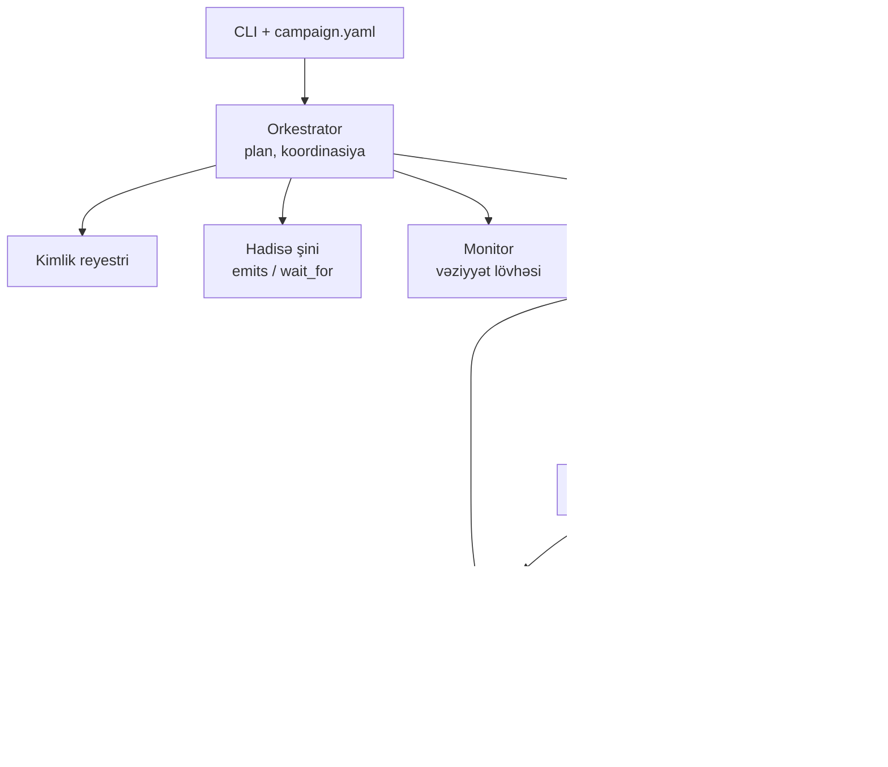

# Pətək — çoxistifadəçili AI test platforması: MVP planı

2026-09-25 ·

## Nə istəyirik, niyə və məqsəd

Pətək — bir əmrlə işə düşən, hədəf saytda N sayda AI tester agentini eyni anda ayrı-ayrı brauzer sessiyalarında işlədən və sübut əsaslı hesabat verən çoxistifadəçili test platformasıdır. Heç bir konkret sayt üçün yazılmayıb: hədəf sahibin verdiyi istənilən saytdır (ən dəqiq nəticəni test rejimi olan staging verir).

**Niyə**

- Çoxistifadəçili və real-time xətalar (elan çatmır, ticket statusu yanlış görünür, iki nəfər eyni anda təsdiqləyir) tək istifadəçi ilə əl testində üzə çıxmır.
- 30 adam və 30 cihazla canlı test praktiki mümkün deyil; avtomatlaşdırılmalıdır.
- Hər buraxılışdan sonra eyni testlər lazımdır; bir dəfə yazılıb dəfələrlə işlədilməlidir.
- Sənə aid olmayan hissə (LLM-in ekranı oxuması, brauzer idarəsi) hazır kitabxanalardır; sənin dəyərin orkestrator, kimlik reyestri, real-time koordinasiya və sübut əsaslı hesabatdır.

**MVP-nin məqsədi (ölçülə bilən)**

Test kontraktını (`docs/TARGET_CONTRACT.md`) verən saytda `petek run scenarios/<sayt>.yaml` əmri ilə:

1. 30 agent hədəf saytın staging-ində qeydiyyatdan keçir — email təsdiqi və OTP daxil, insan müdaxiləsi olmadan.
2. Şirkət, 5 departament, rəhbərlər və işçilər yaradılır; hər agent öz rolunda login olur.
3. Elan ssenarisi (1 → 29) və ticket ssenariləri (yarat → in-progress → assign → approve/reject → bildiriş) icra olunur.
4. Hər addımın sübutu (screenshot, DOM, vaxt, oracle cavabı) saxlanılır, hesabat çıxır.
5. Eyni ssenari 3 dəfə ardıcıl işlədildikdə nəticə eynidir; staging-də artıq heç nə qalmır.

## Əhatə: MVP-yə daxildir və daxil deyil

MVP tək maşında, web-də, ssenarili rejimdə 30 agentlə tam dövrəni (qeydiyyat → test → hesabat → təmizlik) bağlayır; qalan hər şey sonrakı fazalardır.

| Sahə | MVP (Faza 0–5) | Sonra (Faza 6–8) |
|---|---|---|
| Adapter | Web, Playwright | API adapteri, mobil (Maestro/Appium) |
| Rejim | Ssenarili (YAML) | Sərbəst kəşf (exploratory) |
| Agent sayı | Limitsiz (ilk kampaniya 30; yalnız kəşfiyyatçının qaralaması ən çox 999 tester yazır), tək proses, yükə görə bölünmüş Chromium-lar; `petek capacity` maşın üçün maksimumu tövsiyə edir | Redis/NATS ilə çoxmaşınlı |
| Kimlik | Reyestr, catch-all email, email OTP, telefon test kodu | Real SMS provayderi ilə OTP |
| Doğrulama | Typed assert + oracle API + üç mənbəli müqayisə | LLM hakim (screenshot əsaslı yumşaq yoxlama) |
| Hesabat | Markdown/HTML fayl, konsol lövhəsi | Web paneli, tarixçə, trend |
| Kəşfiyyatçı agent | Yox | Faza 6: sayt modeli, avtomatik ssenari |
| Əks-əlaqə | Yox | Faza 7: sürpriz triajı, ssenari v2, fərq kəşfiyyatı |
| Hədəf | Test kontraktını verən sayt (staging, fake target) | Sahibin istənilən saytı |

## Arxitektura və komponentlər

MVP tək JVM prosesidir: orkestrator kotlinx.coroutines ilə 30 agent korutinini idarə edir, hər agent öz single-thread dispetçerində bir Playwright instansı və browser context ilə yaşayır, hamısı bir SQLite sübut bazasına yazır.


```mermaid
flowchart TD
  CLI[CLI + campaign.yaml] --> ORK[Orkestrator<br/>plan, koordinasiya]
  ORK --> REG[Kimlik reyestri]
  ORK --> BUS[Hadisə şini<br/>emits / wait_for]
  ORK --> MON[Monitor<br/>vəziyyət lövhəsi]
  ORK --> AG[Tester agentlər x N<br/>LLM + öz browser context]
  AG --> AD[Adapter: web<br/>Playwright]
  AD --> T[Hədəf sayt: staging]
  T --> MAIL[Poçt qutusu<br/>Mailpit]
  MAIL --> AG
  AG --> EV[(Sübut bazası<br/>SQLite)]
  T --> ORC[Oracle API<br/>/test/...]
  EV --> J[Hakim + hesabat]
  ORC --> J
```

Oxunuşu: orkestrator kimlikləri yaradır və addımları paylayır; agentlər hədəflə brauzer vasitəsilə danışır, OTP-ni Mailpit-dən oxuyur; hakim sübut bazası ilə oracle cavablarını tutuşdurub hesabat çıxarır.

| Komponent | Vəzifəsi | Harada (modul xəritəsi: `docs/ARCHITECTURE.md`) |
|---|---|---|
| CLI | `plan`, `run`, `report`, `teardown`, `smoke` və digər əmrlər; `.env` və campaign.yaml oxuyur | `app` (`cli/PetekCommand`, `config/ConfigLoader`) |
| Orkestrator | Agentləri yaradır, ssenari addımlarını aktora görə paylayır, ilişməni aşkar edir, run-ı bitirir | `features/orchestration` (`DefaultCampaignRunner`, `StepExecutor`) |
| Kimlik reyestri | Ad, email, parol, telefon, rol, departament — başlamazdan əvvəl, deterministik | `features/identity` (`DefaultIdentityRegistryGenerator`) |
| Hadisə şini | `emits` → hadisə + t0; `wait_for`; gecikmə ölçmə | `features/orchestration` (`InProcessEventBus`) |
| Monitor | Hər agentin addımı, son əməliyyatı, son screenshotu; hərəkətsizlik taymeri | `features/orchestration` (`MordantMonitorView`, `InactivityWatchdog`), panel: `features/dashboard` |
| Tester agent | Gör → LLM qərar verir → Playwright icra edir → qeyd et; yalnız whitelist əməliyyatlar | `features/agent` (`DefaultAgentLoop`, `JsonDecisionProtocol`, `runs/`), `features/llm` |
| Adapter (web) | Agent başına Playwright instansı, browser server-ə `connect()`, context, snapshot, screenshot | `features/browser` (`PlaywrightBrowserSession`, `BrowserServerPool`) |
| Poçt oxuyucu | OTP və təsdiq linki: Mailpit, sahibin IMAP qutusu, hədəfin test API-si | `features/mail` (`MailpitMailbox`, `ImapMailbox`, `TestApiMailbox`) |
| Oracle müştərisi | Hədəfin `/test/...` endpointlərindən həqiqət mənbəyi | `features/oracle` |
| Sübut bazası | run, identity, step, event, artifact, finding və digər cədvəllər | `features/evidence` (`SqliteEvidenceStore`, `EvidenceTables`) |
| Hakim + hesabat | Typed assertlər, üç mənbəli müqayisə, Markdown/HTML hesabat | `features/verification`, `features/reporting` (`ThreeSourceJudge`, `BuildReportUseCase`) |

MVP əvvəlcə tək modul (`src/main/kotlin/az/petek/`) kimi planlanmışdı; kod feature-based clean architecture ilə
modullara bölünüb (AGENTS.md "Arxitektura qaydaları").

## Əsas dizayn qərarları

Beş qərar bütün kodun sərhədlərini çəkir; hər biri pozulanda sistemin etibarı itir.

**1. Unikallıq agentin yox, orkestratorun işidir.** Agentlər ad, email və ya parol uydurmur. Orkestrator run başlamazdan əvvəl kimlik reyestrini yaradır: hər tester üçün ad, unikal email, parol, telefon, rol, departament. Reyestr `seed` ilə deterministikdir (eyni seed = eyni 30 adam), DB-də `UNIQUE(email)` və `UNIQUE(run_id, display_name)` məhdudiyyəti var, toqquşma olduqda run heç başlamır. Agent öz kimliyini yalnız oxuyur.

**2. Hər agent öz brauzer kontekstində ****və öz thread-ində ****yaşayır.** Chromium browser server kimi qaldırılır və hər biri N browser context daşıyır (default 20, `PETEK_CONTEXTS_PER_BROWSER`; 30 tester iki Chromium-da): cookie, localStorage, sessionStorage tam ayrıdır, sessiyalar qarışmır. Playwright-ın browser context mexanizmi məhz bunun üçündür — hər test üçün ayrıca brauzer açmadan izolyasiya olunmuş mühitlər verir və çoxistifadəçili ssenariləri birbaşa dəstəkləyir ([mənbə](https://thegtmdirectory.com/tools/playwright/md)). Playwright Java thread-safe deyil — metodları Playwright obyektinin yaradıldığı thread-də çağırılmalıdır, hər thread-də ayrıca instans yaratmaq olar ([mənbə](https://playwright.dev/java/docs/multithreading)); ona görə hər agent öz Playwright instansı ilə serverə `BrowserType.connect(ws)` edir və bütün brauzer çağırışları sessiyanın öz `ConfinedThread`-ində (tək thread-li executor) icra olunur. Login sonrası `storage_state` faylı saxlanılır; kontekst çökərsə eyni kimliklə yenidən qaldırılır. Sübut: hər agent login sonrası ekranda öz adını oxuyur və reyestrlə tutuşdurur.

**3. Real-time koordinasiya ssenaridə asılı addım kimi yazılır.** "Admin elan verir, işçilər oxuyur" iki müstəqil agent deyil, `emits` / `wait_for` cütüdür. Admin agenti `announcement_created(id, t0)` yayır; 29 işçi agenti həmin hadisəni gözləyir, ekranda görəndə `seen(id, t1)` qaytarır; t1 − t0 real gecikmədir. Şin tək prosesdədir (`InProcessEventBus`: `Mutex` və hər adın ən yeni hadisəsini verən `MutableStateFlow`, run-ın bütün hadisələri saxlanır ki, gec gələn də görsün); çoxmaşınlı sürüdə eyni `EventBus` portu Redis pub/sub və ya NATS ilə əvəz olunur. Vaxtı həmişə harness saatı ölçür: t0 = dəyişikliyin sayta yazıldığı an (emitter-in öz səhifəsinin gördüyü yazı sorğusunun cavabı, `emits.request`; publish anı ayrıca saxlanır), t1 = mətnin receiver-in səhifəsində göründüyü an: receiver-lər emitter addımı başlayanda öz səhifələrində mətni izləməyə başlayır, anı səhifənin özü qeyd edir (Faza 24.10); timeout = `not_received`.

**4. Doğruluğu üç mənbənin uyğunluğu təsdiqləyir, AI-nin fikri yox.** A = göndərənin etdiyi (agentin addım logu), B = alanların gördüyü (DOM-da tapılan mətn, screenshot), C = hədəfin özü (oracle API). Qayda: A = B = C → keçdi; A ≠ C → backend xətası; C ≠ B → çatdırılma və ya UI xətası; A ≠ B, C yoxdursa → araşdırılmalı tapıntı. Hökmü yalnız typed assertlər verir; LLM hakim (screenshot əsaslı "mətn düzgün görünür?") hələ yoxdur (Faza 14, köhnə Faza 8 qalıqları); gəlsə, hər hökmün yanında screenshot saxlanır ki, insan yoxlaya bilsin.

**5. Deterministik olan ****`run`****, düşüncə tələb edən ****`do`****.** `run` addımı sabit Playwright funksiyasıdır (login, OTP oxuma, menyuya keçid) — LLM yox, ucuz, stabil. `do` addımı təbii dildir, LLM icra edir. Qeydiyyat kimi axınlar bir dəfə `do` ilə (UI-ı test edir), qalan 29 üçün `run` ilə keçir. Nəticə: LLM xərci və qeyri-sabitlik yalnız həqiqətən test olunan addımlarda qalır.

## Kimlik reyestri, email və OTP mexanizmi

MVP-də bütün poçt Mailpit-ə gedir, telefon kodu hədəfin test rejimindən oxunur — DNS, real domen və SMS provayderi lazım deyil.

**Reyestrin sahələri**

| Sahə | Nümunə | Qeyd |
|---|---|---|
| `agent_id` | `a07` | run daxilində sabit |
| `display_name` | `Əli Kərimov` | sən verdiyin adlar əvvəl, sonra daxili siyahı; eyni run-da təkrar olmur |
| `email` | `eli.k7x2.a07@test.portal.example` | ad + run-ın 4 simvollu qısaltması + agent_id; həmişə unikal |
| `password` | generasiya, 16 simvol | SQLite-da açıq saxlanır — yalnız test kimliyi |
| `phone` | `+99450` + 7 rəqəm | uydurma, real nömrə deyil; test rejimində validasiya olunmur |
| `role` | `admin` / `manager` / `employee` | campaign.yaml-dakı bölgüyə görə |
| `department` | `IT` | manager və employee üçün; admin-də boş |
| `status` | `planned` → `active` və ya `failed` | orkestrator yeniləyir; sonra alınmayan addımdan əvvəl saytda yaranan hesab həmin addımın detalında yazılır |
| `storage_state` | fayl yolu | login sonrası cookie/storage; bərpa üçün |

Rol bölgüsü deterministikdir: admin = 1 (agent `a01`), hər departamentə 1 manager, qalan agentlər departamentlərə növbə ilə paylanır (5 departament × 5–6 nəfər). Managerlər həmişə dəvətlə qoşulur (`/join` formasında rol sahəsi yoxdur, şirkət kodu ilə qoşulan işçi olur); qalan dəvətlər işçilərə seed-ə görə departamentlər üzrə paylanır, şirkət kodu ilə yalnız işçilər qoşulur.

**Email: Mailpit ilə (MVP)**

1. Mailpit Docker ilə qaldırılır: SMTP `:1025`, REST API və UI `:8025`.
2. Hədəf staging-in çıxış SMTP-si test rejimində Mailpit-ə yönəlir. Beləliklə hədəf real poçt göndərmir, hər məktub Mailpit-də qalır.
3. `test.portal.example` domeni real olmalı deyil — məktub heç vaxt internetə çıxmır.
4. `run: read_email_code` (və qeydiyyat axınları, `do`-da `get_email_code` aləti) Mailpit API-də `to:<email>` ilə axtarır, hər 1 saniyədə bir, maksimum 60 saniyə.
5. Kod regex ilə çıxarılır (4–8 rəqəm); təsdiq linki varsa `href` götürülüb eyni browser context-də açılır.
6. Oxunan məktub "read" işarələnir ki, köhnə kod təkrar istifadə olunmasın; məktubun id-si sübut bazasına yazılır.

Poçtu Mailpit-ə yönəldə bilməyən hədəflər üçün eyni `Mailbox` portunun başqa mənbələri var (Faza 10, 16): sahibin IMAP qutusu (`ImapMailbox`, artı ünvanlar), hədəfin test API-si (`TestApiMailbox`) və kodu paneldə sahibin yazdığı əl rejimi.

**Telefon və SMS OTP**

- Test rejimində hədəf SMS göndərmir; kodu `GET /test/otp/{phone}` oracle endpointi qaytarır (yalnız test tenantı üçün).
- `run` funksiyaları telefon addımını özləri keçir; `do` addımında agent `get_phone_code` alətini çağırır, harness kodu `/test/otp/{phone}`-dan bir neçə saniyə təkrar soruşaraq oxuyur və `{vars.phone_code}` kimi saxlayır (kod LLM-ə getmir).
- Sadə alternativ: test rejimində sabit kod `000000`. Oracle variantı üstündür — real kod generasiyası da test olunur.
- Real SMS provayderi ilə iş MVP-dən kənardır.

**Uğursuzluq halları**

- 60 saniyədə məktub gəlmirsə addım `failed(mail_timeout)`, agent dayanır, orkestrator bunu tapıntı kimi qeyd edir (poçt göndərilmir = xəta).
- Test poçt qutusunun özü (Mailpit) bütün gözləmə müddətində oxunmursa addım `error(mail_unavailable)` olur: bu mühit problemidir, hədəfin xətası sayılmır və hesabatda "test inbox unreachable" kimi görünür.
- E-poçt kodu rədd edilirsə harness saytdan yeni kod istəmir, bir dəfə daha təzə kodun gəlməsini gözləyir; o da rədd edilir və ya gəlmirsə `failed(otp_rejected)`. Telefon kodu təkrarlanmır: rədd edilirsə dərhal `failed(otp_rejected)`.
- Qeydiyyat 3 cəhddən sonra alınmırsa agent `failed`, qalan 29 davam edir; hesabatda ayrıca görünür.

## Ssenari formatı və assert növləri

Ssenari YAML-dır: `do` sətirləri təbii dildir (LLM şərh edir), `run`, `emits`, `wait_for` və `assert` isə kod tərəfindən icra və yoxlanır.

Aşağıdakı blok `scenarios/contract-demo.yaml`-ın tam surətidir (fayl dəyişəndə bu da yenilənir): kontrakt saytı (`docs/TARGET_CONTRACT.md`, fake target) üçün kampaniya. Axınları kontraktdan fərqlənən real sayt üçün nümunə kampaniya `docs/examples/company-portal.yaml`-dır: eyni sxem, üstəlik `target_profile.flows` (qeydiyyat, dəvət, şirkət kodu ilə qoşulma, login axınları real markup-a görə), `local_storage`, `dismiss`, `api_prefix` və `campaign.pacing` (aşağıda "Hədəf axınları").

```yaml
# Contract demo campaign (docs/PLAN.md "Ssenari formatı"): the site of docs/TARGET_CONTRACT.md, which the fake target
# implements (./gradlew :testing:fake-target:run). Its flows are the contract defaults, so target_profile names none.
# `do` = natural language for the LLM agent; `run`, `emits`, `wait_for` and `assert` are executed and checked by code.
campaign:
  name: contract-demo
  target: https://staging.portal.example     # PETEK_TARGET in .env wins
  testers: 30
  seed: 42
  names: [Əli, Vəli, Sahil, Cəmil, Amil]   # the rest comes from the built-in catalog
  roles: {admin: 1, manager: 5, employee: 24}
  departments: [IT, HR, Satış, Maliyyə, Əməliyyat]
  registration: {invite: 15, company_code: 14}   # how the 29 non-admins join; all 5 managers are among the invited
  budget: {max_steps_per_agent: 60, max_minutes: 40}
  on_fail: continue

# Where the harness reads ids of created objects (never from the LLM when a better source exists).
target_profile:
  id_sources:
    announcement_created:
      oracle: {path: "/test/announcements/latest?by={self.email}", field: id}
    ticket_created:
      oracle: {path: "/test/tickets/latest?by={self.email}", field: id}

setup:
  - id: owner_signup
    actor: admin
    do: "Qeydiyyatdan keç, email kodunu və istənsə telefon kodunu təsdiqlə, 'Pətək Test MMC' adlı şirkət yarat"
  - id: seed
    actor: admin
    run: seed_company              # departments + invitations for invite-mode testers (test API)
  - id: join
    actor: employee[*] | manager[*]
    run: register_and_login        # invite link or company code + e-mail code + phone OTP; saves storage_state

steps:
  - id: announce
    actor: admin
    do: "Elan yarat: 'Sabah 10:00 ümumi iclas {pass}'"
    # The form's post is when the announcement reached the site: the readers' latency is measured from its answer.
    emits: {event: announcement_created, request: "POST /announcements"}
    assert:
      - oracle: {path: "/test/announcements/{last_id}", field: status, equals: published}

  - id: read_announce
    actor: employee[*]
    wait_for: announcement_created
    do: "Bildirişləri aç və yeni elanı oxu"
    assert:
      - visible_text: {text: "Sabah 10:00 ümumi iclas {pass}", within_s: 5}
      - latency_max: {ms: 5000}
      - oracle: {path: "/test/announcements/{last_id}/receipts", contains: "{self.email}"}

  - id: ticket
    actor: employee[dept=IT, n=1]
    do: "IT departamentinə ticket yaz: 'Noutbuk işləmir'"
    emits: ticket_created

  - id: ticket_flow
    actor: manager[IT]
    wait_for: ticket_created
    do: "Ticketi in-progress et, sonra HR menecerinə assign et"
    assert:
      - oracle: {path: "/test/tickets/{last_id}", field: status, equals: in_progress}

  - id: ticket_notified
    actor: employee[dept=IT, n=1]
    # The ticket's author is told when someone else changes its status: the notification the site stored for them.
    assert:
      - oracle: {path: "/test/notifications?user={self.email}", contains: "/tickets/{event.ticket_created.id}"}

  - id: race
    actor: ["manager[IT]", "manager[HR]"]   # quoted: [ and ] are YAML syntax inside a list
    parallel: true
    do: "Eyni ticketi approve et"
    assert:
      # Decided by code from each manager's own approve request (accepted < 400, refused 409), never by the agent.
      - only_one_succeeds: {request: "POST .*/approve"}

  - id: forbidden
    actor: employee[dept=IT, n=2]
    do: "Ticketi approve etməyə çalış"
    assert:
      - not_visible: {selector: "[data-testid=\"ticket-approve\"]"}
      - http_status: {path: "/api/tickets/{event.ticket_created.id}/approve", method: POST, equals: 403}
```

**Addım açarları**

| Açar | Mənası |
|---|---|
| `actor` | Kim edir: `admin`, `manager[IT]`, `employee[*]` (hamısı), `employee[dept=IT, n=1]` (departamentdən n-ci), `employee[reg=invite]` (qoşulma yoluna görə: `invite`, `company_code`, `self`, `login`, `guest`); `a \| b` və ya siyahı = bir neçə aktor |
| `do` | Təbii dil tapşırığı; LLM whitelist əməliyyatlarla icra edir |
| `run` | Sabit Playwright və ya API funksiyası; LLM iştirak etmir |
| `emits` | Addım bitəndə hadisə yayır; payload = `{id, actor, t0, published_at, write}`; uzun forma `{event, id_from, request}`: `request` (`"POST /api/announcements"`) dəyişikliyi yazan sorğudur, gecikmə onun cavabından ölçülür |
| `wait_for` | Hadisə gələnə qədər gözləyir; `timeout_s` (default 30) |
| `parallel` | Aktorlar eyni anda başlayır (yarış testləri üçün) |
| `assert` | Bir və ya bir neçə typed yoxlama; hamısı keçməlidir |
| `on_fail` | `continue` (default) və ya `abort` |

**Assert növləri (MVP)**

| Assert | Parametrlər | Necə yoxlanır |
|---|---|---|
| `visible_text` | `text`, `within_s` | receiver-in səhifəsi mətni yazıdan əvvəl izləyir (və ya hadisədən sonra gözləyir); gecikmə = t1 − t0; yazıdan əvvəl görünən mətn `stale_text` |
| `not_visible` | `text` və ya `selector` | element DOM-da yoxdur və ya gizlidir |
| `oracle` | `path`, `field`, `equals` / `contains` | oracle API cavabı ilə müqayisə |
| `http_status` | `path`, `method` (default `GET`), `equals` | agentin sessiyası ilə birbaşa HTTP çağırışı |
| `count` | `selector`, `equals` | elementlərin sayı |
| `latency_max` | `ms` | `wait_for` sonrası ölçülən gecikmə həddi; eyni addımda bir `visible_text`-dən sonra gəlməlidir (onun ölçdüyü gecikmədir) |
| `only_one_succeeds` | `{request: "<METHOD> <path regex>", oracle: {path, field, equals}}` (`request` məcburidir, Faza 24.5) | paralel aktorlardan yalnız birinin sorğusunu hədəf qəbul edib: brauzerin gördüyü uyğun sorğulardan biri `< 400`, heç biri 403/409/422 deyil (agentin `done(success)` sözü nəzərə alınmır); `oracle` verilibsə, test API-nin son vəziyyəti də yoxlanır. Yarışı uduzan aktor (409/422 və ya obyekt artıq qərarlaşdırılıb) gözlənilən nəticədir: addımı `lost_race` ilə keçir |

`{last_id}` və `{self.email}` kimi şablonlar orkestrator tərəfindən run vaxtı doldurulur: `last_id` = addımın öz hadisəsinin obyekt id-si — gözlədiyi hadisə, yoxlamalarında isə emit etdiyi (Faza 24.6); başqa addımın obyekti `{event.<ad>.id}` ilə adlanır.

### Hədəf axınları (`target_profile.flows`)

Pətək istənilən sayta uyğunlaşmalıdır: real saytların axınları çox vaxt kontraktdan fərqlənir (linklə təsdiq, loginə
şirkət kodu, ad/soyad ayrı, şifrə təkrarı, overlay-lər). Ona görə deterministik `run` funksiyaları sabit kod yox, kampaniyadakı
**axınları** icra edir. Axın adlarını run funksiyaları seçir:

| Run funksiyası | Axın(lar) |
|---|---|
| `register_owner` | `register_owner`; test API varsa şirkət id/kodu paylaşılır; sessiya açılmayıbsa `login`, sonra `verify_identity` |
| `register_and_login` | kimliyin rejiminə görə `join_by_invite`, `join_by_code` və ya (şirkətsiz saytda, `self`) `sign_up`; `login` testeri yalnız `login`; sessiya açılmayıbsa `login`; `verify_identity`; 3 cəhd (hesab yarandıqdan sonra təkrar cəhd `login` ilə) |
| `login` | `login` |
| `verify_identity` | `verify_identity` (`assert_identity` addımı məcburidir) |

Default axınlar `docs/TARGET_CONTRACT.md`-dəki kontraktdır (fake target üçün heç nə yazmaq lazım deyil); kampaniya eyni
adlı axını yazanda default əvəz olunur. Axın addımları (bir addım = bir sübut sətri):

| Addım | Nə edir |
|---|---|
| `goto: <path>` | səhifəni açır (path açarı, `/path` və ya `{vars.link}` kimi şablon) |
| `fill: {selector, value}`, `select: {selector, option}`, `check`, `click`, `click_if_visible` | forma əməliyyatları |
| `wait_for: <selector>` / `{selector \| any: [...] \| text, timeout_s, fail}` | element və ya mətn görünənə qədər gözləyir |
| `expect_url: {regex, timeout_s, fail}` | URL uyğun gələnə qədər gözləyir |
| `email_link: {purpose: verify\|invite\|any, pattern, open, into}` | test poçtundan linki götürür (dəvət üçün əvvəl `seed_company`-nin paylaşdığı link), saxlayır, açır |
| `email_code: {selector, submit}`, `phone_code: {selector, submit}` | kodu yazır; rədd edilən e-poçt kodu bir dəfə yenisi ilə təkrarlanır, sonra `otp_rejected` |
| `read: {selector, into, regex}`, `set_shared: {key, value}` | dəyər oxuyur/paylaşır (`vars.<k>` və ya `shared.<k>`) |
| `if_visible: {selector, then, timeout_s}` | şərti addımlar |
| `journey: {label, until, pages, start, max_visits}` | saytın vəziyyətindən asılı səhifələr (kod, telefon, login...) `until` görünənə qədər |
| `save_session`, `account_created`, `assert_identity: <selector>` | sessiyanı saxlayır; hesabın yarandığını qeyd edir; kimliyi yoxlayır |

Selektor ya profil açarıdır (`login.email` → `target_profile.selectors`), ya da olduğu kimi CSS/Playwright selektorudur
(`role=button[name="Daxil ol"]`). Dəyərlər şablondur: `{self.email|password|name|first_name|last_name|phone|department|role|agent_id}`,
`{shared.company_code|company_id|invite_link|...}` (paylaşılmayıbsa gözlənilir), `{vars.<key>}`, `{campaign.company}`,
xəta mesajlarında `{url}`. `{self.password}` yalnız `fill` dəyərində ola bilər — axınlar LLM-ə getmir, sübutda `***` görünür.
`fail: {reason, message, error}` addımın xətasını adlandırır (`login_failed`, `registration_failed`, ...); `error`
selektorunun mətni mesaja əlavə olunur.

Profilin digər açarları: `local_storage` (hər brauzer kontekstinə, səhifə skriptlərindən əvvəl, yalnız hədəf origin-ə
yazılır, məs. `portal:domain_dialog_dismissed: "1"`), `dismiss` (hər addımdan əvvəl görünən overlay-lər bağlanır;
selektor olduğu kimi işlənir, şablon ola bilməz),
`api_prefix` (`{api}` → `/api/v1`, fayl yüklənəndə açılır). `campaign.pacing: {start_stagger_ms, max_parallel_actors}`
bir addımın aktorlarını agent id sırası ilə aralıqla və ən çox N paralel başladır (IP limitləri üçün); `parallel: true`
addımları və yalnız yoxlama edən (`do`/`run`-suz) addımlar bundan asılı deyil. Poçt mənbəyi Mailpit və ya hədəfin test API-si (`GET /test/emails?to=`) ola bilər.

## Texnologiya seçimi və repo strukturu

Pətək Kotlin 2.4 / JDK 25 toolchain + Gradle (Kotlin DSL) + kotlinx.coroutines + Playwright Java + SQLite üzərində, tək JVM prosesində, IntelliJ IDEA-da yazılır (versiyalar `gradle/libs.versions.toml`-da). Python-un üstünlüyü (hazır browser-agent kitabxanaları) bu planda onsuz da istifadə olunmur, çünki agent döngəsi whitelist alətlərlə özümüz yazırıq; web paneli Ktor serveridir (Spring yoxdur).

| Ehtiyac | Seçim | Niyə |
|---|---|---|
| Brauzer | Playwright Java (`com.microsoft.playwright`) | browser context izolyasiyası, auto-wait, trace; Node ayrıca lazım deyil, driver paketlə gəlir |
| Paralellik | kotlinx.coroutines; sessiya başına `ConfinedThread` (tək thread-li executor), LLM/HTTP çağırışları suspend | Playwright-ın "eyni thread" qaydası ödənir, paralellik itmir |
| Brauzer prosesi | Chromium browser server-ləri (hər biri default 20 kontekst) + agent başına `BrowserType.connect(ws)` | 30 Chromium əvəzinə iki Chromium, 30 context |
| Agentin səhifəni oxuması | ARIA snapshot + nömrələnmiş elementlər; screenshot yalnız lazım olanda | tam HTML LLM üçün baha və səhvə meyllidir |
| LLM | Vendora bağlı olmayan `LlmClient`: sxemlə yoxlanan strukturlu JSON qərar (`JsonDecisionProtocol`, ADR-0003); AI CLI adapterləri, Anthropic Java SDK, OpenAI-uyğun HTTP (ADR-0008) | sahibdə hansı AI varsa o işləyir; qərarı kod yoxlayır |
| Konfiqurasiya | kotlinx.serialization + kaml (YAML) | tipli sxem, aydın xəta mesajları |
| CLI | Clikt + Mordant | əmrlər və canlı konsol lövhəsi |
| Sübut bazası | sqlite-jdbc + Exposed | tək fayl, run başına ayrı DB mümkündür |
| Poçt və oracle | Ktor client | Mailpit REST, hədəfin `/test/...` API-si |
| Hesabat | kotlinx.html → HTML, Markdown şablon | screenshot linkləri ilə |
| Loglama | kotlin-logging + logback | `run_id`/`agent_id` MDC ilə |

İlk risk yoxlaması Faza 3-dədir: browser server + `connect()` patterni yaddaş və stabillik baxımından gözləniləni verməsə, Python-a keçid ucuzdur — ssenari formatı, DB sxemi və oracle müqaviləsi dildən asılı deyil.

```
petek/
  settings.gradle.kts, build.gradle.kts, build-logic/    # convention plugin-ləri, lisenziya başlığı
  gradle/libs.versions.toml                              # bütün versiyalar
  docker-compose.yml                                     # Mailpit
  AGENTS.md, README.md, README.az.md, docs/              # PLAN, ARCHITECTURE, requirements, adr, examples, ci
  core/domain, core/sqlite                               # id-lər, saat, Secret; SQLite bağlantısı
  features/<ad>/                                         # hər biri domain -> application -> infrastructure
    campaign, identity, browser, agent, llm, mail, oracle, verification, orchestration,
    evidence, reporting, capacity, scenarios, explorer, dashboard, ownership
  app/                                                   # CLI, konfiqurasiya, kompozisiya kökü, panel backend, bundle
  launcher/                                              # npx petek
  docker/                                                # image
  testing/fake-target/                                   # kontrakt saytı, yalnız Pətəkin öz e2e testləri üçün
  e2e/                                                   # Konsist arxitektura qaydaları
  scenarios/contract-demo.yaml                           # kontrakt saytının kampaniyası
```

## Hədəf sayt tərəfində hazırlıq

Sayt sənindir: hədəfdə `TEST_MODE` açmaq platformanın yarısını asanlaşdırır, ona görə bu iş Faza 0-dadır və Pətək kodundan əvvəl bitir.

**Test rejimi (****`TEST_MODE=true`****, yalnız staging)**

- Ayrı staging mühiti və ayrı DB; production-a heç bir bağlantı yoxdur.
- Çıxış SMTP → Mailpit (`:1025`); SMS provayderi söndürülür, kod `/test/otp/{phone}`-dan oxunur.
- `@test.portal.example` email ilə yaradılan şirkət `is_test=true` alır; oracle və teardown yalnız belə şirkətlərdə işləyir (təhlükəsizlik qapağı).
- Rate limit və CAPTCHA test IP-ləri üçün söndürülür (allowlist).
- Test endpointləri `X-Test-Token` başlığı tələb edir; token yalnız staging env-də var.

**Oracle və köməkçi endpointlər**

| Metod | Yol | Qaytarır / edir |
|---|---|---|
| GET | `/test/otp/{phone}` | həmin nömrə üçün son OTP kodu |
| GET | `/test/announcements/{id}` | status, yaradılma vaxtı, hədəf auditoriya |
| GET | `/test/announcements/{id}/receipts` | kim oxuyub, nə vaxt (email + timestamp siyahısı) |
| GET | `/test/tickets/{id}` | cari status, assignee, status tarixçəsi (kim, nə vaxt, nədən nəyə) |
| GET | `/test/notifications?user={email}` | istifadəçiyə göndərilən bildirişlər və oxunma vaxtı |
| GET | `/test/companies?owner={email}` | sahibin şirkəti (id, kod, `is_test`) |
| POST | `/test/companies/seed` | mövcud şirkətə (`company_id`) departamentlər və dəvətlər bir çağırışla (setup-ı sürətləndirir; şirkəti özü yaratmır) |
| GET | `/test/announcements/latest?by={email}`, `/test/tickets/latest?by={email}` | istifadəçinin son yaratdığı obyekt (hadisənin id mənbəyi) |
| GET, POST | `/test/emails?to={email}`, `/test/emails/{id}/read` | Mailpit əvəzinə hədəfin saxladığı poçt (`PETEK_MAIL_SOURCE=test-api`) |
| DELETE | `/test/companies/{id}` | test şirkətini bütün verilənləri ilə silir |

**UI tərəfində**

- Bildiriş zəngi, elan siyahısı, ticket statusu, approve/reject/assign düymələri `data-testid` alır. Agentin etibarlılığı ən çox buna bağlıdır.
- Real-time mexanizmi sənədləşdirilir: web-də WebSocket, SSE, yoxsa polling; bildiriş DOM-a hansı elementlə düşür. Bu bilinməsə `visible_text` gecikməsi düzgün ölçülmür.

Cavablanmış sual: qeydiyyat dəvətlə (admin əlavə edir, işçi linklə gəlir) yoxsa sərbəstdir (işçi özü qeydiyyatdan keçib şirkət kodu yazır)? Hər ikisi, testerə görə (`campaign.registration: {invite, company_code}`); `register_and_login` kimliyin rejiminə görə `join_by_invite` və ya `join_by_code` axınını seçir. Tam siyahı: `docs/TARGET_CONTRACT.md` §4.

## Fazalar

Faza 0–5 MVP-dir, 6–25 sonrasıdır; hər faza yalnız "hazır sayılır" şərti ödənəndə bağlanır, yarımçıq faza üstündən növbətiyə keçilmir. Son sütun təxmini müddətdir, vəziyyət deyil; vəziyyət hər fazanın bəndlərindədir.

| Faza | Ad | Nəticə | Təxmini müddət |
|---|---|---|---|
| 0 | Hədəf və mühit | Staging test rejimində, Mailpit işləyir, bir skript login olur | 2–3 gün |
| 1 | Konfiqurasiya və reyestr | `petek plan` 30 deterministik kimlik verir | 1–2 gün |
| 2 | Tək agent | Bir agent `do` tapşırığını sübutla tamamlayır | 1–2 həftə |
| 3 | N agent və orkestrator | 30 agent eyni anda, izolyasiya sübutu, ilişmə aşkarı | 3–5 gün |
| 4 | Ssenari və real-time | emits/wait_for, assertlər, kontrakt saytının ssenariləri keçir | 1 həftə |
| 5 | Hesabat, stabillik, təmizlik | Tək əmr → hesabat; 3 run eyni nəticə; teardown | 3–5 gün |
| 6 | Kəşfiyyatçı | Sayt modeli, avtomatik ssenari | hazırdır |
| 7 | Sürpriz və əks-əlaqə | Triaj, ssenari v2, fərq kəşfiyyatı | hazırdır |
| 8 | Bünövrə düzəlişləri və biznes hazırlığı | Real saytda kəşfiyyat işləyir; lisenziya, `workspace_id`, edition portları | 3–5 gün |
| 9 | Provayder-agnostik AI qatı | Layihə hansı AI-ı işlədirsə Pətək onunla işləyir (`auto`) | 1 həftə |
| 10 | Hədəf profili və giriş zənciri | Bir neçə sayt, öz hesablarınla giriş, IMAP/manual OTP, sübut səviyyələri | 1–2 həftə |
| 11 | Alət üzü | MCP server + `--json` CLI: ev sahibi AI Pətəki çağırır | 1 həftə |
| 12 | Skill paketi və paylanma | `petek init`, rol təlimatları, Docker/CLI dist, `petek dev`, CI rejimi | 1–2 həftə |
| 13 | Universal hədəf modeli | Şirkət modeli isteğe bağlı, sərbəst rollar, kor test naxışları | 2 həftə |
| 14 | Ekosistem və ödənişli modullar | Kontrakt kitləri, log körpüsü, regressiya baseline, hosted sürü | sonra |
| 15 | Sahiblik təsdiqi və icazə qapısı | Pətək yalnız sahibliyi təsdiqlənmiş sayta yazır, qalanında yalnız oxuyur | 2–3 gün |
| 16 | Poçt: sahibin qutusu və artı ünvan | OTP və təsdiq linki sahibin IMAP qutusundan oxunur | 3–5 gün |
| 17 | Kəşfiyyatçı: Keçid 0 → 1 | Saytın növü, kəşfiyyatçının öz hesabı, içəridən ev xəritəsi | 1–2 həftə |
| 18 | Qapı dalğası, hesablar və izolyasiya | Qapı bir dəfə öyrənilir, kodla keçilir; testerlər bir-birini görmür | 1–2 həftə |
| 19 | Xırda xəta kartları | Ümumi kataloq, mağaza, xəbər və vitrin naxışları | 1–2 həftə |
| 20 | İki qatlı, üç rəfli hesabat | Müştəri üçün sadə qat, detal qatı, JUnit XML və SARIF | 1 həftə |
| 21 | Tutum, dalğalar və ayrı IP | Böyük sürü dalğalarla; hər testerə ayrı IP seçimi | 1 həftə |
| 22 | Demo hədəfləri | açıq mənbəli xəbər və mağaza platformaları sahibin serverində, real tapıntılar | sonra |
| 23 | Bir əmrlə başlanğıc | `petek` + şəxsi iş qovluğu + "Quraşdırma" ekranı + "Test et"; sonra AI seçimi, saytlar siyahısı | gedir |
| 24 | Orkestratorun kompozisiya auditi | Rol, tester sayı, dalğa, swap, yarış və hadisənin hər birləşməsində yalançı nəticə yoxdur | 1 həftə |
| 25 | Ssenari kəşfiyyatdan doğulur | "Test et" yalnız saytda görünəni yoxlayır; universal uğur meyarları | 1 həftə |

Müddətlər təxminidir və bir nəfərin axşam-həftəsonu işi kimi hesablanıb. Faza 8–14 "Pətək 2: universal alət" planıdır
(aşağıda, Faza 7-dən sonra); köhnə Faza 8 ("Universal platforma") onun içində əridilib. Faza 15–23 "Pətək 3: yalnız
link ilə sürü" planıdır; Faza 24 və 25 onların üstündə orkestratorun auditi və kəşfiyyatdan doğan ssenaridir.

**Faza 0 — Hədəf və mühit**

- [ ] Staging mühiti ayrı DB ilə qaldırılır, `TEST_MODE` bayrağı əlavə olunur — **sahib:** hədəf saytın sahibi (`docs/TARGET_CONTRACT.md`; fake target bunu kontrakt üzrə edir)
- [ ] SMTP → Mailpit, SMS → `/test/otp/{phone}`; rate limit və CAPTCHA allowlist — **sahib:** hədəf saytın sahibi (`docs/TARGET_CONTRACT.md`; fake target bunu kontrakt üzrə edir)
- [ ] `is_test` tenant bayrağı; oracle və teardown endpointləri (yuxarıdakı cədvəl) — **sahib:** hədəf saytın sahibi (`docs/TARGET_CONTRACT.md`; fake target bunu kontrakt üzrə edir)
- [ ] Əsas UI elementlərinə `data-testid` — **sahib:** hədəf saytın sahibi (`docs/TARGET_CONTRACT.md`; fake target bunu kontrakt üzrə edir)
- [x] Real-time mexanizmi və bildirişin DOM görünüşü sənədləşdirilir
- [x] Repo: IntelliJ IDEA, Kotlin/JVM (indi JDK 25 toolchain), Gradle (Kotlin DSL); Chromium-u brauzer mühərriki başlayanda `PlaywrightDriver.installChromium()` yalnız lazım olanda yükləyir (`PLAYWRIGHT_SKIP_BROWSER_DOWNLOAD` bunu keçir), `.env` (LLM açarı, test token, Mailpit URL)
- [x] `docker-compose.yml` ilə Mailpit

Hazır sayılır: bir Playwright skripti test email ilə qeydiyyatdan keçir, kodu Mailpit-dən oxuyur, login olur, `DELETE /test/companies/{id}` ilə silir.

**Faza 1 — Konfiqurasiya və kimlik reyestri**

- [x] Konfiqurasiya: campaign.yaml → kaml node ağacı → `CampaignYamlMapper` → domain data class-ları; xətalar sətir nömrəsi ilə (`.env`: `app/config/ConfigLoader`, `PetekConfig`)
- [x] Kimlik (`features/identity`, `DefaultIdentityRegistryGenerator`): ad siyahısı, email/parol/telefon generasiyası, seed, rol və departament bölgüsü
- [x] SQLite sxemi (`EvidenceTables`, `IdentityTable`): `run`, `identity`, `step`, `event`, `artifact`, `finding` (sonradan daha çox, "Sübut bazası" bölməsində); unikallıq məhdudiyyətləri
- [x] `petek plan campaign.yaml`: kimlikləri cədvəl kimi çap edir, DB-yə yazır, heç nə icra etmir

Hazır sayılır: `plan` iki dəfə çağırılanda eyni 30 kimliyi verir; eyni adı iki dəfə verəndə run başlamır və səbəbi yazır.

**Faza 2 — Tək agent (ən vacib faza)**

- [x] Brauzer (`features/browser`: `PlaywrightBrowserSession`, `BrowserServerProcess`, `BrowserServerPool`): context yaratma, accessibility snapshot (nömrələnmiş elementlər), screenshot, `storage_state`
- [x] Alətlər (`agent/domain/Tools.kt`): whitelist — `navigate`, `click(id)`, `type(id, text, submit)`, `select(id, option)`, `read_text(selector)`, `wait_text(text, timeout)`, `get_email_code()`, `get_phone_code()`, `done(summary, success, object_id)`, `report_problem(kind, note)`
- [x] Qərar: sxemlə yoxlanan strukturlu JSON (`JsonDecisionProtocol`, ADR-0003; tool calling yox), sistem promptu (`PromptBuilder`: rol, məqsəd, qaydalar), token sayğacı (`MeteredLlmClient`)
- [x] Döngə (`DefaultAgentLoop`): gör → qərar → et → qeyd; addım limiti; dövrə = eyni səhifədə eyni əməliyyat son 6 qərarda 3 dəfə (`RepeatedStateLoopDetector`), dayandır
- [x] Hər addımda səbəb və vaxt → `step`; screenshot icra olunan hər əməliyyatdan sonra və son addımda, accessibility ağacı ilk, son və keçməyən addımlarda → `artifact` (`StepEvidence`)
- [x] `runs/`: `login`, `read_email_code`, `register_and_login`, `seed_company` (sonradan `register_owner`, `verify_identity`, `logout`, `site_health`, `direct_url`, `page_checks`)

Hazır sayılır: bir agent "qeydiyyatdan keç, kodu təsdiqlə, şirkət yarat" tapşırığını `do` ilə tamamlayır; hər addımın sübutu DB-dədir; eyni iş `run` ilə 10 saniyədən az çəkir.
  **Vəziyyət:** `do` ilə qeydiyyat (e-poçt və telefon kodu, şirkət) `ContractDemoEndToEndTest`-də real Chromium-da keçir, qərarları
  qaydalı sürücü (`ContractSiteDriver`) verir; real AI ilə eyni run `./gradlew :e2e:liveTest`-dir. `run` ilə qeydiyyatın
  müddəti ayrıca ölçülmür (30 testerlik contract demo bütövlükdə təxminən 15 saniyədir).

**Faza 3 — N agent və orkestrator**

- [x] Orkestrator (`DefaultActorExpressionParser`, `DefaultCampaignRunner`, `StepExecutor`): aktor seçici parseri, addımları agent korutinlərinə paylama, `parallel`
- [x] Hər agent öz `ConfinedThread`-i və öz Playwright instansı ilə ortaq browser server-ə connect() edir; bir Chromium-da default 20 context (`BrowserEngineConfig.DEFAULT_CONTEXTS_PER_BROWSER`, 30-a qədər sınanıb); brauzerlərin yaddaşı ölçülür (yalnız Linux `/proc`-dan), CPU ölçülmür: tutum tövsiyəsi nüvə sayından hesablanır (`SystemHostResourceProbe`, `CapacityAdvisor`)
- [x] Monitor (`AgentBoard`, `MordantMonitorView`, `InactivityWatchdog`): vəziyyət lövhəsi (Mordant), N saniyə hərəkətsizlik → `blocked`, agent növbəti addıma keçir
- [x] Çökən context eyni kimlik və `storage_state` ilə bərpa olunur
  **Vəziyyət:** `BrowserContextLostException` → `RestoringBrowserSession` yeni kontekst açır (saxlanmış `storage_state` ilə), səhifəni yenidən açır, çağırışı bir dəfə təkrarlayır; sübutda `restore_session` addımı (ən çox 2 dəfə).
- [x] `on_fail: continue | abort`

Hazır sayılır: 30 agent eyni anda login olur, hər biri ekranda öz adını oxuyub reyestrlə tutuşdurur (sessiya qarışmasının sübutu); biri süni ilişdiriləndə digərləri dayanmır; 30 agent eyni anda gözləyərkən gecikmə ölçüsü serialaşmır.
  **Vəziyyət:** 30 testerin girişi və adı `ContractDemoEndToEndTest`-də (real Chromium, kontrakt saytı); ilişmə və
  serialaşmayan gözləmə `RunnerConcurrencyTest`-də; 30 və 60 sessiyanın izolyasiyası `BrowserIsolationAtScaleTest`-də.

**Faza 4 — Ssenari mühərriki və real-time**

- [x] Ssenari modeli (`campaign/domain/Campaign.kt`, `Placeholder`): addım açarları, şablonlar (`{last_id}`, `{pass}`, `{self.email}`, ...)
- [x] Hadisə şini (`InProcessEventBus`, `StepExecutor`): `emits` → hadisə + t0; `wait_for` → gözləmə + timeout; alan tərəfdə t1
- [x] Assertlər (`DefaultAssertionEvaluator`): `visible_text`, `not_visible`, `oracle`, `http_status`, `count`, `latency_max`, `only_one_succeeds`
- [x] Oracle (`features/oracle`, `HttpTargetOracle`): test endpointləri müştərisi
- [x] `docs/examples/company-portal.yaml`: setup, elan, ticket axını, icazə, yarış

Hazır sayılır: elan ssenarisi 29/29 çatır və gecikmələr agent başına yazılır; ticket axınları oracle ilə təsdiqlənir; icazə testi 403 qaytarır; yarış testində yalnız biri qalib gəlir.
  **Vəziyyət:** kontrakt saytında `ContractDemoEndToEndTest` sübut edir (elanı `employee[*]` oxuyur: 24/24).

**Faza 5 — Hesabat, stabillik, təmizlik**

- [x] Hakim (`reporting/domain/ThreeSourceJudge`): A/B/C müqayisəsi, tapıntı növləri (backend, çatdırılma/UI, araşdırılmalı, sonradan sayt yoxlaması, agent xətası, sübut yetərsiz)
- [x] Hesabat (`BuildReportUseCase`, `MarkdownReportWriter`, `HtmlReportWriter`): addım cədvəli, gecikmə paylanması, tapıntılar screenshot və oracle cavabı ilə, agent başına token və xərc
- [x] `petek run --repeat 3`: stabillik faizi, flaky addımların işarələnməsi
- [x] `petek teardown`: run bitəndə və yarımçıq qalanda test şirkəti silinir
- [x] README: quraşdırma, ilk run, ssenari yazma

Hazır sayılır: tək əmr → tam run → hesabat; 3 ardıcıl run eyni nəticə; staging-də artıq heç nə qalmır.
  **Vəziyyət:** kontrakt saytında `ContractDemoEndToEndTest` sübut edir (`--repeat 3`, test şirkəti silinir).

**Faza 6 — Kəşfiyyatçı (MVP-dən sonra)** — kodda: `features/explorer`, panelin "Kəşfiyyat" ekranı (`docs/ARCHITECTURE.md`)

- [x] Sayt modeli sxemi: `pages`, `roles`, `actions`, `realtime`, `unknowns`; `observed` / `inferred` ayrımı (`SiteModel`, `Provenance`)
- [x] Üç fazalı gəzinti: anonim, rol-əsaslı, sınaq toxunuşu; səhifə və vaxt büdcəsi (`ExploreSiteUseCase`, `ExplorationBudget`)
- [x] Test nümunələri kitabxanası: hər əməliyyat üçün uğurlu yol, icazə, yarış, real-time, sərhəd, idempotentlik (`TestPatterns`)
- [x] İnstruksiya verilibsə onu modelə bağlama (grounding) — sahibin təlimatı + cavab kitabı (`AnswerBook`)

**Faza 7 — Sürpriz protokolu və əks-əlaqə** — kodda: `features/scenarios`, `CompareExplorationsUseCase`

- [x] `report_problem` → kəşfiyyatçı triajı: sistem xətası / model boşluğu / ssenari xətası (`TriageRunUseCase`)
- [x] Model versiyalama; run sonrası hesabat v2 → ssenari v2 diff → sənin təsdiqin (`ScenarioCatalog`: draft → diff → approve)
- [x] Təsdiqlənmiş ssenarilər dondurulur; fərq kəşfiyyatı (release-dən release-ə nə dəyişib) (`freeze`, `SiteModelDiff`)

Faza 6–7-nin bu siyahısı 2026-09-25-də kodla tutuşdurulub; qalan boşluqlar (kəşfiyyatçının öz girişi, öz hesablar,
IMAP) Faza 10, 16 və 17-də bağlanıb.

## Pətək 2: universal alət planı (2026-09-25)

### Sahibin qərarları (bu planın əsası)

1. **Pətək məhsuldur, AI onun bir parçasıdır.** Adam Pətəki öz layihəsində işə salır, brauzerdə Pətəkin paneli açılır,
   orada hansı saytı, hansı hissəni, neçə testerlə yoxlayacağını seçir, mühərrik işləyir, sübutlu hesabat çıxır. UI,
   mühərrik, sübut sistemi və hesabat Pətəkindir; AI yalnız "düşünən" hissəni doldurur. BMAD kimi yalnız təlimat faylı
   deyil, işləyən proqramdır — ideya və dəyər sahibdə qalır, satıla bilir.
2. **AI provayderindən asılı deyil.** Sahibdə hansı AI varsa (Codex, Gemini, Cursor, Grok, Copilot, Ollama...), Pətək
   onu tapır və onunla işləyir; heç bir vendor default və ya xüsusi deyil (2026-09-26). AI yoxdursa kəşfiyyat və `do`
   addımları işləmir, Pətək necə qurulacağını deyir; dondurulmuş `run` ssenariləri LLM-siz də icra olunur.
3. **Bir neçə sayt.** Sahibin 2–3 fərqli saytı var; hər birinin öz hədəf profili olur, heç biri xüsusi deyil.
4. **Kəşfiyyatçı özü daxil ola bilməlidir**: test API ilə şirkət yarada bilmirsə sahibin verdiyi hesablarla, o da yoxsa
   özü qeydiyyatdan keçib OTP-ni oxuyaraq; heç biri alınmasa anonim. Qeydiyyat alınmasa login məlumatlarına düşür.
5. **Məlumat yoxdursa kor testlər**: kəşfiyyatçının topladığı modelə əsasən, model boş olsa da ümumi naxışlarla test.
6. **Layihə ilə birgə işləmə və kod səviyyəsində kök səbəb**: Pətək layihənin yanında qalxır; tapıntılar layihənin öz
   AI-ına verilir, o repoda kodu araşdırır. Pətək başqa AI-ı içinə almır.
7. **Gələcəkdə pul qazanmaq mümkün olmalıdır**: açıq nüvə + ödənişli modullar/hosted; sərhədlər indi çəkilir.

### Məhsul sərhədi: nə Pətəkdir, nə deyil

| Pətəkin özü (məhsul) | Layihənin AI-ı (kənar) |
|---|---|
| Panel (UI), CLI, MCP server | Kəşfiyyatın "bu səhifə nə edir" nəticə çıxarması |
| Brauzer sessiyaları, kimlik reyestri, poçt/OTP oxuma | `do` addımlarında növbəti hərəkəti seçmək |
| Vaxt ölçmə, assert-lər, oracle, üç mənbəli hökm | Triaj (sistem bug / model boşluğu / ssenari xətası) |
| Sübut bazası, hesabat, tarixçə, teardown | Kök səbəbi repoda tapmaq, düzəliş təklif etmək |
| Hədəf profilləri, giriş zənciri, kontrakt | — |

Pozulmamalı qaydalar (AGENTS.md) bu bölgünü zaten diktə edir: vaxtı harness ölçür, assertləri kod yoxlayır, AI yalnız
whitelist daxilində hərəkət seçir. Ona görə AI-ın kim olduğu nəticənin etibarını dəyişmir.

### Üç qatlı arxitektura

```
┌──────────────────────────────────────────────────────────────┐
│ Ev sahibi AI (kod agenti: Codex / Gemini CLI / Cursor ...)    │
│  oxuyur: SKILL.md · AGENTS.md · .cursor/rules · GEMINI.md      │
│  rollar: explorer · scenario author · judge · root-cause       │
└───────────────┬──────────────────────────────────────────────┘
                │ MCP (petek mcp)  /  CLI --json
┌───────────────▼──────────────────────────────────────────────┐
│ Pətək mühərriki + panel (deterministik, sübut əsaslı)         │
│  explore · plan · run · report · teardown · findings           │
│  hədəf profilləri · giriş zənciri · poçt mənbələri · oracle    │
└───────────────┬──────────────────────────────────────────────┘
                │ LlmClient (auto: CLI agent | OpenAI-uyğun HTTP)
┌───────────────▼──────────────────────────────────────────────┐
│ Sürü beyni: N tester agentinin `do` addımları                  │
│  layihənin öz AI-ı ilə, whitelist daxilində, xərc ölçülür      │
└──────────────────────────────────────────────────────────────┘
```

Niyə iki AI girişi var: kəşfiyyat, triaj və kök səbəb az sayda ardıcıl çağırışdır — ev sahibi AI bunu MCP/skill ilə
edir. 100 tester × hər addım isə bir IDE agentinin daşıyacağı yük deyil — orada Pətək eyni AI-ı birbaşa çağırır
(`LlmClient`), amma yenə layihənin öz provayderini.

### Faza 8 — Bünövrə düzəlişləri və biznes hazırlığı

Məqsəd: real saytda kəşfiyyat işləsin; sonradan dəyişməsi baha olan biznes qərarları indi verilsin.

- [x] `RoleSessions.kt` boş `TargetProfile` ilə setup kampaniyası qururdu → default kontrakt axınları; indi saytın
  öz ssenarisinin profilini götürür (`CatalogSetupProfiles`: təsdiqlənmiş/dondurulmuş versiya, yoxsa sahibin faylı,
  yoxsa kontrakt default-u) və mənbəyini kəşfiyyat qeydində göstərir. Plan yoxlamasından sonra (2026-09-29) profil
  sayta bağlıdır: əvvəl hədəf profilinin `profile:` göstəricisi (`PointedProfiles`), sonra kataloqda yalnız həmin sayt
  üçün yazılmış versiyalar (`campaign.target` yazıldığı kimi, `PETEK_TARGET` override-ından asılı olmayaraq); başqa
  saytın axınları heç vaxt götürülmür.
- [x] `PETEK_MAIL_SOURCE=mailpit|test-api` və `PETEK_TEST_API_URL` konfiqurasiya açarları; `AppContainer`
  `TestApiMailbox`-u seçir, oracle ayrıca API ünvanına gedir; `petek doctor` seçilmiş poçt qutusunu yoxlayır.
- [x] Faza 6–7 qutularını kodla tutuşdurub işarələmək; `docs/ARCHITECTURE.md`-də boş "Explorer" bölməsini yazmaq.
- [x] `LICENSE` (BSL 1.1: Kodcraft / Aslan Aslanov, Change Date 2030-09-25 → Apache 2.0; 2026-09-26-dan Apache 2.0, ADR-0013), `NOTICE`; hər mənbə faylında
  Spotless-in məcbur etdiyi copyright başlığı (`PetekLicense.kt`); `README.md` + `README.az.md`, `SECURITY.md`,
  `CONTRIBUTING.md`, `docs/requirements/` (R01–R15, sonradan R16), GitHub Actions CI, PR şablonu, `CODEOWNERS`.
- [ ] Ad/marka: `petek` latın yazılışı ilə GitHub org, domen, npm/Maven adlarının tutulması (sahib).
- [x] Buraxılış xətti (R15-in ilk addımı): `main` buraxılış branch-ı, `gradle.properties`-də `version`, `:app:distZip`
  (`petek-<versiya>-any-jdk25.zip`: `bin/petek`, jar-lar, LICENSE, `.env.example`, `scenarios/`, hədəf kontraktı) və
  GitHub Release yaradan `release.yml` (indi yalnız əl ilə: Actions → Release → Run workflow, branch `main`, versiya;
  push və teq onu başlatmır). README-də "Öz saytınızda istifadə"
  bölməsi: sidecar, kitabxana deyil; müştərinin öz AI login-i.
- [x] Platform bundle-ları (Faza 12a, R15): `:app:bundle` → `petek-<versiya>-<platform>.tar.gz` (Windows-da `.zip`),
  içində `bin/petek` (sh) / `bin/petek.cmd`, `lib/` (Playwright driver-bundle jar-ı yalnız o platformun Node-u ilə
  yenidən paketlənir: ~200 MB → ~35 MB), `runtime/` (jlink: jdeps-in tapdığı modullar + `jdk.localedata`,
  `jdk.crypto.ec`, `jdk.charsets`, `jdk.zipfs`; JDK lazım deyil), sənədlər. Platform `-Ppetek.platform=` ilə
  (linux-x64, linux-arm64, mac-x64, mac-arm64, win-x64; default host). `release.yml` matrisi (ubuntu, ubuntu-arm,
  macos, windows) hər bundle-ı öz platformunda qurur, `bin/petek --help`-i JDK-sız işlədir, `SHA256SUMS` ilə birlikdə
  Release-ə qoyur; `build.yml` (əl ilə) linux bundle-ını qurub başladır. Lokal sübut: linux-x64 bundle-ı
  (165 MB) `/tmp`-də JDK-sız `doctor` — Chromium slim driver-dən qalxdı, real hədəf HTTP 200.
- [x] Konsist arxitektura testləri `e2e/`-də (AGENTS.md-də yazılmışdı, amma yox idi) — 7 qayda, hər build-də (indi 9:
  ödənişli modul və HR anlayışı qaydaları sonradan əlavə olunub).
- [x] Tester izolyasiyası auditi və sərtləşdirmə (`docs/requirements/R01` "Isolation guarantees"): roster parolsuz
  (`Colleague`), paylaşılan dəyərlər write-once, `{last_id}` eyni addımdakı başqa agentin ID-sinə düşmür, yalnız
  admin `register_owner`/`seed_company`, hər hadisənin bir emit addımı, sessiya faylları `rw-------`. Sübut:
  `TesterIsolationAtScaleTest` (100 / 1 000 / 5 000 tester, real orkestrator) və `BrowserIsolationAtScaleTest`
  (30 default, 60 ölçülüb; 100 bu maşının həddini aşdı — sessiya başına ≈135 MiB).
- [x] `workspace_id` ID sisteminə əlavə olunur (qayda 4): `run`, `identity`, `finding` cədvəlləri və `ReportModel`;
  lokal rejimdə həmişə `local`. Migrasiya `core/sqlite`-də.
- [x] Edition sərhədi ADR-i (ADR-0011): ödənişli implementasiyaların port arxasında ayrı modulda yaşayacağı portlar
  adlandırılır (`RunRepository`, `ReportStore`, `Orchestrator`/`AgentScheduler`, `UsageSink`). Kodda yalnız portlar;
  Konsist testi "açıq nüvə ödənişli modulu import etmir" qaydasını əlavə edir (modul mövcud olmasa da qayda dayanır).
- [x] Telemetriya portu `UsageSink` (opt-in, default söndürülü, yalnız sayğaclar, məzmun yoxdur); `UsageMeter` ona
  yazır; hazırda tək implementasiya lokal fayldır.

Hazır sayılır: `petek panel` real saytda (test API açıq) rol-əsaslı kəşfiyyatı tamamlayır; `./gradlew build`
yeni Konsist qaydası ilə keçir; `LICENSE` repodadır.
Vəziyyət: build və `LICENSE` şərti ödənir; real saytda rol-əsaslı kəşfiyyat test API-si olan staging gözləyir —
fake target-da `PanelEndToEndTest` ilə keçir. Qutular kodun hazır olduğunu deyir, qəbulun real sayt hissəsini yox.

#### İlk real run-lar (2026-09-26, fake target + real Chromium + real AI CLI)

`petek doctor` 7/7 yaşıl (LLM daxil), `smoke`, `plan`, `run` (10 və 30 tester), `report`, `teardown` real işlədi.
10 tester: PASSED, 33 addım, 125 s, 70 screenshot, $0.45. 30 tester: 61 tapşırıq, 175 s; ilk run yalnız
`forbidden` addımında qırmızı oldu. Tapıntılar və düzəlişlər (hamısı `develop`-da):

- **Gözlənilən rədd LLM-in söz seçimindən asılı idi.** Agent artıq təsdiqlənmiş ticketi "problem" kimi bildirdi
  (`problem_reported`), addımın assertləri (`not_visible`, HTTP 403) kodla keçmişdi, amma addım FAILED sayıldı.
  İndi rədd gözləyən addımı kod tanıyır (assertlərində `not_visible` və ya `http_status` 401/403 olan əsas addım) və
  agentin istənilən "problem"/`done success=false` hesabatı orada `permission_denied` kimi qeyd olunur; assertlər
  qərar verir (ADR-0007). Hesabat agentin öz sətirlərini də eyni cür göstərir ("icazə verilmədi").
- **`petek capacity` əmri sənədlərdə var idi, kodda yox idi.** Əlavə olundu (`--measure N`, `--url`); bu maşında:
  24 tester (CPU həddi), ölçülmüş sessiya 110 MiB.
- **`run --testers N`** sənədlərdəki addır; `--agents` köhnə ad kimi qalır.
- **Hesabatın token xülasəsi** yalnız keşsiz giriş tokenlərini göstərirdi (30 tester üçün "giriş 106"); indi keşdən
  oxunanlar da xülasədədir.
- **Fake target** brauzer SSE axınını bağlayanda "Request /events failed" + stack trace yazırdı (hər run sonunda
  onlarla); müştərinin getməsi indi debug səviyyəsindədir.
- **Real sayt (anonim, yalnız oxu, panel ilə):** `doctor` saytı, siyasəti və LLM-i yaşıl görür, test API tokeni
  və test poçtu sahibin staging-ində olmalıdır. Kəşfiyyat 54 s-də 7 səhifə gəzdi, 18 ideya və ssenari qaralaması
  yaratdı. Tapıntılar: (1) Chromium konteynerin proxy sertifikatına inanmırdı (`ERR_CERT_AUTHORITY_INVALID`) —
  `PETEK_BROWSER_IGNORE_TLS_ERRORS` seçimi əlavə olundu (default söndürülü; bu maşında CA NSS-ə import edildi);
  (2) sayt SPA-dır, `load`-dan sonra boş qabıq gəlir, kəşfiyyatçı 7 səhifədən 5-ini boş çəkirdi və analitik
  "səhifə xarabdır?" soruşurdu — indi məzmun görünənə qədər gözləyir (`pageSettleTimeout` 4 s, 250 ms addımla);
  (3) analitikin bəzi sualları türkcə gəlirdi — dil qaydası prompt-a yazıldı. Düzəlişdən sonra təkrar kəşfiyyat
  (48 s): 4 səhifənin hamısı məzmunla çəkildi, sayt modelində 4 form və 35 əməliyyat (giriş: e-poçt, şifrə, şirkət
  kodu; qeydiyyat: 7 sahə), 15 ideya, 9 sual Azərbaycan dilində. Rollarla gəzinti və sınaq toxunuşu test API tokeni
  olmadan atlanır — növbəti addım sahibin test rejimli staging-i və `docs/TARGET_CONTRACT.md`-dəki test API-dir.
- **Real sayt, 5 tester (`docs/examples/company-portal-anonymous.yaml`-a bənzər kampaniya, token və test poçtu olmadan):** 3 dəq 07 san,
  102 addım (93 keçdi), $0.86. Ana səhifə və səhv login hər 5 agentdə düzgün ("Email və ya şifrə yanlışdır");
  şirkət sahibinin qeydiyyatı (a01) formun 8 sahəsini doldurub `/register/verify` "Email-inizi yoxlayın" ekranına
  çatdı — kod oxunmadığı üçün burada bitir. **Saytda tapıntı:** naməlum şirkət kodu (`PETEK-DEMO`) ilə işçi
  qeydiyyatı 3 agentdə eyni cavabı aldı — login xətası "Email və ya şifrə yanlışdır", "şirkət kodu tapılmadı" yox
  (a03/0028, a04, a05). **Pətəkdə düzəlişlər:** (1) testerin ilk screenshot-u SPA-nın boş qabığı idi — agent dövrü
  də indi məzmun görünənə qədər gözləyir (`DefaultAgentLoop.settledSnapshot`, 4 s / 250 ms); (2) xəta modalı açıq
  ikən arxadakı düyməyə klik 15 s timeout verirdi (4 agent) — agentlər sonra OK-ni basıb davam etdilər, bu
  davranışı promptda "əvvəl dialoqu bağla" qaydası ilə qısaltmaq açıq maddədir; (3) a02 `/register/employee`-yə
  keçəndən sonra köhnə (login) snapshot-u gördü və "form login formu ilə eynidir" dedi — URL dəyişəndən sonra
  yenidən çəkmə (stale snapshot) açıq maddədir.
- **Saxta test yoxdur (sahibin qərarı, 2026-09-26, AGENTS.md qayda 12):** yalnız verilən sayt test olunur; saxta
  ekran, saxta səhifə, uydurma nəticə qəti qadağandır. `TargetReachability` (`app/diagnostics`,
  `AppContainer.reachability`) `petek run`, paneldən run və kəşfiyyat brauzer açmazdan əvvəl sayta baxır: cavab
  yoxdursa və ya 5xx-dirsə `TargetUnreachableException` (çıxış kodu 2) / hədəf sahəsi altında
  `PanelRequestException`, heç nə test edilmir; yalnız CDN-in xəta səhifəsini göstərən sayt (`CdnErrorPage`:
  Cloudflare `error code: 521`/`1000`, challenge, CloudFront, Akamai, Sucuri, Imperva) da cavab verməyən sayılır.
  `.env` olmayanda `petek panel` brauzerdə bir sual verir — hansı sayt (`SetupServer` + `PanelSetup`): cavab verən sayt
  `.env`-ə şablondan yazılır və panel onun üçün açılır, cavab gələnə qədər heç nə başlamır (sahibin istəyi,
  2026-09-26: "məlumatları brauzerdə yazmalıydım"); `petek mcp`
  `UnavailablePanelBackend(NO_TARGET)` ilə cavab verir (host AI sahibdən soruşur və gözləyir). Əvvəlki
  "`.env` yoxdursa fake target" fallback-i və `--demo` silindi (`DemoTarget`, `app`-ın fake-target runtime
  asılılığı); fake target yalnız `--env-file .env.fake-target` ilə, Pətəkin öz e2e testləri üçün.
- **Dil (sahibin qərarı, 2026-09-26):** AI-ın sahib üçün yazdığı heç bir mətn Azərbaycan dilinə məcbur edilmir.
  `PETEK_LANGUAGE` (default `auto` = sahibin öz təlimatının/ssenarisinin dili, yoxdursa səhifənin dili; ya da ad,
  məsələn `English`) `WorkingLanguage` (core domain) kimi kəşfiyyatçının promptuna (`PageAnalysisProtocol.system`),
  testerlərin xülasə qaydasına (`PromptBuilder`) və triaja (`TriageOptions.language`) gedir. Panelin öz etiketləri
  hələlik Azərbaycancadır (lokalizasiya ayrıca).
- **CI siyasəti (sahibin qərarı, 2026-09-26):** Actions heç bir push-da işləmir — `build.yml` və `release.yml`
  yalnız `workflow_dispatch`. Səbəb: dəqiqə limiti və "hər şey bitməmiş deploy yoxdur". Hər commit-in qapısı lokal
  `./gradlew spotlessApply build`; buraxılış əl ilə (AGENTS.md-də addımlar). Bunun üçün GitHub-da default branch
  `main` olmalıdır (əks halda "Run workflow" düyməsi workflow-u görmür).
- **CI-da panel testləri (Release run #1–2):** panelin start-up import-u sahibin ssenarisini bəzən kataloqa
  yazmırdı — `SQLITE_BUSY_SNAPSHOT`: yazı tranzaksiyası əvvəl oxuyub (versiya nömrəsi) sonra INSERT edirdi (deferred
  snapshot), bu arada başqa thread-dəki repository `init`-i sxem ifadələri (indeks, trigger) yazırdı; SQLite belə
  yüksəlməni `busy_timeout`-a baxmadan dərhal rədd edir, Exposed-un 3 təkrarı lokalda gizlədirdi, CI-da yetmirdi.
  Düzəliş `core/sqlite`-dədir: yazılar və sxem ifadələri (`SqliteDatabase.setUp`) `BEGIN IMMEDIATE` ilə açılır,
  kilid əvvəlcədən alınır və gözlənilir; reqressiya testi köhnə kodda qırmızıdır.
- Qeyd (dəyişmədi): hesabatın "Keçən addımlar" sayı hər alt-hərəkəti sayır (10 tester üçün 315), CLI xülasəsi isə
  orkestratorun tapşırıq sayını (33). İkisi də doğrudur, amma eyni ad daşıyır — panel/hesabat işində birləşdirilməli.

Düzəlişlərdən sonra 30 tester yenidən: **PASSED**, 87 tapşırıq, 0 uğursuz, 185 s; real-time gecikmə 24 alanda orta
104 ms / p95 161 ms; $1.06 (giriş 212 · keşdən 262 197 · çıxış 16 540 token).

### Faza 9 — Provayder-agnostik AI qatı

Məqsəd: `PETEK_LLM_PROVIDER=auto` default olsun; istənilən AI CLI, Codex, Gemini CLI və istənilən OpenAI-uyğun endpoint
işləsin. Agent/explorer/triaj kodu dəyişmir — heç bir prompt bir vendora bağlı deyil (yoxlanıb: XML tag, thinking, native
tool-use yoxdur). 2026-09-26: vendor adı koddan və sənədlərdən çıxarıldı, ümumi `cli` profili gəldi (R09).

- [x] `LlmProviderId` enum → açıq `value class LlmProviderKey`; `LlmProviders` reyestr (`Map<key, factory>`), exhaustive
  `when` yoxdur (OCP).
- [x] `CliAgentLlmClient` (generic): proses hissəsi (scratch dir, timeout, kill-tree, output faylları, `ProcessRunner`);
  hər agent üçün kiçik `CliAgentProfile` strategiyası: `call(request, scratch)` (əmr və stdin, `CliTranscripts`),
  `environment`, `parse(ProcessOutput, scratch)`. Profillər: `codex exec`, `gemini -p`, `opencode run` və `.env`-də
  təsvir olunan istənilən alət üçün `GenericCliProfile` (`PETEK_LLM_BIN`, `PETEK_LLM_ARGS`, 2026-09-26).
- [x] Sxem dəstəyi olmayan CLI-lər üçün "sxem promptda" rejimi: sistem mətninə sxem əlavə olunur, `StructuredJson`
  parse edir, kod validasiyası (`DecisionProtocol` və s.) qalan işi görür. Yararsız cavab bir dəfə dərhal təkrar
  soruşulur (`RetryingLlmClient`; eyni sorğudur, düzəliş mesajı deyil).
- [x] `OpenAiCompatibleLlmClient` (`infrastructure/http/`): Ktor client (kataloqda var, yeni kitabxana yoxdur);
  `POST {base}/v1/chat/completions`, `response_format: json_schema` (strict) → fallback `json_object` → prompt;
  `PETEK_LLM_STRUCTURED=schema|json_object|prompt`. Xəta xəritəsi `AnthropicErrors` kimi (429 retry-after, 401/403,
  404, 5xx). Bir adapter: OpenAI, Ollama, Groq, Mistral, OpenRouter, LM Studio, Gemini/Anthropic compat.
- [x] Strict-sxem adapteri: bütün sahələr `required`, isteğe bağlılar `nullable` (OpenAI strict rejimi mövcud üç sxemi
  rədd edir). Parserlər `null`-u "yoxdur" kimi oxuyur.
- [x] Konfiqurasiya: `PETEK_LLM_PROVIDER=auto` (default), `PETEK_LLM_BIN`, `PETEK_LLM_ARGS`, `PETEK_LLM_ENV_UNSET`,
  `PETEK_LLM_BASE_URL`, `PETEK_LLM_MODEL` (`openai-compat` və `anthropic-api` üçün məcburi), `PETEK_LLM_API_KEY`
  (`Secret`; `ANTHROPIC_API_KEY`/`OPENAI_API_KEY`/`XAI_API_KEY`/`OPENROUTER_API_KEY`/`GEMINI_API_KEY` alias),
  `PETEK_LLM_EFFORT`. Pətək heç bir provayderə model seçmir.
- [x] `auto` aşkarlama sırası (app/config `LlmProviderResolver`): (1) açıq `.env` dəyəri; (2) mühit açarları; (3) hədəf
  repodakı işarələr — `AGENTS.md`/`.codex/` → codex-cli, `GEMINI.md`/`.gemini/` → gemini-cli,
  `.github/copilot-instructions.md` → OpenAI-uyğun endpoint tələb olunur; (4) PATH-dakı binarlar (`codex`, `gemini`,
  `opencode`, `ollama`). Tapılan digər agent CLI-ləri ehtiyatdır; heç nə tapılmasa `none`. Hər addım səbəbi ilə
  loglanır və `doctor`-da göstərilir. `auto`-nun açarla (və ya `ollama` ilə) tapdığı provayderin `PETEK_LLM_MODEL`-i
  yoxdursa, AI-sız əmrləri dayandırmır: PATH-dakı AI CLI, yoxsa `none` işlənir və səbəb deyilir; sahibin adını
  verdiyi provayder isə əvvəlki kimi konfiqurasiya xətasıdır (plan yoxlaması, 2026-09-29).
- [x] `doctor`: aşkarlanan provayder + səbəb, ehtiyatlar və hansının cavab verdiyi; binar `--version`; PING. Neytral
  mətnlər (`CapacityAdvisor` "AI provayderinin limitləri"; login ipucları provayderə görə).
- [x] `TextRedactor` və triaj `SecretRedactor`: bütün provayder açar formatları (`sk-`, `sk-ant-`, `AIza`, `gsk_`...).
- [x] Testlər: `CliAgentProfilesTest` və `GenericCliProfileTest` (fake process, hər profil üçün arqument siyahısı və parse), `OpenAiCompatibleLlmClientTest`
  (Ktor fake server), `LlmProviderResolverTest` (fixture qovluqları ilə aşkarlama), `ConfigLoaderTest` yeniləmə.
  `ScriptedLlmClient.provider` neytral olur.
- [x] ADR-0008 (ADR-0003-ü genişləndirir), `.env.example`, `docs/ARCHITECTURE.md`, AGENTS.md stack sətri.

Hazır sayılır: eyni `scenarios/contract-demo.yaml` fake target-də (a) `.env`-də təsvir olunan bir AI CLI, (b) Ollama
(lokal model) və (c) fake `codex` skripti ilə keçir; `.env`-də provayder yazılmayanda `doctor` "auto → codex-cli
(AGENTS.md tapıldı)" kimi səbəbi deyir.

Vəziyyət (2026-09-26): kod və vahid testlər hazırdır — hər CLI profili saxta proses ilə (arqumentlər, STDIN, JSONL/JSON
parse, xəta xəritəsi), OpenAI-uyğun klient Ktor saxta serveri ilə (strict sxem → `json_object` → prompt pilləsi, 429/401/
404/5xx), `auto` fixture qovluqları ilə; `doctor` sətri `codex-cli (default, codex <versiya>) ... [auto: AGENTS.md
found]` formasındadır. Real Ollama və real `codex`/`gemini` ilə contract-demo run-ı bu mühitdə yoxlanmayıb (binar və
model yoxdur) — **sahib:** öz maşınında `PETEK_LLM_PROVIDER=openai-compat` + Ollama ilə bir dəfə `petek doctor` və
contract-demo işlətsin.

### Faza 10 — Hədəf profili və giriş zənciri

Məqsəd: bir Pətək bir neçə saytı tanısın; kəşfiyyatçı və testerlər hədəfə mümkün olan ən yaxşı yolla daxil olsun;
oracle olmayan sayt "zəif" deyil, dəstəklənən rejim olsun.

- [x] `targets/<ad>.yaml` hədəf profili (domain: `campaign` feature-ində `TargetSpec`; DTO infrastructure-da):
  ```yaml
  target:
    name: my-portal
    url: https://staging.portal.example
    api_url: https://api.staging.portal.example     # oracle və TestApiMailbox üçün ayrıca baza (API öz hostundadırsa)
    production_hosts: [portal.example, www.portal.example]
    mail: {source: test-api | mailpit | imap | manual, domain: test.portal.example}
    test_api: {token: '${PETEK_TEST_TOKEN_PORTAL}'}   # sirlər yalnız .env-dən referansla (dırnaq içində)
    sign_in:                                        # giriş zənciri, sıra ilə cəhd olunur
      - test_company                                # /test API ilə şirkət + rollar (indiki yol)
      - own_accounts                                # sahibin verdiyi hesablar (aşağıda)
      - self_register                               # özü qeydiyyat + poçt/OTP
      - anonymous
    accounts:                                       # own_accounts üçün; parollar .env referansı
      - {role: admin, email: owner@example.com, password: '${PETEK_ACC_PORTAL_ADMIN}'}
    profile: docs/examples/company-portal.yaml#target_profile  # selektorlar və axınlar (mövcud format)
  ```
  `PETEK_TARGET` yalnız default hədəfin adı/URL-i olur; `RunTargets` `config.copy(target=…)` yerinə profili götürür;
  `PanelRunsAdapter.kt:119`-dakı "yalnız PETEK_TARGET" bloku qaldırılır.
  **Vəziyyət:** `TargetSpec` (campaign domain), `YamlTargetSpecSource`, `PETEK_TARGETS_DIR`, `PETEK_TARGET=<ad>`, `${VAR}` sirləri dırnaq içində; panel profili olan istənilən saytda run və teardown edir; MCP `list_targets` profilləri göstərir; nümunə `docs/examples/target-profile.yaml`. `profile:` göstəricisi kəşfiyyatçının qeydiyyat axınlarını verir (`PointedProfiles`, 2026-09-29).
- [x] Giriş zənciri: kəşfiyyatçı profilin `sign_in` sırası ilə daxil olur (test şirkəti, sahibin hesabları, öz
  qeydiyyatı), alınmayanda növbətiyə keçir. İlk plan (`identity` + `mail` application-da `SignInStrategy` portu,
  qərarların `event` cədvəlinə və hesabata yazılması, testerlərin də eyni zənciri işlətməsi) belə qurulmayıb.
  **Vəziyyət:** zəncir app-dadır (`app/panel/explorer/SignInChain`); hər cəhd və keçid kəşfiyyatın fəaliyyət
  sətirlərində görünür (`ExplorationTracker`), `event` cədvəlinə və run hesabatına düşmür (R07). Testerlərin
  `register_and_login`-i kampaniyanın öz qapısı ilə gedir: Faza 18-də qapı bir dəfə öyrənilir, testerlər onu kodla
  keçir; zəncir testerlər üçün deyil.
- [x] Öz hesabların (bring-your-own accounts): panelin "Təlimat" ekranında hədəf üzrə rol → e-poçt/parol (və ya hazır
  `storage_state` faylı); `Secret` ilə gəzir, LLM `{self.password}` görür (qayda 10); panel sirləri `.env`-ə yazır,
  bazaya yox.
  **Vəziyyət:** "Təlimat" ekranında "Hesablar" kartı: parol `.env`-ə `PETEK_ACC_<SAYT>_<ROL>` kimi (`rw-------`), hesab `targets/<sayt>.yaml`-a `${VAR}` referansı ilə; bazaya heç nə düşmür. `storage_state` faylı profildə verilir. Login formu e-poçt və paroldan artıq sahə istəyirsə (şirkət kodu), hesabın `fields:` hissəsi (`{company_code: ...}`, sir deyil) profilin öz `login` axınını doldurur — kəşfiyyatçı testerlərin axınını oynayır (`ExplorerLoginFlow`); forma qalırsa səbəbi (boş məcburi sahənin adı və ya saytın xəta mətni) fəaliyyətdə yazılır (2026-09-26, tester hesabatı).
- [x] Saxlanan sessiyalar: hər (hədəf, kimlik) üçün `storage_state` `<evidence>/sessions/` altında; növbəti kəşfiyyat
  yenidən qeydiyyat etmir, sessiya köhnəlibsə `login` axınına düşür.
  **Vəziyyət:** sahibin hesabları üçün `<evidence>/sessions/<sayt>/<rol>.json` (`rw-------`), köhnəlibsə login formu. Saxlanan vəziyyət sessionStorage-i də daşıyır (`origins[].sessionStorage`; Playwright bu açarı nəzərə almır) və tab həmin origin-in ilk səhifəsini açanda bir dəfə geri qoyulur — girişi sessionStorage-də saxlayan SPA-lar da daxil olmuş qalır, çıxışdan sonra isə yenidən qoyulmur (2026-09-26, tester hesabatı). Yalnız yaddaşda saxlanan token heç bir brauzer vəziyyətində saxlanıla bilməz.
- [x] Poçt mənbələri: `TestApiMailbox` bağlanır (Faza 8); `ImapMailbox` (catch-all domen və ya `+` adresləmə;
  kitabxana seçimi — qayda 11, aşağıdakı suallar); `ManualCodeMailbox`: panel "kodu daxil et" pəncərəsi açır (panel
  gözləyən kodları 3 saniyədən bir soruşur, SSE yox), agent gözləyir, sahib yazır (kəşfiyyatçının 1–3 sessiyası üçün;
  çox testerli run-da `petek run` və panel əvvəlcədən xəbərdarlıq edir, `doctor` da deyir).
- [x] İmkan yoxlaması (`capability probe`, `diagnostics`): hədəfin nəyi dəstəklədiyi — test API, poçt mənbəyi,
  real-time nəqliyyat, CAPTCHA/rate limit əlamətləri — `TargetCapabilities` kimi `petek probe` hesabatına (kəşfiyyatın
  özü onu çağırmır, bazaya yazılmır).
  **Vəziyyət:** `TargetCapabilities` (`petek probe`): test API, poçt mənbəyi, real-time nəqliyyat, CAPTCHA (reCAPTCHA/hCaptcha/Turnstile) və 429 əlamətləri; hesabatda "Capabilities" bölməsi. Kəşfiyyat öncəsi bazaya ayrıca yazılmır — `petek probe` hesabatı sübutdur.
- [x] Sübut səviyyəsi hər tapıntıda: `ORACLE_CONFIRMED` / `UI_NETWORK` / `LLM_JUDGED` (`FindingRecord.evidenceTier`);
  hesabat və panel göstərir; oracle olmayan hədəfdə `oracle` assert-ləri "SKIPPED" yox, "N/A (no oracle)" olur.
- [x] Testlər: profil parse/validasiya, zəncir sırası və fallback (fake-lər ilə), `ImapMailbox` (embedded fake IMAP
  və ya Mailpit-in IMAP-ı ilə e2e), manual kod axını (`PanelHarness`).
  **Vəziyyət:** profil, zəncir, IMAP (saxta gateway), manual kod (panel marşrutu) testləri var; ikinci fake sayt
  (`FakeNotesServer`: şirkətsiz, test API-siz) `TenantlessEndToEndTest` və `ExplorerNotesSiteIntegrationTest`-dədir. Hələ
  yoxdur: iki profilin eyni paneldən seçilib ikincidə sahibin hesabı ilə kəşfiyyat edilməsinin e2e-si.

Hazır sayılır: iki fərqli hədəf profili (fake target + ikinci fake sayt: test API-siz, yalnız login formalı) eyni
paneldən seçilir; ikincidə kəşfiyyatçı sahibin hesabı ilə daxil olur, hesabat sübut səviyyələrini göstərir.

### Faza 11 — Alət üzü (MCP + `--json`)

Məqsəd: ev sahibi AI Pətəki alət kimi çağırsın; panel və AI eyni use-case-ləri işlətsin.

- [x] `PanelBackend` portu üstündə ikinci "üz": dashboard daxilində `infrastructure/mcp` alt-paketi (`McpServer`,
  `McpTools`, `McpSettings`, `JsonRpc`). 25 alət: `list_targets`, `get_capacity`, `explore_site` (`wait`),
  `get_exploration`, `cancel_exploration`, `list_unknowns`, `answer_unknown`, `compare_explorations`,
  `generate_scenario`, `list_scenarios`, `get_scenario`, `diff_scenarios`, `get_run_plan`, `approve_scenario`,
  `freeze_scenario`, `run_campaign` (`wait`), `cancel_run`, `list_runs`, `get_run_status`, `get_findings`,
  `get_evidence`, `get_triage`, `run_triage`, `get_stability`, `teardown` (sonradan `get_finding_bundle` və Faza 25.3-də
  `test_site`, `get_test`, `cancel_test`: indi 29 alət). Giriş JSON Schema, çıxış `PanelJson`
  (mətn + `structuredContent`). `PanelRuns`-a `findings(runId)` və `teardown(runId)` əlavə olundu.
- [x] `petek mcp [--allow-writes]` (stdio): nazik JSON-RPC implementasiyası, SDK-sız (qərar verildi;
  R10-da qeyd). Yazan alətlər `--allow-writes` tələb edir; hədəf siyasəti eynidir; `.env` yoxdursa hər alət
  sahibdən saytı soruşur və heç nə test edilmir (qayda 12).
  `PanelCore` = panelin HTTP serversiz obyekt qrafı (WebPanel ondan istifadə edir).
- [x] `--json`: `doctor`, `init`, `plan`, `run`, `report`, `teardown` (stdout bir JSON sənəd, loglar stderr,
  uğursuzluq `{"error":...}` + adi çıxış kodu); sonradan `capacity`, `probe`, `smoke` (CI rejimi ilə), `verify`,
  `test`, `findings` də.
- [x] Tapıntı paketi (`FindingBundle`): tapıntı + addım + request/response + screenshot yolu + A/B/C + sübut səviyyəsi —
  kök səbəb araşdırması üçün ev sahibi AI-ın oxuyacağı tək obyekt (`reporting` domain).
  **Vəziyyət:** `BuildFindingBundlesUseCase` (reporting), `petek findings <run|latest> --json`, MCP `get_finding_bundle`, panel `findingBundles`.
- [x] Testlər: `McpServerTest` (əl sıxma, alət siyahısı və sxemlər, oxu alətləri, tapılmadı → `isError`, yazma
  rədd/icazə, JSON-RPC xəta kodları), `McpCommandTest` (real montaj, sahibin faylı MCP ilə siyahıda), `--json`
  yoxlamaları doctor/init/teardown testlərində. Qalır: `.mcp.json` oxuyan real MCP müştərisi ilə
  `explore_site` → `get_findings` zənciri fake target-də.

Hazır sayılır: `.mcp.json` oxuyan iki fərqli MCP müştərisində `explore_site` → `get_findings` zənciri
fake target-də işləyir; eyni iş `petek --json test` və sonra `petek --json findings latest` ilə də alınır.

### Faza 12 — Skill paketi və paylanma

Məqsəd: BMAD kimi bir əmrlə hər layihəyə qoşulsun; layihə qalxanda Pətək yanında qalxsın; CI-da işləsin.

- [x] `petek init` (hədəf repoda): `.env` (şablondan; bir daha toxunulmur), `.petek/petek.yaml` (profil),
  `.petek/SKILL.md` (Agent Skills formatı), AI-a görə (`HostAi`, repodakı işarələrlə aşkarlanır; `--ai` ilə seçilir)
  təlimat faylında işarəli parça (`AGENTS.md`, `.cursor/rules/petek.mdc`, `GEMINI.md`,
  `.github/copilot-instructions.md`), layihə MCP faylında `petek` serveri (`.mcp.json`, `.cursor/mcp.json`,
  `.gemini/settings.json`, `.vscode/mcp.json`); yalnız aşkarlanan və ya `--ai` ilə seçilən agentin faylları yazılır
  (heç biri tapılmasa `AGENTS.md` və `.mcp.json`); Cursor qaydasının front matter-i faylın başında, işarələrdən
  yuxarıdadır; `.gitignore`-a
  `.env`, `evidence/`. Mövcud faylların üstünə yazmır: parça əlavə edir/yeniləyir, JSON-a bir qeyd qatır, öz
  fayllarını yalnız `--force` ilə yenidən yazır. Testlər: `ProjectInitializerTest`, `InitCommandTest`.
- [x] Rol təlimatları (`.petek/SKILL.md`, ingiliscə): *explorer* (naməlumları sahibdən soruş, `answer_unknown`),
  *scenario author* (`generate_scenario` → sahib təsdiqi), *judge* (triaj, oracle cavabını screenshot ilə üstələmə),
  *root-cause* (`get_findings` → repoda kodu tap → düzəliş təklifi, tətbiq etmə — sahib təsdiqləyir); qaydalar
  (vaxt harness-in, assertlər kodun, sirlər prompt-a düşmür). MCP alət adları Faza 11-də serverlə eyni saxlanmalı.
- [ ] Paylanma: ~~`installDist`/jlink CLI (yollar repo kökündən asılı olmur)~~ hazırdır (Faza 12a, yuxarıda; launcher
  `-Dpetek.home` verir, `petek init` MCP qeydini onunla yazır — `McpLaunch`, 2026-09-29); ~~`npx petek` başladıcı~~ hazırdır (`launcher/`: asılılıqsız Node skripti, GitHub Release-dən
  öz versiyasının bundle-ını `~/.petek/versions/<v>`-yə bir dəfə endirir, `SHA256SUMS` ilə yoxlayır, `tar` ilə açır,
  `bin/petek`-i eyni arqumentlərlə işə salır; `PETEK_VERSION`, `PETEK_DOWNLOAD_BASE`, `PETEK_HOME`; `node --test`
  ilə lokal stand-in release üzərində 3 test, `build.yml`-də işləyir; `release.yml` `NPM_TOKEN` secret-i olanda
  `npm publish` edir, versiya `gradle.properties` ilə eyni olmalıdır — **sahib: npm-də `petek` adını tutub
  `NPM_TOKEN` secret-ini əlavə etsin**); ~~Docker image~~ hazırdır (Faza 12c: `docker/Dockerfile` — Playwright-ın
  rəsmi `mcr.microsoft.com/playwright:v<playwright>-noble` image-i üstündə Linux bundle-ı, Chromium daxildə,
  `PLAYWRIGHT_SKIP_BROWSER_DOWNLOAD=1`, `/work` mount, `ENTRYPOINT petek`; `docker/prepare-context.sh` bundle-ı
  `docker/context/<arch>/`-ə açır, buildx `TARGETARCH` ilə bir build-də linux/amd64 + linux/arm64; `release.yml`
  `ghcr.io/<owner>/petek:<versiya>` və `:latest` push edir; `build.yml` (əl ilə) image-i qurub `--json
  doctor`-un Chromium sətrinin yaşıl olduğunu `jq` ilə yoxlayır). Panel loopback-ə bağlı qaldığından Docker-da
  `--network host` lazımdır (Linux); əsas istifadə CI-dır. CI şablonu: `docs/ci/github-actions.yml` (Mailpit servisi,
  `--json doctor` + `--json run`, sübut artefaktı). Qalır: mac-x64 bundle-ı (runner yoxdur; `any-jdk25` ilə) — **sahib**; Mailpit companion compose faylı hazırdır
  (`docker/compose.yml`). `:app`-ın `fake-target` runtime asılılığı 2026-09-26-da qayda 12 ilə
  silindi (demo yoxdur; fake target yalnız test asılılığıdır).
- [x] `petek dev`: hədəf tətbiq qalxandan sonra paneli yanında açır (health URL gözləyir); hədəf `.env`-dəndir,
  `.petek/petek.yaml`-dan yalnız `health_url` oxunur.
  **Vəziyyət:** `--health` / `.petek/petek.yaml` `health_url` (şablonda boşdur) / hədəfin öz ünvanı; `--wait` (180 s), 2xx gələndə panel.
- [x] CI rejimi: `petek run --ci` → exit code, JUnit XML, SARIF (tapıntılar), HTML hesabat artefakt; ~~GitHub
  Action şablonu~~ (`docs/ci/github-actions.yml`, image + `--json run` ilə, çıxış kodları sənədlənib) və GitLab CI
  şablonu (`docs/ci/gitlab-ci.yml`) hazırdır; LLM-siz dondurulmuş ssenarilər üçün nəzərdə tutulur.
  **Vəziyyət:** `report/junit.xml`, `report/findings.sarif` hər run-da; `--ci` yolları çap edir və `GITHUB_STEP_SUMMARY`-yə Markdown yazır; `docs/ci/gitlab-ci.yml`; `--json` indi `capacity`, `probe`, `smoke`-da da var.
- [x] Paylaşıla bilən hesabat: tək fayl HTML (inline screenshot-lar); hesabat başlığında hədəf, provayder, model,
  sübut səviyyələri.
  **Vəziyyət:** `report/share.html` (screenshot-lar `data:` ilə içində, AI provayderi/model, sübut səviyyələri).
- [ ] PDF ixracı: yeni kitabxana (məs. OpenPDF) tələb edir — **sahib qərarı** (qayda 11, "Qərar gözləyən suallar");
  o vaxta qədər brauzerdən "Print → PDF" işləyir.
- [x] README (ingiliscə + Azərbaycanca): 5 dəqiqədə quraşdırma; `docs/` sənədləri yenilənir.

Hazır sayılır: boş bir Node/Spring layihəsində `npx petek init && npx petek dev` paneli açır; iki fərqli kod agenti
həmin repoda `SKILL.md`-ni oxuyub `explore_site` çağırır; GitHub Action fake target-də yaşıl/qırmızı verir.

### Faza 13 — Universal hədəf modeli

Məqsəd: HR SaaS forması nüvədən çıxsın; sayt haqqında heç nə bilməyəndə də dəyərli test alınsın. Ən riskli refaktor,
ona görə gec və hissə-hissə (hər addımda Konsist və e2e keçir).

- [x] `Roles.kt` enum-ları sərbəst sətirə: rollar və qeydiyyat rejimləri kampaniya/hədəf profili tərəfindən müəyyən
  olunur; `admin/manager/employee` yalnız kontrakt profilinin dəyərləridir.
  **Vəziyyət:** `Role` açıq value class-dır (istənilən kiçik hərfli açar; `admin/manager/employee` kontraktın
  dəyərləridir). `RegistrationMode` qəsdən qapalı dəstdir (`invite`, `company_code`, `owner`, `self`, `login`, `guest`):
  hər qapını kod keçir, yeni qapı kod dəyişikliyidir.
- [x] Şirkət/departament/`seed_company`/dəvət-şirkət kodu məntiqi "tenant" plugin-inə (`features/tenant` və ya
  `campaign` daxilində isteğe bağlı bölmə): profil `tenant: none | company` deyir; `PromptBuilder` "Company context"
  blokunu yalnız tenant varsa qoşur; teardown resurs üzrə ümumiləşir.
  **Vəziyyət:** `campaign.tenant` və hədəf profilinin `tenant`-ı; şirkətsiz saytda şirkət run-ları rədd olunur, prompt
  qısa test konteksti alır; teardown artıq run-ın qeyd etdiyi resurslar üzrədir (şirkətsiz run heç nə qeyd etmir).
- [x] Oracle adapteri konfiqurasiya ilə: `/test/...` yolları və resurslar profildə (`ScenarioSettings.oracleResources`
  başlanğıcdır); `none` rejimi birinci dərəcəli.
  **Vəziyyət:** `PETEK_ORACLE=none`, profildə `test_api: {mode: none}` və `test_api.paths` (`OraclePaths`: OTP və
  şirkət yolları); nəticə "N/A (no oracle)". Profilin yollarını oracle-dan başqa `doctor`, `petek probe` və
  kəşfiyyatçının test API yoxlaması da işlədir; o yolda JSON yox, səhifə cavab verirsə "test API yoxdur" deyilir (plan
  yoxlaması, 2026-09-29). Resurs yoxlamaları (`/test/<resurs>/...`) kontraktın adlandırmasındadır və yalnız sınaq
  toxunuşunun sübut etdiyi resurslara yazılır (Faza 25.2); resurs yolları profildə yoxdur.
- [x] Kor test naxışları (`TestPatterns` genişlənir; site model boş olsa da işləyir): forma validasiyası (boş/uzun/yanlış
  giriş), ikiqat submit (idempotentlik), birbaşa URL ilə icazə (rol A-nın səhifəsi rol B ilə), yarış (iki agent eyni
  obyekt), sessiya bitməsi, geri düyməsi, qırıq linklər, konsol/şəbəkə xətaları, yavaş endpoint-lər, mobil viewport.
  Hər naxış hansı sübut səviyyəsini verə bildiyini bildirir.
  **Vəziyyət:** `TestPattern` hər naxışın sübut səviyyəsini daşıyır; sayt boyu naxışlar (qırıq linklər, konsol/şəbəkə
  xətaları, yavaş sorğular, geri düyməsi, mobil görünüş, sessiyanın bitməsi) boş modeldə də `site_health` addımıdır;
  birbaşa URL `direct_url`-dur; forma validasiyası `BOUNDARY`, ikiqat submit `IDEMPOTENCY`, yarış `RACE`. Hamısı kodla
  qərar verilir, ikinci fake saytda real Chromium ilə sübut olunub (qəsdən qoyulmuş icazə xətası tapılır).
- [x] Kəşfiyyatçı draftları şirkətsiz setup ilə (yalnız login və ya anonim); seed yolları və açar sözlər profildə.
  **Vəziyyət:** `ScenarioSettings.forSiteWithoutCompanies`: görülən rollar, hər birinə 2 tester; qapı qeydiyyat
  görülübsə `self`, yoxsa sahibin hesabları ilə `login` (qalan testerlər `guest`), yalnız anonim görülübsə `guest`.
  Seed yolları və açar sözlər profildə deyil: seed yolları `ExplorerSettings`-də sabitdir, açar sözlər sahibin
  təlimatından gəlir.
- [x] Konkret bir saytın default-ları nüvədən çıxır: `PetekConfig`-in iki default-u, `.env.example`, panel placeholder → hədəf profili (`docs/examples/target-profile.yaml`).
- [x] Testlər: tenant-sız kampaniya e2e ikinci fake saytda; Konsist "core/domain HR anlayışı bilmir" qaydası.
  **Vəziyyət:** `FakeNotesServer` (şirkətsiz qeydlər tətbiqi, test API-siz), `TenantlessEndToEndTest` (real Chromium).

Hazır sayılır: ikinci fake sayt (şirkət anlayışı olmayan, adi login-li tətbiq) kəşfiyyat (panel və ya `petek test`) →
draft → `run` → hesabat dövrəsini tam keçir; şirkətli kontrakt kampaniyası dəyişməz nəticə verir.

### Faza 14 — Ekosistem və ödənişli modullar

- [ ] Kontrakt kitləri: `TARGET_CONTRACT.md`-dəki `/test/...` endpointlərini bir sətirlə verən paketlər (Spring Boot
  starter, Express router, Laravel paketi); test rejimində açılır, `X-Test-Token` yoxlayır.
- [x] Korrelyasiya körpüsü: hər agent sorğusuna `X-Petek-Correlation-Id`; run sonrası log/OpenTelemetry mənbəyindən
  (adapter portu) həmin ID-lər çəkilir və `FindingBundle`-a əlavə olunur — kök səbəb üçün "düymə → request → server
  exception".
  **Vəziyyət:** `PETEK_CORRELATION_HEADER` (default söndürülü: başlıq cross-origin sorğuda CORS preflight yaradır), hər addım öz ID-si ilə; `TraceSource` portu, `LogFileTraceSource` (`PETEK_TRACE_LOG`); OpenTelemetry adapteri ödənişli/sonra.
- [ ] Regressiya baseline: release-lər arası dondurulmuş ssenari nəticə fərqi (yeni/düzələn/yavaşlayan); vizual
  regressiya (screenshot fərqi); əlçatanlıq və performans ölçüləri (Playwright içindən) ayrıca bölmə.
- [ ] Production "yalnız oxu" monitorinq rejimi (yazan addım yoxdur, 2–3 agent, cron).
- [ ] Ödənişli modullar (ayrı repo/modul, Faza 8 portları arxasında): hosted sürü (Redis/NATS ilə çoxmaşınlı
  orkestrasiya), hesabat tarixçəsi/trend və paylaşılan panel, SSO/audit, hesabat hostingi.
- [ ] Köhnə Faza 8 qalıqları: API adapteri, mobil adapter (Maestro/Appium), LLM hakim (yalnız `LLM_JUDGED` səviyyəsi ilə).

### Eninə kəsən: biznes hazırlığı

- Gəlir modeli: **açıq nüvə + ödənişli modullar/hosted**; ilk pul xidmətdən ("saytını Pətəklə yoxlayıram") gələ bilər,
  məhsul hazır olmadan da. BYO-AI prinsipi pozulmur: LLM xərcini Pətək daşımır (marja), müştəri məlumatı Pətəkdən keçmir.
- Faza 8: lisenziya, `workspace_id`, edition portları, telemetriya portu (opt-in), ad/marka.
- Faza 11–12: paylaşıla bilən hesabat (satış materialı), `petek init` (yayılma).
- Faza 14: hosted sürü, tarixçə/trend, SSO — ödənişli.
- Çəkinilməli: model xərcini öz üzərinə almaq; hosted SaaS-ı 3–5 ödəyən müştəridən əvvəl qurmaq; portları qapalı saxlamaq.

### Yeni konfiqurasiya açarları (Faza 9–10)

| Açar | Default | Məna |
|---|---|---|
| `PETEK_LLM_PROVIDER` | `auto` | `auto`, `cli`, `codex-cli`, `gemini-cli`, `opencode-cli`, `anthropic-api`, `openai-compat`, `none` |
| `PETEK_LLM_BIN` | provayderə görə | CLI binarı; `cli` üçün işlədiləcək istənilən AI aləti |
| `PETEK_LLM_ARGS` | — | `cli` üçün arqument şablonu (`{model}`, `{effort}`, `{system}`, `{schema}`, `{schema_file}`) |
| `PETEK_LLM_BASE_URL` | — | OpenAI-uyğun endpoint (məs. `http://localhost:11434/v1`) |
| `PETEK_LLM_API_KEY` | — | `Secret`; `ANTHROPIC_API_KEY`, `OPENAI_API_KEY`, `GEMINI_API_KEY` alias |
| `PETEK_LLM_STRUCTURED` | `schema` | `schema`, `json_object`, `prompt` |
| `PETEK_LLM_EFFORT` | provayderə görə | yalnız dəstəkləyən provayderə ötürülür |
| `PETEK_MAIL_SOURCE` | `mailpit` | `mailpit`, `test-api` (Faza 8-də var), `imap`, `manual` (hədəf profili üstünlük alır) |
| `PETEK_TEST_API_URL` | hədəf | `/test/...` API-nin ayrıca baza ünvanı (Faza 8-də var) |
| `PETEK_TARGETS_DIR` | `targets` | hədəf profilləri qovluğu |
| `PETEK_HOME` | `~/.petek` | Pətəkin bu kompüterdəki qovluğu: başladıcının versiyaları və sahibin şəxsi iş qovluğu `workspace/` (layihədə `.env` olmayanda konfiqurasiya, sübutlar, ssenarilər, profillər) |

### Qərar gözləyən suallar (Pətək 2)

- [x] **Lisenziya:** BSL 1.1 (Kodcraft / Aslan Aslanov), 2030-09-25-də Apache 2.0 — qərar 2026-09-25 (ADR-0011).
  **Dəyişdi 2026-09-26:** layihə tam açıq mənbədir, lisenziya dərhal Apache 2.0; töhfələr DCO imzası ilə; `develop`-a
  yalnız sahibin əlavə etdiyi maintainer-lər, `main`-ə yalnız sahib birləşdirir (ADR-0013).
- [x] **MCP:** Kotlin MCP SDK (yeni kitabxana, qayda 11) və ya SDK-sız nazik stdio JSON-RPC? Tövsiyə: SDK, əgər
  Kotlin 2.4/JDK 25 ilə uyğundursa; deyilsə nazik implementasiya. **Qərar:** SDK-sız nazik JSON-RPC (Faza 11, R10).
- [x] **IMAP kitabxanası:** Jakarta Mail (Angus) və ya Ktor üzərində minimal IMAP? Tövsiyə: Jakarta Mail (Angus).
  **Qərar (sahib, 2026-09-26):** Jakarta Mail (Angus).
- [ ] **Sürü beyni üçün minimum:** OpenAI-uyğun + generic CLI kifayətdirmi, yoxsa Gemini/OpenAI native SDK-ları da?
  Tövsiyə: hələlik kifayətdir.
- [x] **Rol adları:** skill fayllarında ingiliscə, UI-da Azərbaycanca? Tövsiyə: bəli. **Belə qurulub:** `SKILL.md`
  rolları ingiliscədir (explorer, scenario author, judge, root-cause), panel rolları sahibin dilində göstərir
  (`P.roleLabel`).
- [x] **Ödənişli modulların yeri:** eyni repoda ayrı Gradle modulu (`premium/`) və ya ayrı repo? Tövsiyə: ayrı repo,
  nüvədə yalnız portlar. **Qərar:** ayrı repo (ADR-0011); Konsist qaydası nüvənin onları import etməsini qadağan edir.
- [ ] **Poçt serverinin e2e testi (Faza 16):** IMAP yolunu real serverlə yoxlamaq üçün GreenMail (test asılılığı, yeni
  kitabxana, qayda 11)? İndi IMAP saxta gateway ilə test olunur. Tövsiyə: bəli, yalnız test asılılığı kimi.
- [ ] **PDF ixracı (Faza 12):** paylaşılan hesabatın PDF-i üçün OpenPDF (yeni kitabxana, qayda 11)? İndi brauzerin
  "Print → PDF"-i işləyir. Tövsiyə: hələlik lazım deyil.
- [ ] **İki qalibli yarışın sinfi (Faza 24):** `only_one_succeeds` iki qalib gördükdə (saytın öz cavabları: iki 2xx)
  tapıntı `INVESTIGATE` ("bir insan baxmalıdır") olur, ARCHITECTURE isə bunu "sayt səhv qərar verdi" adlandırır.
  `SITE_CHECK` (saytın qüsuru) edilsinmi? Hamısının rədd edildiyi hal ssenari səhvi də ola bildiyi üçün
  `INVESTIGATE` qalır. Tövsiyə: bəli (hakimin qayda müqaviləsi dəyişir, ona görə sahibin qərarıdır).

## Pətək 3: yalnız link ilə sürü (2026-09-26)

Sahibin qərarları və bütün dizayn: [`LINK_ONLY_SWARM.md`](LINK_ONLY_SWARM.md) (bölmə 0 üstündür). Qərar:
[ADR-0012](adr/0012-link-only-swarm.md). Tələb: [R16](requirements/R16-link-only-swarm.md). Faza 10 (giriş zənciri,
öz hesablar, IMAP) və Faza 13 (universal model, kor naxışlar) bu fazaların bünövrəsidir: burada onların üstünə qurulur,
təkrarlanmır. Sıra sahibin razılaşdığı tikinti sırasıdır; sahiblik təsdiqi birincidir, çünki tam test ondan asılıdır.

### Faza 15 — Sahiblik təsdiqi və icazə qapısı

Məqsəd: Pətək yalnız sahibliyi təsdiqlənmiş sayta yazır (run, kəşfiyyatın rollu və toxunan fazaları); təsdiqsiz saytda
yalnız oxuyur. Beləliklə heç kim Pətəki başqasının saytına yönəldib orada hesab aça bilmir. Teardown bu qapıdan keçmir:
o yalnız run-ın öz test datasını tokenlə qorunan test API-dən silir, onu bağlamaq saytda zibil qoyardı.

- [x] `features/ownership`: domain (`OwnershipToken`, `OwnershipChallenge`, `OwnershipRecord`, `OwnershipStatus`,
  `LocalAddresses`), portlar (`OwnershipLedger`, `OwnershipProbe`, `HostLocality`, `OwnershipTokens`), use-case
  `SiteOwnership` (vəziyyət, yoxlama, tam test tələbi; 30 gündən köhnə təsdiq avtomatik yenidən yoxlanır).
- [x] Sübut: `/.well-known/petek-verification.txt` faylı və ya `_petek-verification.<host>` DNS TXT qeydi, içində
  `petek-verification=<token>`; token host-un identity secret altında HMAC-ıdır (eyni secret-li maşınlar eyni kodu görür).
- [x] Təsdiqsiz keçənlər: `localhost`, `*.localhost`, loopback, özəl şəbəkə (10/8, 172.16/12, 192.168/16, fc00::/7) və
  link-local ünvanlar; host-un bütün ünvanları belədirsə.
- [x] Qapı: `petek run`, panel run-ı və MCP (exit 2 / hədəf sahəsi altında göstəriş); kəşfiyyat təsdiqsiz saytda yalnız
  anonim fazada işləyir və səbəbini deyir.
- [x] Ziyarətçi run (sahibin qərarı, 2026-09-27): təsdiqsiz saytda yalnız oxuyan kampaniya da başlaya bilər — hamısı
  qonaq (`tenant: none`, `guest`), `do` addımı yox, yalnız `register_and_login`, `site_health` və `page_checks`, test
  API-yə və ya yazmağa ehtiyac duyan yoxlama yox (`VisitorRun`, campaign domain). Tester sayı sahibin seçimidir və
  hamısı eyni anda işləyir (əvvəl ən çox 3 idi; sahibin qərarı, 2026-09-27: "nə qədər tester seçilibsə, kompüterin gücü
  və AI planı çatırsa, hamısı işləməlidir; sayta görə limit olmaz"). CLI, panel və MCP bunu tətbiq edir,
  başqa kampaniyanı rədd edəndə nəyin mane olduğunu deyir; kəşfiyyatçının girişsiz sayt üçün qaralaması elə belədir.
- [x] `petek verify` (kod, iki yol, yoxlama; `--json`), `doctor`-da sahiblik sətri.
- [x] Bundle runtime-a `jdk.naming.dns` (JNDI DNS provayderi jdeps-ə görünmür).
- [x] İstifadə qaydası: README (EN/AZ), `SECURITY.md`, skill paketi — yalnız sahibi olduğunuz pre/stage sayt, yalnız test
  hesabları, real istifadəçi hesabı heç vaxt.
- [x] Testlər: domain qaydaları, use-case fake-lərlə, HTTP və DNS sübutu, SQLite reyestri, CLI və panel imtinası.

Hazır sayılır: təsdiqsiz stage-ə `petek run` exit 2 ilə imtina edir və kodu, faylın yerini, DNS qeydini göstərir; fayl
qoyulandan sonra eyni əmr işləyir; localhost-dakı fake target ilə e2e dəyişmədən keçir.

### Faza 16 — Poçt: sahibin qutusu və artı ünvan

- [x] `ImapMailbox` (Faza 10 bəndi önə çəkilir). Kitabxana seçimi qayda 11-ə görə sahibin qərarıdır (yuxarıdakı
  "IMAP kitabxanası" sualı).
- [x] Artı ünvanlı kimliklər: sahibin qutusu (məs. `test@sirket.example`) verilir, hər tester `test+<run>-<agent>@sirket.example`
  alır; məktub alan ünvana görə testerə ayrılır.
- [x] "+" işarəsini qəbul etməyən sayt tanınır və hesabatda deyilir; alternativ: sahibin domenində catch-all.
- [ ] Pətəkin serverindəki qutu: sonra, ödənişli modul (Faza 14 hosted xətti). — **sahib/ödənişli modul:** ayrı repo (ADR-0011), açıq nüvədə yalnız `Mailbox` portu.

Hazır sayılır: fake target-də qeydiyyat kodu IMAP qutusundan (test IMAP serveri) oxunur, iki tester bir-birinin
məktubunu görmür.

Vəziyyət (2026-09-26): `ImapMailbox` (Angus 2.0.5), `PETEK_MAIL_INBOX` ilə artı ünvanlar, dəqiq ünvan uyğunluğu
(`To`/`Cc`/`Delivered-To`/`X-Original-To`; server axtarışı da bu başlıqları soruşur, yoxsa catch-all qutusunda və
ya Bcc ilə gələn məktub tapılmırdı — plan yoxlaması, 2026-09-29), "+" imtinasının tanınması və `manual` mənbəyi
(panelin "Kodu daxil et" pəncərəsi) kodda və vahid testlərdədir (IMAP söhbəti saxta gateway ilə, MIME oxunuşu və
axtarış şərti yaddaşdakı məktubla). Real IMAP serveri ilə e2e yoxdur:
test IMAP serveri (məs. GreenMail) yeni test kitabxanasıdır — **sahib qərarı** (qayda 11).

### Faza 17 — Kəşfiyyatçı: saytın növü, öz hesabı, Keçid 0 → 1

- [x] Saytın növü (mağaza, xəbər, vitrin, giriş sistemi, digər) Keçid 0-ın gördüyündən təyin olunur (modeldə
  saxlanmır, göstəriləndə sayt modelindən hesablanır).
  **Vəziyyət:** `SiteKinds` kodla, anonim səhifələrin söz və formasından, səbəbi ilə; paneldə və draft başlığında görünür.
  Rol gəzintisi (25.1) içəridəki səhifələri modelə əlavə etdikdən sonra da növ və qapı yalnız ziyarətçinin gördüyündəndir
  (`SiteKinds.visitorPages`): admin səhifələrində məhsul və sifariş olan portal giriş sistemi qalır, adminin "istifadəçi
  əlavə et" forması qeydiyyat sayılmır. `SiteKindsTest` hər növü və hər `GateBlocker`-i yoxlayır.
- [x] Qapının xəritəsi: qeydiyyat, login, qonaq girişi, OTP növü, şifrəni unutdum, CAPTCHA, dəvət; dürüst dayanma səbəbləri.
  **Vəziyyət:** `GateMaps` (sahələr profil açarlarına xəritələnir), `GateBlocker` (CAPTCHA, qapı yox, yalnız dəvət, qeydiyyat yox) paneldə sahibin dilində; ikinci fake saytda real Chromium testi.
- [x] Kəşfiyyatçının öz hesabı: təlimatda verilibsə o, yoxdursa `self_register` (Faza 10 zənciri); testerlərlə paylaşılmır.
  **Vəziyyət:** profildə `role: explorer` hesabı varsa kəşfiyyatçı yalnız onu işlədir; testerlərə heç vaxt verilmir.
- [x] Keçid 1 default-dur; admin hesabında yalnız adında Pətək işarəsi olan obyektlər, sonda silinir.
  **Vəziyyət:** rollu keçid default fazalardadır; sınaq toxunuşunun yaratdığı hər obyekt sonda obyektin öz səhifəsində, Pətək işarəsi hələ görünürsə, saytın öz silmə əməliyyatı ilə silinir; silinə bilməyən qeyd olunur (siyahı səhifəsindəki "Sil" heç vaxt basılmır). Öz səhifəsi açılmayan obyekt də artıq
  unudulmur: qeydlərdə "saytda qaldı" kimi adı ilə yazılır, şirkət olan saytda test şirkəti ilə birlikdə silinir (plan
  yoxlaması, 2026-09-29).

### Faza 18 — Qapı dalğası, hesablar və izolyasiya

- [x] Ssenaridə hər testerin qapısı: `register`, `login` (təlimatdakı test hesabları, parol `Secret`) və ya `guest`.
  **Vəziyyət:** `registration: {self, login, guest}` (`tenant: none`); `login` testeri hədəf profilinin hesabını (rolu, `name`) alır, `explorer` rollu hesab heç vaxt testerə verilmir; real Chromium e2e.
- [x] Qapı bir dəfə öyrənilir, qalan testerlər onu kodla keçir; qapı baryeri keçməyəni missiyaya buraxmır.
  **Vəziyyət:** kəşfiyyatçının qapı xəritəsi draftın `target_profile`-na (yollar, selektorlar) yazılır, testerlər standart `sign_up`/`login` axını ilə kodla keçir; qapını keçməyən tester sonrakı addımlardan çıxarılır (şirkətli saytda yalnız sahibin uğursuzluğu run-ı dayandırır).
- [x] Həmkar siyahısı promptdan götürülür; başqa testerə aid dəyər kartda yer tutucu ilə gəlir.
  **Vəziyyət:** promptda heç bir başqa tester yoxdur (ölçüsü 5 və 500 testerdə eynidir); kart `{tester.<rol>.<n>.name|email}` ilə yazır, harness dəyəri son anda qoyur, kimin olduğunu demir; parol/telefon heç vaxt.
- [x] İcazə ilə hesab dəyişdirmə, yalnız testini bitirənlər arasında; sübutda hər addımın hesabı.
  **Vəziyyət:** `petek run --swap-accounts`: əsas addımlardan sonra uğurla bitirən testerlər hesabları halqa ilə ötürür; köhnə brauzer bağlanır, hesab saxlanmış sessiyası ilə təzə brauzerdə və təzə agentlə `<addım>@swap` kimi yenidən keçir; `swap_accounts` sübutu kimin hansı hesabı tutduğunu yazır.
- [ ] Kəşfiyyatçı run boyu davam edir; tapdıqları növbəti run-ın ssenarisini genişləndirir.

### Faza 19 — Xırda xəta kartları

- [x] Vitrin kartları kodla (`page_checks`, yalnız oxuyur): səhifədaxili keçid (`#bölmə`) mövcud hissəyə aparır,
  şəkillər yüklənir, hər şəklin alt mətni var, hər səhifənin başlığı, bir `h1`-i, təsviri və dili var, iki səhifənin
  başlığı eyni deyil, başqa saytlara keçidlər cavab verir (404/410 və ya cavabsızlıq ölü keçiddir; 401/403/429/5xx
  avtomatik ziyarətçini rədd edən sayt kimi qeyd olunur, xəta sayılmır). Naxışlar: `PAGE_ANCHORS`, `BROKEN_IMAGES`,
  `IMAGE_ALT`, `PAGE_META`, `OUTBOUND_LINKS`.
- [x] Bütün testerlər işləyir (sahibin qərarı, 2026-09-27): kəşfiyyatçının layihəsində sayt yoxlamalarını bütün
  testerlər eyni anda, hərəsi öz brauzerində öz işi ilə edir (`share: work`, `devices: phone,tablet,desktop`: hər
  səhifə telefon, planşet və masaüstündə bir iş kimi testerlərə paylanır, tester işdən çox olanda ikinci baxış kimi
  yenidən paylanır; bir səhifənin linkləri bir dəfə soruşulur; `share: links` və `share: pages` əl ilə yazılan
  kampaniyalar üçündür). Giriş varsa ziyarətçinin gördüyü səhifələr girişdən əvvəl (setup), hər rolun öz səhifələri
  ssenaridən sonra yoxlanır; giriş yoxdursa hamı ziyarətçidir. Layihə sahibin tester sayı ilə
  yazılır və sayt başına bir adı var (`explorer-<host>`), hər yeni kəşfiyyat onun növbəti versiyasıdır.
- [ ] Ümumi kataloq (`LINK_ONLY_SWARM.md` bölmə 6) Faza 13 kor naxışlarının üstünə, hər kart sübut səviyyəsi ilə.
- [ ] Sayt növünə görə ilk üç naxış: mağaza (stok yarışı, səbət və login, kupon), xəbər (dərc, qaralama, şərh),
  vitrin (ölü link, dil güzgüsü, boş siyahı).

### Faza 20 — İki qatlı, üç rəfli hesabat

- [x] Müştəri qatı: bir səhifə, qısa cümlələr; detal qatı: addımlar, sübut, hesab və qapı.
  **Vəziyyət:** `report/summary.html` sahibin dilindədir (AZ; `PETEK_LANGUAGE` English olanda EN), saytın dilində deyil;
  detal qatı `index.html` agentin adını və id-sini göstərir, hesabın rolu, e-poçtu və qapısı orada yoxdur.
- [x] Rəflər: sayt xətası, alət boşluğu, ssenari səhvi (triaj artıq var). JUnit XML və SARIF çıxışı.
  **Vəziyyət:** `Shelf` tapıntı sinfinə görə üç rəfdir: saytın xətası, Pətəkin bacarmadığı (alət boşluğu) və "Bir
  insan baxmalıdır" (`INVESTIGATE`); "ssenari səhvi" yalnız panelin triajındadır (`TriageCategory.SCENARIO_BUG`),
  hesabatın rəfində yox. JUnit XML və SARIF yuxarıda.

### Faza 21 — Tutum, dalğalar və ayrı IP

- [x] Dalğalar; realtime kartları yalnız eyni dalğadakılara.
  **Vəziyyət:** `campaign.wave_size`: hər dalğa öz brauzerlərini açır, addımları öz testerləri ilə işlədir, öz hadisə
  şini var; paylaşılan dəyərlər (şirkət kodu, dəvətlər) run boyu qalır. 24.11-dən tək nəfərlik rol (şirkətin sahibi)
  hər dalğada canlıdır, setup hadisələri sonrakı dalğaların şininə daşınır, yarışanlar bir dalğada qalır; emitteri
  dalğasında olmayan receiver `emitter_absent`, heç bir dalğanın yoxlaya bilmədiyi `wait_for` `not_covered` olur.
- [x] "Hər testerə ayrı IP": yalnız sahibliyi təsdiqlənmiş saytda, sahibin proxy ünvanları ilə (Playwright proxy, yeni
  kitabxana yox); IP çatmırsa əvvəldən deyilir. Seçim yoxdursa IP limit cavabı tanınır, "alət boşluğu" rəfinə düşür.
  **Vəziyyət:** `PETEK_PROXIES` yalnız sahibliyi təsdiqlənmiş və ya lokal saytda işlənir (`RunOptions.ownSite`); təsdiqsiz saytdakı ziyarətçi run-ı maşının öz IP-si ilə gedir və `run`, panel və lövhə bunu deyir. Canlı testerdən az proxy varsa run başlamır və səbəbini deyir; swap-da hər hesab öz proxy-si ilə açılır; 429 cavabı `rate_limited` (mühit problemi, "alət boşluğu"), mətni testerlərin bir IP-dən və ya öz proxy-lərindən gəldiyini deyir.

### Faza 22 — Demo hədəfləri

- [ ] Açıq mənbəli bir xəbər platforması və bir mağaza platforması sahibin serverində; hər biri üçün kampaniya və qısa
  video. Fake target yalnız e2e üçündür (qayda 12).

### Faza 23 — Bir əmrlə başlanğıc (sahibin qərarı, 2026-09-28)

Məqsəd: bir dəfə quraşdırılandan sonra sadəcə `petek`, sonra panelin quraşdırma ekranı. Heç bir işləyən axın dəyişmir:
layihənin `.env`-i, `--env-file` və CI-ın mühit dəyişənləri əvvəlki kimi birinci gəlir.

- [x] Arqumentsiz `petek` paneli açır (əvvəldən var idi).
- [x] Sahibin şəxsi iş qovluğu: `$PETEK_HOME/workspace` (default `~/.petek`). Layihədə konfiqurasiya yoxdursa oradan
  oxunur; panelin ilk sualı (hansı sayt) ora yazılır, sonra `petek` istənilən qovluqdan işləyir (`CliSession`).
- [x] "Quraşdırma" ekranı (bir dəfə tamamlanana qədər ilk ekran): sayt cavab verirmi, sahiblik (təsdiq sətri,
  "Kopyala", "Yoxla"), AI (bir kliklə sınaq, `doctor`-un sorğusu), tester sayı (tutum tövsiyəsi ilə, "Təlimat"-la
  ortaq). `PanelReadiness` portu, `/api/readiness*`.
- [x] Bir düymə "Test et": kəşf et → ssenari → run, ssenarini baxıb düzəltmək istəyənlər üçün köhnə yol qalır.
  **Vəziyyət:** Faza 25.3-də (panel, `petek test`, MCP `test_site`).
- [ ] AI-ı paneldən seçmək (yalnız göstərmək və sınamaq deyil).
- [ ] Paneldə saytlar siyahısı: bir neçə sayt, hər biri öz ayarları ilə, panel yenidən başlamadan.
- [ ] Quraşdırma kanalları: `brew` (macOS), `scoop` (Windows); npm paketinin dərci (`NPM_TOKEN`).

### Faza 24 — Orkestratorun kompozisiya auditi (2026-09-28)

Audit (`DefaultCampaignRunner` → `StepExecutor` → agent → verification → judge) göstərdi ki, qaydaların hər biri tək
götürəndə doğrudur; deşiklər onların birləşdiyi yerdədir: dalğa × rol sırası, swap × hadisə şini, dalğa × yarış,
emit xətası × `{last_id}`. Bu faza həmin birləşmələri bağlayır. Sıra zərərə görədir: əvvəl yalançı PASSED və
təhlükəsizlik, sonra yalançı FAILED və səhv obyektə baxan sübut, sonra ölçünün dəqiqliyi. Nümunələr (elan, manager,
IT/HR) müqavilə saytındandır; düzəlişlər isə mühərrik səviyyəsindədir və kəşfiyyatçının yazdığı ssenarilərə də eyni
dərəcədə aiddir (Faza 25).

- Hər bənd ayrıca commit-dir; onu sındıran birləşmənin regression testi və toxunduğu tələb/ADR sənədi eyni commit-ə
  daxildir. Hər commit-də `./gradlew spotlessApply build`, hər mərhələnin sonunda `./gradlew e2eTest` keçir.
- DSL-i pozan bənd repodakı nümunələri (`scenarios/contract-demo.yaml`, `docs/examples/company-portal.yaml`) və
  kəşfiyyatçının draft yazanını eyni commit-də köçürür.
- Mərhələ C arxitektura qərarlarıdır: sahib aşağıdakı suallara cavab verməyincə başlanmır.

İcra sırası: 24.1 → 24.2 → 24.3 → 24.4 → 24.9 (təsdiq gələn kimi) → 24.5 → 24.6 → 24.7 → 24.8 → 24.10 → 24.11 →
24.12 → 24.13. Kompozisiya matrisi (24.14) hər bəndlə böyüyür, 24.15 yol üstündə edilir.

#### Mərhələ A — yalançı PASSED və təhlükəsizlik (lokal, təsdiq lazım deyil)

- [x] **24.1 Tək aktorlu yarış PASSED olmur.**
  - *Problem:* `RaceVerdict.judge` "tam bir qalib" və "hər request oxunub" şərtlərinə baxır, neçə aktorun yarışdığına
    yox; validatorun "ən azı 2 tester" yoxlaması kvotaya görədir, runtime-a yox. `wave_size` yarışanları ayrı
    dalğalara böləndə (hər dalğada bir manager) və ya setup-da biri düşəndə yarış bir nəfərlə keçir və PASSED olur;
    dalğa yolunda run da PASSED olur.
  - *Yol:* qrup verdikti request sübutu olan, yəni start xəttinə çatıb hərəkət etmiş aktorları sayır; 2-dən azdırsa
    FAILED, qeydi "yarış üçün ən azı 2 canlı aktor lazımdır, N yarışdı". SKIPPED yox: judge SKIPPED-i neytral sayır və
    run yenə PASSED olardı. Run-dan əvvəlki ön baxış (CLI, panel, MCP) dalğalara bölünən yarışı əvvəlcədən deyir;
    mexanizm `--testers` xəbərdarlığınınkıdır (kimlik generatorunun ön baxışı + `chunked(wave_size)`).
  - *Test:* `wave_size: 2`, 2 manager, 2 şöbə; setup-da düşən manager; start xəttindən əvvəl düşən aktor;
    `RaceVerdict` vahid testləri; ön baxış xəbərdarlığı.
  - *Sənəd:* ARCHITECTURE «Races», R03.
  - *Vəziyyət:* `RaceVerdict` yarışanları (request sübutu olanları) sayır, 2-dən azdırsa FAILED idi, 24.12-dən
    INCONCLUSIVE-dir (sübut qərar vermir, sayt haqqında tapıntı yoxdur, run yenə PASSED deyil): "a race needs at least 2
    racing actors; only a02 raced"; heç hərəkət etməyən aktor `did not race` görünür. `Waves` (24.11-dən `Waves.plan`) runner-in və ön baxışın
    ortaq dalğa qaydasıdır; `petek run` və panel dalğalara bölünən yarışı run-dan əvvəl deyir; panelin və MCP-nin
    `run_campaign` cavabı da bu xəbərdarlıqları daşıyır (`RunStartView.warnings`, 2026-09-29). Orkestrasiya
    testləri yarışı real hökmlə yoxlayır.

- [x] **24.2 Qadağan addımda qəbul olunan yazı sorğusu xətadır.**
  - *Problem:* `expectsRefusal` addımında qərarı yalnız refusal assert-ləri verir. Agent qadağan əməliyyatı UI-dan və
    ya başqa yolla edib, sayt da qəbul edibsə, buna baxılmır; `not_visible` və harness-in sonrakı `http_status`
    sorğusu (vəziyyət artıq dəyişib) bunu həmişə tutmur. Nəticədə saytın icazə xətası PASSED kimi keçir.
  - *Yol:* addımın 401/403 gözləyən `http_status` assert-i qadağan əməliyyatın metodunu və yolunu artıq verir. Action
    zamanı aktorun öz sessiyasının göndərdiyi uyğun mutating request `< 400` cavab alıbsa (`BrowserSession.mutations`,
    yarışdakı kimi), addım FAILED `forbidden_accepted` olur: `SITE_CHECK`, `UI_NETWORK` sübutu. Agentin "etdim" sözü
    yalnız qeyddir. `http_status`-suz (yalnız `not_visible`) addım dəyişmir.
  - *Test:* fake sessiyada qadağan yola 200 → FAILED; 403 → keçir; əlaqəsiz yola 200 → təsirsiz.
  - *Sənəd:* ARCHITECTURE, `ExpectedOutcomes`/`FailureKeys` KDoc, R03.
  - *Vəziyyət:* `StepExecutor.refusalBreached` action-dan sonra aktorun sorğularını oxuyur (agentin sözü mühakimə
    olunmazdan əvvəl); qəbul olunan qadağan sorğu `forbidden_accepted` (`SITE_CHECK`, `UI_NETWORK` sübut, səhifənin
    screenshot-u). Detal: `forbidden_accepted: POST /api/tickets/t1/approve -> 200 was accepted, although this step
    expects the site to refuse it; agent: ...`.

- [x] **24.3 Agent yalnız test komandasının ünvanlarını yazır.**
  - *Problem:* `DefaultAgentLoop.prepare` `type` mətnində yalnız yer tutucuları həll edir. Model "həmkarını dəvət et"
    kimi tapşırıqda uydurma real e-poçt və ya telefon yaza bilər, hədəf sayt da real üçüncü şəxsə məktub və ya SMS
    göndərər.
  - *Yol:* `type` mətnindəki e-poçt və telefon formalı hər dəyər icazəli dəstdə olmalıdır: e-poçt üçün testerin
    özü, həmkar siyahısı (`Colleague`), test poçt domeni və ya sahibin qutusunun artı ünvanları; telefon üçün yalnız
    testerin öz (reyestrin verdiyi saxta) nömrəsi (`Colleague`-də telefon yoxdur). Əks halda `prepare` action-ı rədd
    edir və modelə icazəli variantları deyir (başqa hosta `navigate` imtinası kimi).
    Qayda agent domain-ində saf funksiyadır; `run` axınları sahibin profilindən gəldiyi üçün toxunulmur.
  - *Test:* `ScriptedLlmClient` ilə xarici ünvan → rədd və izah; öz, həmkar, artı ünvan → keçir; telefon halları.
  - *Sənəd:* R12 (yeni təhdid sətri: AI üçüncü şəxslə əlaqə saxlayır).
  - *Vəziyyət:* `ContactPolicy` (agent domain) və `TestMail` (sahibin qutusu varsa yalnız onun `+` ünvanları, yoxdursa
    catch-all domen); `DefaultAgentLoop` `type` mətnini yer tutucular həll olunmazdan əvvəl yoxlayır, imtina modelə
    etibarsız qərar kimi qayıdır. Beynəlxalq formatlı (`+`) nömrələr yoxlanır; yerli formatlı nömrə tanınmır.

- [x] **24.4 Swap: sessiya sayta açılır, gözləmə öz hadisəsini gözləyir.**
  - *Problem 1:* swap hesabı təzə brauzerdə açır, sessiya isə `about:blank`-da qalır. İlk addımı `wait_for` olan
    receiver-in `visible_text`-i boş səhifədə yoxlanır və FAILED olur; sonra agentin öz `do`-su bildirişi oxuyur,
    oracle keçir və judge bunu `DELIVERY_UI` yazır, yəni sayta yalançı çatdırılma xətası.
  - *Problem 2:* swap main addımları eyni `EventBus`-da təkrarlayır, `wait_for` isə `afterSequence = 0` ilə gözləyir.
    Swap-da emitter nəşr etməsə, waiter 1-ci keçidin hadisəsini dərhal alır və `{last_id}` köhnə obyektə baxır.
  - *Yol:* (1) `swapAccounts` hər təzə sessiyanı main addımlardan əvvəl hədəfin ana səhifəsinə aparır və sübut yazır;
    bərpa olunan sessiyanın hələ daxil olduğu da burada görünür. (2) `RunState` hər addım icrasının başlanğıcındakı bus
    sequence-ini saxlayır (bus-a məxsusdur, dalğa yeni bus alanda sıfırlanır); `wait_for` hadisəni emit edən addımın bu
    icrasının başlanğıcından sonrakı hadisəni gözləyir. Setup addımları swap-da təkrarlanmadığı üçün setup
    hadisələrinin kursoru dəyişmir. (3) Kod Faza 18-in qərarına uyğunlaşır: main addımda uğursuz olan tester halqaya
    düşmür (indi düşür, çünki testeri yalnız setup uğursuzluğu çıxarır).
  - *Test:* swap + `emits`/`wait_for`: swap-da emitter uğursuzdur → waiter köhnə hadisəni almır (`not_received`);
    receiver hədəf səhifəsindədir və yalançı `DELIVERY_UI` yoxdur; setup hadisəsini gözləyən main addım swap-da da
    işləyir; main-də uğursuz tester halqada deyil.
  - *Sənəd:* R05, ARCHITECTURE «Run lifecycle».
  - *Vəziyyət:* `RunState.eventCursor`: hadisəni emit edən addımın son icrasının başlanğıcındakı bus sequence-i
    (`wait_for`, buraxılmış hadisə qəbzi və `{event.<ad>.id}` bunu işlədir; yeni bus kursorları sıfırlayır). Swap-da
    hər sessiya `/`-ya açılır (`swap_open` sübutu, harada açıldığı ilə); main addımda uğursuz olan tester `swap_accounts`
    SKIPPED ilə kənarda qalır və swap keçidində iştirak etmir. `RunnerSwapTest`.

#### Mərhələ B — yalançı FAILED və səhv obyektə baxan sübut (bəziləri DSL-i pozur)

- [x] **24.5 Yarışın `request`-i məcburidir.**
  - *Problem:* `only_one_succeeds: true` hər mutating request-i sayır (`RequestPattern.ANY_MUTATION`). Approve
    göndərməyən racer-in səhifəsi "oxundu" kimi əlaqəsiz bir 200 alırsa, o da qalib sayılır və yarış yalançı "iki
    qalib" ilə FAILED olur.
  - *Yol:* validator `request`-siz `only_one_succeeds`-i rədd edir və nümunə pattern göstərir; `true` forması
    sənədlərdən çıxır. Kəşfiyyatçının `ScenarioComposer`-i pattern çıxara bilməyəndə yarış addımı yazmır (indi
    `CampaignYamlWriter` belə halda `true` yazır).
  - *Test:* validator; `RaceEvidence`-də refusal-sız əlaqəsiz 200; kəşfiyyatçının draftı.
  - *Sənəd:* bu planın «Ssenari formatı», ARCHITECTURE «Races».
  - *Vəziyyət:* validator `request`-siz yarışı nümunə ilə rədd edir; parser `true`-nu hələ oxuyur ki, xəta sətri ilə
    deyilsin. Kəşfiyyatçı sorğusunu görmədiyi əməliyyat üçün yarış yazmır və səbəbini qeyd edir. Repodakı nümunələr
    artıq pattern-li idi; test snippet-ləri köçürüldü.

- [x] **24.6 `{last_id}` yalnız addımın öz hadisəsidir.**
  - *Problem:* `emitted ?: waited ?: lastIdBeforeStep` zənciri hadisənin id-si oxunmayanda başqa adlı hadisənin
    obyektinə sürüşür. `wait_for`/`emits`-siz addımda `{last_id}` "ən son nə olubsa"dır: demo-dakı `forbidden` addımı
    təsadüfən düz işləyir, arada başqa `emits` əlavə olunsa səssizcə başqa obyektə baxar. Qalib olmayan yarışda qrup
    assert-i əvvəlki hadisənin obyektini götürür.
  - *Yol:* addımın hadisəsi varsa `{last_id}` yalnız onun id-sidir; id yoxdursa template xətası (`id_unavailable`),
    fallback yoxdur. Hadisəsiz addımda validator `{last_id}`-i rədd edir və `{event.<ad>.id}` təklif edir. Qrup
    assert-i yalnız qalibin emit etdiyi id-ni görür. İstehlak olunan (`wait_for` və ya `{event.…}` ilə oxunan)
    hadisəni bir neçə testerə uyğun gələn, yarış olmayan addım emit edirsə, validator xəta verir: hansı obyektin
    yoxlanacağı bitirmə sırasından asılı olardı.
  - *Test:* id oxunmayan emit + aradakı başqa hadisə → template xətası, səhv obyekt yox; validator halları; qalibsiz
    yarışda qrup assert-i.
  - *Sənəd:* bu planın «Ssenari formatı», ARCHITECTURE, `Placeholder` KDoc; nümunələrdə `forbidden` →
    `{event.ticket_created.id}`.
  - *Vəziyyət:* runtime-da `latestAny` fallback-ı silindi: action-dan əvvəl gözlənilən hadisə, yoxlamalarda emit
    edilən (emit etmirsə gözlənilən), qrup assert-ində qalibin obyekti; id yoxdursa şablon xətası. Validator hadisəsiz
    addımda `{last_id}`-i rədd edir (hədəf profilinin şablonlarında isə istifadə edən addımın hadisəsidir) və başqa
    addımların asılı olduğu hadisəni çox testerin emit etməsinə yalnız yarışda icazə verir. Nümunələr köçürüldü.

- [x] **24.7 Emitteri olmayan dalğada gözləmə SKIPPED-dir.**
  - *Problem:* kimliklər admin → manager → employee sırasındadır, dalğalar bu siyahını `chunked(wave_size)` ilə kəsir;
    sonrakı dalğalarda adətən emitter olmur, receiver-lər `not_received` alır və run FAILED olur. Judge WAIT-i
    finding-dən çıxardığı üçün səbəb heç yerdə görünmür. `RunnerWavesTest` bu davranışı hazırda təsdiqləyir.
  - *Yol:* hadisəni emit edən addım bu dalğada heç bir aktora uyğun gəlməyibsə, onu gözləyən addım FAILED yox,
    "emitter bu dalğada yoxdur" səbəbi ilə SKIPPED yazılır; hesabat əhatəni göstərir (məs. "30 receiver-dən 9-u
    yoxlandı, 21-i emittersiz dalğada"). Heç bir dalğada yoxlanmayan addım run-ı PASSED etmir (`not_covered`). Ön
    baxış xəbərdarlıq edir. Setup hadisəsini gözləyən main addım üçün də eyni qayda keçərlidir; setup hadisələrini
    dalğalar arasında daşımaq 24.11-in işidir.
  - *Test:* `RunnerWavesTest` yeni semantikaya keçir; heç bir dalğada yoxlanmayan addım.
  - *Sənəd:* ARCHITECTURE (dalğalar), R05, Faza 21 qeydi.
  - *Vəziyyət:* `RunState.absentEmitter`: emit edən addım bu bus-da testersiz qalıbsa, qəbul edən dərhal SKIPPED
    (`emitter_absent: step 'post', which emits ..., had no tester here`), əhatə sayılır; bütün iştirakçıları belə olan
    yarışın qrup hökmü verilmir. Run sonunda `coverage` qeydi ("N of M receivers could wait"); heç kim gözləyə bilməyibsə
    `not_covered` (FAILED). `petek run` və panel əvvəlcədən deyir (`CampaignScaler.waitsWithoutEmitter`). Setup
    addımında isə belə tester qurulmamış sayılır: `emitter_absent` ilə sonrakı addımlardan kənarda qalır, heç vaxt
    aktiv sayılmır; mətn dalğadakı və dalğasız halı ayırır (kod review, 2026-09-29).

- [x] **24.8 Loop detector səhifənin vəziyyətinə baxır.**
  - *Problem:* ref-lər hər snapshot-da 1-dən nömrələnir, `ConsecutiveLoopDetector` isə yalnız ardıcıl eyni action-ı
    sayır. Üç fərqli səhifədə eyni yerdəki "Next" (`click [7]`) 3-cü dəfə icra olunmur (`loop_detected`), eyni
    səhifədə A-B-A-B dövrəsi isə tutulmur.
  - *Yol:* detector (action, səhifə fingerprint-i: URL + snapshot mətninin hash-i) cütünü son K qərarlıq pəncərədə
    sayır; eyni vəziyyətdə eyni action 3 dəfə → loop; səhifə dəyişibsə təkrar sayılmır. `LoopDetector.register`
    fingerprint alır.
  - *Test:* səhifələmə (eyni ref, fərqli səhifə) → loop yox; eyni səhifədə A-B-A-B → loop; `wait_text` təkrarı.
  - *Sənəd:* R02 (qoruyucular).
  - *Vəziyyət:* `RepeatedStateLoopDetector` (açar: action + səhifənin fingerprint-i = ünvan və modelin gördüyü
    render) `ConsecutiveLoopDetector`-u əvəz etdi; eyni səhifədə eyni action son 6 qərarda 3 dəfə → loop, dəyişən
    səhifələrdə eyni klik → irəliləyiş.

#### Mərhələ C — arxitektura qərarları (sahibin təsdiqi ilə)

- [x] **24.9 İcazəli origin kampaniyanındır, tab-ın yox (qayda 8).**
  - *Problem:* `staysOnSite` mütləq URL-i cari səhifənin hostu ilə müqayisə edir. `click` agenti başqa hosta apara
    bilər, sonra `navigate` orada sərbəstdir. `PETEK_PRODUCTION_HOSTS` yalnız hədəf seçiləndə yoxlanır, brauzerdə
    runtime bloku yoxdur: staging-dəki "canlı sayta keç" linki agenti production-a aparıb orada yazdıra bilər.
  - *Yol:* (1) icazəli hostlar = `PETEK_TARGET` hostu + hədəf profilindəki `allowed_hosts` (SSO, e-poçt linkləri);
    `staysOnSite` bununla müqayisə edir. (2) Action-dan sonra səhifə icazəsiz hostdadırsa harness əvvəlki ünvana
    qayıdır və agentə `off_site` deyir. (3) Sessiyanın öz thread-ində Playwright `route` production hostlarına sənəd
    naviqasiyasını həmişə kəsir; `PETEK_ALLOW_PRODUCTION` yalnız hədəfin özünə aiddir.
  - *Sənəd:* R06, R12, ADR-0007, hədəf profili sxemi, ARCHITECTURE.
  - *Vəziyyət:* `allowed_hosts` (hədəf profili) və `PETEK_ALLOWED_HOSTS`; `AgentRuntime.siteHosts` = hədəfin hostu +
    icazəlilər. `navigate` yalnız bunlara (və `/yol`-a; `/\host` forması yol sayılmır); klik/yönləndirmə kənara
    aparanda səhifə model görməzdən əvvəl geri qaytarılır, 3 dəfədən çox və ya qayıdan kimi yenə çıxırsa `off_site`
    (profilə əlavə etmək məsləhəti ilə). `SessionOptions.blockedHosts`: kontekst production hostunu açmır (`204`, tab
    olduğu yerdə qalır) və ora yazmır (sorğu kəsilir); real Chromium testi ilə. Yol üstündə: profildəki `tenant:`
    oxunurdu, amma `TargetSpec`-ə ötürülmürdü — düzəldildi.

- [x] **24.10 Gecikmə yazı anından ölçülür, receiver-lər əvvəlcədən baxır.**
  - *Problem:* `t0` emitter-in bütün `do`-su bitəndən sonrakı publish anıdır, submit-dən sonrakı LLM dövrəsi də
    içindədir; receiver-lər isə emitter addımı bitəndən sonra baxmağa başlayır. Çatdırılma yavaşdırsa ölçü real
    gecikmədən LLM quyruğu qədər az çıxır və `latency_max` yalançı PASSED verir. Eyni mətn eyni şirkətdə ikinci dəfə
    nəşr olunanda (dalğa, swap) receiver köhnə mətni görüb keçir. ADR-0006 yalnız id lookup gecikməsini qəbul edib.
  - *Yol:* (1) `t0` = emitter-in uyğun mutating request-inin harness vaxtı (`ObservedMutation.at`; `emits`-ə məcburi
    olmayan `request` pattern-i və ya id mənbəyinin cavabı); publish anı ayrıca saxlanır. (2) Arming: `wait_for` +
    `visible_text` addımının receiver-ləri emitter addımı başlayanda öz sessiyalarında mətni gözləməyə başlayır (o an
    boşdurlar); əvvəlcə mətnin olmadığı yoxlanır, varsa yoxlama etibarsızdır. (3) İkisi birlikdə gedir: yalnız `t0`
    dəyişsə, arming olmadan ölçü əks tərəfə şişər. `{last_id}` olan mətn əvvəlcədən bilinmir, orada köhnə üsul qalır
    və nəticə "yuxarı həd" kimi işarələnir (mutation `t0`-ı ilə bu, həqiqətən yuxarı həddir).
  - *Sənəd:* ADR-0006 (yeni seçim), R05, bu planın «Əsas dizayn qərarları» 3-cü bəndi.
  - *Vəziyyət:* t0 = emitter-in öz sorğusunun cavabı (`emits.request`; yoxdursa action-ın ilk qəbul olunan yazısı, bir
    neçə idisə yuxarı həd kimi); publish anı `published_at` kimi ayrıca qalır, yazı görünməyibsə gecikmə publish ilə
    action-ın başlanğıcı arasında aralıq kimi verilir. Emitter addımı başlayanda receiver-lər öz səhifələrində
    `visible_text` mətnini izləməyə başlayır (`BrowserSession.watchText`, `text-watch.js`: DOM dəyişikliyində və hər
    50 ms-dən bir, kölgə DOM daxil); mətnin göründüyü anı səhifə özü qeyd edir. İzləmə başlayanda mətn artıq varsa
    `stale_text` (swap-ın ikinci nəşri də belə tutulur). `{last_id}` mətni əvvəlcədən bilinmir: hadisədən sonra
    yoxlanır, ilk baxışda görünürsə yuxarı həddir. `latency_max` gecikmənin aralığına baxır: ən uzunu da limitdədirsə
    PASSED, ən qısası da keçirsə FAILED, arada "təsdiq oluna bilmir" (24.12-dən `INCONCLUSIVE`, `stale_text` də).
    Kəşfiyyatçı yaratma addımına formun sorğusunu `emits.request` kimi yazır. Real Chromium testi, `WatchedDeliveryTest`,
    `RunnerDeliveryTest` (gecikən çatdırılma daha `latency_max`-dan yalançı keçmir).

- [x] **24.11 Hər dalğa addımlarının ehtiyac duyduğu rolları daşıyır.** Rollar dalğalara növbə ilə paylanır (indi
  kimliklər rol sırası ilə kəsilir); tək nəfərlik rol (məs. şirkətin sahibi) bütün dalğalarda canlı qalır, onun setup
  addımları yalnız ilk dalğada işləyir; bir yarışın iştirakçıları eyni dalğaya düşür; setup hadisələri dalğalar
  arasında daşınır. 24.1 və 24.7 bunsuz da düzgündür; bu bənd həmin halları nadir edir.
  - *Vəziyyət:* `Waves.plan` → `WavePlan` (sakinlər + dalğalar), runner və ön baxış eyni qaydanı işlədir. Rolunda tək
    olan tester sakindir: brauzeri ilk dalğada açılır və run sonuna qədər qalır, setup-ı yalnız 1-ci dalğada işləyir,
    hər dalğanın main addımlarında iştirak edir (admin hər dalğada elan verir, hər dalğanın oxucusu öz elanını alır).
    Yarış addımının iştirakçıları bir qrupdur və eyni dalğaya düşür; dalğadan böyük yarış dalğa ölçülü hissələrə
    bölünür və ön baxış bunu deyir. Qalanlar rol üzrə növbə ilə paylanır. Setup hadisələri eyni id ilə növbəti
    dalğanın şininə daşınır (`EventBus.carry`). Proxy-lər: sakinlər ilk proxy-ləri saxlayır, dalğanın testerləri
    növbətiləri alır; canlı say `wave_size` + sakinlərdir.

- [x] **24.12 "Sübut yoxdur" verdikti.** `Verdict`-ə yeni dəyər (`INCONCLUSIVE`): oxunmayan race request-i kimi hallar
  saytın FAILED-i yox, "alət boşluğu" rəfinə düşür. Hesabat "heç kim uyğun request göndərmədi" (`no_attempt`) ilə
  "hamı rədd edildi" fərqini göstərir.
  - *Vəziyyət:* `Verdict.INCONCLUSIVE` və `FindingClass.INCONCLUSIVE` (rəf: "Pətək bacarmadı"). Yarış: oxunmayan
    request (ikinci qalib sübut olunmayıbsa), heç kimin göndərmədiyi request (`no_attempt: no racer sent ...`) və tək
    yarışan (24.1-in halı, əvvəl FAILED idi) `INCONCLUSIVE`-dir; hamının rədd edilməsi ("every attempt was refused")
    və iki qalib FAILED qalır. 24.10-un halları: `stale_text` və limiti aralığın içində qalan `latency_max`
    `INCONCLUSIVE`-dir. Judge onları A/B/C-dən çıxarır, yalnız belə yoxlaması olan qrup üçün bir `INCONCLUSIVE`
    tapıntı yazır (sayta aid tapıntı yox). Run PASSED olmur (heç nə sübut olunmayıb): `RunSummary.assertionsInconclusive`,
    CLI/konsol/log xülasəsi, hesabatların sayğacı, JUnit-də `inconclusive` xüsusiyyəti, SARIF-də `note`, canlı paneldə
    "sübutsuz" sayğacı; tapşırıq lövhəsi belə aktoru `inconclusive: ...` ilə keçməmiş göstərir.

#### Mərhələ D — hesabat və keyfiyyət

- [x] **24.13 Flaky-nin səbəbi.** `StabilityAnalyzer` dəyişkənliyi sayt, agent (LLM) və mühit üzrə ayırır; yalnız
  agent xətaları ilə dəyişən addım "saytda flaky" sayılmır.
  - *Vəziyyət:* `FailureKeys.causeOf`: sayt (`unhealthy_page`, `access_not_refused`, `forbidden_accepted`,
    `mail_timeout`, `request_failed` və uğursuz yoxlama), mühit (`mail_unavailable`, `rate_limited`, `llm_unavailable`,
    `browser_error`, `not_covered`), qalan hər şey agent. Hər run-da hər aktorun səbəbi ayrıca, addımın səbəbi ən
    ağırıdır (sayt > mühit > agent); öz action-ı agent/mühit səbəbindən pozulan aktorun uğursuz yoxlaması mənasızdır.
    `StabilityRow` sayt/agent/mühit saylarını daşıyır; `flaky` yalnız saytın bəzən uğursuz etdiyi addımdır, qalan
    dəyişkənlik `unsteady` ("qeyri-sabit: agent, mühit, yoxlanmadı (saytın xətası deyil)"), hesabatda və paneldə.
- [x] **24.14 Kompozisiya matrisi.** Orkestrasiya testlərində {dalğa, swap, setup uğursuzluğu, emitter uğursuzluğu,
  yarış} × {`emits`/`wait_for`, `{last_id}`, `only_one_succeeds`, qadağan addım} cədvəli; hər bənd öz xanasını
  doldurur, faza sonunda boş xana qalmır.
  - *Vəziyyət:* `CompositionMatrixTest`: 20 xananın 8-i əvvəlki bəndlərin testlərindədir (KDoc hansı test olduğunu
    deyir), qalan 12-si bu sinifdədir (hər şərt üçün bir iç sinif, hər xüsusiyyət üçün bir test). Boş xana qalmadı.
    Yol üstündə: oxunmayan racer sorğusu testinin adı və hökmü 24.12-yə uyğunlaşdı (`INCONCLUSIVE`).
- [x] **24.15 Xırdalar.** Yarış iştirakçıları `pacing.max_parallel_actors`-dan çoxdursa validator xəbərdarlığı.
  - *Vəziyyət:* `CampaignValidator.warnings` (bloklamayan, xətalardan ayrı): `parallel` addım (hər yarış) limiti
    saymır, aktorları eyni anda başlayır; limitdən çox aktoru ola bilən belə addım üçün sətir nömrəsi ilə xəbərdarlıq.
    `petek plan` və `petek run` stderr-ə, panel lövhəyə yazır.

#### Auditdə baxılıb, dəyişiklik lazım deyil

- Swap-dan sonra `{self.*}` əvvəlki testerə baxmalıdır: kimlik və saxlanmış sessiya birlikdə keçir, bu düzgündür.
- "Boş resolve = FAILED" ümumi qaydası: dalğada boş resolve normaldır; əsl deşik 24.1-dir.
- "A keçdi, C yoxdur → DELIVERY": A (SENDER) yalnız yarışda olur, receiver qrupunda yoxdur.
- Paylaşılan dəyər konflikti səssizdir: sübutda yazılır.
- Tutum aşanda `--ci` dayansın və `TOOL_GAP` sinfi olsun: tutum tövsiyədir (sahibin qərarı); `AGENT_FAILURE` artıq
  "alət boşluğu" rəfinə düşür.
- Watchdog sayğacları sızır: agent id-lər run-lar arasında təkrarlanır, xəritə tester sayı ilə məhduddur.
- Qrup `only_one_succeeds` bir aktora yapışır: `agentId = null` ilə ayrıca qrupdur.
- Dalğa nəticəsi flaky görünür: dalğa bölgüsü deterministikdir, nəticə hər təkrarda eynidir.

#### Qərar gözləyən suallar (Faza 24)

**Qərar (sahib, 2026-09-28):** "hamısını düzəlt" — aşağıdakı beş sualın hamısında tövsiyə qəbul edildi.

- [x] **24.9:** hədəf profilinə `allowed_hosts` və brauzer səviyyəsində production bloku (profil sxemi dəyişir).
  Tövsiyə: bəli.
- [x] **24.10:** icra modeli dəyişir: receiver-lər emitter addımı zamanı öz sessiyalarında gözləyir; ADR-0006
  yenilənir. Tövsiyə: bəli.
- [x] **24.11:** tək nəfərlik rol bütün dalğalarda canlı qalsın (canlı brauzer sayı `wave_size + 1`, proxy hesabında
  ayrıca)? Tövsiyə: bəli.
- [x] **24.12:** yeni verdikt sübut bazasının sxemini, hesabatları, JUnit XML və SARIF çıxışını dəyişir. Tövsiyə:
  bəli, 24.10-dan sonra.
- [x] **24.5 və 24.6 DSL-i pozur:** dərhal xəta, yoxsa bir buraxılış xəbərdarlıq, sonra xəta? Tövsiyə: dərhal xəta,
  çünki köhnə forma yalançı nəticə verir; validator mesajı düzgün formanı göstərir.
- [x] **24.10-dan çıxan sual — hər nəşrin öz mətni.** Swap-da (və 24.11-dən sonra dalğalarda) eyni elan mətni eyni
  şirkətdə ikinci dəfə nəşr olunur; receiver-in səhifəsində birinci nəşr artıq göründüyü üçün yoxlama indi düzgün
  şəkildə `stale_text` olur, amma ssenari müəllifinin mətni nəşrə görə dəyişdirməyə yolu yoxdur (`{self.*}` hesabla
  birlikdə keçir, dəyişmir). Emitter-in `do`-sunda və receiver-in `visible_text`-ində işlənən, hər icrada fərqli bir
  yer tutucu (məs. `{pass}`: 1-ci keçid, swap, dalğa nömrəsi) əlavə edilsinmi? Tövsiyə: bəli, `{pass}` kimi sadə və
  deterministik; kəşfiyyatçının marker-i də onu işlətsin.
  *Qərar (sahib, 2026-09-29):* bəli. *Vəziyyət:* `{pass}` = `<run tag>-<n>` (`RunState.passMark`): n 1-ci keçiddə 1,
  sonrakı dalğalarda dalğanın nömrəsi, swap-da növbəti nömrə; run tag-i sayəsində eyni hesabla təkrarlanan run-da da
  (şirkətsiz sayt, `login` testerləri) mətn yenidir. `{last_id}` kimi addımın öz hadisəsinə bağlıdır: emit edən
  addımda indiki keçid, gözləyən addımda gözlədiyi hadisənin keçidi (`PublishedEvent.pass`: 1-ci dalğanın setup
  hadisəsi sonrakı dalğada da öz mətni ilə oxunur), qalanında indiki keçid. Validator onu hər kampaniya şablonunda
  qəbul edir, axınlarda (flows) yoxdur. Kəşfiyyatçının marker-ləri (`Pətək yoxlaması …`, `Pətək təkrar …`) və
  nümunə ssenarilərin elan mətni `{pass}` daşıyır. `RunnerWavesTest`, `RunnerDeliveryTest`.

Hazır sayılır: kompozisiya matrisinin hər xanası testdədir; dalğadan böyük yarış (`wave_size: 2` ilə üç manager;
24.11-dən iki manager bir dalğada qalır) PASSED ola bilmir, tək yarışan INCONCLUSIVE-dir (24.12);
qadağan əməliyyatı qəbul edən sayt FAILED alır; swap + `wait_for` yalançı `DELIVERY_UI` vermir; xarici ünvan rədd
olunur; gecikdirilmiş çatdırılmada `latency_max` yalançı keçmir; `./gradlew build` və `./gradlew e2eTest` keçir.

#### Tərs oxunun yoxlanması (sahibin tapşırığı, 2026-09-29)

Faza 24-ün "tərs oxunu"nun (on üç əks-iddia) hər biri kodla yoxlandı; doğru çıxanlar düzəldildi, dizayn qərarı
olanlar aşağıdakı suallardadır.

- **0. Kompozisiya.** Qismən doğru: `CompositionMatrixTest` hər xananı yoxlayır, amma yeni qaydaların birləşmələrində
  yenə üç boşluq tapıldı (2A, 3, 4); onların testləri matrisin davamıdır (`RunnerWavesTest`, `VisibleTextAndLatencyTest`,
  `ScreenAssertionsTest`).
- **1. Tək yarışan.** INCONCLUSIVE və run-ın PASSED olmaması qəsdəndir (24.12); hesabatda bu "Pətək bacarmadı" rəfidir,
  saytın xətası deyil. İkinci hissə doğrudur: iki yarışandan yalnız biri sorğu göndərib, o biri göndərmədən cavab
  veribsə (obyekti artıq qərarlaşdırılmış görüb) yarış PASSED olur, sayt isə eyni anda iki qərarı heç sınamayıb. Bu
  ARCHITECTURE-dakı qəsdən qoyulmuş "uduzan yarışan" qaydasıdır; dəyişmək sahibin qərarıdır (aşağıda).
- **2A. Rezidentlərin təkrarlanan addımı.** Doğru idi, düzəldildi: yalnız rezidentlərin (sahib, tək menecer) etdiyi
  addım hər dalğada təkrarlanırdı; setup obyekti üzərində yarış 2-ci dalğada qərarlaşdırılmış obyektə düşüb saytın
  günahı olmadan FAILED verərdi. İndi belə addım sonrakı dalğada yalnız hadisə emit edirsə və ya ana addımın
  hadisəsini gözləyirsə yenidən icra olunur, qalanı qeyd ilə buraxılır (`DefaultCampaignRunner.repeats`).
- **2B. Dalğadan böyük yarış.** Doğrudur və qəsdəndir: `wave_size` canlı brauzer və IP limitidir, sığmayan yarış
  bölünür, `petek run` və panel (MCP də) bunu run-dan əvvəl deyir. ARCHITECTURE dəqiqləşdi ("sığanda bir dalğada").
- **2C. Proxy sayı.** Qismən: rezidentlər canlı brauzer sayını `wave_size` + rezident edir; proxy çatmayanda run səssiz
  qısalmır, səbəbi ilə başlamır.
- **3. Swap kursoru və `carry`.** Swap-da emitter uğursuz olanda gözləyənlərin `not_received` olması düzgündür (bu
  keçiddə hadisə yoxdur); `{pass}` artıq var. `carry` t0-ı dəyişmir (iddianın bu hissəsi yanlışdır), amma sonrakı
  dalğanın (və swap-ın) setup hadisəsini oxuyan receiver-i 1-ci keçidin yazısından ölçülürdü və `latency_max` saxta
  yıxılırdı: düzəldildi (`AssertionInput.earlierDelivery`: mətnin göründüyü yoxlanır, `latency_max` N/A, səbəbi ilə).
- **4. `{last_id}`.** Hadisəsiz addımda `{last_id}` validator xətasıdır, səssiz deyil. Son hissə doğru idi: addımın
  hadisəsi id gətirməyəndə `{last_id}` və ya `{event.x.id}` işlədən yoxlama "template error" ilə FAILED olurdu, yalnız
  oracle mənbəli olduğundan hakim onu saytın BACKEND xətası sayırdı; indi INCONCLUSIVE-dir (`id_unavailable`).
- **5. Emitter yoxdur.** Dizayndır: heç bir dalğada yoxlanmayan `wait_for` `not_covered`-dir (run FAILED), qismən örtük
  hesabatda qeyddir və run-dan əvvəl deyilir.
- **6. `ContactPolicy`.** Yerli formatlı nömrə tanınmır və həmkarın telefonu siyahıda yoxdur (R12-də yazılıb);
  nöqtəsiz domen (`user@intranet`) internetdəki üçüncü şəxs deyil. Mətni agent yalnız `type` ilə yazır, başqa yolu
  yoxdur (iddianın bu hissəsi yanlışdır).
- **7. SSO.** Dizayndır: səhifə başqa hosta gedəndə geri gətirilir, `off_site` mesajı hostu `allowed_hosts`-a
  (`PETEK_ALLOWED_HOSTS`) əlavə etməyi deyir.
- **8. WasThere.** `{pass}` ilə hər keçidin mətni yenidir; `{pass}`-sız təkrar mətn `stale_text` INCONCLUSIVE-dir,
  yalançı keçid deyil. `carry` üçün 3-ə bax.
- **9. Eyni çıxış kodu.** Doğrudur: run 1 ilə bitir həm saytın xətasında, həm yalnız qərarsız yoxlamada. Ayırmaq sahibin
  qərarıdır (aşağıda).
- **10. GET ilə qadağan səhifə.** `forbidden_accepted` yalnız dəyişdirən sorğulara baxır; rola bağlı səhifəni (GET)
  `http_status` probu testerin sessiyası ilə yoxlayır. KDoc dəqiqləşdi.
- **11. Dövrə açarı.** Açar URL (sorğu daxil, `#` xaric) və səhifənin snapshot-udur: SPA-nın fərqli görünüşü fərqli
  açardır (iddia əsasən yanlışdır). Hər dəfə dəyişən sayğac dövrəni gizlədə bilər; onu addım limiti dayandırır.
- **12. Faza 25.** Kəşfiyyatçının görmədiyi rol ssenaridə yoxdur; qaralama bunu buraxılan ideyalarda deyir, run
  hesabatı demir (təklif aşağıda). "Bir run bir vaxtda" qaydası bir prosesin içindədir: panel, MCP və CLI ayrı
  proseslərdə paralel run aça bilər (təklif aşağıda).

Açıq sahib qərarları (tərs oxudan):

- [ ] **Mübarizəsiz yarış:** qərar verən sorğunu yalnız bir yarışan göndəribsə (o biri obyekti qərarlaşdırılmış görüb
  sorğusuz cavab veribsə) yarış INCONCLUSIVE olsunmu ("yarış sınanmadı")? Tövsiyə: bəli; `parallel: true` onsuz da
  eyni anda başladır, bu halda saytın eyni anda iki qərarı sınanmayıb.
- [ ] **Qərarsız run-ın çıxış kodu:** heç bir yoxlama FAILED deyil, amma INCONCLUSIVE var — CI ayırsın deyə çıxış kodu
  3 olsunmu (0 keçdi, 1 saytın xətası, 2 başlamadı)? Tövsiyə: bəli; CI şablonları və README yenilənir.
- [ ] **Proseslər arası run kilidi:** evidence qovluğunda fayl kilidi ilə panel, MCP və CLI eyni anda iki run açmasın?
  Tövsiyə: bəli.
- [ ] **Örtük hesabatda:** kəşfiyyatçının görmədiyi rollar və buraxılan ideyalar run hesabatının xülasəsinə yazılsın?
  Tövsiyə: bəli.

### Faza 25 — Ssenari kəşfiyyatdan doğulur (sahibin qərarı, 2026-09-28)

Sahibin qərarı: hər sistem fərqlidir, ona görə sayt əvvəlcədən yazılmış statik ssenari ilə başlamır. Testlər yalnız
kəşfiyyatçının saytda tapdıqları əsasında planlanır və hər tester öz payına düşən ssenari ilə işləyir; saytda olmayan
şeyi (məs. elanı) heç bir tester gözləmir. Qeydiyyat və giriş də belədir: sahib təlimat verməyibsə, bütün testerlərin
planını kəşfiyyatçının qapıda tapdıqları qurur. Alət heç bir model və ya AI üçün yazılmayıb, istənilən AI onu işlədir
(R09, R10). Statik kampaniya faylı yalnız iki halda qalır: Pətəkin öz e2e testləri (fake target, qayda 12) və sahibin
özünün yazdığı ssenari, çünki o, sahibin təlimatıdır.

Artıq belədir: kəşfiyyatçının draftı yalnız gördüyü əməliyyatlardan yazılır (`ScenarioComposer`, `TestPatterns`);
real-time testi yalnız sınaq toxunuşu nəticənin canlı gəldiyini görəndə, icazə testi yalnız əməliyyat bir rola təklif
olunmayanda yaranır. Şirkətsiz saytda qapı planı da kəşfiyyatdan gəlir (`GateMaps` → `sign_up`/`login` axınları,
sahibin hesabları, qonaq). Bu fazanın işi qalan müqavilə fərziyyələrini çıxarmaqdır. Sıra: Faza 24-ün A
mərhələsindən sonra.

- [x] **25.1 Qeydiyyat modeli test API-dən yox, qapıdan seçilir.**
  - *Problem:* sahib profildə `tenant` verməyibsə, panel onu test API-nin varlığına görə seçir
    (`PanelExplorerAdapter.tenant`, `RoleSessions.tenantOf`): API varsa şirkət çərçivəsi, yəni dəvət və şirkət kodu,
    admin + manager + employee, şöbələr. Bu, müqavilə saytının modelidir; real saytın qapısı ilə əlaqəsi yoxdur.
  - *Yol:* qərar ardıcıllığı: (1) sahibin təlimatı (hədəf profili: `tenant`, qapılar, hesablar); (2) yoxdursa
    kəşfiyyatçının qapı xəritəsi: sərbəst qeydiyyat, sahibin hesabları ilə giriş, dəvət, kodla qoşulma və ya qonaq,
    hər rol üçün öz yolu. Dəvət və kod yalnız kəşfiyyatçı onları və onları verən əməliyyatı görəndə seçilir. Test
    API-nin olması yalnız oracle və teardown deməkdir.
  - *Test:* test API-si olan, amma şirkəti olmayan saytda draft sərbəst qeydiyyatla yazılır; dəvətli qapı görüləndə
    draftda dəvəti verən rol var; sahibin profilindəki qapı kəşfiyyatdan üstündür.
  - *Sənəd:* R04, R07, R11; TARGET_CONTRACT-da şirkət modeli müqavilənin öz modeli kimi göstərilir.
  - *Vəziyyət:* `GateMaps.tenantFor`: sahibin `tenant`-ı; yoxdursa şirkət yalnız kəşfiyyatçı saytın öz şirkət yolunu
    gördükdə (`GateMaps.companyWay`: dəvət və ya şirkət kodu alan qoşulma forması və daxil olmuş rolun onları verən
    əməliyyatı) və test API test şirkətini toxuya bildikdə; test API tək başına heç vaxt şirkət draftı yaratmır.
    Panel (draft, avtomatik önizləmə) bunu işlədir; kəşfiyyatçının öz hesabı (`self_register`) yalnız sahib
    `tenant: company` deyəndə şirkət açır. Kəşfiyyatçının rollu sessiyaları ziyarətçi gəzintisindən sonra açılır
    (`RoleWalkSource`); test şirkəti (`test_company`) yalnız sahib `tenant: company` deyəndə və ya ziyarətçi gəzintisi
    dəvət və ya şirkət kodu ilə qoşulma formu görəndə yaradılır (`GateMaps.joinPages`), `tenant: none` olanda heç
    vaxt: test API tək başına kəşfiyyat zamanı da heç nə yazdırmır (plan yoxlaması, 2026-09-29). Fake target-də kəşfiyyatçı `/join` formasını və adminin "Dəvət et"
    əməliyyatını görür, draft yenə şirkət draftıdır (e2e bunu indi yoxlayır); kodu kimin verdiyini görmədiyi saytda
    (kəşfiyyatçı özü soruşur) draft `tenant: none` olur.

- [x] **25.2 Draft çərçivəsində müqavilə sabitləri qalmır.**
  - *Problem:* `ScenarioSettings`-in default-ları müqavilədəndir: komanda 1 admin + 2 manager + 3 employee, şöbələr IT
    və HR, oracle yoxlaması yalnız `announcements` və `tickets` üçün.
  - *Yol:* komanda sahibin tester sayından və kəşfiyyatçının gördüyü rollardan qurulur; şöbə yalnız kəşfiyyatçı şöbə
    görəndə yazılır; oracle resursları sabit siyahıdan yox, test API-nin həqiqətən verdiklərindən götürülür.
  - *Test:* müqavilədən fərqli resursları olan test API-də oracle yoxlamaları həmin resurslara yazılır.
  - *Sənəd:* R07, R11.
  - *Vəziyyət:* şirkət draftının komandası sahibin formundan, yoxdursa kəşfiyyatçının gördüyü rollardan (manager
    görülübsə 2, employee görülübsə 3; canlı görənlər də sayılır); şöbələr sahibin formundan, yoxdursa kəşfiyyatçının
    gördüyü şöbə seçimlərindən (`Departments.seen`), heç biri yoxdursa draftın öz test şirkətinin bir şöbəsi (`Test`).
    Oracle resursları sabit siyahıdan çıxdı: sınaq toxunuşu yaratdığı obyekti yaradanın e-poçtu ilə test API-dən
    soruşur (`TestApiProbe`, paneldə `OracleResourceProbe`: `GET /test/<resurs>/latest?by=`, cavab marker-i daşımalıdır)
    və draft oracle yoxlamasını yalnız belə sübut olunan resurslara yazır. Resurs adı sınaqla draft arasında ortaqdır
    (`Resources`). Fake target-də draft yenə `announcements` oracle-ını yazır (e2e yoxlayır).

- [x] **25.3 "Test et" əsas yoldur.** Faza 23-ün açıq bəndi (kəşf et → ssenari → run) bu fazanın məqsədidir: sahib
  heç bir ssenari faylı yazmadan başlayır; CLI və MCP də eyni axını verir, nümunə kampaniya faylı əsas yol kimi
  təqdim olunmur.
  - *Vəziyyət:* `PanelTestFlow` (appdə `PanelTestFlowAdapter`) panelin adi əməliyyatlarını zəncirləyir: kəşfiyyatı
    başladır, onun sessiyaları və brauzeri buraxmasını gözləyir, ssenarini yalnız həmin kəşfiyyatdan yazır (heç vaxt
    əvvəlkindən), təsdiqləyir və formun tester sayı ilə eyni saytda run edir; test run ilə bitir (`FINISHED` run-ın
    nəticəsi ilə, və ya `STOPPED` səbəbi ilə: kəşfiyyat alınmayıb, dayandırılıb və ya model saxlamayıb, qaralama
    yoxlamadan keçməyib, run rədd edilib və ya yarımçıq qalıb). Qaydalar hissələrin öz qaydalarıdır (hədəf siyasəti,
    saytın cavab verməsi, yazmadan əvvəl sahiblik sübutu, bir anda bir kəşfiyyat və bir run); bir anda bir test,
    "Dayandır" gedən hissəni dayandırır. Üç üzü: "Təlimat" ekranında əsas düymə **Test et** (`/api/test`; run başlayanda
    lövhə özü açılır), `petek test` (çıxış kodu run-ın nəticəsinə görə 0/1/2, `--json`) və MCP `test_site`/`get_test`/
    `cancel_test`. Formun komandası istəyə bağlıdır (`PanelInstructions.roles`, `registration`, `departments`):
    "Avtomatik bölgü" açıq olanda heç nə göndərilmir və draft kəşfiyyatçının gördüyü rolları, giriş yollarını və
    şöbələri götürür; şöbə tələbi və MCP-nin müqavilə komandası (IT, HR, menecer payı) çıxdı. Köhnəlmiş (superseded)
    versiyanın mətni yenidən yazılanda həmin ölü versiya yox, yeni qaralama qaytarılır. README (EN/AZ) əsas yolu
    "Test et"/`petek test` kimi göstərir; öz kampaniya faylı sahibin öz təlimatı kimi qalır. Testlər: axın (app,
    saxta sayt), REST, MCP, CLI və real Chromium ilə paneldə düymədən hesabata qədər e2e.

- [x] **25.4 Uğur meyarları universal olur.** "MVP-nin uğur meyarları" (elan 29 receiver-ə, ticket axını, test
  şirkəti) müqavilə saytının e2e meyarlarıdır və belə adlandırılır. Universal meyar: tanımadığı saytda draft yalnız
  mövcud əməliyyatları yoxlayır; heç bir addım saytda olmayan şeyi gözləmir; hər tester öz qapısından keçir və ya
  səbəbi hesabatdadır.
  - *Vəziyyət:* "Uğur meyarları" bölməsi iki hissədir: universal meyarlar (istənilən sayt) və müqavilə saytının e2e
    meyarları (MVP, fake target). Universal meyar kodla yoxlanır: müqavilədən fərqli saytda (resept saytı, test API
    var, şirkət yoxdur) qaralamanın hər əsas addımı kəşfiyyatçının gördüyü əməliyyatın ideyasına və ya gəzdiyi
    səhifələrin yoxlamasına bağlıdır, hamı kəşfiyyatçının tapdığı qeydiyyat formu ilə girir, dəvət, kod, şirkət,
    elan və ticket yoxdur, oracle yalnız sınaqda sübut olunan resursdadır (`GenerateScenarioUseCaseTest`). Açıq qalan
    tək bənd sahibin demo hədəfləridir (Faza 22).

Hazır sayılır: test API-si olan, amma şirkət modeli olmayan saytda kəşfiyyatdan run-a qədər heç bir dəvət, şirkət kodu
və ya müqavilə resursu fərz edilmir; draftdakı hər addım kəşfiyyatçının gördüyü bir əməliyyata və ya qapıya bağlıdır.

## Sübut bazası və hesabat

Hər keçdi/keçmədi hökmü ən azı bir screenshot və ya oracle cavabına bağlıdır; sübutsuz nəticə hesabata düşmür.

| Cədvəl | Əsas sahələr | Nə üçün |
|---|---|---|
| `run` | `run_id`, `run_tag`, `campaign_hash`, `campaign_name`, `seed`, `target`, `started_at`, `ended_at`, `result`, `repeat_group`, `repeat_index`, `workspace_id` | run-ları müqayisə etmək, `--repeat` |
| `run_resource` | `run_id`, `kind`, `external_id`, `created_at` | run-ın saytda yaratdığı (test şirkəti): teardown bunları silir |
| `identity` | reyestrin sahələri + `run_id` | kim kimdir |
| `step` | `step_id`, `run_id`, `agent_id`, `scenario_step`, `kind`, `action`, `llm_reason`, `started_at`, `ended_at`, `duration_ms`, `status`, `detail`, `correlation_id` | hər əməliyyatın izi |
| `event` | `event_id`, `name`, `emitter`, `object_id`, `object_id_source`, `payload_json` (t0, yazı sorğusu) | real-time hadisələri |
| `receipt` | `event_id`, `receiver`, `received`, `t1`, `latency_ms` | alan tərəfin gecikməsi |
| `artifact` | `artifact_id`, `step_id`, `type` (screenshot, a11y, dom, http, oracle, log, ...), `relative_path`, `sha256`, `size_bytes` | sübut faylları |
| `assertion` | `step_id`, `agent_id`, `scenario_step`, `type`, `source` (A/B/C mənbəyi), `expected`, `observed`, `verdict`, `latency_ms`, `note`, `artifact_ids` | hər yoxlamanın hökmü və sübutu |
| `finding` | `finding_id`, `step_id`, `scenario_step`, `agent_id`, `finding_class`, `a`, `b`, `c`, `note`, `artifact_ids`, `evidence_tier`, `workspace_id` | üç mənbəli müqayisənin nəticəsi |
| `usage` | `agent_id`, `input_tokens`, `output_tokens`, `cache_read_tokens`, `cost_usd`, `calls` | agent başına token və xərc |

Sütunların dəqiq siyahısı: `features/evidence/.../EvidenceTables.kt`; ssenari kataloqu, triaj və kəşfiyyat öz modullarının
cədvəllərindədir.

Hesabat (Markdown + HTML, run başına bir qovluq):

- Xülasə: keçən/keçməyən addım sayı, agent sayı, müddət, ümumi token və xərc.
- Addım cədvəli: ssenari addımı × aktor, nəticə, müddət, screenshot linki.
- Real-time: hər hadisə üçün alan başına gecikmə, orta, maksimum, çatmayanlar.
- Tapıntılar: sinif, A/B/C dəyərləri yanaşı, screenshot və oracle cavabı.
- Stabillik (`--repeat` ilə): hər addımın keçmə faizi; keçmədiyi hər run kimin üstünə düşür (Faza 24.13): sayt (uğursuz
  yoxlama, kodun gördüyü qüsur), mühit (poçt qutusu, IP, AI provayderi) və ya testerin agenti. `flaky` yalnız saytın
  başqa vaxt keçdiyi addımı yıxmasıdır; yalnız agent və ya mühit səbəbindən dəyişən addım "testerə görə dəyişdi"
  (qeyri-sabit) kimi ayrıca göstərilir. Agentin bərpa etdiyi alət çağırışı addımı yıxmır.
- Uğursuz agentlər: hansı addımda, hansı səbəblə (`mail_timeout`, `otp_rejected`, `blocked`).

## Pozulmamalı qaydalar, risklər və xərc

**Kodlaşdırarkən pozulmamalı qaydalar**

Tam və bağlayıcı siyahı `AGENTS.md` "Pozulmamalı qaydalar"dadır (13 qayda); MVP-dən gələn ilk səkkizi:

1. Vaxtı həmişə harness ölçür, LLM yox.
2. Assertləri həmişə kod yoxlayır, LLM yox.
3. Agent yalnız whitelist əməliyyatları edə bilər; yeni əməliyyat = kod dəyişikliyi, prompt dəyişikliyi yox.
4. Hər şeyin ID-si var: `run_id`, `agent_id`, `step_id`, `event_id`, `correlation_id`.
5. Sübutsuz nəticə yoxdur.
6. Deterministik olan `run`, yalnız düşüncə tələb edən `do`.
7. Kimliyi yalnız orkestrator yaradır.
8. Seed, teardown və silmə yalnız `is_test=true` şirkətlərdə işləyir (oracle yalnız oxuyur).

**Risklər**

| Risk | Təsiri | Tədbir |
|---|---|---|
| LLM addımı qeyri-sabitdir (yanlış element, dövrə) | flaky testlər | accessibility tree + `data-testid`; addım limiti; təkrar aşkarı; `run` ilə əvəzləmə |
| 30 context yaddaşı doldurur | agentlər çökür | screenshot icra olunan əməliyyatdan sonra və son addımda; viewport 1280×800; hər Chromium-da ən çox 20 context, çox tester növbəti Chromium-a düşür |
| Bildiriş DOM-a gec düşür, polling intervalı | gecikmə yanlış ölçülür | receiver-in səhifəsi mətni yazıdan əvvəl izləyir: hər DOM dəyişikliyində və ən gec 50 ms-dən bir (`text-watch.js`); nəqliyyat şəbəkə trafikindən tapılır |
| Mailpit-də köhnə məktub oxunur | səhv OTP | oxunan məktub read işarələnir; axtarış run başlanğıcından sonrakı məktublarla məhdudlaşır |
| Teardown yarımçıq run-da işləmir | staging zibillənir | `try/finally` + `petek teardown --run <id>` əmri |
| Ssenari LLM tərəfindən "yaradıcı" şərh olunur | test məqsədindən sapma | `do` mətnləri qısa və birmənalı; sistem promptunda "tapşırıqdan kənara çıxma" |

**Xərc (təxmini)**

Bir `do` addımı accessibility tree ilə təxminən 3–5 min token, `run` addımı 0 token. 30 agent × ~40 `do` addımı × ~4 min token ≈ 5 milyon token bir run üçün — ucuz modellə bir neçə dollar səviyyəsində. Setup-ın `run` və API ilə edilməsi bu rəqəmi yarıya endirir. Dəqiq rəqəm Faza 2-də token sayğacı ilə ölçüləcək.

**Qərar gözləyən suallar** (hamısı cavablandı, 2026-09-25)

- [x] Qeydiyyat dəvətlə, yoxsa sərbəst şirkət kodu ilə? — **Hər ikisi, tester başına.** `campaign.registration` bölgüsü hər kimliyə öz rejimini verir; rəhbərlər həmişə dəvətlə qoşulur (şirkət kodu ilə qeydiyyat işçi yaradır), qalan dəvətlər işçilərə düşür.
  **Dəyişdi 2026-09-28 (sahibin qərarı):** qeydiyyat rejimi əvvəlcədən fərz edilmir. Sahib giriş və ya qeydiyyat üçün
  təlimat verməyibsə, bütün testerlərin qeydiyyat/giriş planını kəşfiyyatçının qapıda tapdıqları qurur; dəvət və
  şirkət kodu yalnız müqavilə saytının (fake target) modelidir (Faza 25).
- [x] Hədəf saytda real-time mexanizmi hansıdır? — **Avtomatik aşkarlanır.** Pətək ondan asılı deyil: gecikmə DOM-da ölçülür, nəqliyyat (WebSocket, SSE, polling) şəbəkə trafikindən tapılıb hesabatda göstərilir.
- [x] Elanın "oxundu" statusu backend-də var, yoxsa yalnız bildiriş göndərilir? (receipts oracle-ı buna bağlıdır) — **Var** (təsdiqləndi); `receipts` oracle assert-i default kampaniyadadır.
- [x] Hansı LLM provayderi və model agentlər üçün? — **Sahibdə hansı AI varsa** (2026-09-26: heç bir vendor default deyil; R09, ADR-0008).
  2026-09-28 (sahibin qərarı, təkrar): alət heç bir konkret model və ya AI üçün yazılmayıb; istənilən AI onu metod
  paketi kimi işlədir (MCP, `--json`, skill paketi; R10).

**Real saytlar üçün açıq sual**

- [ ] `http_status` yoxlaması agentin cookie-ləri ilə hədəf origin-ə gedir; access token-i JS-də saxlayıb `Authorization`
  başlığı ilə ayrı API hostuna göndərən saytda bu yoxlama 401 görə bilər. Həll: test rejimində API-nin eyni origin-dən
  cookie ilə açılması, ya da Pətəkin sessiyanın token-ini istifadə etməyi öyrənməsi.

**Sahibin əlavə qərarları (2026-09-25)**

- Tester sayı məcburi deyil və limit yoxdur: maşın güclüdürsə 100 və ya 500 tester də ola bilər. `petek capacity` maşının götürə biləcəyi maksimumu **tövsiyə edir**, heç vaxt qadağan etmir; `run` tövsiyədən çox tester istənəndə yalnız xəbərdarlıq verir.
- Brauzer dialoqları (`alert`/`confirm`/`prompt`/`beforeunload`) qəbul edilir və sübut kimi yazılır (növ, mətn, vaxt); agent onları növbəti addımda görür.
- Müştərisi olmayan, buraxılışdan əvvəlki sayt production host kimi test oluna bilər: TargetPolicy qalır, sahib `PETEK_ALLOW_PRODUCTION=true`-nu açıq verir (sayt canlıya çıxanda `false` edilməlidir).

## Uğur meyarları

### Universal meyarlar (istənilən sayt, Faza 25.4)

Pətək heç bir sayt üçün yazılmayıb, ona görə uğur saytın özündən yox, alətin necə davrandığından ölçülür. Tanımadığı
saytda:

- [x] "Test et" (və ya `petek test`, MCP `test_site`) bir addımla, insan müdaxiləsi olmadan run-ın sonuna çatır, ya da
  harada və niyə dayandığını deyir (Faza 25.3).
- [x] Qaralama yalnız mövcud əməliyyatları yoxlayır: hər əsas addım kəşfiyyatçının gördüyü bir əməliyyatın ideyasına və
  ya onun gəzdiyi səhifələrin yoxlamasına bağlıdır; setup yalnız ziyarətçi yoxlamaları və kəşfiyyatçının tapdığı
  giriş yollarıdır.
- [x] Heç bir addım saytda olmayan şeyi gözləmir: şirkət, dəvət, şirkət kodu, müqavilənin elanı və ticket-i fərz
  edilmir; `wait_for` yalnız eyni kampaniyada emit olunan hadisəni gözləyir (validator), real-time yalnız sınaq
  toxunuşunun canlı gördüyü rollara, oracle yalnız test API-nin sınaqda verdiyi resurslara yazılır (Faza 25.1–25.2).
- [x] Hər tester öz qapısından keçir (qeydiyyat, giriş, dəvət, kod və ya qonaq) və ya səbəbi hesabatdadır
  ("Uğursuz agentlər": hansı addımda, hansı səbəblə).
- [x] Hər keçdi/keçmədi hökmü sübuta bağlıdır; qərar verilə bilməyən yoxlama "keçdi" sayılmır (`INCONCLUSIVE`, Faza
  24.12).
- [ ] Sahibin öz demo hədəflərində (Faza 22: açıq mənbəli xəbər və mağaza platformaları) "Test et" sona çatır və
  hesabat yalnız həmin saytda olanları yoxlayır.

*Yoxlama:* `GenerateScenarioUseCaseTest` ("on a site unlike the contract every step of the draft traces back to what
the explorer saw": müqavilədən fərqli, test API-si olan, amma şirkəti olmayan resept saytında), `PanelTestFlowTest`,
`TestCommandTest` və paneldə real Chromium ilə "Test et" e2e testi.

### Müqavilə saytının e2e meyarları (MVP)

Bu meyarlar müqavilə saytınındır (`testing/fake-target`, docs/TARGET_CONTRACT.md): elan, ticket axını və test şirkəti
onun modelidir, istənilən saytın deyil. Pətəkin öz e2e testləri bunları yoxlayır; başqa saytın uğuru yuxarıdakı
universal meyarlarla ölçülür. Aşağıdakıların hamısı işarələnəndə MVP bitmiş sayılır və Faza 6-ya keçilir.

- [x] Test rejimli real saytda `petek run scenarios/<sayt>.yaml` tək əmrlə, insan müdaxiləsi olmadan sona çatır
- [x] 30 agentin ən azı 28-i qeydiyyat + OTP + login mərhələsini keçir; qalanların səbəbi hesabatdadır
- [x] Hər agent login sonrası öz adını görür (izolyasiya sübutu)
- [x] Elan 29 alandan ən azı 28-inə çatır, gecikmələr ölçülüb yazılır
- [x] Ticket axını (yarat → in-progress → assign → approve/reject) oracle ilə təsdiqlənir
- [x] İcazə testi 403 qaytarır; yarış testində yalnız biri qalib gəlir
- [x] Hər keçmədi tapıntısının yanında screenshot və A/B/C dəyərləri var
- [x] `--repeat 3` ilə nəticə eynidir; flaky addımlar sıfırdır və ya səbəbi bilinir
- [x] Run sonrası staging-də test şirkəti qalmır
- [x] Hesabat README-də təsvir olunmuş yolla açılır

*Yoxlama (2026-09-29):* `ContractDemoEndToEndTest` (`./gradlew :app:e2eTest`) repodakı `scenarios/contract-demo.yaml`-ı
(30 tester) `petek --json run` ilə fake target-ə qarşı real Chromium-da, istehsal obyekt qrafı ilə işlədir; testerlərin
AI-ının yerində yalnız `ContractSiteDriver` var: promptu model kimi oxuyur (tapşırıq, səhifənin elementləri və
dəyərləri, son müşahidələr) və agentin öz alətləri ilə cavab verir; qeydiyyat, qoşulma, kodlar, hadisələr, yoxlamalar,
təmizlik və hesabat Pətəkindir. Sübut olunanlar: run PASSED və exit 0; 30 testerin hamısı ACTIVE; 29 qoşulan testerin
hər biri sessiyada öz adını görür (adminin adı `do` addımındadır, kodla yoxlanmır); elan 24 işçinin (`employee[*]`)
hamısına çatır, hər gecikmə yazıdan ölçülür; ticket in-progress oracle ilə, assign HR menecerinə edilir (assign-in
özü oracle ilə yoxlanmır), yarışda bir qalib (digəri 409), işçinin approve-u 403; test şirkəti silinir; hesabat
`evidence/<run>/report/index.html`-dadır və `petek report` onu yenidən qurur. Qüsurlu saytda (`RACE_DOUBLE_APPROVE`,
`EMPLOYEE_CAN_APPROVE`, `WRONG_TICKET_STATUS`) run FAILED olur və üç tapıntının hər biri saytın özününküdür (agentə
yazılmır), screenshot-u, A-sı və yoxlanıldığı yerdə B/C-si var. `--repeat 3`: üç run PASSED, heç bir addım flaky və ya
qeyri-sabit deyil. Real AI ilə eyni run `./gradlew :e2e:liveTest`-dədir (sahibin öz planı ilə); onun keyfiyyəti bu
sübutun predmeti deyil. Yol üstündə tapılıb düzəldilənlər: `select`-in "tapılmadı" cavabı axtarılan mətni daşıyan
seçimləri önə çəkir (uzun siyahı 500 simvolda kəsilir, 30 nəfərlik siyahıda HR meneceri görünmürdü); bərpa olunmuş
alət çağırışı (səhv `select`-dən sonra düz seçim) stabillik cədvəlində addımı uğursuz saymır; yalnız oracle ilə
yoxlanan tapıntının A-sı aktorun öz əməl qeydindən gəlir; uğursuz yoxlamanın yanında aktorun səhifəsi, uğursuz
yarışın yanında hər yarışanın səhifəsi saxlanır.
